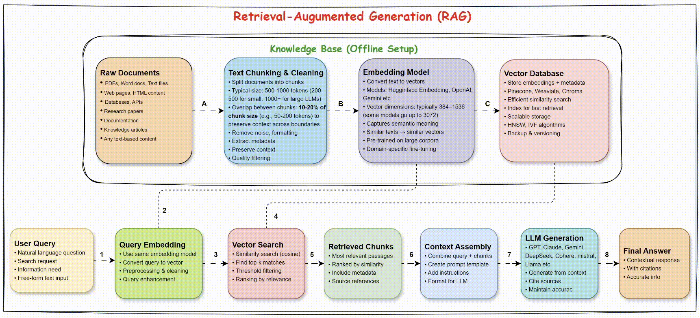

## 📚 Advance RAG



---
**Retrieval-Augmented Generation (RAG)** enhances Large Language Models (LLMs) by combining them with an external knowledge retrieval system.

When you send a query:

1. The retrieval system fetches the most relevant data from a knowledge base.

2. The LLM uses both the query and the retrieved data to generate a more accurate, context-aware response.

This makes RAG essential for building reliable GenAI applications. As queries and data grow in complexity, advanced RAG techniques, like agentic RAG, Graph RAG, Corrective RAG, Reranking RAG etc further improve accuracy, adaptability & relevance.

---
## 🔑 Core Components of RAG

   - **Knowledge Base**: External data source (e.g. documents, databases) that the system relies on.

   - **Retrieval System**:

      - **Vector Database** for storing and searching embeddings.

      - **Embedding Model** to convert queries and documents into vector representations.

   - **Language Model (LLM)**: Generates responses using both retrieved data and the query.

---
## 🧪 Exploring Advanced RAG

### A. Try Graph RAG

👉 [Graph RAG](graph_rag/)

---

### B. Try Agentic RAG

👉 [Agentic RAG](agentic-rag/)

---
### C. Try Advanced RAG Techniques in Google Colab

👉 [Notebooks](notebooks/)

   - [Basic RAG](notebooks/basic-rag.ipynb)
   - [Corrective RAG](notebooks/corrective-rag.ipynb)
   - [Re-ranking RAG](notebooks/re_ranking_rag.ipynb)
   - [Hybrid Search RAG](notebooks/hybrid-search-rag.ipynb)
   - [Hypothetical Doucment Embedding RAG](notebooks/hypothetical-document-embedding-rag.ipynb)
   - [Multi-index RAG](notebooks/multi-index-rag.ipynb)
   - [Query Expansion RAG](notebooks/query-expansion-rag.ipynb)
   - [Adaptive RAG](notebooks/adaptive-rag.ipynb)
   - [Self Adaptive RAG](notebooks/self-adaptive-rag.ipynb)

---
### D. Try Advanced RAG Techniques in Streamlit UI

### 🛠️ Setup Instructions

#### ✅ Prerequisites
   - Python 3.10 or higher
   - pip (Python package installer)

#### 📦 Installation & Running App
   1. Clone the repository:

      ```bash
      git clone https://github.com/genieincodebottle/generative-ai.git
      cd genai-usecases\advance-rag\rag_techniques
      ```
   2. Open the Project in VS Code or any code editor.
   3. Create a virtual environment by running the following command in the terminal:
   
      ```bash
      pip install uv #if uv not installed
      uv venv
      .venv\Scripts\activate # On Linux -> source venv/bin/activate
      ```
   4. Create a `requirements.txt` file and add the following libraries:
      
      ```bash
        streamlit>=1.47.1 
        langchain>=0.3.27 
        langchain-google-genai>=2.1.8 
        langchain-chroma>=0.2.5 
        langchain-community>=0.3.27
        nest-asyncio>=1.6.0
        pypdf>=5.9.0
        python-dotenv>=1.0.1
        flashrank>=0.2.10
        rank_bm25>=0.2.2
      ```
   5. Install dependencies:
      
      ```bash
      uv pip install -r requirements.txt
      ```
   6. Configure Environment
      * Rename .env.example → .env
      * Update with your keys:

         ```bash
         GOOGLE_API_KEY=your_key_here # Using the free-tier API Key
         ```
      * Get **GOOGLE_API_KEY** here -> https://aistudio.google.com/app/apikey

   9. Run RAG implementations in ```genai-usecases\advance-rag\rag_techniques```
   
      * [basic_rag](./rag_techniques/basic_rag.py) 

        `streamlit run basic_rag.py`
    
      * [adaptive_rag](./rag_techniques/adaptive_rag.py)
      
        `streamlit run adaptive_rag.py`

      * [corrective_rag](./rag_techniques/corrective_rag.py)
      
        `streamlit run corrective_rag.py`

      * [re_ranking_rag](./rag_techniques/re_ranking_rag.py)
      
        `streamlit run re_ranking_rag.py`

      * [hybrid_search_rag](./rag_techniques/hybrid_search_rag.py)
      
        `streamlit run hybrid_search_rag.py`

---
### E. RAG with MCP Server (Fullstack Agentic RAG on AWS Cloud)

[RAG Application with AWS & MCP Server Integration](https://github.com/genieincodebottle/rag-app-on-aws)
