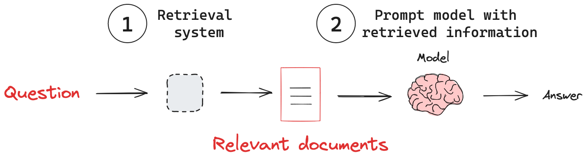

## Advance RAG

Retrieval Augmented Generation (RAG) is a technique that enhances language models by combining them with external knowledge retrieval.

RAG integrates a retrieval system with a generative language model. When given a query, it first retrieves relevant information from a knowledge base, then uses this information to generate a more informed and accurate response.



Source: LangChain

### Key components of RAG

#### ✓ Knowledge base: 
The external data source serves as the repository of information that the RAG system can rely on.

#### ✓ Retrieval system: 
The retrieval system typically consists of two main parts:

  * A vector database to efficiently store and search through embeddings

  * An embedding model to convert queries and documents into vector representations

#### ✓ Language model: 
RAG systems use Large Language Models (LLMs) to generate responses based on the retrieved information and the original query.

RAG is essential for building accurate and context-aware GenAI applications. As queries become more complex and information increases, basic RAG may not be enough. Advanced RAG techniques, including agentic RAG, improve the retrieval and generation process, leading to more relevant, accurate, and adaptable responses.

### 🛠️ Setup Instructions

#### ✅ Prerequisites
   - Python 3.10 or higher
   - pip (Python package installer)

#### 📦 Installation & Running App
   1. Clone the repository:

      ```bash
      git clone https://github.com/genieincodebottle/generative-ai.git
      cd genai-usecases\advance-rag
      ```
   2. Open the Project in VS Code or any code editor.
   3. Create a virtual environment by running the following command in the terminal:
   
      ```bash
      pip install uv #if uv not installed
      uv venv
      .venv\Scripts\activate # On Linux -> source venv/bin/activate
      ```
   4. Create a requirements.txt file and add the following libraries:
      
      ```bash
        streamlit>=1.47.1 
        langchain>=0.3.27 
        langchain-google-genai>=2.1.8 
        langchain-chroma>=0.2.5 
        langchain-community>=0.3.27
        nest-asyncio>=1.6.0
        pypdf>=5.9.0
        python-dotenv>=1.0.1
        flashrank>=0.2.10
        rank_bm25>=0.2.2
      ```
   5. Install dependencies:
      
      ```bash
      uv pip install -r requirements.txt
      ```
   6. Configure Environment
      * Rename .env.example → .env
      * Update with your keys:

      ```bash
      GOOGLE_API_KEY=your_key_here # Using the free-tier API Key
      ```
      * Get **GOOGLE_API_KEY** here -> https://aistudio.google.com/app/apikey

   9. Run the different RAG implementations located in ```genai-usecases\advance-rag```
   
      * [basic_rag](./basic_rag.py) 

        `streamlit run basic_rag.py`
    
      * [adaptive_rag](./adaptive_rag.py)
      
        `streamlit run adaptive_rag.py`

      * [corrective_rag](./corrective_rag.py)
      
        `streamlit run corrective_rag.py`

      * [re_ranking_rag](./re_ranking_rag.py)
      
        `streamlit run re_ranking_rag.py`

      * [hybrid_search_rag](./hybrid_search_rag.py)
      
        `streamlit run hybrid_search_rag.py`

