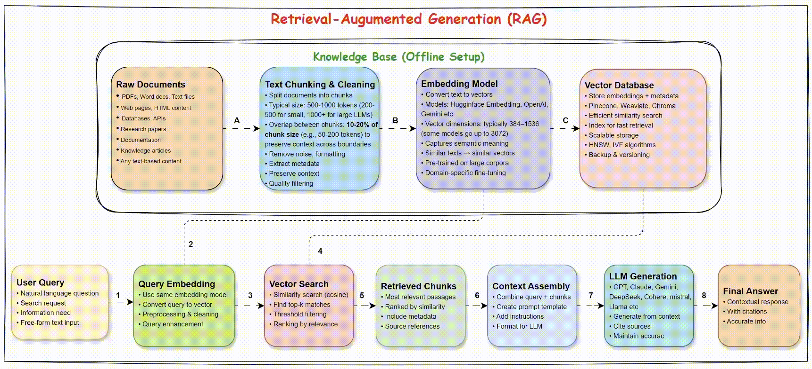

## 📚 Advance RAG



---
**Retrieval-Augmented Generation (RAG)** enhances Large Language Models (LLMs) by combining them with an external knowledge retrieval system.

When you send a query:

1. The retrieval system fetches the most relevant data from a knowledge base.

2. The LLM uses both the query and the retrieved data to generate a more accurate, context-aware response.

This makes RAG essential for building reliable GenAI applications. As queries and data grow in complexity, advanced RAG techniques, like agentic RAG, Graph RAG, Corrective RAG, Reranking RAG etc further improve accuracy, adaptability & relevance.

---
## 🔑 Core Components of RAG

   - **Knowledge Base**: External data source (e.g. documents, databases) that the system relies on.

   - **Retrieval System**:

      - **Vector Database** for storing and searching embeddings.

      - **Embedding Model** to convert queries and documents into vector representations.

   - **Language Model (LLM)**: Generates responses using both retrieved data and the query.

---
## 📚 Super Handy Resources

| Resource | Link | Description |
|----------|------|-------------|
| **Embedding Models • Vector Stores • Vector Embeddings (Guide)** | [PDF](https://github.com/genieincodebottle/generative-ai/blob/main/docs/vector-embeddings-guide.pdf) | Guide covering embedding models, vector stores, and embeddings explained with examples |
| **RAG Decision Flow** | [PDF](./docs/advance-rag-decision-flow-chart.pdf) | Quick reference flowchart to select the right **RAG technique** for your use case |
| **Advanced Snapshot-Based PDF Parsing** | [GitHub](https://github.com/genieincodebottle/parsemypdf) | End-to-end parsing using **Docling, Markitdown, Gemini, Llama 4, Claude, GPT-4 & more** |
| **Uber's Usecase -> Enhanced Agentic-RAG: What If Chatbots Could Deliver Near-Human Precision?** | [Blog](https://lnkd.in/eGz5a9xm) | Genie is Uber's internal on-call copilot in Slack, delivering real-time, cited answers from internal docs and boosting on-call engineers' and SMEs' productivity by handling common queries efficiently. |

---
## 🗺️ Recommended Learning Path

If you are new to RAG, work through the techniques in this order to build understanding progressively:

| Step | Technique | Where to run |
|------|-----------|--------------|
| 1 | **Basic RAG** — core retrieve-then-generate loop | [Notebook](notebooks/basic-rag.ipynb) · [Streamlit](rag_techniques/basic_rag.py) |
| 2 | **Hybrid Search RAG** — combine keyword (BM25) + semantic search | [Notebook](notebooks/hybrid-search-rag.ipynb) · [Streamlit](rag_techniques/hybrid_search_rag.py) |
| 3 | **Re-ranking RAG** — improve relevance with a reranker | [Notebook](notebooks/re_ranking_rag.ipynb) · [Streamlit](rag_techniques/re_ranking_rag.py) |
| 4 | **Corrective RAG** — self-correct low-quality retrievals | [Notebook](notebooks/corrective-rag.ipynb) · [Streamlit](rag_techniques/corrective_rag.py) |
| 5 | **Adaptive RAG** — route queries to the best strategy | [Notebook](notebooks/adaptive-rag.ipynb) · [Streamlit](rag_techniques/adaptive_rag.py) |
| 6 | **Agentic RAG** — multi-agent workflow with LangGraph | [App](agentic-rag/) |
| 7 | **Graph RAG** — relationship-aware retrieval over a document graph | [App](graph-rag/) |
| 8 | **Multimodal RAG** — add image understanding to your pipeline | [App](multimodal-rag/) |
| 9 | **Code Search RAG** — semantic search over a code repository | [App](code-search-rag/) |

> **Tip:** Refer to the [RAG Decision Flow PDF](./docs/advance-rag-decision-flow-chart.pdf) to quickly choose the right technique for your use case.

---
## 🧪 Exploring Advanced RAG

**A. Try Graph RAG**

Knowledge-graph based retrieval using LangGraph, HuggingFace embeddings, and ChromaDB. Understands relationships between concepts in your documents — not just keyword matches.

👉 [Full setup instructions →](graph-rag/README.md)

```bash
# After completing setup in graph-rag/README.md:
cd graph-rag
streamlit run streamlit_app.py
```

---
**B. Try Agentic RAG**

Multi-agent workflow with five specialized agents (Planner, Retriever, Research, Synthesizer, Validator). Uses LangGraph for orchestration and optionally Tavily for live web search.

👉 [Full setup instructions →](agentic-rag/README.md)

```bash
# After completing setup in agentic-rag/README.md:
cd agentic-rag
streamlit run streamlit_app.py
```

---
**C. Try Multimodal RAG**

Processes both PDF text and images. Uses Gemini Vision to describe images and stores text, tables, and image descriptions in separate vector stores for richer retrieval.

> **Entry point:** Always run `streamlit_app.py` — not `app.py`. The `app.py` file is the backend and is not meant to be executed directly.

👉 [Full setup instructions →](multimodal-rag/README.md)

```bash
# After completing setup in multimodal-rag/README.md:
cd multimodal-rag
streamlit run streamlit_app.py
```

---
**D. Try Code Search RAG**

Semantic search over code repositories using Tree-sitter AST parsing. Understands code structure — functions, classes, imports — not just raw text.

👉 [Full setup instructions →](code-search-rag/README.md)

```bash
# After completing setup in code-search-rag/README.md:
cd code-search-rag
streamlit run app.py
```

---
**E. Try Advanced RAG Techniques in Google Colab**

> ⚠️ **Different tech stack from the Streamlit apps (Section F) below:**
> The notebooks run on **Groq API** (free LLMs) + **HuggingFace Embeddings** + **FAISS**.
> You will need a free [Groq API key](https://console.groq.com/keys) and a [HuggingFace token](https://huggingface.co/settings/tokens) — **not** a Google API key.
> Each notebook has an **Open in Colab** button at the top — click it to run without any local setup.

👉 [Notebooks](notebooks/)

   - [Basic RAG](notebooks/basic-rag.ipynb)
   - [Corrective RAG](notebooks/corrective-rag.ipynb)
   - [Re-ranking RAG](notebooks/re_ranking_rag.ipynb)
   - [Hybrid Search RAG](notebooks/hybrid-search-rag.ipynb)
   - [Hypothetical Document Embedding RAG](notebooks/hypothetical-document-embedding-rag.ipynb)
   - [Multi-index RAG](notebooks/multi-index-rag.ipynb)
   - [Query Expansion RAG](notebooks/query-expansion-rag.ipynb)
   - [Adaptive RAG](notebooks/adaptive-rag.ipynb)
   - [Self Adaptive RAG](notebooks/self-adaptive-rag.ipynb)

---
**F. Try Advanced RAG Techniques in Streamlit UI**

> 🔑 **Tech stack:** Google Gemini API (LLM + Embeddings) + ChromaDB. Requires a free `GOOGLE_API_KEY` — **not** a Groq key. See step 5 below.

**🛠️ Setup Instructions**

**✅ Prerequisites**
   - Python 3.10 or higher
   - pip (Python package installer)

**📦 Installation & Running App**
   1. Clone the repository:

      ```bash
      git clone https://github.com/genieincodebottle/generative-ai.git

      # Windows
      cd genai-usecases\advance-rag\rag_techniques

      # Linux / macOS
      cd genai-usecases/advance-rag/rag_techniques
      ```
   2. Open the project in VS Code or any code editor.
   3. Create a virtual environment:

      ```bash
      # uv is a fast Python package manager — it replaces both pip and venv
      pip install uv  # skip if uv is already installed
      uv venv

      # Windows
      .venv\Scripts\activate

      # Linux / macOS
      source .venv/bin/activate
      ```
   4. Install dependencies (a `requirements.txt` is already included in this folder):

      ```bash
      uv pip install -r requirements.txt
      ```
   5. Configure environment — **never commit the `.env` file to version control**:
      * Rename `.env.example` → `.env`
      * Add your API key:

         ```bash
         GOOGLE_API_KEY=your_key_here
         ```
      * Get a free **GOOGLE_API_KEY** at https://aistudio.google.com/app/apikey

   6. Run any RAG implementation from inside the `rag_techniques` folder:

      * [basic_rag](./rag_techniques/basic_rag.py)

        `streamlit run basic_rag.py`

      * [adaptive_rag](./rag_techniques/adaptive_rag.py)

        `streamlit run adaptive_rag.py`

      * [corrective_rag](./rag_techniques/corrective_rag.py)

        `streamlit run corrective_rag.py`

      * [re_ranking_rag](./rag_techniques/re_ranking_rag.py)

        `streamlit run re_ranking_rag.py`

      * [hybrid_search_rag](./rag_techniques/hybrid_search_rag.py)

        `streamlit run hybrid_search_rag.py`

      The app opens at `http://localhost:8501`

---
**G. Local LLM Powered Multi-Function App (RAG Included)**

[Local LLM RAG App Powered by Llama](../llama-4-multi-function-app/)

---
**H. RAG with MCP Server (Fullstack Agentic RAG on AWS Cloud)**

[RAG Application with AWS & MCP Server Integration](https://github.com/genieincodebottle/rag-app-on-aws)
