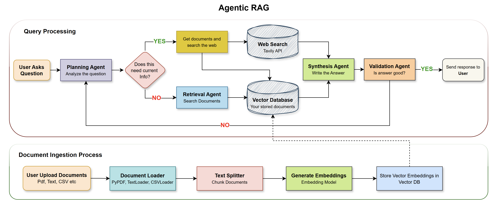
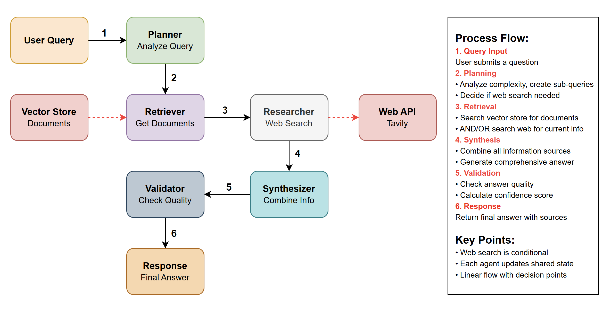

# Agentic RAG System


[](https://www.python.org/downloads/)


[](https://langchain.com/)
[](https://langchain.com/langgraph)




An <strong>Agentic Retrieval-Augmented Generation (RAG)</strong> system built with LangChain, LangGraph & Google's Gemini LLM. This system implements advanced multi-agent workflows for intelligent question answering with adaptive reasoning strategies.

## ✨ Features

- 🧠 **Multi Agent Architecture**
   - **Planner Agent**: Analyzes queries and creates intelligent execution plans
   - **Retriever Agent**: Performs semantic document retrieval from vector database
   - **Research Agent**: Conducts web searches for current information
   - **Synthesizer Agent**: Combines information from multiple sources
   - **Validator Agent**: Validates and refines final answers

   ```
   Planner Agent → Retriever Agent → Research Agent → Synthesizer Agent → Validator Agent
   ```

- 🔮 **Advanced Capabilities**
   - **Adaptive Query Planning**: Automatically detects query complexity and selects optimal strategies
   - **Multi-Modal Processing**: Handles text, PDFs & CSV document formats
   - **Web Augmented RAG**: Combines document knowledge with real time web search
   - **Confidence Scoring**: Provides transparency in answer reliability
   - **Source Tracking**: Detailed citation of information sources

### 🔧 Tech Stack

- **Python**: Programming Language
- **LangGraph**: State-of-the-art agent workflow orchestration
- **Gemini LLM API (Free tier)**: Google's AI models (gemini-2.0-flash, gemini-2.0-pro, gemini-2.5-pro, gemini-2.5-flash & Gemini Embedding Models)
- **Tavily Search API (Free Tier)**: Advanced web search integration
- **ChromaDB (Open Source)**: High performance open-source vector database
- **Streamlit**: Interactive python based web interface

## ⚡ Quick Start

### 📋 Installation & Running App

   1. Prerequisites
      - Python 3.10 or higher
      - pip (Python package installer)
   2. Clone the repository:

      ```bash
      git clone https://github.com/genieincodebottle/generative-ai.git
      cd genai-usecases\advance-rag\agentic-rag
      ```
   3. Open the Project in VS Code or any code editor.
   4. Create a virtual environment by running the following command in the terminal:
   
      ```bash
      pip install uv #if uv not installed
      uv venv
      .venv\Scripts\activate # On Linux -> source venv/bin/activate
      ```
   5. Create a `requirements.txt` file and add the following libraries:
      
      ```bash
      # LangGraph for agent workflows
      langgraph>=0.6.7
      # Core LangChain packages
      langchain-core>=0.3.75
      langchain-google-genai>=2.1.10
      langchain-community>=0.3.29
      langchain-text-splitters>=0.3.11
      langchain-chroma>=0.2.5
      # Vector store and embeddings
      chromadb>=1.0.20
      # Web search capabilities
      tavily-python>=0.7.11
      # Document processing
      pypdf>=6.0.0
      # Streamlit app dependencies
      streamlit>=1.49.1
      plotly>=6.3.0
      pandas>=2.3.2
      # Structured outputs
      pydantic>=2.11.7
      # Environment and utilities
      python-dotenv>=1.1.1
      ```
   6. Install dependencies:
      
      ```bash
      uv pip install -r requirements.txt
      ```
   7. Configure Environment
      * Rename .env.example → .env
      * Update with your keys:

        ```bash
        GOOGLE_API_KEY=your_key_here # Using the free-tier API Key
        TAVILY_API_KEY=your_key_here # Optional- For Web Search
        ```
      * Get **GOOGLE_API_KEY** here -> https://aistudio.google.com/app/apikey
      * Get **TAVILY_API_KEY** here (Optional- For Web Search)-> https://tavily.com/home

   8. Running the Application. Start the Streamlit app:

      ```bash
      streamlit run streamlit_app.py
      ```

      The application will open in your browser at `http://localhost:8501`

## 📋 Usage Guide

1. **Configure Models & Parameters**
   Configure your settings in the sidebar before initializing:
   
   **🤖 Model Selection:**
   - **Main LLM Model**: Choose from different Gemini LLMs (gemini-2.0-flash, gemini-2.0-pro, gemini-2.5-pro, gemini-2.5-flash)
   - **Embedding Model**: Select between `text-embedding-004` or `text-embedding-003`
   
   **⚙️ Model Parameters:**
   - **Temperature** (0.0-1.0): Control creativity (0=focused, 1=creative)
   - **Max Tokens** (1024-8192): Maximum response length
   - **Max Iterations** (5-15): Maximum agent workflow iterations
   
   **📝 Processing Settings:**
   - **Chunk Size** (500-2000): Size of text chunks for processing
   - **Chunk Overlap** (50-400): Overlap between chunks for continuity
   - **Retrieval Count** (3-15): Number of relevant chunks to retrieve
   - **Confidence Threshold** (0.5-0.9): Minimum confidence for answers

2. **Initialize & Setup**
   - Upload documents (PDF, TXT, CSV files)
   - Click "🔨 Build Vector Database" to process uploaded files
   - System creates embeddings and stores them in ChromaDB

3. **Query Your Content**
   - Ask questions in natural language
   - System automatically analyzes query complexity
   - Get multi-agent processed responses with:
     - Confidence scoring with visual gauge
     - Performance metrics
     - Source citations from documents and web
     - Agent execution breakdown

4. **Explore Different Query Types**
   - **Simple**: Direct factual questions
   - **Moderate**: Analysis or comparison questions  
   - **Complex**: Multi-faceted synthesis queries
   - **Research**: Current information requiring web search

5. **Review Analysis & Sources**
   - View query complexity analysis and sub-questions
   - Check agent execution steps and logs
   - Review document sources with previews
   - See web search results and citations
   - Track complete query history

## 📁 Supported File Types

1. **Documents**:
   - **PDF**: Full text extraction and processing
   - **TXT**: Plain text files
   - **CSV**: Structured data files

2. **Content Processing**:
   - **Text Chunks**: Intelligent splitting with overlap
   - **Embeddings**: Vector representations using Gemini embeddings
   - **Metadata**: Source tracking and citation support

## 🎯 Sample Use Cases

1. **Business Intelligence**: Upload financial reports, market research, and business documents
2. **Research Analysis**: Process academic papers, research data, and technical documentation  
3. **Knowledge Management**: Organize company documents, policies, and procedures
4. **Due Diligence**: Analyze legal documents, contracts, and compliance materials
5. **Educational Support**: Study materials, textbooks, and reference documents

## 🎨 User Interface

The web interface is organized into **5 intuitive tabs**:

### 📁 Document Management
- Upload PDF, TXT, and CSV documents
- Process documents into vector database

### 💬 Ask Questions
- Natural language query input
- Real time answer generation
- Confidence scoring with visual gauge
- Performance metrics display
- New conversation threading

### 🧠 Query Analysis
- Query complexity analysis (Simple, Moderate, Complex, Research)
- Sub questions breakdown
- Execution steps and logs
- Strategy selection details

### 📋 Sources & History
- Document sources with previews
- Web search results and links
- Complete query history table
- Source citations and attributions

### 🔄 System Overview
- Agent workflow visualization
- Current system configuration
- Model and parameter settings
- Architecture overview

## 🏗️ System Process Flow



## 📊 Query Processing Flow

1. **Query Analysis**: The system analyzes query complexity and requirements
2. **Strategy Selection**: Chooses optimal retrieval and reasoning strategies
3. **Document Retrieval**: Searches vector database for relevant information
4. **Web Research**: Fetches current information if needed
5. **Information Synthesis**: Combines all sources into coherent answer
6. **Validation**: Ensures answer quality and confidence scoring

## 🎯 Query Complexity Levels

- **Simple**: Direct factual questions with straightforward answers
- **Moderate**: Questions requiring analysis or comparison
- **Complex**: Multi-faceted queries needing synthesis from multiple sources
- **Research**: Queries requiring current information and web search

## 🔍 Example Queries

Try these sample queries to explore the Agentic RAG's capabilities:

1. **Simple Queries**
   - "What are the main renewable energy sources mentioned?"
   - "Define artificial intelligence."

2. **Moderate Queries**
   - "How do renewable energy solutions impact economic growth?"
   - "Compare machine learning and deep learning approaches."

3. **Complex Queries**
   - "Analyze the relationship between AI development and climate change solutions."
   - "What are the synergies between renewable energy and AI technologies?"

4. **Research Queries (requires web search)**
   - "What are the latest breakthroughs in AI safety research in 2025?"
   - "Recent developments in quantum computing applications."

## 🔧 Troubleshooting

### 🛑 Common Issues

1. **Google API Key Error**
   ```
   Error: GOOGLE_API_KEY environment variable not set
   ```
   **Solution**: Ensure your Google API key is properly set in the `.env` file

2. **Web Search Not Working**
   ```
   Warning: Tavily API key not configured
   ```
   **Solution**: Add your Tavily API key to enable web search capabilities

3. **Document Loading Fails**
   ```
   Error: No documents could be loaded from files
   ```
   **Solution**: Ensure document files exist and are in supported formats (PDF, TXT, CSV)

4. **Memory Issues with Large Documents**
   ```
   ChromaDB memory error
   ```
   **Solution**: Reduce `chunk_size` in configuration or process documents in batches

## ⚡️Performance Tips

1. **Use smaller models** like `gemini-2.0-flash` for better speed
2. **Chunk Size**: 1500+ for comprehensive documents, 800-1200 for focused content
3. **Retrieval Count**: 6-8 for balanced results, 10+ for comprehensive search
4. **Temperature**: 0.1-0.3 for factual questions, 0.5-1.0 for creative tasks
5. **Max Iterations**: 8-10 for complex queries, 5-6 for simple questions
6. **Confidence Threshold**: 0.7+ for high-quality answers, 0.5-0.6 for exploratory queries
7. **File Organization**: Group related documents for better context
8. **Query Specificity**: More specific questions yield better results
9. **Web Search**: Enable only when current information is needed
10. **Disable web search** for document-only queries to improve speed

## 🔐 Security Notes

- Never commit your .env file to version control
- Keep your Google API key secure

---
<strong>RAG On.. 🔥</strong>