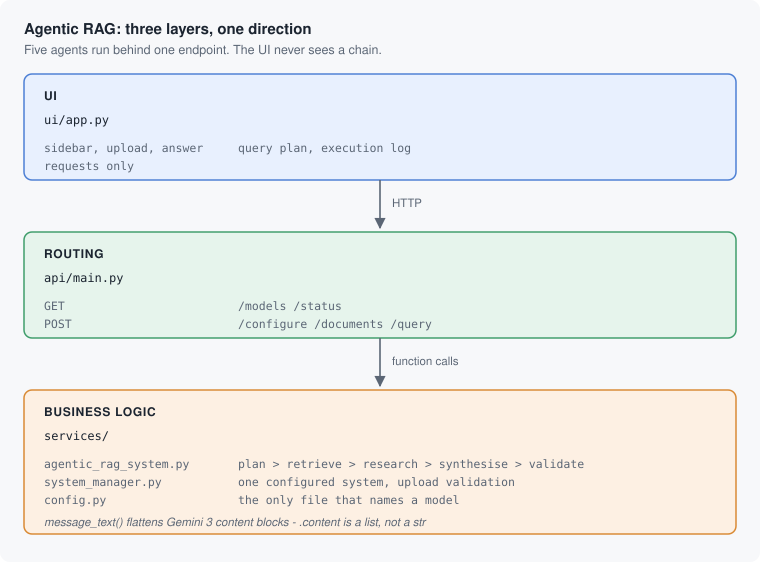

# Agentic RAG

> **Learn how to build this project step-by-step on [AI-ML Companion](https://aimlcompanion.ai/)**. Interactive ML learning platform with guided walkthroughs, architecture decisions, and hands-on challenges.


**Plain RAG retrieves once and answers. This one decides how hard the question
is first, and only then chooses what to do about it.**

---

## 1. The problem

"What are the three principal risks, and which are rated HIGH?" and
"What is the mitigation budget?" are not the same kind of question, but plain
RAG treats them identically: embed, fetch `k` chunks, generate.

A pipeline that plans first can behave differently. Five agents run in order:

| Agent | Decides |
|---|---|
| **Planning** | how complex the question is, and whether to split it into sub-queries |
| **Retrieval** | which chunks to pull from your documents |
| **Research** | whether the documents are enough, or the web is needed |
| **Synthesis** | how to combine document and web context into one answer |
| **Validation** | whether the result is good enough, and what confidence to report |

The execution log in the UI shows each decision, which is the point of the
project: you can see *why* it answered the way it did.

## 2. The shape of the fix



`services/agentic_rag_system.py` imports no web framework, so the whole
pipeline is callable from a notebook or a test.

## 3. What upgrading the model broke

This project used to pin `gemini-2.0-flash`. That ID has since been **retired**,
so a fresh clone 404s on the first call. Moving to the current generation fixed
that and immediately exposed a second, quieter problem.

**On Gemini 3, `response.content` is a list of content blocks, not a string:**

```python
[{"type": "text", "text": "the answer", "extras": {"signature": "..."}}]
```

Code written against the string contract fails in two ways, neither of which
raises:

- The UI renders the raw block repr, base64 thinking signature and all.
- `len(final_answer) < 50` measures the **number of blocks**. An 881-character
  answer has "length 1", so the validation agent logged
  *"Warning: Answer seems too short"* and multiplied confidence by 0.8 on every
  single query.

`message_text()` flattens whatever shape arrives:

```python
answer = message_text(response)   # str, on every model generation
```

Elsewhere in this repo the same assumption was a hard crash:
`response.content.strip()` and `response.content.find('[')` raise
`AttributeError` on a list. 72 call sites across the repository were corrected.

## 4. Run it

### Clone

```bash
git clone https://github.com/genieincodebottle/generative-ai.git
cd generative-ai/genai-usecases/advance-rag/agentic-rag
```

### Set up with uv

```bash
pip install uv

uv venv
source .venv/bin/activate      # Linux / macOS
# .venv\Scripts\activate       # Windows PowerShell or cmd

uv pip install -r requirements.txt
```

Python 3.10+.

### Add a key

```bash
cp .env.example .env           # copy .env.example .env  on Windows
```

| Variable | Required? | Where to get it |
|---|---|---|
| `GOOGLE_API_KEY` | **yes** | [Google AI Studio](https://aistudio.google.com/app/apikey) |
| `TAVILY_API_KEY` | optional | [Tavily](https://app.tavily.com/home) |

Without a Tavily key the research agent is switched off and the system answers
from your documents alone. The UI says so explicitly rather than running a
research step that silently returns nothing.

### Start both services

```bash
python run.py
```

```
API   ->  http://localhost:8000/docs
UI    ->  http://localhost:8501
```

### Use it

1. Sidebar, then **Upload PDFs**, then **Index documents**.
2. Ask a question and press **Run the pipeline**.
3. Open **Query plan** and **Execution log** to see what each agent decided.

### Run the tests

```bash
pytest                         # 21 tests, no API key, no network
```

## 5. The API

| Method | Path | Purpose |
|---|---|---|
| `GET` | `/health` | Liveness, which keys are set, whether the system is built |
| `GET` | `/models` | Model catalogue, and whether web search is available |
| `GET` | `/status` | Vector store, retriever, indexed documents, active config |
| `POST` | `/configure` | Build or rebuild the system with new settings |
| `POST` | `/documents` | Upload and index PDFs |
| `POST` | `/query` | Run the full five-agent pipeline |

```bash
curl -X POST http://localhost:8000/query \
  -H 'Content-Type: application/json' \
  -d '{"question":"What are the three principal risks, and which are rated HIGH?"}'
```

The response carries the answer plus the reasoning trail: `confidence`,
`retrieved_documents`, `web_results`, `query_plan` (complexity, sub-queries,
estimated steps), `sources`, and `execution_log`.

## 6. Models

Defaults are Google's rolling aliases (`gemini-flash-latest`), which track the
current generation instead of rotting. Pinned Gemini 3 and 2.5 IDs stay in the
dropdown for reproducible runs. `services/config.py` is the only file that
names a model.

## 7. If something goes wrong

| symptom | cause | fix |
|---|---|---|
| UI says "Cannot reach the API" | Streamlit started on its own | use `python run.py` |
| "GOOGLE_API_KEY is not set" | `.env` missing or unfilled | `cp .env.example .env`, add the key, restart |
| `409 No documents have been indexed` | nothing uploaded yet | upload a PDF and index it |
| "Web search is off" | no `TAVILY_API_KEY` | expected; add one to enable the research agent |
| `422` on upload | not a PDF, empty, or over the size cap | check the message; it names the file |
| `chunk_overlap must be smaller` | overlap >= chunk size | lower it in Advanced |
| Answer arrives but confidence is low | few chunks retrieved | see the limitation below; it is the formula, not a fault |
| Port already in use | something else has 8000/8501 | `API_PORT=8100 UI_PORT=8600 python run.py` |

## 8. Layout

```
run.py                          starts the API and the UI together
.env.example                    the keys, and where to get them
.streamlit/config.toml          turns off Streamlit's own start-up advert

ui/app.py                       Streamlit. Widgets + requests only.

api/main.py                     6 routes, upload handling, status mapping

services/config.py              THE ONLY FILE THAT NAMES A MODEL OR READS THE ENV
services/agentic_rag_system.py  the five agents, the LangGraph workflow,
                                and message_text() for Gemini 3 content blocks
services/system_manager.py      one configured system, upload validation

tests/test_system_manager.py    upload validation, config guards, 15 cases
tests/test_api.py               routes and status codes, 10 cases
```

## 9. Track modules this covers

`agenticRag` - `rag` - `langGraph` - `multiAgent` - `toolUse` - `vectorDatabases`

## 10. Honest limitations

- **Confidence is a heuristic, not a probability.** It is
  `0.6 * (chunks / k) + 0.4 * (web results / 3)`. On a one-page test document
  only one chunk exists, so the score is 0.075 no matter how good the answer
  is. It ranks results within one corpus; it does not measure correctness.
- **Nothing measures answer quality.** There is no eval set here. The execution
  log tells you what the pipeline *did*, not whether it was right.
- **Chroma persists to disk** (`./chroma_db_agentic`). Re-indexing the same
  document adds it again rather than replacing it; delete the folder to start
  clean.
- **Web results are not fact-checked** against the documents. The synthesis
  agent is told to prefer documents, which is an instruction, not a guarantee.
- **One shared system, not per-user.** `POST /configure` rebuilds the single
  instance every client sees. Fine for a local demo, wrong for a shared server.
- **CORS is wide open** because both halves run on localhost.
