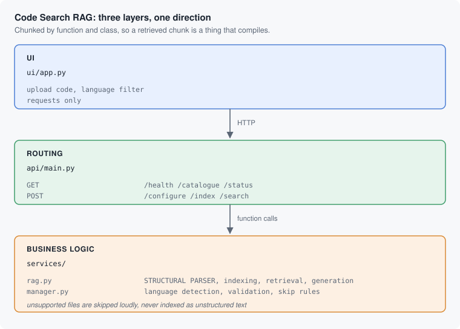

# Code Search RAG

> **Learn how to build this project step-by-step on [AI-ML Companion](https://aimlcompanion.ai/)**. Interactive ML learning platform with guided walkthroughs, architecture decisions, and hands-on challenges.


**Chunking prose by character count is fine. Chunking code that way cuts
functions in half. This project chunks by function and class, so every
retrieved chunk is a thing that compiles.**

---

## 1. The problem

`RecursiveCharacterTextSplitter` at 1000 characters will happily slice through
the middle of a method. The first chunk has a signature and no return; the
second has a return and no idea what it belongs to. Neither answers
*"how does authentication work here?"*, and the embedding of half a function is
not the embedding of anything.

Code has structure that prose does not: a function is a unit, a class is a
unit, and a docstring describes the unit it sits in. `services/rag.py` parses
that structure and chunks along it, keeping the signature, the body, and the
docstring together, plus the file, language, and symbol name as metadata you
can filter on.

Real output, over the bundled OAuth2 sample corpus:

> **Query:** How is the OAuth2 access token refreshed when it expires?

> **Answer:** Refreshing an expired OAuth2 access token is handled via the
> **Refresh Token Grant** flow implemented in the `refresh_access_token`
> method. [...] The request body includes `grant_type='refresh_token'`, the
> currently stored `refresh_token`, and the client credentials.

`refresh_access_token` is a real method at line 114 of the sample file, and the
description of the grant matches its body. It named the symbol because the
symbol name was in the chunk.

## 2. The shape of it



## 3. Two things this restructure fixed

**A sample corpus was named like a test.** `test_oauth2_examples.py` sat in the
project root. It contains zero tests, zero assertions, and no pytest import -
it is 593 lines of OAuth2 sample code that exists to be *searched*. Because of
its name, `pytest` collected it as a test module. It now lives in
`samples/oauth2_examples.py`, and a test asserts that no `test_*.py` file ever
reappears there.

**The service layer printed 47 `[DEBUG]` lines to stdout per search.** Fine in
a script, wrong behind an HTTP API where stdout is the server log. Those are
now `logger.debug`, so you get them with `--log-level debug` and not otherwise.

## 4. Run it

### Clone

```bash
git clone https://github.com/genieincodebottle/generative-ai.git
cd generative-ai/genai-usecases/advance-rag/code-search-rag
```

### Set up with uv

```bash
pip install uv

uv venv
source .venv/bin/activate      # Linux / macOS
# .venv\Scripts\activate       # Windows PowerShell or cmd

uv pip install -r requirements.txt
```

Python 3.10+.

### Add a key

```bash
cp .env.example .env           # copy .env.example .env  on Windows
```

`GOOGLE_API_KEY` from [Google AI Studio](https://aistudio.google.com/app/apikey)
(free tier).

### Start both services

```bash
python run.py
```

```
API   ->  http://localhost:8000/docs
UI    ->  http://localhost:8501
```

### Use it

1. Press **Use samples** to index the bundled OAuth2 corpus - 23 chunks, no
   files needed - or upload your own source files.
2. Ask a question about the code. Optionally filter by language.

Supported extensions: `.py .js .jsx .ts .tsx .java .go .rs .cpp .cc .c .h .hpp`

Anything else is **skipped and reported**, never indexed as unstructured text.
A `README.md` in with your source would otherwise become a retrievable "code"
chunk and pollute every search.

### Run the tests

```bash
pytest                         # 33 tests, no API key, no network
```

## 5. The API

| Method | Path | Purpose |
|---|---|---|
| `GET` | `/health` | Liveness, whether the key is set, whether anything is indexed |
| `GET` | `/catalogue` | Models, supported languages, defaults |
| `GET` | `/status` | Chunk count, indexed files, skipped files |
| `POST` | `/configure` | Rebuild with new retrieval settings (clears the index) |
| `POST` | `/index` | Index uploads, or `use_samples=true` |
| `POST` | `/search` | Ask in English, optionally filtered by language |

```bash
curl -s -X POST http://localhost:8000/index -F "use_samples=true"

curl -X POST http://localhost:8000/search \
  -H 'Content-Type: application/json' \
  -d '{"query":"How is the OAuth2 access token refreshed when it expires?"}'
```

The retrieval pipeline is a funnel, and the three numbers are configurable:
`top_k_initial` (100 candidates) -> `top_k_rerank` (3 after filtering) ->
`top_k_final` (2 shown to the model). `POST /configure` rejects a
`top_k_final` larger than `top_k_rerank`, because asking for more results than
survive filtering is incoherent.

## 6. If something goes wrong

| symptom | cause | fix |
|---|---|---|
| UI says "Cannot reach the API" | Streamlit started on its own | use `python run.py` |
| `503 GOOGLE_API_KEY is not set` | `.env` missing or unfilled | `cp .env.example .env`, add the key, restart |
| `422 None of these files are in a supported language` | uploaded docs, not code | upload source files |
| Files appear in `skipped` | unsupported extension, or binary content | expected; only code is indexed |
| `422 Nothing could be indexed` | files contain no functions or classes | the parser needs structure to chunk on |
| `409 Nothing has been indexed` | no index yet | press **Use samples**, or upload code |
| `422 top_k_final must not exceed top_k_rerank` | incoherent funnel settings | lower `top_k_final` |
| Port already in use | something else has 8000/8501 | `API_PORT=8100 UI_PORT=8600 python run.py` |

## 7. Layout

```
run.py                       starts the API and the UI together
.env.example                 the key, and where to get it
.streamlit/config.toml       turns off Streamlit's own start-up advert
samples/oauth2_examples.py   sample corpus for the "Use samples" button

ui/app.py                    Streamlit. Upload + requests only.

api/main.py                  6 routes, upload handling, status mapping

services/rag.py              THE STRUCTURAL PARSER, indexing, retrieval, generation
services/manager.py          language detection, validation, skip rules, key check

tests/test_manager.py        language detection, validation, guards, 25 cases
tests/test_api.py            routes and status codes, 8 cases
```

## 8. Track modules this covers

`codeRag` - `rag` - `chunking` - `astParsing` - `embeddings` -
`vectorDatabases` - `metadataFiltering`

## 9. Honest limitations

- **Python and JavaScript get real structural parsing.** Other languages fall
  back to a generic parser that is closer to brace-matching than to a syntax
  tree, so chunk boundaries are less reliable there.
- **No cross-file understanding.** Each chunk is one function or class. A
  question whose answer spans a call graph across four files will retrieve
  four unrelated-looking chunks and leave the joining up to the model.
- **No repository cloning in the UI.** `gitpython` is in the requirements and
  the service can index a directory, but the UI only takes uploads. Cloning
  arbitrary URLs from a web form is not something to ship casually.
- **Comments are not weighted differently from code.** A well-commented but
  wrong function can outrank the correct one.
- **The index is global and in memory.** Restart the API and it is gone;
  `POST /configure` rebuilds the single instance every client shares.
- **CORS is wide open** because both halves run on localhost.
