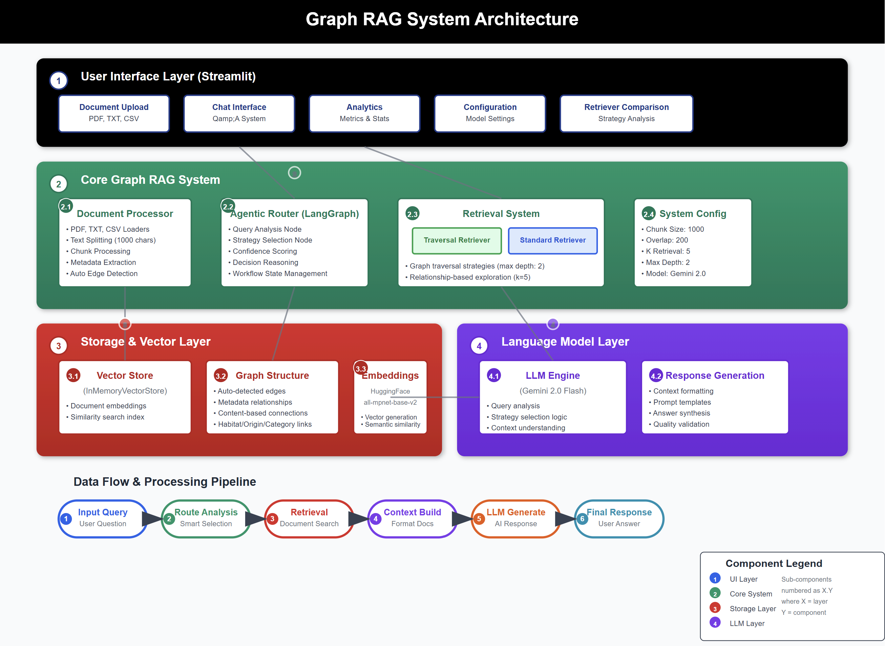

# Graph RAG System with Agentic Router


[](https://www.python.org/downloads/)


[](https://langchain.com/)
[](https://langchain.com/langgraph)




An advanced <strong>Graph-based Retrieval-Augmented Generation (RAG)</strong> system built with LangChain, LangGraph & Google's Gemini LLM. This system leverages graph relationships between documents to provide enhanced context retrieval through intelligent routing strategies.

## ✨ Features

- 🧠 **Graph-Based Intelligence**
   - **Graph Retrieval**: Leverages document relationships for enhanced contextual understanding
   - **Smart Edge Detection**: Automatically identifies relationships based on metadata and content patterns
   - **Traversal Strategies**: Explores connected documents through graph relationships with configurable depth
   - **Relationship Mapping**: Builds connections between documents for improved retrieval accuracy

- 🤖 **Agentic Router System**
   - **LangGraph Workflow**: Advanced AI-powered decision system using LangGraph state management
   - **Query Analysis**: Intelligent analysis of query characteristics and requirements
   - **Strategy Selection**: Automatic selection between traversal and standard retrieval approaches
   - **Confidence Scoring**: Provides transparency in routing decisions with confidence metrics

- 🔧 **Multiple Retrieval Strategies**
   - **Traversal Retriever**: Explores graph relationships using configurable depth-based traversal
   - **Standard Retriever**: Direct vector similarity search for straightforward queries
   - **Hybrid Routing**: Intelligent selection based on query complexity analysis

- 📄 **Multi-Format Document Support**
   - **PDF Files**: Full text extraction and processing
   - **TXT Files**: Plain text document processing
   - **CSV Files**: Structured data import and processing
   - **Default Dataset**: Built-in animal dataset for testing and demonstration

### 🔧 Tech Stack

- **Python**: Programming Language
- **LangGraph**: State-of-the-art agent workflow orchestration  
- **LangChain**: Core AI framework for document processing and retrieval
- **Graph Retriever**: Advanced graph-based document retrieval system
- **Gemini LLM API (Free tier)**: Google's AI models for intelligent routing and generation
- **HuggingFace Embeddings**: sentence-transformers/all-mpnet-base-v2 for document embeddings
- **Streamlit**: Interactive web interface for system interaction

## ⚡ Quick Start

### 📋 Installation & Running App

   1. Prerequisites
      - Python 3.10 or higher
      - pip (Python package installer)
   2. Clone the repository:

      ```bash
      git clone https://github.com/genieincodebottle/generative-ai.git
      cd genai-usecases\advance-rag\graph-rag
      ```
   3. Open the Project in VS Code or any code editor.
   4. Create a virtual environment by running the following command in the terminal:
   
      ```bash
      pip install uv #if uv not installed
      uv venv
      .venv\Scripts\activate # On Linux -> source venv/bin/activate
      ```
   5. Install dependencies:
      
      ```bash
      uv pip install -r requirements.txt
      ```
   6. Configure Environment
      * Rename .env.example → .env
      * Update with your keys:

        ```bash
        GOOGLE_API_KEY=your_key_here # Using the free-tier API Key
        ```
      * Get **GOOGLE_API_KEY** here -> https://aistudio.google.com/app/apikey

   7. Running the Application. Start the Streamlit app:

      ```bash
      streamlit run streamlit_app.py
      ```

      The application will open in your browser at `http://localhost:8501`

## 📋 Usage Guide

1. **Initialize the System**
   - **Option 1 - Default Data**: Click "Load Default Animal Dataset" to get started quickly
   - **Option 2 - Upload Files**: Upload your own PDF, TXT, or CSV documents
   - **Option 3 - Text Input**: Paste text directly into the system
   
2. **Choose Your Retrieval Strategy**
   - **🌐 Traversal Retriever**: Best for queries about relationships, connections, or when you need context from related documents
   - **📊 Standard Retriever**: Ideal for direct factual questions and straightforward information lookup
   - **🤖 Smart Router**: Let the AI automatically choose the best strategy based on your question

3. **Query Your Documents**
   - Ask questions in natural language
   - The system will analyze your query and route it appropriately
   - View detailed results including confidence scores and routing decisions
   
4. **Compare Retrieval Strategies**
   - Use the comparison feature to see how different retrievers perform on the same query
   - Understand which strategy works best for different types of questions
   
5. **Review Results & Sources**
   - Examine retrieved documents and their metadata
   - View detected graph relationships
   - Analyze routing decisions and confidence scores

## 📁 Supported File Types

1. **Documents**:
   - **PDF**: Full text extraction and processing
   - **TXT**: Plain text files
   - **CSV**: Structured data files

2. **Content Processing**:
   - **Text Chunks**: Intelligent splitting with configurable size and overlap
   - **Embeddings**: Vector representations using HuggingFace sentence-transformers
   - **Graph Relationships**: Auto-detected based on metadata and content patterns

## 🎯 Sample Use Cases

1. **Research & Analysis**: Upload research papers, technical documents, and academic materials for intelligent querying
2. **Business Intelligence**: Process company documents, reports, and policies with relationship-aware retrieval
3. **Knowledge Management**: Organize and query interconnected documentation with graph-based context
4. **Educational Support**: Study materials, textbooks, and reference documents with intelligent routing
5. **Content Exploration**: Explore relationships between different topics and concepts in your document collections

## 📊 System Architecture

The web interface provides **4 intuitive sections**:

### 📁 Document Management
- Upload PDF, TXT, and CSV documents
- Load default animal dataset for testing
- Process documents into vector database with relationship detection

### 💬 Query Interface
- Natural language query input
- Real-time answer generation with strategy selection
- Confidence scoring and routing transparency
- Performance metrics display

### 🔍 Retriever Comparison
- Side-by-side comparison of all three retrieval strategies
- Visual comparison of results and context
- Strategy performance analysis

### 🧠 System Configuration
- Configurable system parameters
- View detected graph relationships
- Monitor system status and settings

## 🏗️ System Process Flow

```
Documents → Text Splitting → Vector Embeddings → Edge Detection
                                                      ↓
Query → LangGraph Router → Strategy Analysis → Retriever Selection
                                                      ↓
Selected Retriever → Graph Traversal/Vector Search → Context → LLM → Answer
```

## 🔍 Query Routing Logic

The Agentic Router uses LangGraph to analyze queries and make intelligent routing decisions:

1. **Query Analysis**: LLM analyzes query characteristics and requirements
2. **Strategy Selection**: Chooses between TRAVERSAL or STANDARD based on query type
3. **Confidence Scoring**: Provides transparency in routing decisions
4. **Execution**: Routes to selected retriever with detailed reasoning

## 🔍 Example Queries

Try these sample queries to explore the Graph RAG system's capabilities:

1. **Traversal Retriever Best For**
   - "What animals share similar habitats and how are they related?"
   - "Compare animals from different origins and their characteristics."
   - "Find connections between different animal categories."

2. **Standard Retriever Best For**
   - "What is a capybara?"
   - "List all mammals in the dataset."
   - "Where do elephants live?"

3. **Smart Router Examples**
   - "How do habitat preferences vary across different animal species?" (→ Traversal)
   - "What type of animal is a penguin?" (→ Standard)
   - "Analyze the relationship between animal size and habitat." (→ Traversal)

## 📈 Advanced Features

### 🧠 Automatic Edge Detection

The system intelligently detects graph relationships based on your data:

**For Animal Dataset:**
```python
# Automatically detects these relationships
edges = [
    ("habitat", "habitat"),    # Animals sharing habitats
    ("origin", "origin"),      # Geographic connections  
    ("category", "category")   # Type-based groupings (mammal, bird, etc.)
]
```

**For Custom Documents:**
```python
# Auto-detects based on metadata and content
relationship_patterns = {
    'source': 'source',        # Document source relationships
    'author': 'author',        # Same author connections
    'category': 'category',    # Category-based links
    'topic': 'topic',         # Topic similarity
    'location': 'location',   # Geographic connections
    'date': 'date',           # Temporal relationships
    'department': 'department' # Organizational links
}

# Content-based patterns
content_patterns = {
    'person': ['person', 'people', 'individual', 'name'],
    'organization': ['company', 'organization', 'corp'],
    'location': ['city', 'country', 'state', 'region'], 
    'technology': ['software', 'system', 'platform'],
    'concept': ['concept', 'idea', 'theory', 'method']
}
```

### ⚙️ Retrieval Strategy Configuration

**Traversal Retriever:**
```python
GraphRetriever(
    store=vector_store,
    edges=detected_edges,
    strategy=Eager(
        k=5,           # Total documents to retrieve
        start_k=1,     # Initial seed documents
        max_depth=2    # Maximum traversal depth
    )
)
```

**Standard Retriever:**
```python
GraphRetriever(
    store=vector_store, 
    edges=detected_edges,
    strategy=Eager(
        k=5,           # Documents to retrieve
        start_k=5,     # All from initial search
        max_depth=0    # No traversal (direct similarity only)
    )
)
```

### 🔧 Configurable Parameters

- **Chunk Size**: Default 1000 characters (configurable in GraphRAGConfig)
- **Chunk Overlap**: Default 200 characters for context continuity
- **K Retrieval**: Default 5 documents retrieved per query
- **Max Depth**: Default 2 levels for graph traversal
- **Embedding Model**: sentence-transformers/all-mpnet-base-v2

## 🔧 Troubleshooting

### 🛑 Common Issues

1. **Google API Key Error**
   ```
   Error: GOOGLE_API_KEY environment variable not set
   ```
   **Solution**: Ensure your Google API key is properly set in the `.env` file

2. **Document Loading Failures**
   ```
   Error: No documents could be loaded from files
   ```
   **Solution**: Ensure document files exist and are in supported formats (PDF, TXT, CSV)

3. **Memory Issues with Large Documents**
   ```
   ChromaDB memory error or slow processing
   ```
   **Solution**: Reduce `chunk_size` in GraphRAGConfig or process documents in smaller batches

4. **No Graph Relationships Detected**
   ```
   Warning: No edges detected, using default relationships
   ```
   **Solution**: Ensure documents have meaningful metadata or content patterns for relationship detection

5. **Router Decision Errors**
   ```
   Error in routing workflow
   ```
   **Solution**: Check LLM connectivity and ensure proper initialization of both retrievers

## ⚡ Performance Tips

1. **For Better Speed**: Use smaller chunk sizes (500-800) for faster processing
2. **For Better Context**: Use larger chunk sizes (1200-2000) for comprehensive retrieval
3. **Graph Traversal**: Set `max_depth=1` for faster queries, `max_depth=2` for comprehensive exploration
4. **Retrieval Count**: Use `k_retrieval=3-5` for balanced performance
5. **Smart Routing**: Let the agentic router choose the optimal strategy automatically
6. **File Organization**: Group related documents for better relationship detection
7. **Query Specificity**: More specific questions yield better routing and retrieval results

## 🔐 Security Notes

- Never commit your .env file to version control
- Keep your Google API key secure

---
<strong>RAG On.. 🔥</strong>