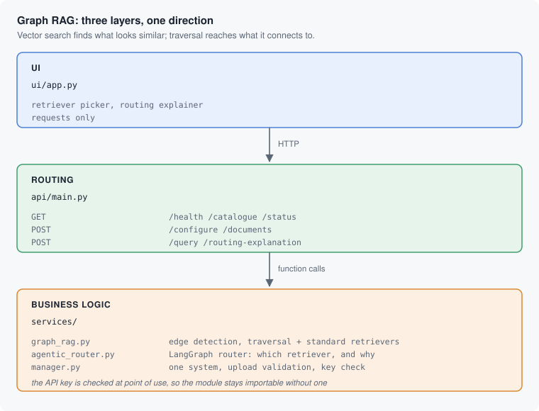

# Graph RAG

> **Learn how to build this project step-by-step on [AI-ML Companion](https://aimlcompanion.ai/)**. Interactive ML learning platform with guided walkthroughs, architecture decisions, and hands-on challenges.


**Vector search finds documents that *look like* your question. Some answers
only exist in what those documents *connect to*.**

---

## 1. The problem, demonstrated

Same dataset, same question, two retrievers. Real output from this project:

> **Question:** Which animals live in the same habitat as the aardvark?

| Retriever | Answer |
|---|---|
| **Standard vector** | *"The aardvark's habitat is the savanna. **None of the other animals listed share this habitat.** Narwhals: Arctic. Caribou: tundra. Bears: forests..."* |
| **Graph traversal** | *"The aardvark's habitat is the savanna. The other animals that share this habitat are: **Gazelles, Lions, Cheetahs, Ostriches**."* |

The standard retriever is not broken and it is not hallucinating. It did
exactly what it is designed to do: it embedded *"animals in the same habitat as
the aardvark"* and returned the documents nearest to that sentence - which are
documents **about aardvarks and about animals in general**. Gazelles and lions
are not textually similar to that question, so they never entered the context,
and the model correctly reported that nothing in its context matched.

It produced a confident, well-written, wrong answer with no error and no
warning.

Graph traversal starts from the same vector hits, then walks the
`habitat -> habitat` edge to every other document with the same value. The
lions were one hop away the whole time.

## 2. When traversal is the wrong tool

Traversal is not a free upgrade. It costs an edge-detection pass over your
corpus, and on questions with no relational structure (*"summarise this
document"*) it just retrieves more text.

That is what the third option is for. The **agentic router** reads the question
and picks, then tells you why:

```
router: traversal | confidence 0.95
```

You can also ask it to explain without answering, via
`POST /routing-explanation`, which is the interesting endpoint if you are
trying to learn how the routing decision is made.

## 3. The shape of it



## 4. A defect this restructure fixed

`graph_rag.py` used to do this at **module level**:

```python
if 'GOOGLE_API_KEY' not in os.environ:
    raise ValueError("GOOGLE_API_KEY environment variable not set...")
```

Raising at import time means the module cannot be imported at all without a
key. The API could not start and then report a helpful message - it died while
loading. No test could import the module either, which is why there were none.

The check now happens where the key is actually used:

```python
def _initialize_components(self):
    require_api_key()          # raises MissingAPIKey, caught by the API as 503
```

`GET /health` now answers `{"google_key": false}` instead of the process
refusing to start, and 24 tests import the module with no key set.

## 5. Run it

### Clone

```bash
git clone https://github.com/genieincodebottle/generative-ai.git
cd generative-ai/genai-usecases/advance-rag/graph-rag
```

### Set up with uv

```bash
pip install uv

uv venv
source .venv/bin/activate      # Linux / macOS
# .venv\Scripts\activate       # Windows PowerShell or cmd

uv pip install -r requirements.txt
```

Python 3.10+.

### Add a key

```bash
cp .env.example .env           # copy .env.example .env  on Windows
```

`GOOGLE_API_KEY` from [Google AI Studio](https://aistudio.google.com/app/apikey)
(free tier). Embeddings run **locally** on CPU (`all-mpnet-base-v2`), so the
first load downloads about 420 MB. That is a one-time cost.

### Start both services

```bash
python run.py
```

```
API   ->  http://localhost:8000/docs
UI    ->  http://localhost:8501
```

### Reproduce the result in section 1

1. Press **Use sample** in the sidebar. This loads a small animals dataset -
   no files needed - and prints the edges it detected
   (`habitat`, `origin`, `category`).
2. Pick **Standard vector** and ask *"Which animals live in the same habitat as
   the aardvark?"*
3. Switch to **Graph traversal** and ask the identical question.

### Run the tests

```bash
pytest                         # 24 tests, no API key, no network
```

## 6. The API

| Method | Path | Purpose |
|---|---|---|
| `GET` | `/health` | Liveness, whether the key is set, whether documents are loaded |
| `GET` | `/catalogue` | Models, the three retrievers, defaults |
| `GET` | `/status` | Loaded source, detected edges, active config |
| `POST` | `/configure` | Rebuild with new settings (clears loaded documents) |
| `POST` | `/documents` | Index uploads, or `use_sample=true` |
| `POST` | `/query` | Ask, with `retriever` = traversal / standard / hybrid |
| `POST` | `/routing-explanation` | What the router would pick, and why - without answering |

```bash
curl -s -X POST http://localhost:8000/documents -F "use_sample=true"

curl -X POST http://localhost:8000/query \
  -H 'Content-Type: application/json' \
  -d '{"question":"Which animals live in the same habitat as the aardvark?",
       "retriever":"traversal"}'
```

## 7. If something goes wrong

| symptom | cause | fix |
|---|---|---|
| UI says "Cannot reach the API" | Streamlit started on its own | use `python run.py` |
| `503 GOOGLE_API_KEY is not set` | `.env` missing or unfilled | `cp .env.example .env`, add the key, restart |
| First load takes several minutes | downloading the local embedding model (~420 MB) | expected once |
| `409 No documents are loaded` | nothing indexed yet | press **Use sample**, or upload files |
| `422 not a .pdf, .txt or .csv` | unsupported file type | convert it, or use a supported type |
| Standard retriever gives a poor answer | that is the point of section 1 | switch to traversal |
| No edges detected | your documents share no repeated metadata values | traversal needs structure to walk |
| Port already in use | something else has 8000/8501 | `API_PORT=8100 UI_PORT=8600 python run.py` |

## 8. Layout

```
run.py                       starts the API and the UI together
.env.example                 the key, and where to get it
.streamlit/config.toml       turns off Streamlit's own start-up advert

ui/app.py                    Streamlit. Retriever picker + requests only.

api/main.py                  7 routes, upload handling, status mapping

services/graph_rag.py        EDGE DETECTION, traversal and standard retrievers
services/agentic_router.py   LangGraph router: which retriever, and why
services/manager.py          one system, upload validation, the key check
services/llm_text.py         flattens Gemini 3 content blocks to text

tests/test_manager.py        validation, config guards, the key check, 13 cases
tests/test_api.py            routes and status codes, 11 cases
```

## 9. Track modules this covers

`graphRag` - `rag` - `knowledgeGraphs` - `langGraph` - `embeddings` -
`agenticRouting`

## 10. Honest limitations

- **Edges come from repeated metadata values, not from understanding.** Two
  documents are connected when they share a `habitat` value. That works
  beautifully on structured data like this dataset and does very little on a
  pile of unstructured prose with no shared fields.
- **The animals dataset is chosen to make traversal win.** It has clean,
  repeated categorical metadata. Your corpus probably does not, and on a
  corpus without structure, standard vector search is the right answer.
- **No scored evaluation.** Section 1 is one reproducible example, not a
  benchmark.
- **Embeddings are local and single-threaded.** Fine for a demo corpus, slow
  for thousands of documents.
- **The index is in memory and global.** Restart the API and it is gone;
  `POST /configure` rebuilds the single instance every client shares.
- **CORS is wide open** because both halves run on localhost.
