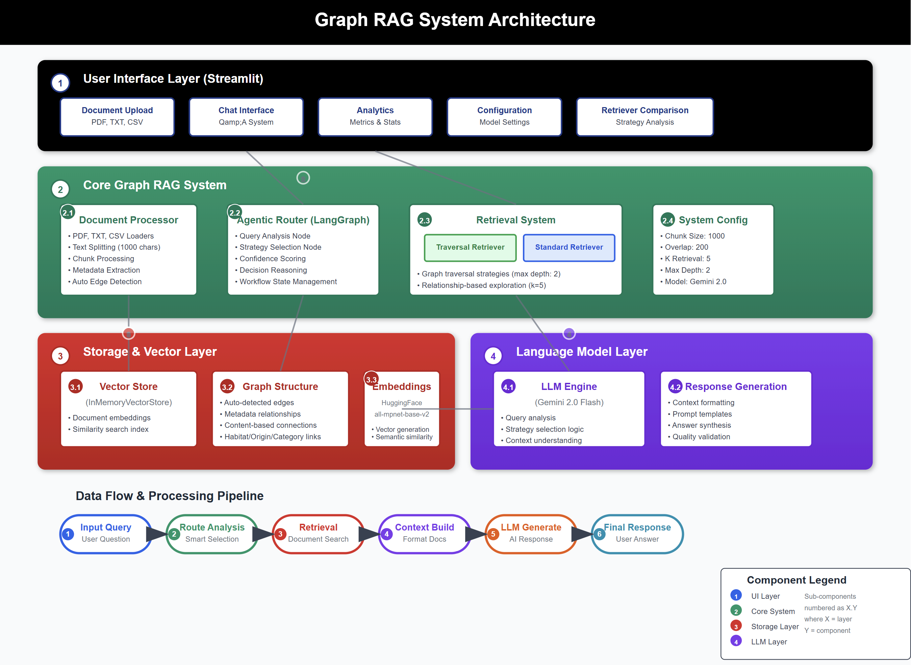
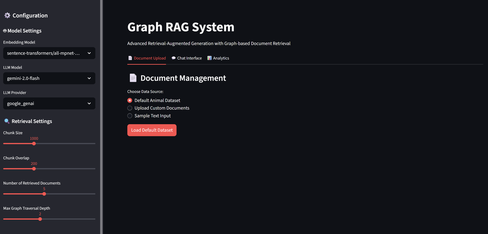
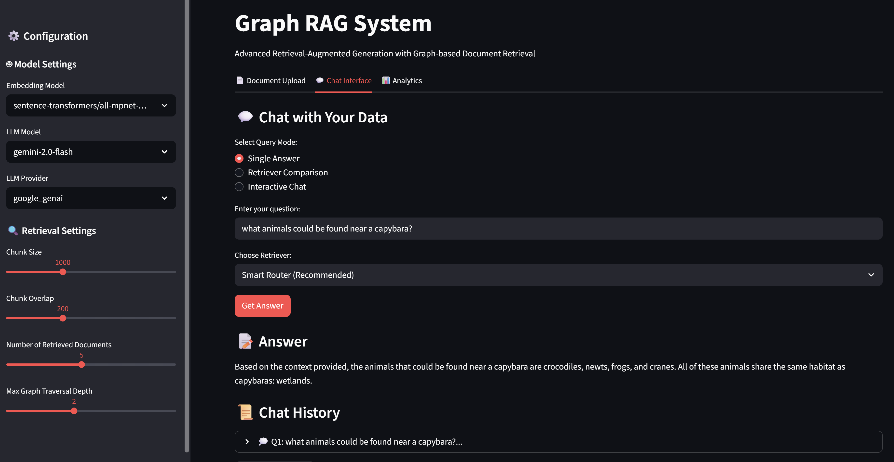

# Graph RAG System with Agentic Router

An advanced Retrieval-Augmented Generation (RAG) system that combines graph based document retrieval with intelligent routing using LangGraph.




## ✨ Features

### Core Capabilities
- **Graph-based Retrieval**: Leverages document relationships for enhanced context retrieval
- **Agentic Router**: AI-powered decision system that chooses optimal retrieval strategy
- **Multiple Retrievers**: 
  - **Traversal Retriever**: Explores graph relationships (depth-based traversal)
  - **Standard Retriever**: Direct vector similarity search
  - **Hybrid Router**: Intelligent selection based on query analysis

### Document Support
- **PDF Files**: Extract text from PDF documents
- **Text Files**: Plain text file processing
- **CSV Files**: Structured data import
- **Word Documents**: DOC/DOCX support
- **Direct Text Input**: Paste text directly into interface

### Streamlit Interface
- **Interactive Web UI**: User-friendly document upload and querying
- **Real-time Configuration**: Adjust model parameters on-the-fly
- **Retriever Comparison**: Side-by-side comparison of different retrieval strategies
- **Chat Interface**: Conversational interaction with documents
- **Analytics Dashboard**: Usage statistics and system metrics

## 📋 Installation

   1. Clone the repository:

      ```bash
      git clone https://github.com/genieincodebottle/generative-ai.git
      cd genai-usecases\advance-rag\graph-rag
      ```
   2. Open the Project in VS Code or any code editor.
   3. Create a virtual environment by running the following command in the terminal:
   
      ```bash
      pip install uv #if uv not installed
      uv venv
      .venv\Scripts\activate # On Linux -> source venv/bin/activate
      ```
   4. Create a requirements.txt file and add the following libraries:
      
      ```bash
       # Core LangChain and Graph RAG
        langchain>=0.3.27
        langchain-core>=0.3.75
        langchain-community>=0.3.29
        langchain-graph-retriever>=0.8.0
        langchain-huggingface>=0.3.1
        langchain-google-genai>=2.1.10
        langgraph>=0.6.6

        # Graph RAG specific
        graph_rag_example_helpers>=0.8.0

        # Embeddings
        sentence-transformers>=5.1.0

        # Document Processing
        pypdf>=3.0.0

        # Streamlit Interface
        streamlit>=1.49.1
        pandas>=2.3.2

        # Utilities
        python-dotenv>=1.1.1
      ```
   5. Install dependencies:
      
      ```bash
      uv pip install -r requirements.txt
      ```
   6. Configure Environment
      * Rename .env.example → .env
      * Update with your keys:

      ```bash
      GOOGLE_API_KEY=your_key_here # Using the free-tier API Key
      ```
      * Get **GOOGLE_API_KEY** here -> https://aistudio.google.com/app/apikey

## 🎯 Usage

### Streamlit Web Interface

**Start the Application**
```bash
streamlit run streamlit_app.py
```

Then open your browser to `http://localhost:8501`





**Features Available in Web Interface:**

1. **📄 Document Upload Tab**
   - Upload multiple files (PDF, TXT, CSV, DOC, DOCX)
   - Load default animal dataset
   - Direct text input
   - View file information and detected relationships

2. **💬 Chat Interface Tab**
   - Single Answer mode with retriever selection
   - Retriever Comparison mode (side-by-side results)
   - Interactive Chat mode with history
   - Progress indicators for long-running queries

3. **📊 Analytics Tab**
   - Usage statistics and query counts
   - Retriever usage metrics
   - Current configuration display

## 📊 System Architecture

### Core Components

1. **DocumentProcessor**: Handles file loading and text splitting
2. **GraphRAGSystem**: Main system orchestrator
3. **AgenticRetrieverRouter**: LangGraph-based intelligent routing
4. **StreamlitApp**: Web interface for user interaction

### Data Flow
```
Documents → Processing → Vector Store → Graph Edges → Retrievers
                                                    ↓
Query → Agentic Router → Selected Retriever → LLM → Answer
```

## 📈 Advanced Features

### Automatic Edge Detection

The system intelligently detects graph relationships based on your data:

**For Animal Dataset:**
```python
# Automatically detects these relationships
edges = [
    ("habitat", "habitat"),    # Animals sharing habitats
    ("origin", "origin"),      # Geographic connections  
    ("category", "category")   # Type-based groupings (mammal, bird, etc.)
]
```

**For Custom Documents:**
```python
# Auto-detects based on metadata and content
relationship_patterns = {
    'source': 'source',        # Document source relationships
    'author': 'author',        # Same author connections
    'category': 'category',    # Category-based links
    'topic': 'topic',         # Topic similarity
    'location': 'location',   # Geographic connections
    'date': 'date',           # Temporal relationships
    'department': 'department' # Organizational links
}

# Content-based patterns
content_patterns = {
    'person': ['person', 'people', 'individual', 'name'],
    'organization': ['company', 'organization', 'corp'],
    'location': ['city', 'country', 'state', 'region'], 
    'technology': ['software', 'system', 'platform'],
    'concept': ['concept', 'idea', 'theory', 'method']
}
```

### Retrieval Strategies

**Traversal Retriever Configuration:**
```python
GraphRetriever(
    store=vector_store,
    edges=detected_edges,
    strategy=Eager(
        k=5,           # Total documents to retrieve
        start_k=1,     # Initial seed documents
        max_depth=2    # Maximum traversal depth
    )
)
```

**Standard Retriever Configuration:**
```python
GraphRetriever(
    store=vector_store, 
    edges=detected_edges,
    strategy=Eager(
        k=5,           # Documents to retrieve
        start_k=5,     # All from initial search
        max_depth=0    # No traversal (direct similarity only)
    )
)
```

### Document Processing Pipeline

**Supported File Types:**
```python
def _load_single_file(self, file_path: str) -> List[Document]:
    file_extension = Path(file_path).suffix.lower()
    
    if file_extension == '.pdf':
        loader = PyPDFLoader(file_path)        # PDF documents
    elif file_extension == '.txt':
        loader = TextLoader(file_path)         # Plain text files
    elif file_extension == '.csv':
        loader = CSVLoader(file_path)          # CSV data files
    else:
        raise ValueError(f"Unsupported file format: {file_extension}")
```

**Text Splitting Configuration:**
```python
text_splitter = RecursiveCharacterTextSplitter(
    chunk_size=config.chunk_size,      # Default: 1000 characters
    chunk_overlap=config.chunk_overlap  # Default: 200 characters overlap
)
```

## 🔧 Customization

### Adding New Document Loaders

**Extend the DocumentProcessor:**
```python
def _load_single_file(self, file_path: str) -> List[Document]:
    file_extension = Path(file_path).suffix.lower()
    
    if file_extension == '.pdf':
        loader = PyPDFLoader(file_path)
    elif file_extension == '.txt':
        loader = TextLoader(file_path)
    elif file_extension == '.csv':
        loader = CSVLoader(file_path)
    elif file_extension == '.docx':
        # Add Word document support
        from langchain_community.document_loaders import Docx2txtLoader
        loader = Docx2txtLoader(file_path)
    elif file_extension == '.json':
        # Add JSON support
        from langchain_community.document_loaders import JSONLoader
        loader = JSONLoader(file_path)
    else:
        raise ValueError(f"Unsupported file format: {file_extension}")
```

### Custom Edge Detection

**Override the edge detection logic:**
```python
class CustomGraphRAGSystem(GraphRAGSystem):
    def _detect_edges(self, documents: List[Document]) -> List[tuple]:
        """Custom edge detection based on your domain"""
        edges = []
        
        # Your custom logic here
        for doc in documents:
            metadata = doc.metadata
            
            # Example: Connect documents by custom fields
            if 'project_id' in metadata:
                edges.append(('project_id', 'project_id'))
            if 'team' in metadata:
                edges.append(('team', 'team'))
                
        return edges
```

### Custom Smart Router

**Enhanced routing logic:**
```python
def _get_smart_retriever(self, question: str) -> BaseRetriever:
    """Enhanced smart routing with domain-specific rules"""
    question_lower = question.lower()
    
    # Relationship indicators
    relationship_words = ["related", "similar", "connected", "with"]
    
    # Domain-specific routing
    if "compare" in question_lower or "difference" in question_lower:
        return self.traversal_retriever
    elif "definition" in question_lower or "what is" in question_lower:
        return self.standard_retriever
    elif any(word in question_lower for word in relationship_words):
        return self.traversal_retriever
    else:
        return self.standard_retriever
```

### Complete Custom Implementation Example

```python
from graph_rag import GraphRAGSystem, GraphRAGConfig, RetrieverType

class DomainSpecificRAG(GraphRAGSystem):
    def __init__(self, domain_config=None):
        # Custom configuration for your domain
        config = GraphRAGConfig(
            embedding_model="sentence-transformers/all-MiniLM-L6-v2",
            llm_model="gemini-2.0-flash",
            chunk_size=800,
            k_retrieval=7,
            max_depth=3
        )
        super().__init__(config)
        self.domain_config = domain_config
    
    def _detect_edges(self, documents):
        # Your custom edge detection
        return [("custom_field", "custom_field")]
    
    def preprocess_query(self, query: str) -> str:
        # Add domain-specific query preprocessing
        query = query.replace("our company", "AcmeCorp")
        return query
    
    def query(self, question: str, retriever_type=None):
        processed_question = self.preprocess_query(question)
        return super().query(processed_question, retriever_type)

# Usage
domain_rag = DomainSpecificRAG()
domain_rag.initialize_with_files(['company_docs.pdf'])
answer = domain_rag.query("How does our company handle customers?")
```

## 🐛 Troubleshooting

### Common Issues & Solutions

**1. API Key Errors**
```bash
# Error: GOOGLE_API_KEY environment variable not set
# Solution: Create .env file with your key
echo "GOOGLE_API_KEY=your_actual_key_here" > .env

# Or set environment variable directly
export GOOGLE_API_KEY=your_actual_key_here
```

**2. Document Loading Failures**  
```python
# Error: "Unsupported file format"
# Solution: Check supported formats
supported_formats = ['.pdf', '.txt', '.csv']

# Error: "No documents could be loaded from files" 
# Solution: Verify file paths exist
import os
for file_path in file_paths:
    if not os.path.exists(file_path):
        print(f"File not found: {file_path}")
```

**3. Memory Issues with Large Documents**
```python
# Solution: Reduce chunk size and increase overlap
config = GraphRAGConfig(
    chunk_size=500,        # Reduced from 1000
    chunk_overlap=100,     # Reduced from 200
    k_retrieval=3          # Reduced from 5
)
```

**4. No Relevant Documents Found**
```python
# Check if documents were loaded properly
if rag_system.vector_store is None:
    print("Vector store not initialized - load documents first")

# Check detected relationships
relationships = rag_system.get_detected_relationships()
print(f"Detected relationships: {relationships}")
```

