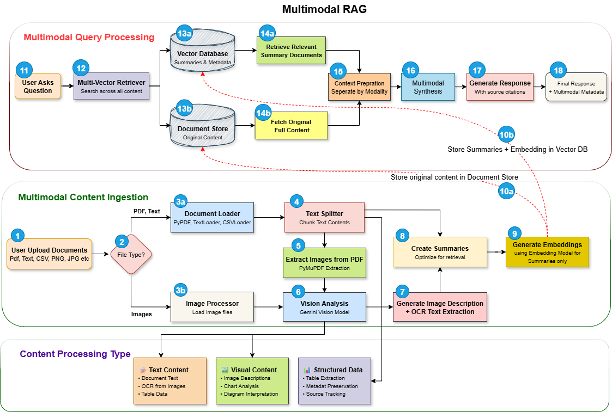

# 🖼️ Multimodal RAG System


[](https://www.python.org/downloads/)


[](https://langchain.com/)




A Multimodal RAG system that integrates text and images with Google Gemini LLMs and Embedding model, built using LangChain, ChromaDB and Streamlit.

## 🌟 Features
- **📄 Document Processing**: PDF text extraction and analysis
- **🖼️ Advanced Image Analysis**: Visual content description and OCR text extraction
- **🧠 Multi Vector Retrieval**: Separate processing for text, tables and images

## 🔧 Tech Stack
- **Python**: Programming Language
- **LangChain**: AI Framework
- **Gemini LLM API (Free tier)**: Google's AI models (gemini-2.0-flash, gemini-2.0-pro, gemini-2.5-pro, gemini-2.5-flash & Gemini Embedding Models)
- **ChromaDB (Open Source)**: High performance open-source vector database
- **Streamlit**: Interactive python based web interface

## ⚡ Quick Start
### 📦 Installation & Running App
   
   1. Prerequisites
      - Python 3.10 or higher
      - pip (Python package installer)
   2. Clone the repository:

      ```bash
      git clone https://github.com/genieincodebottle/generative-ai.git
      cd genai-usecases\advance-rag\multimodal-rag
      ```
   3. Open the Project in VS Code or any code editor.
   4. Create a virtual environment by running the following command in the terminal:
   
      ```bash
      pip install uv #if uv not installed
      uv venv
      .venv\Scripts\activate # On Linux -> source venv/bin/activate
      ```
   5. Create a `requirements.txt` file and add the following libraries:
      
      ```bash
      # Core Streamlit dependency
      streamlit
      # Google AI and LangChain dependencies
      google-generativeai
      langchain
      langchain-google-genai
      langchain-chroma
      langchain-community
      langchain-core
      langchain-text-splitters
      # Vector Database
      chromadb
      # Document Processing
      pypdf
      pymupdf
      # Environment and Configuration
      python-dotenv
      ```
   6. Install dependencies:
      
      ```bash
      uv pip install -r requirements.txt
      ```
   7. Configure Environment
      * Rename .env.example → .env
      * Update with your keys:

         ```bash
         GOOGLE_API_KEY=your_key_here # Using the free-tier API Key
         ```
      * Get **GOOGLE_API_KEY** here -> https://aistudio.google.com/app/apikey

   8. Running the Application. Start the Streamlit app:
      
      ```bash
      streamlit run streamlit_app.py
      ```

      The application will open in your browser at `http://localhost:8501`

## 📋 Usage Guide

1. **Configure Models & Parameters**
   Configure your settings in the sidebar before initializing:
   
   **🤖 Model Selection:**
   - **Main LLM Model**: Choose from different Gemini LLMs
   - **Vision Model**: Select model for image processing and analysis  
   - **Embedding Model**: Pick between `text-embedding-004` or `text-embedding-003`
   
   **⚙️ Model Parameters:**
   - **Temperature** (0.0-1.0): Control creativity (0=focused, 1=creative)
   - **Max Tokens** (1024-8192): Maximum response length
   
   **📝 Processing Settings:**
   - **Chunk Size** (500-3000): Size of text chunks for processing
   - **Retrieval Count** (3-15): Number of relevant chunks to retrieve

2. **Initialize & Setup**
   - Click "🔄 Initialize System" to create RAG system with selected models
   - Upload PDF documents and/or images (PNG, JPG, JPEG)
   - Click "🔨 Build Database" to process uploaded files

3. **Query Your Content**
   - Ask questions about your uploaded content
   - View sample questions for inspiration
   - Get multimodal responses with source citations
   - See breakdown of text, table, and image sources used

4. **Review History**
   - Track previous queries and responses
   - Clear history when needed

## 📁 Supported File Types

1. **Documents**:
   - **PDF**: Full text extraction + image extraction from PDFs
   - **TXT**: Plain text files

2. **Images**:
   - **PNG, JPG, JPEG**: Visual analysis and OCR text extraction
   - **Charts/Graphs**: Data extraction and description  
   - **Diagrams**: Technical analysis and interpretation
   - **PDF Images**: Automatically extracted and processed

## 🎯 Sample Use Cases

1. **Financial Analysis**: Upload annual reports (PDF) and financial charts (images)
2. **Research Projects**: Process research papers with accompanying figures
3. **Technical Documentation**: Analyze manuals with diagrams and specifications
4. **Business Intelligence**: Combine reports, presentations, and data visualizations

## 🔧 Advanced Features

1. **Multi-Vector Retrieval**
   - Separate processing for text, tables, and images
   - Enhanced context understanding
   - Better relevance matching

2. **Enhanced Image Processing**
   - Detailed visual analysis using Gemini Vision
   - OCR for text extraction
   - Chart and graph data extraction

3. **Smart Chunking**
   - Context aware text splitting
   - Overlap optimization for continuity
   - Metadata preservation

## 🔧 Troubleshooting

### 🛑 Common Issues:

1. **"API Key Error"**
   - Verify your Google API key in `.env` file
   - Ensure you have access to Gemini API
   - Try regenerating your API key

2. **"ChromaDB/Vector Database Error"**
   - Check write permissions in the project directory
   - Delete `chroma_db` folder and rebuild database
   - Ensure sufficient disk space

3. **"File Upload Issues"**  
   - Supported formats: PDF, TXT, PNG, JPG, JPEG
   - Check file size (reasonable limits recommended)
   - Verify files are not corrupted

## ⚡️Performance Tips

1. **Use smaller models** like `gemini-2.0-flash` for better speed
2. **Chunk Size**: 1500+ for comprehensive documents, 800-1200 for focused content
3. **Retrieval Count**: 6-8 for balanced results, 10+ for comprehensive search
4. **Temperature**: 0.1-0.3 for factual questions, 0.5-1.0 for creative tasks
5. **File Organization**: Group related documents for better context
6. **Query Specificity**: More specific questions yield better results
7. **Mixed Content**: Combine text documents with relevant images for richer context

## 🔐 Security Notes

- Never commit your .env file to version control
- Keep your Google API key secure

---
<strong>RAG On.. 🔥</strong>