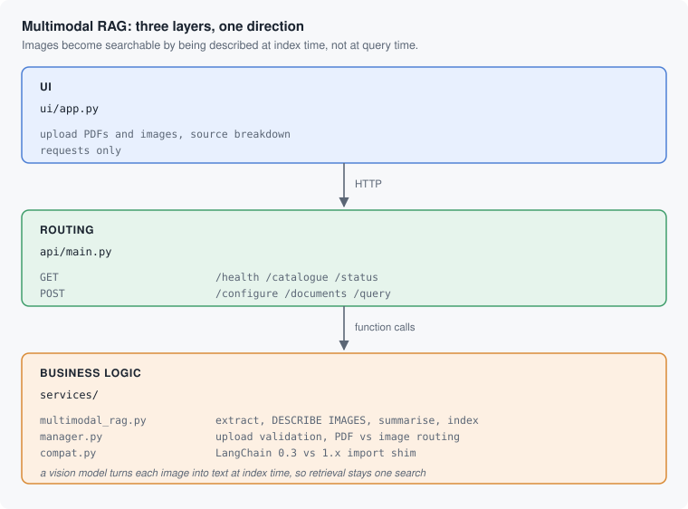

# Multimodal RAG

> **Learn how to build this project step-by-step on [AI-ML Companion](https://aimlcompanion.ai/)**. Interactive ML learning platform with guided walkthroughs, architecture decisions, and hands-on challenges.


**A chart is not text, and a text index cannot find it. This project makes
images retrievable by describing them at index time, so one search covers
paragraphs, tables and figures alike.**

---

## 1. The problem

Half the answer in a real report is in the figures. Ask *"what does the chart
on page 3 show?"* of an ordinary RAG pipeline and it retrieves the paragraph
next to the chart, because that is the only thing it ever indexed.

You cannot embed a bar chart into the same space as a sentence and expect
similarity to mean anything. So the image has to become text **before** it is
indexed, not after the question arrives.

## 2. What actually happens

At index time, each image is sent to a vision model, which writes a
description. That description is embedded and stored alongside the real text.
At query time there is only one search, over one index, and an image can win
it.

Real output from this project, with an index containing **one image and no
text at all**:

> **Question:** Which region had the highest Q3 revenue, and what was the value?

> **Answer:** Based on the visual analysis of the provided chart titled
> "Q3 REVENUE BY REGION", the region with the highest Q3 revenue was **AMER**
> (Americas). The revenue value for AMER was **300** [...] accounting for
> approximately 47.62% of the total combined revenue across all three regions
> and generating 2.5 times the revenue [of EMEA].

```json
"multimodal_summary": {"text_sources": 0, "table_sources": 0, "image_sources": 1}
```

The bars were 120, 210 and 300. 300 / 630 is 47.62%, and 300 / 120 is 2.5.
Both figures are right, and both were derived from pixels.

That `multimodal_summary` is worth watching: it tells you which modality the
answer actually came from, which is the only honest way to know whether the
image pipeline is doing anything.

## 3. The shape of it



## 4. Run it

### Clone

```bash
git clone https://github.com/genieincodebottle/generative-ai.git
cd generative-ai/genai-usecases/advance-rag/multimodal-rag
```

### Set up with uv

```bash
pip install uv

uv venv
source .venv/bin/activate      # Linux / macOS
# .venv\Scripts\activate       # Windows PowerShell or cmd

uv pip install -r requirements.txt
```

Python 3.10+.

### Add a key

```bash
cp .env.example .env           # copy .env.example .env  on Windows
```

`GOOGLE_API_KEY` from [Google AI Studio](https://aistudio.google.com/app/apikey)
(free tier). Nothing is downloaded; both the answering model and the vision
model are API calls.

### Start both services

```bash
python run.py
```

```
API   ->  http://localhost:8000/docs
UI    ->  http://localhost:8501
```

### Use it

1. Upload a PDF **or an image** (or both) and press **Index**. Images inside
   PDFs are extracted and described too.
2. Ask a question about a figure.
3. Check the **image sources** metric to confirm the answer came from a
   picture rather than from surrounding prose.

**Indexing is the slow step.** Every image costs a vision-model call before it
becomes searchable. A twenty-image PDF is twenty calls. Querying afterwards is
fast, because the hard work is already done.

### Run the tests

```bash
pytest                         # 27 tests, no API key, no network
```

## 5. The API

| Method | Path | Purpose |
|---|---|---|
| `GET` | `/health` | Liveness, whether the key is set, whether anything is indexed |
| `GET` | `/catalogue` | Answering models, vision models, defaults |
| `GET` | `/status` | What is indexed, split into documents and images |
| `POST` | `/configure` | Rebuild with different models (clears the index) |
| `POST` | `/documents` | Index PDFs and images together |
| `POST` | `/query` | Ask across all modalities |

```bash
curl -s -X POST http://localhost:8000/documents \
  -F "files=@revenue_chart.png;type=image/png"

curl -X POST http://localhost:8000/query \
  -H 'Content-Type: application/json' \
  -d '{"question":"Which region had the highest Q3 revenue?","k":6}'
```

## 6. LangChain 0.3 and 1.x

**LangChain 1.0 emptied the top-level `langchain.retrievers` namespace.**
`MultiVectorRetriever` and `InMemoryByteStore` moved, and code written against
0.3 dies at import with a bare `ModuleNotFoundError` before anything runs.

`services/compat.py` tries the 1.x location first and falls back to 0.3, so a
fresh clone works whichever version resolves:

| class | 0.3.x | 1.x |
|---|---|---|
| `MultiVectorRetriever` | `langchain.retrievers.multi_vector` | `langchain_classic.retrievers.multi_vector` |
| `InMemoryByteStore` | `langchain.storage` | `langchain_core.stores` |

## 7. If something goes wrong

| symptom | cause | fix |
|---|---|---|
| UI says "Cannot reach the API" | Streamlit started on its own | use `python run.py` |
| `503 GOOGLE_API_KEY is not set` | `.env` missing or unfilled | `cp .env.example .env`, add the key, restart |
| Indexing takes minutes | one vision call per image | expected; it is the whole point |
| `409 Nothing has been indexed` | no upload yet | index a PDF or image first |
| `422 not a PDF or an image` | unsupported file type | PDF, PNG, JPG, JPEG, WEBP, GIF or BMP |
| `image_sources: 0` on a figure question | the description did not match the question | raise `k`, or ask using words the figure would contain |
| Rate limit during indexing | free tier, many images | index fewer images at a time |
| Port already in use | something else has 8000/8501 | `API_PORT=8100 UI_PORT=8600 python run.py` |

## 8. Layout

```
run.py                        starts the API and the UI together
.env.example                  the key, and where to get it
.streamlit/config.toml        turns off Streamlit's own start-up advert

ui/app.py                     Streamlit. Upload + requests only.

api/main.py                   6 routes, upload handling, status mapping

services/multimodal_rag.py    extraction, IMAGE DESCRIPTION, summarisation, index
services/manager.py           upload validation, PDF vs image routing, key check
services/compat.py            LangChain 0.3 vs 1.x import shim
services/llm_text.py          flattens Gemini 3 content blocks to text

tests/test_manager.py         classification, validation, guards, 19 cases
tests/test_api.py             routes and status codes, 8 cases
```

## 9. Track modules this covers

`multimodalRag` - `rag` - `visionModels` - `embeddings` - `vectorDatabases` -
`documentAi`

## 10. Honest limitations

- **The description is the retrieval surface, not the image.** If the vision
  model omits a detail, that detail is unsearchable no matter how clearly it
  appears in the picture. Retrieval quality is capped by description quality.
- **Indexing cost scales with image count.** Every image is an API call, every
  time you re-index. There is no description cache between runs.
- **Table extraction is basic.** Tables are pulled as text; complex merged-cell
  layouts will not survive intact.
- **No OCR fallback.** A scanned page is handled as an image and described,
  which is not the same as reading it accurately.
- **The index is global and in memory.** Restart the API and it is gone;
  `POST /configure` rebuilds the single instance every client shares.
- **CORS is wide open** because both halves run on localhost.
