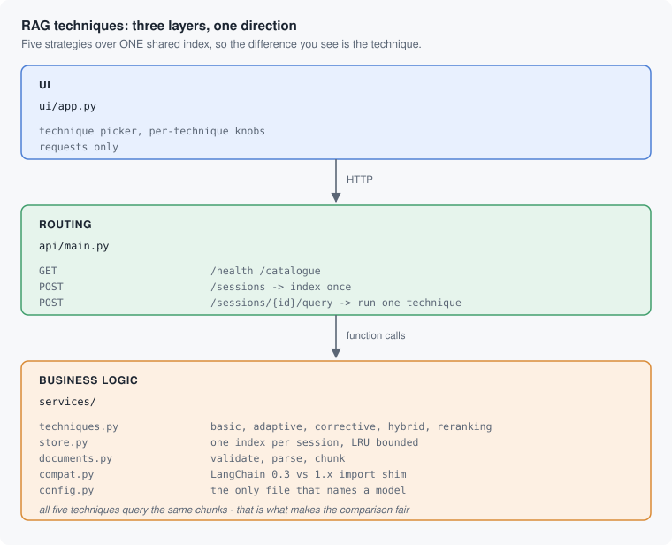

# RAG Techniques, Compared

> **Learn how to build this project step-by-step on [AI-ML Companion](https://aimlcompanion.ai/)**. Interactive ML learning platform with guided walkthroughs, architecture decisions, and hands-on challenges.


**Five retrieval strategies over one shared index. Because they all query the
same chunks, the difference you see is the technique and nothing else.**

---

## 1. The problem, demonstrated

This is not a hypothetical. Same documents, same index, same question, one
knob different:

> **Question:** What are the main types of machine learning?

| Technique | Retrieved | Answer |
|---|---|---|
| **Basic RAG** (`k=2`) | 2 chunks | "Supervised Learning, Unsupervised Learning" |
| **Adaptive RAG** | 4 chunks | "Supervised, Unsupervised, **Reinforcement**" |

The bundled source document states, in as many words, that machine learning is
*"broadly divided into three categories"*. Basic RAG at `k=2` did not retrieve
the chunk describing reinforcement learning, so it answered with two - fluently,
confidently, and **wrong**.

Nothing about that answer looks like a failure. There is no error, no warning,
no low-confidence score. That is the entire reason the other four techniques
exist, and you can reproduce this in about a minute with the bundled samples.

## 2. The five techniques

| Technique | Strategy | Costs |
|---|---|---|
| **Basic** | Embed, take top-k, answer | 1 LLM call. The baseline. |
| **Adaptive** | Classify the question simple/moderate/complex, vary k and prompt style | 2 LLM calls |
| **Corrective** | Answer, critique that answer, re-retrieve **using the critique**, answer again | 3 LLM calls, 2 retrievals |
| **Hybrid** | Weighted ensemble of BM25 keyword search and vector search | 1 LLM call, 2 retrievals |
| **Re-ranking** | Over-retrieve 8, re-order with a second model, keep the best | 1 LLM call + reranker |

Two of these are worth spelling out, because their point is easy to miss:

**Corrective RAG's second search uses the critique, not the question.** That is
what lets it find context the original wording never would have matched. There
is a test that pins exactly this
(`test_second_retrieval_uses_the_critique_not_the_query`).

**Hybrid exists because vector search cannot match tokens it has never seen.**
Product codes, error numbers, surnames. BM25 handles those and fumbles
paraphrase; the ensemble covers both.

## 3. The shape of it



This project used to be five separate Streamlit scripts, each with its own
loader, its own chunker, and its own index. Comparing them meant running five
apps that had each embedded the documents differently - so any difference you
observed might have been the chunking, not the technique.

Now documents are indexed **once** per session and every technique queries that
same index. `services/techniques.py` holds all five side by side, which is also
how you read them: the differences are 20 lines apart, not five files apart.

## 4. Run it

### Clone

```bash
git clone https://github.com/genieincodebottle/generative-ai.git
cd generative-ai/genai-usecases/advance-rag/rag_techniques
```

### Set up with uv

```bash
pip install uv

uv venv
source .venv/bin/activate      # Linux / macOS
# .venv\Scripts\activate       # Windows PowerShell or cmd

uv pip install -r requirements.txt
```

Python 3.10+.

### Add a key

```bash
cp .env.example .env           # copy .env.example .env  on Windows
```

| Variable | Where to get it | Embeddings used |
|---|---|---|
| `GOOGLE_API_KEY` | [Google AI Studio](https://aistudio.google.com/app/apikey) | Gemini API, nothing to download |
| `GROQ_API_KEY` | [Groq Console](https://console.groq.com/keys) | **local CPU**, ~250 MB on first run |

Groq serves chat models but no embedding model, so that path runs
`nomic-embed-text-v1.5` locally. **Gemini is the lighter first run.**

### Start both services

```bash
python run.py
```

```
API   ->  http://localhost:8000/docs
UI    ->  http://localhost:8501
```

### Reproduce the result in section 1

1. Press **Use samples** in the sidebar. No files needed - two documents ship
   with the project and index in a few seconds.
2. Pick **Basic RAG**, set k to **2**, ask *"What are the main types of machine
   learning?"*
3. Switch to **Adaptive RAG** and ask the identical question.

Compare the two answers. Nothing changed except the retrieval strategy.

### Run the tests

```bash
pytest                         # 51 tests, no API key, no network
```

The technique tests use stub models that record every prompt and every search,
so they assert the *strategy* - which chunks were asked for, how many LLM calls
were made, and what happens when a re-ranker filters everything out.

## 5. The API

| Method | Path | Purpose |
|---|---|---|
| `GET` | `/health` | Liveness, configured providers, session count |
| `GET` | `/catalogue` | Providers, models, techniques and the options each takes |
| `POST` | `/sessions` | Index documents once (or `use_samples=true`) |
| `POST` | `/sessions/{id}/query` | Run one technique against that index |
| `DELETE` | `/sessions/{id}` | Drop the session and its index |

```bash
SID=$(curl -s -X POST http://localhost:8000/sessions \
       -F "provider=Gemini (Google)" -F "use_samples=true" \
       | python -c "import json,sys; print(json.load(sys.stdin)['session_id'])")

curl -X POST "http://localhost:8000/sessions/$SID/query" \
  -H 'Content-Type: application/json' \
  -d '{"query":"What are the main types of machine learning?",
       "technique":"adaptive","model":"gemini-flash-latest"}'
```

Every response carries a `steps` list describing what the technique actually
did, which is the part worth reading:

```json
"steps": ["Classified the question as complex",
          "Retrieved 8 chunks (k chosen by complexity)",
          "Answered with the complex prompt style"]
```

## 6. LangChain 0.3 and 1.x

**LangChain 1.0 emptied the top-level `langchain.retrievers` namespace.**
`ContextualCompressionRetriever`, `EnsembleRetriever`, and the document
compressors moved to `langchain_classic`. Code written against 0.3 fails on 1.x
at import time with a bare `ModuleNotFoundError`, before anything runs.

A fresh clone can reasonably resolve either version, so every moved import goes
through `services/compat.py`, which tries the 1.x location, falls back to the
0.3 one, and otherwise raises an error naming the package to install.

| class | 0.3.x | 1.x |
|---|---|---|
| `ContextualCompressionRetriever` | `langchain.retrievers` | `langchain_classic.retrievers` |
| `EnsembleRetriever` | `langchain.retrievers` | `langchain_classic.retrievers` |
| document compressors | `langchain.retrievers.document_compressors` | `langchain_classic.retrievers.document_compressors` |
| `BM25Retriever` | `langchain_community.retrievers` | unchanged |

## 7. Models

Defaults are Google's rolling aliases (`gemini-flash-latest`). Every
`gemini-2.0-*` ID this project previously pinned has been retired, which turns
a working clone into a 404 with no code change. `services/config.py` is the
only file that names a model.

## 8. If something goes wrong

| symptom | cause | fix |
|---|---|---|
| UI says "Cannot reach the API" | Streamlit started on its own | use `python run.py` |
| "No API keys found" | `.env` missing or unfilled | `cp .env.example .env`, add a key, restart the API |
| `ModuleNotFoundError: langchain.retrievers` | LangChain 1.x with pre-shim code | fixed here by `services/compat.py`; reinstall requirements |
| `422 No extractable text found` | scanned/image PDF | this project does not OCR; use a text PDF or the samples |
| "FlashRank is not installed" | optional re-ranker | `pip install flashrank`, or use Embeddings Filter |
| "Hybrid search needs rank_bm25" | optional dependency | `pip install rank_bm25` |
| Re-ranker kept 0 chunks | filter threshold too strict | it falls back and says so in `steps` |
| First Groq index takes minutes | downloading local embeddings | expected once; or switch to Gemini |
| `404` on query | session evicted (LRU, default 12) | index again |
| Port already in use | something else has 8000/8501 | `API_PORT=8100 UI_PORT=8600 python run.py` |

## 9. Layout

```
run.py                       starts the API and the UI together
.env.example                 the keys, and where to get them
.streamlit/config.toml       turns off Streamlit's own start-up advert
sample_docs/                 two documents, so the app works with no files

ui/app.py                    Streamlit. Technique picker + requests only.

api/main.py                  5 routes, upload handling, status mapping

services/config.py           THE ONLY FILE THAT NAMES A MODEL OR READS THE ENV
services/techniques.py       ALL FIVE TECHNIQUES, side by side
services/store.py            one index per session, LRU bounded
services/documents.py        validate, parse, chunk
services/compat.py           LangChain 0.3 vs 1.x import shim
services/llm.py              provider -> chat model and embeddings
services/llm_text.py         flattens Gemini 3 content blocks to text
services/retry.py            backoff for transient embedding failures

tests/test_documents.py      validation, parsing, chunking, 16 cases
tests/test_techniques.py     strategy behaviour with stub models, 24 cases
tests/test_api.py            routes and status codes, 11 cases
```

## 10. Track modules this covers

`rag` - `advancedRag` - `hybridSearch` - `reranking` - `embeddings` -
`vectorDatabases` - `chunking`

## 11. Honest limitations

- **This is a demonstrator, not a benchmark.** There is no scored eval set
  here. The section 1 result is one reproducible example, not a measurement of
  which technique is better in general. Which one wins depends entirely on your
  corpus and your questions.
- **"More chunks" is not free.** Adaptive's k=8 costs more tokens and more
  latency than basic's k=2, and on a simple lookup the extra context can
  distract rather than help. The trade-off is the lesson.
- **Corrective RAG triples your LLM calls** for one answer. On a rate-limited
  free tier that is the difference between working and 429.
- **BM25 is rebuilt per query** in the hybrid technique. Fine at this corpus
  size, wasteful at scale; build it once alongside the index.
- **Sessions live in process memory.** Restart the API and every index is gone.
- **No OCR.** Scanned PDFs are detected and rejected with a clear message
  rather than silently indexing nothing.
- **CORS is wide open** because both halves run on localhost.
