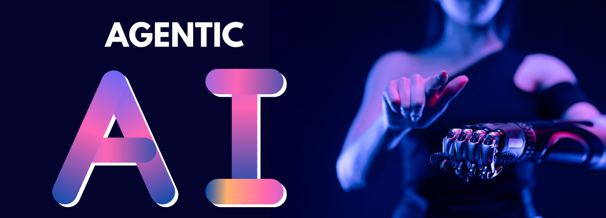
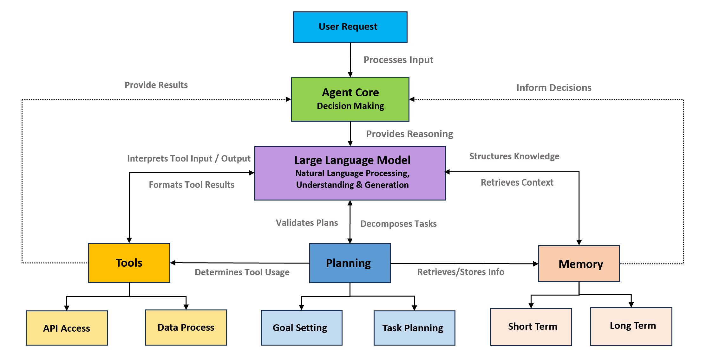
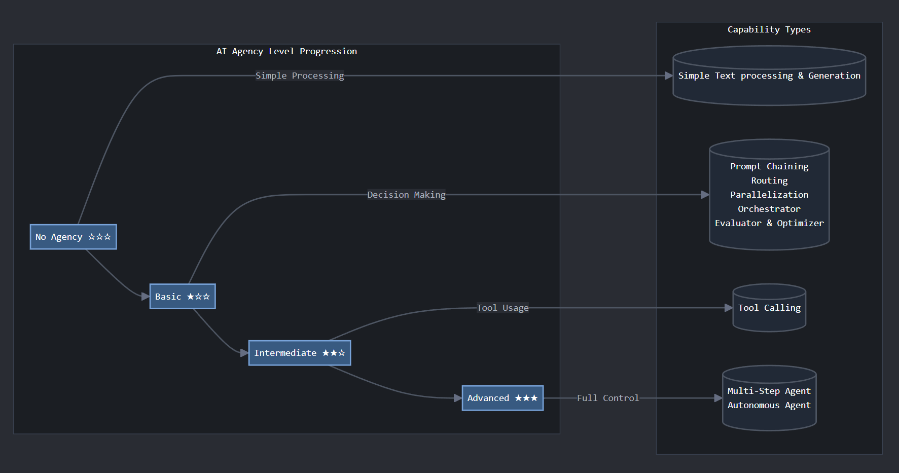
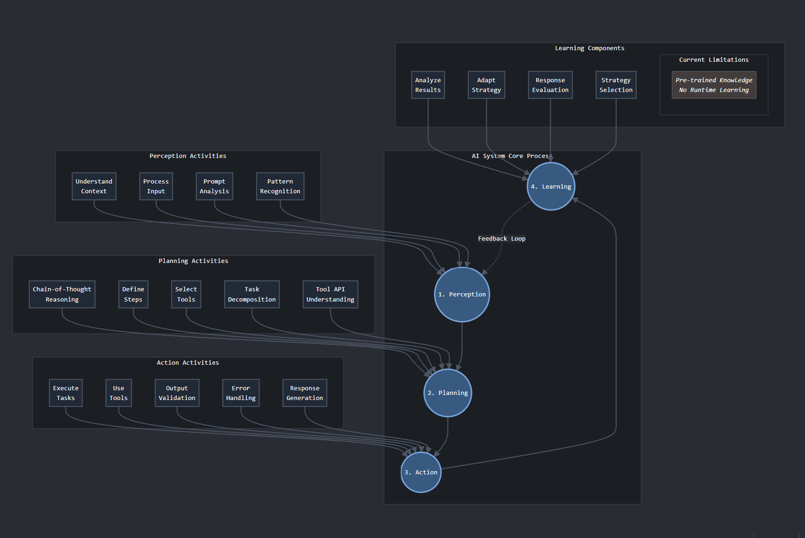
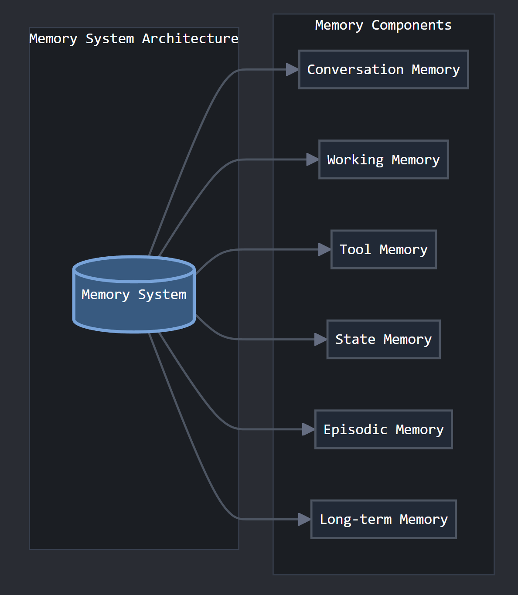
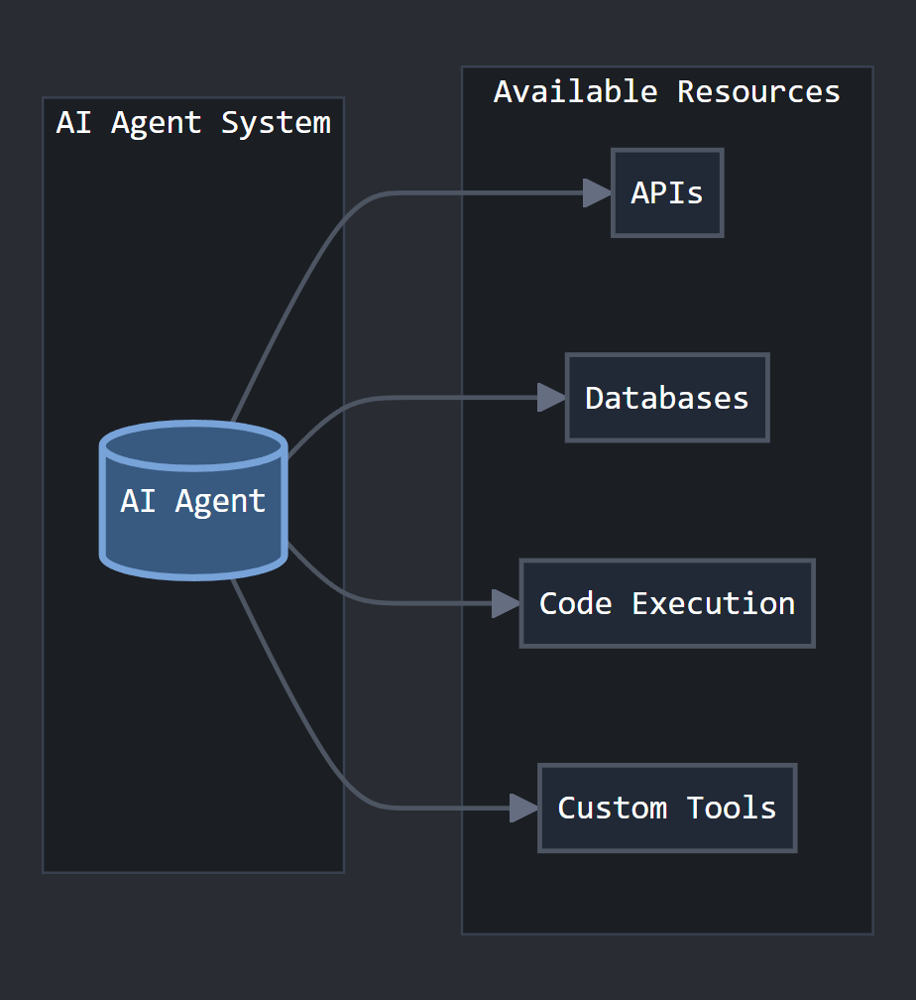
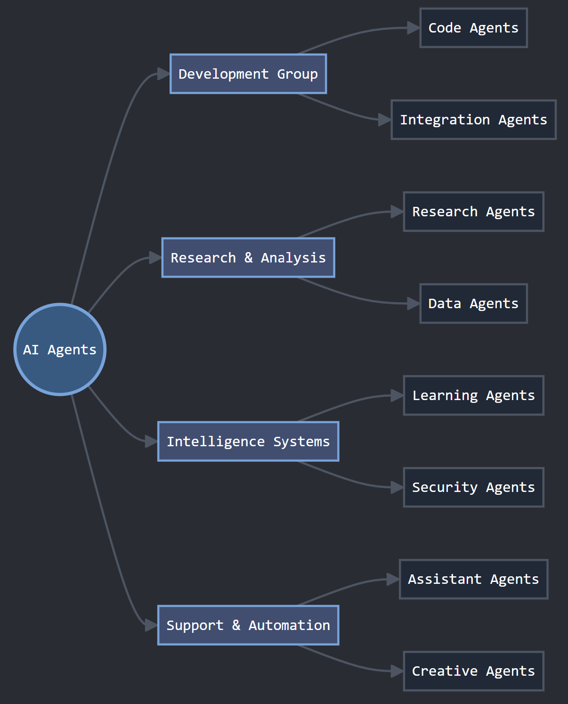
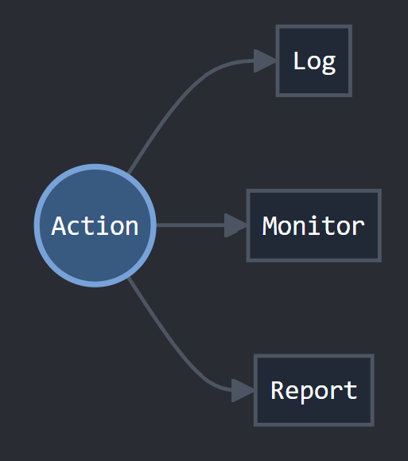

   

 

### 🤖 Agentic AI: From LLMs to Autonomous Agents
Agentic AI is where LLMs evolve beyond text generation - to perceive, plan, act, and learn autonomously using tools, memory, and workflows.

Explore code, courses, and concepts to build your own AI agents.

### 📚 Quick Links

[🤖 What is Agentic AI or AI Agents?](#-what-are-ai-agents)

[📊 Understanding Agency Levels](#-understanding-agency-levels)

[⚙️ How Do AI Agents Work?](#%EF%B8%8F-how-do-ai-agents-work)

[🎯 When to Use Each Agency Level? ](#-when-to-use-each-agency-level)

[🌐 Types of AI Agents](#-types-of-ai-agents)

[💡 Best Practices for Development](#-best-practices-for-development)

[📚 Learn More](#-learn-more)

📚 Courses

- [Huggingface AI Agents Course 🆕](https://huggingface.co/learn/agents-course/en/unit0/introduction)

🧪 Code Examples

- [AI Workflow](./ai_workflow/)
- [AI Agents](./agents/)
   - [CrewAI Usecases](./agents/crewai_usecases/)
   - [Langgraph Usecases](./agents/langgraph_usecases/)

👉 [Agentic AI Interview Q & A](../../docs/agentic-ai-interview-questions.pdf)

### 🤖 What is Agentic AI or AI Agents? 

Agentic AI extends LLMs with the ability to:
   * Autonomously solve problems
   * Use APIs/tools and interact with environments
   * Plan, act, and learn from feedback

Think of an AI Agent as an LLM with hands and a brain, it can understand, plan and interact with the real world through tools and APIs autonomously.

### 📊 Understanding Agency Levels 

In essence, LLMs need [agency](https://huggingface.co/docs/smolagents/conceptual_guides/intro_agents), as agentic systems connect LLMs to the outside world.

Agency refers to how independently an AI system can operate. Here's what each level means:

#### 🔗 References: 
   - [Huggingface Agent Guide](https://huggingface.co/docs/smolagents/conceptual_guides/intro_agents)
   - [Anthropic Effective Agent Guide](https://www.anthropic.com/research/building-effective-agents)

Adapted from above references.

#### Level 0: No Agency
- Basic text processing
- Simple input/output operations
- Like a smart autocomplete

#### Level 1: Basic Agency
- Can make simple decisions
- Handles structured tasks
- Uses basic prompt chaining, Parallelization, Routing, Orchestrator, Evaluator & Optimizer etc..

#### Level 2: Intermediate Agency
- Uses external tools (Tool Calling)
- Breaks down complex tasks
- Makes informed decisions

#### Level 3: Advanced Agency
- Works autonomously (Mult-Step Agent , Autonomous Agent)
- Handles complex workflows
- Self-improves over time

### 🎯 When to Use Each Agency Level? 

#### Choose High Agency When You Need:
- Complex problem solving
- Dynamic decision making
- Strong feedback loops
- Clear performance metrics

#### Choose Low Agency When You Have:
- Simple, repetitive tasks
- Fixed workflows
- Budget constraints
- Limited tool requirements

### ⚙️ How Do AI Agents Work? 

#### The Operation Cycle

1. **Perceive** 👀
   - Understands context
   - Processes input
   - Recognizes patterns

2. **Plan** 🗺️
   - Reasons about the task
   - Chooses tools
   - Breaks down problems

3. **Act** 🎯
   - Uses tools
   - Validates results
   - Handles errors

4. **Learn** 📚
   - Analyzes outcomes
   - Adapts strategies
   - Improves over time

#### 🧠 Memory Systems 

AI Agents use different types of memory to function effectively:

##### Short-Term Memory
- **Conversation Memory**: Keeps track of current dialogue
- **Working Memory**: Handles active tasks and immediate goals

##### Long-Term Memory
- **Tool Memory**: Records how to use different tools
- **Episodic Memory**: Stores past experiences
- **Knowledge Memory**: Maintains learned information

#### 🛠️ Tool Integration 

AI Agents can interact with various external tools and resources:

- **APIs**: Connect to external services
- **Databases**: Store and retrieve data
- **Code Execution**: Run runtime environments
- **Custom Tools**: Handle specialized tasks

### 🌐 Types of AI Agents 

#### Development Agents
- Write and review code
- Integrate systems
- Debug problems

#### Research Agents
- Gather information
- Analyze data
- Generate insights

#### Support Agents
- Automate tasks
- Generate content
- Provide assistance

#### Security Agents
- Monitor systems
- Detect threats
- Protect resources

And More .......

### 💡 Best Practices for Development 

#### 1. Start Small, Scale Smart
- Begin with minimal features
- Add complexity gradually
- Test thoroughly at each step

#### 2. Build Robust Systems
- Use modular design
- Implement error handling
- Maintain clear documentation

#### 3. Prioritize Quality
- Test extensively
- Monitor performance
- Consider ethical implications
- Maintain security standards

### 📚 Learn More 

- [Anthropic's Guide to Building Effective Agents](https://www.anthropic.com/research/building-effective-agents)
- [Huggingface Agent Guide-Smolagents](https://huggingface.co/docs/smolagents/conceptual_guides/intro_agents)
- [Chip Huyen's Blog on Agents](https://huyenchip.com//2025/01/07/agents.html)
- [Google’s Agent Whitepaper](https://www.kaggle.com/whitepaper-agents)