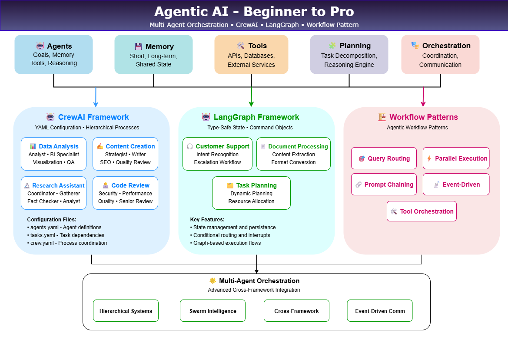

[](https://www.python.org/downloads/)
[](https://streamlit.io)
[](https://langchain.com)
[](https://crewai.com)
[](https://langchain-ai.github.io/langgraph/)

> Hands-on multi-agent implementations showcasing cutting-edge patterns, best practices, and orchestration techniques in autonomous agent development using CrewAI and LangGraph.

🌟 **[Agentic AI Interview Q&A](../../docs/agentic-ai-interview-questions.pdf)**

## 🚀 Start Here — Learning Path for Beginners

If you're new to Agentic AI, **don't try to learn everything at once**. Follow this path:

### Step 1: Workflow Patterns (start here — simplest)
These are standalone Streamlit apps that teach one pattern each. No YAML, no complex state management.

```bash
cd genai-usecases\agentic-ai

# 1️⃣ Start with Query Routing — see how an LLM classifies and routes queries
streamlit run agentic_workflows\query_routing.py

# 2️⃣ Parallel Execution — run multiple LLM tasks concurrently
streamlit run agentic_workflows\parallel_execution.py

# 3️⃣ Prompt Chaining — multi-step reasoning where each step builds on the last
streamlit run agentic_workflows\prompt_chaining.py
```

### Step 2: LangGraph (state-driven agents)
LangGraph adds **state management** — agents pass structured data between steps via a shared state object.

```bash
# 4️⃣ Customer Support Agent — best intro to LangGraph's state + conditional routing
streamlit run agentic_frameworks\langgraph\customer_support_agent.py
```

### Step 3: CrewAI (multi-agent teams)
CrewAI lets you define **teams of specialized agents** via YAML config files. Each agent has a role, goal, and backstory.

```bash
# 5️⃣ Data Analysis Crew — 4 agents collaborate to analyze your CSV data
streamlit run agentic_frameworks\crewai\data_analysis_crew\data_analysis_crew.py
```

> **⚠️ Performance note:** CrewAI crews run 4+ agents sequentially, so expect **2–5 minutes per run**. This is normal — each agent makes multiple LLM calls. Use Groq (`llama-3.1-8b-instant`) for the fastest experience.

### Step 4: Multi-Agent Orchestration (advanced)
Combines CrewAI + LangGraph in hybrid workflows. **Do this last** — it builds on everything above.

```bash
# 6️⃣ Hybrid orchestration — cross-framework coordination
streamlit run multi_agent_orchestration\multi_agent_orchestration.py
```

### Which LLM provider should I use?

| Provider | Cost | Speed | Best for |
|----------|------|-------|----------|
| **Ollama** | Free (local) | Moderate | Learning without API costs. Needs 2-8 GB RAM. |
| **Groq** | Free tier | Fastest | Quick iteration. Get key: https://console.groq.com/keys |
| **Gemini** | Free tier | Fast | Good quality + free quota. Get key: https://aistudio.google.com/app/apikey |
| **Anthropic** | Paid | Good | Highest quality reasoning. Get key: https://console.anthropic.com/settings/keys |
| **OpenAI** | Paid | Good | GPT models. Get key: https://platform.openai.com/api-keys |

> **Recommendation for beginners:** Use **Groq** (free, fastest) or **Ollama** (free, no API key needed). You only need ONE provider to get started — not all five.

---

## Table of Contents

- [🚀 Start Here — Learning Path](#-start-here--learning-path-for-beginners)
- [🤔 What is Agentic AI?](#-what-is-agentic-ai)
- [🎯 Core Characteristics](#-core-characteristics)
- [🔄 How Agentic AI Differs from Traditional AI](#-how-agentic-ai-differs-from-traditional-ai)
- [🏗️ Key Components of Agentic Systems](#-key-components-of-agentic-systems)
- [🧩 Agentic AI SDK and Frameworks](#-agentic-ai-sdk-and-frameworks)
- [✨ Summary of Use Cases](#-summary-of-use-cases)
- [⚙️ Installation and Running App](#-installation-and-running-app)
- [🎮 Frameworks and Use Cases](#-frameworks-and-use-cases)
- [🔧 Troubleshooting](#-troubleshooting)
- [📚 Learning Resources](#-learning-resources)

## 🤔 What is Agentic AI?

**Agentic AI** represents a major evolution from traditional, task specific AI systems to autonomous, goal driven agents capable of reasoning, planning multi step actions, making intelligent decisions and adapting dynamically to achieve complex goals. 

Unlike conventional models that merely respond to prompts, these agents can collaborate with others, use tools and APIs, learn from feedback and orchestrate workflows.

## 🎯 Core Characteristics

- **Autonomy**: Operate independently with minimal human intervention (fully autonomous systems are still rare because they’re complex.)
- **Goal-Oriented**: Work towards specific objectives and outcomes
- **Reactive**: Respond dynamically to environmental changes
- **Proactive**: Take initiative to achieve goals without explicit instructions
- **Social**: Collaborate and communicate with other agents
- **Learning**: Adapt and improve from experience

## 🔄 How Agentic AI Differs from Traditional AI

| Traditional AI | Agentic AI |
|---|---|
| **Reactive**: Responds to inputs | **Proactive**: Plans ahead and takes initiative |
| **Single-task**: Optimized for narrow functions | **Multi-task**: Can coordinate complex workflows |
| **Stateless**: No built-in memory between calls | **Stateful**: Maintains context via integrated memory |
| **Tool User**: Relies on predefined functions | **Tool Creator**: Selects and combines tools dynamically |
| **Human-Directed**: Requires explicit instructions | **Goal-Directed**: Works towards objectives autonomously |

## 🏗️ Key Components of Agentic Systems

###  🤖 **Agents**
- **Definition:** Autonomous entities with specific roles, capable of perceiving, reasoning, planning, acting and adapting.
- **Core Components:**
   - Goals / Objectives (what they aim to achieve)
   - Memory (short-term, long-term and episodic)
   - Tools / Interfaces (APIs, services, external systems)
   - Reasoning / Planning Engine (logic, heuristics, inference)
   - Perception / Input Processing (parsing inputs, interpreting environment)
   - Feedback / Learning Loop (adjusting behavior based on outcomes)
- **Examples:** Data Analyst Agent, Content Creator Agent, Code Reviewer Agent, Monitoring Agent

### 🎭 **Multi-Agent Orchestration**
- **Coordination & Delegation:** How tasks are assigned, scheduled, rebalanced across multiple agents
- **Communication & Protocols:** Message passing, shared state, negotiation, contract protocols
- **Patterns / Architectures:**
   - Hierarchical (manager ⇢ workers)
   - Peer-to-peer / decentralized
   - Federated / federated orchestration (privacy-preserving, cross-domain)
   - Swarm / emergent behaviors
   - Semantic orchestration / capability-based routing (newer research)
- **Orchestrator Roles:** central coordinator, meta-agent, dynamic router

### 🛠️ **Tools, Environment & Integration**
- **Tool Integration:** APIs, databases, external services, classically “tool calls”
- **Dynamic Tool Discovery / Capability Advertising:** Agents discover or advertise new abilities using semantic embeddings, capability vectors, or registry systems
- **Runtime Environment:** The context or sandbox where agents act (OS, cloud, microservices, containerized infrastructure)
- **Protocol Standards & Interoperability:**
   - **Model Context Protocol (MCP)** - Standard for tool/agent interoperability 
   - **Semantic routing, versioned capability vectors** - research like Federation of Agents 
   - **Agentic frameworks:** CrewAI, LangGraph, AutoGen, etc.

### 💾 **Memory & State Management**
- **Short-Term Memory / Context:** Current conversational or task context
- **Long-Term Memory:** Persistent knowledge, past decisions, embeddings, episodic data
- **Shared / Global Memory:** Cross-agent knowledge store or knowledge graph
- **Experience & Trace Logging:** Execution traces, rationale, failure logs
- **Memory Augmentation & Retrieval:** Efficient indexing, retrieval augmentation (structured and dynamic)

### 🧩 **Planning & Reasoning**
- **Task Decomposition / Subtasking:** Splitting complex goals into smaller, manageable units
- **Planning:** Sequencing and scheduling subtasks, contingencies, branching
- **Reasoning & Decision-Making:** Selecting among options, trade-offs, cost-benefit, uncertainty
- **Meta-Reasoning / Self-Reflection:** Agents reasoning about their own plans, revising strategies
- **Error Handling & Recovery:** Detecting failures, rollback, replanning

### 🧠 **Learning, Adaptation & Feedback**
- **Reinforcement / Reward Signals:** Internal metrics or external feedback guiding behaviour
- **Fine-tuning & Model Updates:** Adjusting models over time with new data
- **Policy Adaptation:** Shifting strategies in changing environments
- Agent-to-Agent Learning / Delegation Evolution

### 🛡️ **Governance, Safety & Evaluation**
- **Ethics, Bias & Guardrails:** Rules, constraints, alignment (e.g. avoid malicious actions)
- **Security & Access Control:** Permissions for tool calls, data usage, sandboxing
- **Verification & Monitoring:** Logging, auditing, observability
- **Evaluation Metrics:** Success rate, task latency, resource usage, collaboration efficacy
- **Human-in-the-loop / Oversight:** Interventions, human correction, fallback

## 🧩 Agentic AI SDK and Frameworks

- **[LangChain](https://python.langchain.com/api_reference/core/agents.html)** - A powerful framework for building LLM-powered agents by chaining tools, memory, and reasoning capabilities together for complex workflows.  
- **[LangGraph](https://langchain-ai.github.io/langgraph/concepts/why-langgraph/)** - A graph-based extension of LangChain focused on building **stateful, multi-step agent workflows** with clear control flow and better observability.  
- **[CrewAI](https://docs.crewai.com/)** - A multi-agent orchestration framework that lets you **coordinate teams of specialized AI agents** to collaboratively solve tasks.  
- **[LlamaIndex](https://developers.llamaindex.ai/python/framework/use_cases/agents/)** - Provides agent capabilities tightly integrated with data retrieval, enabling **context-aware reasoning** and **RAG-powered agent systems**.  
- **[Agent Development Kit (ADK)](https://google.github.io/adk-docs/)** - Google’s toolkit for building **production-ready, event-driven AI agents**, with strong emphasis on composability and tool integration.  
- **[OpenAI Agent SDK](https://openai.github.io/openai-agents-python/)** - Official SDK for creating **tool-using OpenAI agents**, supporting function calls, memory, and action orchestration out-of-the-box.  
- **[Claude Agent SDK](https://docs.claude.com/en/api/agent-sdk/overview)** - Anthropic’s SDK for building **Claude-powered agents** with tool access, planning, and long-term reasoning capabilities.  
- **[Microsoft Agent Framework](https://github.com/microsoft/agent-framework)** - A modular, open-source platform to **design, deploy, and manage autonomous agents** with integration into Microsoft’s AI ecosystem.  
- **[AWS Strands Agents](https://aws.amazon.com/blogs/opensource/introducing-strands-agents-an-open-source-ai-agents-sdk/)** - AWS’s open-source SDK for creating **scalable, distributed AI agents** that interact with cloud services and external APIs.  
- **[Model Context Protocol (MCP)](https://modelcontextprotocol.io/)** - An open protocol that enables **seamless communication between LLM agents and external tools/APIs**, making agent capabilities more composable and interoperable.  
- **[A2A (Agent2Agent)](https://github.com/google-a2a/A2A)** - An open protocol initiated by Google to enable **secure, framework-agnostic communication and collaboration between autonomous agents**. Agents can discover each other’s capabilities, negotiate interaction modalities, and jointly coordinate tasks without revealing their internal memory or tools.

## ✨ Summary of Use Cases

| Framework / Workflow | Key Focus | Code |
|----------------------|-----------|---------------|
| **CrewAI** | Collaboration, Task Delegation, Content Creation, Code Review | [`agentic_frameworks\crewai\...`](./agentic_frameworks/crewai/) |
| **LangGraph** | Customer Support, Document Processing, Task Planning | [`agentic_frameworks\langgraph\...`](./agentic_frameworks/langgraph/) |
| **Workflows** | Query routing, Parallel Execution, Prompt Chaining, Event Driven, Tool Orchestration | [`agentic_workflows\...`](./agentic_workflows/) |

## ⚙️ Installation and Running App

Get up and running in under 5 minutes:

1. Clone the repository

    ```bash
    git clone https://github.com/genieincodebottle/generative-ai.git
    cd generative-ai\genai-usecases\agentic-ai
    ```

2. Open the Project in VS Code or any code editor.
3. Create a virtual environment by running the following command in the terminal:

    ```bash   
    pip install uv #if uv not installed
    uv venv
    .venv\Scripts\activate # On Linux -> source venv/bin/activate
    ```

4. Install dependencies

    ```bash
    uv pip install -r requirements.txt
    ```
5. Configure Environment
    
    - **Option 1**: 🏠 Local LLM Setup

        1. **Ollama** - Run open models locally with zero API costs:

            - **Windows/MacOS:** Download Ollama models from here -> https://ollama.com/download
            - **Linux:** Install with command:
            
                ```bash
                # Install Ollama from https://ollama.ai
                curl -fsSL https://ollama.ai/install.sh | sh
                ```
            - Pull a lightweight models as per your system memory availability 
                ```bash
                ollama pull llama3.2:3b # Options: gpt-oss:20b, llama3.2:1b, llama3.2:3b, llama3.1:8b, deepseek-r1:1.5b, deepseek-r1:7b, deepseek-r1:8b, gemma3:1b, gemma3:4b, gemma3:12b, phi3:3.8b

                # No API keys needed..
                ```
            Reference guide for memory requirement 
            - **llama3.2:1b** (1B parameters) - ~0.7GB RAM
            - **llama3.2:3b** (3B parameters) - ~2GB RAM
            - **llama3.1:8b** (8B parameters) - ~4.5GB RAM
            - **gemma3:1b** (1B parameters) - ~0.7GB RAM
            - **gemma3:4b** (4B parameters) - ~2.5GB RAM

            **Note**: Ollama uses Q4_0 quantization (~0.5-0.7GB per billion parameters)
        2. **Run the following command to list the local open models available in Ollama**

            ```bash
            ollama list
            ```
        3. **Start Ollama Service** (if needed)
            ```bash
            ollama serve  # Only needed if Ollama isn't running automatically
            ```

            **Note**: Most desktop installations start Ollama automatically. Check if it's running by visiting `http://localhost:11434` in your browser or by looking for the Ollama icon in your system tray.

    - **Option 2**: ☁️ Cloud Providers

        - Configure Environment 
            - rename ```.env.example``` to ```.env``` in your project root
            - Update with your keys:

                ```env
                # Choose your preferred providers
                GEMINI_API_KEY=your-gemini-key-here
                GROQ_API_KEY=your-groq-key-here
                ANTHROPIC_API_KEY=your-anthropic-key
                OPENAI_API_KEY=your-openai-key-here
                ```
                
                * Get **GEMINI_API_KEY** here -> https://aistudio.google.com/app/apikey
                * Get **GROQ_API_KEY** here -> https://console.groq.com/keys
                * Get **ANTHROPIC_API_KEY** here -> https://console.anthropic.com/settings/keys
                * Get **OPENAI_API_KEY** here -> https://platform.openai.com/api-keys

6. Run the platform, it puts CrewAI, LangGraph, Agentic Workflows and Multi-Agent Orchestration all in one place. 

    ```bash
    streamlit run agentic_ai_platform.py
    ```

## 🎮 Frameworks and Use Cases

### 🤖 CrewAI Framework
> **Location**: [`agentic_frameworks\crewai\`](./agentic_frameworks/crewai/)

#### **Use Cases:**

📊 **Data Analysis Crew**
> **Path**: [`agentic_frameworks\crewai\data_analysis_crew\`](./agentic_frameworks/crewai/data_analysis_crew/)
- **What You'll Learn**: Agent collaboration, task delegation, result synthesis
- **Business Value**: Automated insights from raw data, statistical analysis, visualization strategy
- **Key Patterns**: Manager-worker hierarchy, context passing between agents
- **Agents**: Data Analyst, Business Intelligence Specialist, Visualization Expert, QA Specialist
```bash
streamlit run agentic_frameworks\crewai\data_analysis_crew\data_analysis_crew.py
```

✍️ **Content Creation Crew**
> **Path**: [`agentic_frameworks\crewai\content_creation_crew\`](./agentic_frameworks/crewai/content_creation_crew/)
- **What You'll Learn**: Creative collaboration, quality gates, multi-format output
- **Business Value**: SEO-optimized content, brand consistency, content strategy
- **Key Patterns**: Sequential workflow, iterative refinement, human approval
- **Agents**: Content Strategist, Writer, SEO Specialist, Quality Reviewer
```bash
streamlit run agentic_frameworks\crewai\content_creation_crew\content_creation_crew.py
```

🔬 **Research Assistant Crew**
> **Path**: [`agentic_frameworks\crewai\research_assistant_crew\`](./agentic_frameworks/crewai/research_assistant_crew/)
- **What You'll Learn**: Information gathering, fact verification, synthesis workflows
- **Business Value**: Comprehensive research reports, citation management, executive summaries
- **Key Patterns**: Parallel research, verification chains, report compilation
- **Agents**: Research Coordinator, Information Gatherer, Fact Checker, Analyst, Report Writer
```bash
streamlit run agentic_frameworks\crewai\research_assistant_crew\research_assistant_crew.py
```

👨‍💻 **Code Review Crew**
> **Path**: [`agentic_frameworks\crewai\code_review_crew\`](./agentic_frameworks/crewai/code_review_crew/)
- **What You'll Learn**: Specialized expertise, quality assurance, comprehensive analysis
- **Business Value**: Automated security analysis, performance optimization, code quality
- **Key Patterns**: Expert specialization, parallel analysis, final synthesis
- **Agents**: Security Specialist, Performance Analyst, Quality Reviewer, Senior Reviewer
```bash
streamlit run agentic_frameworks\crewai\code_review_crew\code_review_crew.py
```

---
### 🌐 LangGraph Framework
> **Location**: [`agentic_frameworks\langgraph\`](./agentic_frameworks/langgraph/)

#### **Use Cases:**

🎧 **Customer Support Agent**
> **Path**: [`agentic_frameworks\langgraph\customer_support_agent.py`](./agentic_frameworks/langgraph/customer_support_agent.py)
- **What You'll Learn**: Conversation flows, escalation patterns, context management
- **Business Value**: Automated support, intelligent routing, customer satisfaction
- **Key Patterns**: State persistence, conditional routing, human handoff
- **Features**: Intent recognition, knowledge base integration, escalation workflows
```bash
streamlit run agentic_frameworks\langgraph\customer_support_agent.py
```

📄 **Document Processing Pipeline** 
> **Path**: [`agentic_frameworks\langgraph\document_processing_pipeline.py`](./agentic_frameworks/langgraph/document_processing_pipeline.py)
- **What You'll Learn**: Pipeline orchestration, data transformation, error handling
- **Business Value**: Automated document analysis, content extraction, format conversion
- **Key Patterns**: Sequential processing, checkpoint recovery, parallel execution
- **Features**: Multi-format support, content analysis, structured output
```bash
streamlit run agentic_frameworks\langgraph\document_processing_pipeline.py
```

🗂️ **Task Planning System**
> **Path**: [`agentic_frameworks\langgraph\task_planning_system.py`](./agentic_frameworks/langgraph/task_planning_system.py)
- **What You'll Learn**: Dynamic planning, resource management, adaptive execution
- **Business Value**: Automated workflow planning, resource optimization, adaptive systems
- **Key Patterns**: Graph-based planning, resource allocation, dynamic routing
- **Features**: Dynamic workflow planning, execution monitoring, adaptive optimization
```bash
streamlit run agentic_frameworks\langgraph\task_planning_system.py
```

---
### 🌟 Multi-Agent Orchestration
> **Location**: [`multi_agent_orchestration`](./multi_agent_orchestration/)

**Advanced orchestration patterns:**
- **Hierarchical Systems**: Manager-worker coordination patterns
- **Swarm Intelligence**: Emergent behavior through collaboration
- **Cross-Framework Integration**: CrewAI + LangGraph hybrid workflows
- **Event-Driven Communication**: Async message passing protocols

```bash
streamlit run multi_agent_orchestration\multi_agent_orchestration.py
```

---
### 🏗️ Workflow Patterns
> **Location**: [agentic_workflows](./agentic_workflows/)

Core agentic patterns for building intelligent, autonomous systems:

#### 🎯 **Query Routing**
> **Path**: [`agentic_workflows\query_routing.py`](./agentic_workflows/query_routing.py)
- **What You'll Learn**: Intelligent query classification, specialized pipeline routing
- **Business Value**: Multi-domain support systems, content management, smart chatbots
- **Key Patterns**: Context analysis, route classification, performance optimization
- **Perfect For**: Beginners - immediate visible results with clear routing decisions
```bash
streamlit run agentic_workflows\query_routing.py
```

#### ⚡ **Parallel Execution**
> **Path**: [`agentic_workflows\parallel_execution.py`](./agentic_workflows/parallel_execution.py)
- **What You'll Learn**: Concurrent task processing, multi-perspective analysis, speed optimization
- **Business Value**: Fast comprehensive analysis, time-sensitive processing, resource efficiency
- **Key Patterns**: Task distribution, concurrent processing, result aggregation
- **Perfect For**: Understanding concurrent AI workflows and speed improvements
```bash
streamlit run agentic_workflows\parallel_execution.py
```

#### 🔗 **Prompt Chaining**
> **Path**: [`agentic_workflows\prompt_chaining.py`](./agentic_workflows/prompt_chaining.py)
- **What You'll Learn**: Multi-step reasoning, context preservation, progressive refinement
- **Business Value**: Complex problem-solving, strategic planning, sophisticated analysis
- **Key Patterns**: Sequential chains, parallel chains, custom LCEL, memory management
- **Perfect For**: Building complex reasoning workflows with accumulated intelligence
```bash
streamlit run agentic_workflows\prompt_chaining.py
```

#### 📡 **Event-Driven**
> **Path**: [`agentic_workflows\event_driven.py`](./agentic_workflows/event_driven.py)
- **What You'll Learn**: Real-time reactive systems, multi-agent coordination, event buses
- **Business Value**: Real-time applications, IoT systems, collaborative platforms
- **Key Patterns**: Event publishing/subscription, reactive agents, dynamic adaptation
- **Perfect For**: Interactive systems requiring instant responses and coordination
```bash
streamlit run agentic_workflows\event_driven.py
```

#### 🛠️ **Tool Orchestration**
> **Path**: [`agentic_workflows\tool_orchestration.py`](./agentic_workflows/tool_orchestration.py)
- **What You'll Learn**: Intelligent workflow planning, tool coordination, automation
- **Business Value**: Process automation, API integration, complex workflow management
- **Key Patterns**: Dynamic planning, tool registry, dependency resolution, adaptive execution
- **Perfect For**: Building sophisticated automation with multiple tool coordination
```bash
streamlit run agentic_workflows\tool_orchestration.py
```

### 🏗️ Agentic RAG

An <strong>Agentic Retrieval-Augmented Generation (RAG)</strong> system built with LangChain, LangGraph & Google's Gemini LLM. This system implements advanced multi-agent workflows for intelligent question answering with adaptive reasoning strategies.

> **Path**: [`advance-rag\agentic-rag`](../advance-rag/agentic-rag/)

---

## 🔧 Troubleshooting

| Problem | Cause | Fix |
|---------|-------|-----|
| `No module named 'crewai'` | Dependencies not installed | `uv pip install -r requirements.txt` |
| `No module named 'crewai_tools'` | crewai-tools not installed | `uv pip install crewai-tools` |
| `Connection refused` (Ollama) | Ollama service not running | Start Ollama: `ollama serve` or open the Ollama desktop app |
| `Model not found` (Ollama) | Model not pulled yet | `ollama pull llama3.2:3b` (or whichever model you selected) |
| `API key not found` | Missing `.env` file | Copy `.env.example` to `.env` and add your key |
| `UNAUTHENTICATED` / `Invalid API key` | Wrong or expired key | Double-check the key at the provider's dashboard |
| `Rate limit exceeded` (Groq) | Too many requests on free tier | Wait 60 seconds, or switch to Ollama (no rate limits) |
| CrewAI runs for 5+ minutes | Normal — each agent makes multiple LLM calls | Use Groq (`llama-3.1-8b-instant`) for fastest results |
| `asyncio` / `event loop` error | Nested async on Windows | Already patched in most files. If not: `pip install nest-asyncio` |
| Streamlit blank page | Import error hidden by Streamlit | Run `python <filename>.py` directly to see the full traceback |

### Still stuck?

1. Run the file directly with Python to see the full error: `python agentic_workflows\query_routing.py`
2. Check that your virtual environment is activated: `.venv\Scripts\activate`
3. Check Ollama status: visit `http://localhost:11434` in your browser

---
## 📚 Learning Resources

- [Agentic AI Interview Q&A (PDF)](../../docs/agentic-ai-interview-questions.pdf) - Comprehensive guide covering common questions and answers for Agentic AI concepts.
- [Blog - Building Agents (Claude)](https://www.anthropic.com/research/building-effective-agents)
- [Huggingface Agents Course](https://huggingface.co/learn/agents-course/en/unit0/introduction)
- [Blog - Chip Huyen](https://huyenchip.com/2025/01/07/agents.html) 
- [Google Whitepaper](https://www.kaggle.com/whitepaper-agents) 
- [Agentic Design Pattern](https://docs.google.com/document/d/1rsaK53T3Lg5KoGwvf8ukOUvbELRtH-V0LnOIFDxBryE/edit?tab=t.0#heading=h.pxcur8v2qagu)