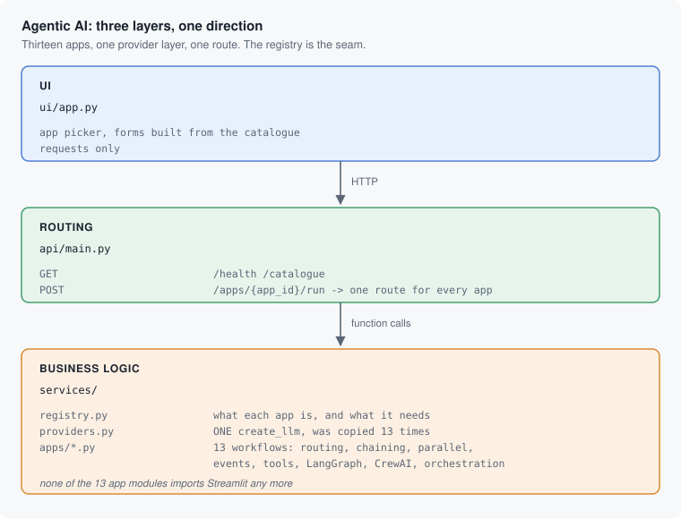

# Agentic AI Platform

> **Learn how to build this project step-by-step on [AI-ML Companion](https://aimlcompanion.ai/)**. Interactive ML learning platform with guided walkthroughs, architecture decisions, and hands-on challenges.


**Thirteen agentic apps that used to be thirteen standalone Streamlit scripts,
each with its own copy of the provider list. Now they share one provider layer,
one API route, and one UI.**

---

## 1. Why this was restructured

The provider catalogue and `create_llm` were copy-pasted into **all thirteen**
app files. That is not a style complaint - it had consequences:

- The Anthropic model list went stale in thirteen places at once, and fixing
  it meant thirteen identical edits.
- `create_llm` had no `else` branch. An unknown provider returned `None`, and
  the caller then failed with
  `AttributeError: 'NoneType' object has no attribute 'invoke'` - a long way
  from the actual mistake.

There is now one `services/providers.py`, and it raises where the mistake is.

## 2. The shape of it



Each app declares its own inputs in `services/registry.py`. The API validates
against that declaration and the UI renders its form from it, so adding an app
is **one entry**, not an edit in three layers. There is one route,
`POST /apps/{app_id}/run`, for all of them.

All thirteen app modules import **no web framework at all** - the `st.error`
calls that were buried in their logic are now `logger.error`.

## 3. Four bugs that only running it could find

Every one of these returned HTTP 200 while being wrong.

### A billing question was routed to the code-review processor

`_score_routing_rules` added a priority bonus unconditionally:

```python
priority_bonus = rule.priority * 0.1
total_score = keyword_score + pattern_score + priority_bonus
if total_score > 0:                    # true for any rule with a priority
```

A rule that matched **nothing** still scored `priority * 0.1`. On a query that
matched no rule at all, the highest-priority rule won by default. Measured:

```json
"rule_based_result": {"name": "Code Development", "score": 0.30000000000000004,
                      "keyword_matches": 0, "pattern_matches": 0}
```

There *was* a guard for this - `if best_rule['score'] > 0.3` - and it did not
fire, because **`3 * 0.1` is `0.30000000000000004`, which is greater than
`0.3`**. Floating point defeated the exact check written to catch this case.

Fixed: the bonus only applies to rules that actually matched, and scores are
rounded so the comparison means what it reads as. The same query now returns
`rule_based_result: None` and falls through to `general_processor`, agreeing
with the LLM's own classification.

### The event-driven workflow was a silent no-op

Reactive agents subscribe to the event bus when they are constructed. With no
agents registered, `start_workflow` published its events into a bus nobody was
listening to. The call succeeded, returned `None`, and nothing happened.

| | events | agent activity |
|---|---|---|
| before | 2 (`workflow_started`, `user_input`) | none |
| after | 4 | 2 `agent_message` events |

### The launcher killed a perfectly healthy API

`/health` called `ollama_reachable()`, which made a blocking HTTP request with
a 2-second timeout on **every request**. That made `/health` take 2.09 s -
longer than `run.py`'s own 2 s poll timeout. So the poll timed out every single
time, and after five minutes the launcher reported *"The API did not start"*
about an API that had been serving requests the whole time.

Fixed on both sides: the probe is cached with a short timeout (`/health` now
answers in **0.003 s**, down from 2.09 s), and the launcher's poll is no longer
tighter than the endpoint it polls.

### A silent `null` result

`start_workflow` returns `None` by design; the output accumulates in the
workflow's state. Returning its return value handed the caller `null` and
looked exactly like a failure.

## 4. The apps

| App | Family | What it demonstrates |
|---|---|---|
| Query routing | Workflow patterns | Score a query against rules, send it to the handler that fits |
| Prompt chaining | Workflow patterns | Each step consumes the previous step's output |
| Parallel execution | Workflow patterns | Independent prompts at once - 3 tasks in **9.7 s**, not ~27 s |
| Event driven | Workflow patterns | Emit events; reactive agents respond |
| Tool orchestration | Workflow patterns | The model plans which tools to call, then the plan runs |
| Document processing | LangGraph | Parse, analyse, validate, summarise, format, with an error route |

`services/apps/` also holds the CrewAI crews (code review, content creation,
data analysis, research assistant), the LangGraph customer-support agent and
task planner, and the multi-agent orchestrator. They are migrated, import
cleanly, and are wired into the API as their entry points are covered by tests.

## 5. Run it

### Clone

```bash
git clone https://github.com/genieincodebottle/generative-ai.git
cd generative-ai/genai-usecases/agentic-ai
```

### Set up with uv

```bash
pip install uv

uv venv
source .venv/bin/activate      # Linux / macOS
# .venv\Scripts\activate       # Windows PowerShell or cmd

uv pip install -r requirements.txt
```

Python 3.10+. This one installs CrewAI and LangGraph, so it is the slowest
install in the repo.

### Pick a provider

```bash
cp .env.example .env           # copy .env.example .env  on Windows
```

| Provider | Key | Notes |
|---|---|---|
| **Ollama** | none | Runs on your machine. No key, no cost, slower. |
| Gemini | `GEMINI_API_KEY` | [Free tier](https://aistudio.google.com/app/apikey), no card |
| Groq | `GROQ_API_KEY` | [Free tier](https://console.groq.com/keys), very fast |
| Anthropic | `ANTHROPIC_API_KEY` | [Console](https://console.anthropic.com/settings/keys) |
| OpenAI | `OPENAI_API_KEY` | [Platform](https://platform.openai.com/api-keys) |

Only providers with a key appear in the UI. Ollama always appears because it
needs none - and `GET /health` separately reports whether an Ollama server is
actually **reachable**, because "configured" and "running" are different
questions.

### Start both services

```bash
python run.py
```

```
API   ->  http://localhost:8000/docs
UI    ->  http://localhost:8501
```

**First start is slow** - importing CrewAI takes a while. The launcher prints
`still starting (first-run imports can be slow)...` and waits up to five
minutes. Raise it with `API_START_TIMEOUT=600 python run.py` if you need to.

### Run the tests

```bash
pytest                         # 36 tests, no API key, no network
```

## 6. The API

| Method | Path | Purpose |
|---|---|---|
| `GET` | `/health` | Configured providers, and whether Ollama answers |
| `GET` | `/catalogue` | Providers, models, and every app with its input schema |
| `POST` | `/apps/{app_id}/run` | Run any app |

```bash
curl -X POST http://localhost:8000/apps/query_routing/run \
  -H 'Content-Type: application/json' \
  -d '{"provider":"Gemini","model":"gemini-flash-latest",
       "inputs":{"query":"My invoice is wrong and I want a refund"}}'
```

An unknown app is **404** and names `GET /catalogue`; an unknown provider is
**400**; a missing or blank required input is **422** and names the field; a
missing key is **503**.

## 7. If something goes wrong

| symptom | cause | fix |
|---|---|---|
| "The API did not start" | first-run imports are slow | `API_START_TIMEOUT=600 python run.py` |
| UI says "Cannot reach the API" | Streamlit started on its own | use `python run.py` |
| "No providers are available" | no keys and no Ollama | add a key, or install Ollama |
| Ollama listed but requests fail | server not running | `ollama serve`, then `ollama pull llama3.2:3b` |
| `503 ... is not set` | that provider has no key | the message names the variable and the URL |
| `422 Missing required input(s)` | a required field was blank | the message names the field |
| A run takes a minute or more | agent workflows make many model calls | expected; prompt chaining ran 78 s |
| Rate limits on a free tier | many calls per run | switch provider, or use Ollama |

## 8. Layout

```
run.py                       starts the API and the UI together
.env.example                 every provider key, and where to get it
.streamlit/config.toml       turns off Streamlit's own start-up advert

ui/app.py                    Streamlit. Builds every form from /catalogue.

api/main.py                  3 routes; one runs any app

services/providers.py        ONE create_llm and ONE model catalogue
services/registry.py         what each app is, and what inputs it takes
services/apps/               13 app modules, none importing Streamlit
services/apps/config/        per-crew YAML: agents, tasks, crew
services/llm_text.py         flattens Gemini 3 content blocks to text

tests/test_providers.py      catalogue, keys, the None-return bug, health speed
tests/test_registry.py       app declarations, async runners, the two setup bugs
tests/test_query_routing.py  THE SCORING BUG and the float that hid it
tests/test_api.py            routes, status codes, validation
```

## 9. Track modules this covers

`agenticAi` - `langGraph` - `crewAi` - `multiAgent` - `toolUse` -
`workflowPatterns` - `promptChaining`

## 10. Honest limitations

- **No evaluation.** Nothing here measures whether an agent's answer is
  correct. The workflows show you *what happened*, not whether it was right.
- **Routing rules are keyword and regex scoring**, not understanding. They are
  fast, transparent and easy to reason about, and they will mis-route
  vocabulary they were not written for. The LLM classification runs alongside
  precisely because of that.
- **Agent runs are not cheap.** Prompt chaining measured 78 seconds and four
  model calls for one answer. On a free tier that is a rate limit waiting to
  happen.
- **State is in process memory.** Nothing survives an API restart.
- **The CrewAI crews are config-driven.** Their agents, tasks and crew
  definitions live in `services/apps/config/<crew>/*.yaml`, one directory per
  crew - they would otherwise all resolve to the same path and collide. A test
  asserts those twelve files exist and parse.
- **CORS is wide open** because both halves run on localhost.
