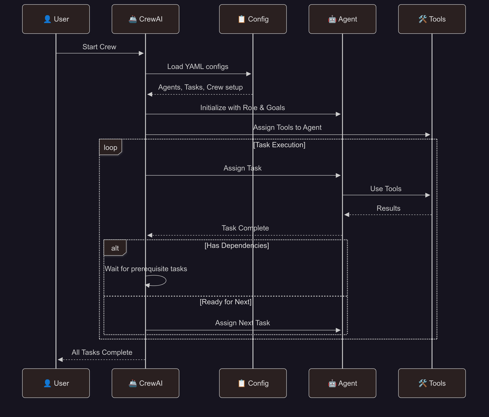

# CrewAI Multi-Agent Framework

[](https://www.python.org/downloads/)
[](https://crewai.com)
[](https://streamlit.io)
[](https://langchain.com)

> Advanced multi-agent implementations showcasing CrewAI's collaborative intelligence, hierarchical task delegation and sophisticated agent coordination patterns.

## Table of Contents

- [Overview](#overview)
- [Installation](#installation)
- [CrewAI Architecture](#crewai-architecture)
- [Available Crews](#available-crews)
- [Use Cases](#use-cases)
- [Advanced Features](#advanced-features)

## Overview

**CrewAI** represents the next generation of multi-agent collaboration, where specialized AI agents operate like a professional crew to accomplish complex tasks. Unlike single-agent systems, CrewAI enables sophisticated workflows through intelligent task delegation, role-based specialization, and collaborative decision-making.

### Key Features

| Feature | Description |
|---------|-------------|
| **Role-Based Agents** | Each agent has specialized skills, goals, and personalities |
| **Hierarchical Processes** | Manager agents coordinate and delegate to specialist workers |
| **Collaborative Intelligence** | Agents share context and build upon each other's work |
| **Task Orchestration** | Complex workflows broken into manageable, sequential tasks |
| **Quality Control** | Built-in review cycles and quality assurance processes |

## ⚙️ Installation

Get up and running in under 5 minutes:

1. Clone the repository

    ```bash
    git clone https://github.com/genieincodebottle/generative-ai.git
    cd genai-usecases\agentic-ai
    ```

2. Open the Project in VS Code or any code editor.
3. Create a virtual environment by running the following command in the terminal:

    ```bash   
    pip install uv #if uv not installed
    uv venv
    .venv\Scripts\activate # On Linux -> source venv/bin/activate
    ```

4. Install dependencies

    ```bash
    uv pip install -r requirements.txt
    ```
5. Configure Environment
    
    - **Option 1**: 🏠 Local LLM Setup

        1. **Ollama** - Run open models locally with zero API costs:

            - **Windows/MacOS:** Download Ollama models from here -> https://ollama.com/download
            - **Linux:** Install with command:
            
                ```bash
                # Install Ollama from https://ollama.ai
                curl -fsSL https://ollama.ai/install.sh | sh
                ```
            - Pull a lightweight models as per your system memory availability 
                ```bash
                ollama pull llama3.2:3b # Options: gpt-oss:20b, llama3.2:1b, llama3.2:3b, llama3.1:8b, deepseek-r1:1.5b, deepseek-r1:7b, deepseek-r1:8b, gemma3:1b, gemma3:4b, gemma3:12b, phi3:3.8b

                # No API keys needed..
                ```
            Reference guide for memory requirement 
            - **llama3.2:1b** (1B parameters) - ~0.7GB RAM
            - **llama3.2:3b** (3B parameters) - ~2GB RAM
            - **llama3.1:8b** (8B parameters) - ~4.5GB RAM
            - **gemma3:1b** (1B parameters) - ~0.7GB RAM
            - **gemma3:4b** (4B parameters) - ~2.5GB RAM

            **Note**: Ollama uses Q4_0 quantization (~0.5-0.7GB per billion parameters)
        2. **Run the following command to list the local open models available in Ollama**

            ```bash
            ollama list
            ```
        3. **Start Ollama Service** (if needed)
            ```bash
            ollama serve  # Only needed if Ollama isn't running automatically
            ```

            **Note**: Most desktop installations start Ollama automatically. Check if it's running by visiting `http://localhost:11434` in your browser or by looking for the Ollama icon in your system tray.

    - **Option 2**: ☁️ Cloud Providers

        - Configure Environment 
            - rename ```.env.example``` to ```.env``` in your project root
            - Update with your keys:

                ```env
                # Choose your preferred providers
                GEMINI_API_KEY=your-gemini-key-here
                GROQ_API_KEY=your-groq-key-here
                ANTHROPIC_API_KEY=your-anthropic-key
                OPENAI_API_KEY=your-openai-key-here
                ```

6. Run any CrewAI usecase

    ```bash
    streamlit run agentic_frameworks\crewai\code_review_crew\code_review_crew.py
    streamlit run agentic_frameworks\crewai\content_creation_crew\content_creation_crew.py
    streamlit run agentic_frameworks\crewai\data_analysis_crew\data_analysis_crew.py
    streamlit run agentic_frameworks\crewai\research_assistant_crew\research_assistant_crew.py
    ```

## CrewAI Architecture

### Core Components

#### **Agents**
- **Role Definition**: Clear responsibilities and expertise areas
- **Goal Setting**: Specific objectives each agent works toward
- **Backstory**: Personality and context that shapes behavior
- **Tools Access**: Specialized capabilities and integrations

#### **Tasks**
- **Description**: Clear task definition and expected outcomes
- **Agent Assignment**: Which agent is responsible
- **Dependencies**: Task execution order and prerequisites
- **Output Format**: Structured results and deliverables

#### **Crew**
- **Process Type**: Sequential, hierarchical, or consensus-based
- **Agent Coordination**: How agents collaborate and communicate
- **Workflow Management**: Task scheduling and dependency resolution
- **Quality Assurance**: Review processes and validation steps

### YAML Configuration Structure
```
crew_name/
    config/
        agents.yaml      # Agent definitions with roles and goals
        tasks.yaml       # Task definitions with dependencies
        crew.yaml        # Crew configuration and processes
    crew_name.py         # Main crew execution script
```



## Available CrewAI based Usecases

### 1. **Data Analysis Crew**
> **Collaborative data insights through specialized agent roles**

**Perfect for beginners** - Clear role separation with visible collaboration.

Transform raw data into actionable insights through intelligent agent collaboration, where each specialist contributes their expertise to create comprehensive analysis.

#### When to Use
- Complex dataset analysis requiring multiple perspectives
- Business intelligence and reporting workflows
- Statistical analysis with quality assurance needs

#### How It Works
```
Data Input -> Data Analyst -> BI Specialist -> Visualization Expert -> QA Review -> Final Report
```

#### Key Features
- **Intelligent Analysis**: Automated pattern discovery and statistical insights
- **Multi-Perspective**: Different agents provide specialized analytical views
- **Quality Assurance**: Built-in validation and review processes
- **Business Intelligence**: Strategic insights and recommendations

#### Agent Roles
| Agent | Responsibility | Expertise |
|-------|---------------|-----------|
| **Data Analyst** | Statistical analysis, pattern recognition | Python, pandas, statistical methods |
| **BI Specialist** | Business context, strategic insights | Business intelligence, KPIs, trends |
| **Visualization Expert** | Chart creation, data storytelling | Visualization best practices, design |
| **QA Specialist** | Validation, accuracy verification | Quality control, error detection |

#### Example Applications
```
1. Sales Performance: Analyze trends -> Identify opportunities -> Create dashboards

2. Customer Analytics: Segment analysis -> Behavior insights -> Action recommendations

3. Financial Reporting: Data processing -> Trend analysis -> Executive summaries

4. Market Research: Data collection -> Analysis -> Strategic recommendations
```

---

### 2. **Content Creation Crew**
> **Professional content production through collaborative creativity**

Create high quality, SEO-optimized content through a structured workflow that mimics professional content teams.

#### When to Use
- Blog posts, articles, and marketing content
- SEO-optimized content strategies
- Brand-consistent content at scale

#### How It Works
```
Content Brief -> Strategist Planning -> Writer Creation -> SEO Optimization -> Quality Review -> Publication
```

#### Key Features
- **Creative Collaboration**: Strategic planning with creative execution
- **SEO Optimization**: Built-in search engine optimization
- **Quality Control**: Multi-stage review and refinement process
- **Brand Consistency**: Maintained voice and style across content

#### Agent Roles
| Agent | Responsibility | Expertise |
|-------|---------------|-----------|
| **Content Strategist** | Planning, audience targeting, content strategy | Marketing strategy, audience analysis |
| **Writer** | Content creation, storytelling, narrative flow | Writing, creativity, subject expertise |
| **SEO Specialist** | Keyword optimization, search performance | SEO best practices, keyword research |
| **Quality Reviewer** | Grammar, style, brand consistency | Editing, quality assurance, brand guidelines |

#### Example Applications
```
1. Blog Content: Strategy -> Writing -> SEO -> Review -> Publish

2. Marketing Materials: Brief -> Creation -> Optimization -> Approval

3. Technical Documentation: Planning -> Writing -> Review -> Finalization

4. Social Media: Strategy -> Content -> Optimization -> Scheduling
```

---

### 3. **Research Assistant Crew**
> **Comprehensive research through systematic investigation and verification**

Conduct thorough, reliable research through specialized agents that gather, verify, and synthesize information from multiple sources.

#### When to Use
- Academic and business research projects
- Market analysis and competitive intelligence
- Due diligence and fact-checking processes

#### How It Works
```
Research Query -> Information Gathering -> Fact Verification -> Analysis -> Report Compilation
```

#### Key Features
- **Comprehensive Coverage**: Multi-source information gathering
- **Fact Verification**: Built-in accuracy and reliability checking
- **Systematic Analysis**: Structured approach to research synthesis
- **Professional Reports**: Executive summaries and detailed findings

#### Agent Roles
| Agent | Responsibility | Expertise |
|-------|---------------|-----------|
| **Research Coordinator** | Project planning, scope definition | Research methodology, project management |
| **Information Gatherer** | Source identification, data collection | Information retrieval, database searching |
| **Fact Checker** | Verification, source validation | Critical analysis, fact-checking methods |
| **Analyst** | Pattern identification, insight generation | Data analysis, synthesis, interpretation |
| **Report Writer** | Documentation, presentation | Technical writing, report formatting |

#### Example Applications
```
1. Market Research: Planning -> Data Collection -> Verification -> Analysis -> Report

2. Competitive Analysis: Scope -> Investigation -> Validation -> Insights -> Summary

3. Academic Research: Literature Review -> Data Gathering -> Analysis -> Documentation

4. Due Diligence: Planning -> Investigation -> Verification -> Risk Assessment -> Report
```

---

### 4. **Code Review Crew**
> **Code quality assurance through specialized expertise**

Ensure code quality, security, and performance through systematic review by specialized agents with different areas of expertise.

#### When to Use
- Code quality assurance and security audits
- Performance optimization reviews
- Team code review processes

#### How It Works
```
Code Submission -> Security Analysis -> Performance Review -> Quality Assessment -> Final Report
```

#### Key Features
- **Security Focus**: Specialized security vulnerability detection
- **Performance Analysis**: Optimization recommendations and bottleneck identification
- **Quality Assurance**: Code style, maintainability, and best practices
- **Comprehensive Reports**: Detailed findings with actionable recommendations

#### Agent Roles
| Agent | Responsibility | Expertise |
|-------|---------------|-----------|
| **Security Specialist** | Security vulnerabilities, threat analysis | Security best practices, vulnerability assessment |
| **Performance Analyst** | Performance optimization, bottlenecks | Performance profiling, optimization techniques |
| **Quality Reviewer** | Code style, maintainability, standards | Code quality, design patterns, best practices |
| **Senior Reviewer** | Architecture, final recommendations | System design, technical leadership |

#### Example Applications
```
1. Security Audit: Analysis -> Vulnerability Detection -> Risk Assessment -> Recommendations

2. Performance Review: Profiling -> Bottleneck Analysis -> Optimization -> Validation

3. Code Quality: Style Check -> Best Practices -> Refactoring -> Documentation

4. Architecture Review: Design Analysis -> Scalability -> Maintainability -> Guidelines
```

## 💡 Use Cases

### Business Applications
- **Strategic Planning**: Multi-perspective analysis and planning
- **Market Research**: Comprehensive market intelligence gathering
- **Content Marketing**: Scalable, high-quality content production
- **Quality Assurance**: Systematic review and validation processes

### Development Applications
- **Code Reviews**: Automated quality, security, and performance analysis
- **Documentation**: Collaborative technical documentation creation
- **Testing Strategies**: Comprehensive testing approach development
- **Architecture Planning**: Multi-expert system design reviews

### Research & Education
- **Academic Research**: Systematic literature reviews and analysis
- **Business Intelligence**: Multi-source data analysis and insights
- **Competitive Analysis**: Comprehensive market and competitor research
- **Knowledge Synthesis**: Information gathering and synthesis workflows

### Creative Applications
- **Content Creation**: Professional content development workflows
- **Marketing Campaigns**: Strategic campaign planning and execution
- **Brand Development**: Collaborative brand strategy and content
- **Educational Materials**: Structured educational content creation

## ✨ Advanced Features

### Agent Specialization
- **Role-Based Expertise**: Each agent specialized in specific domains
- **Contextual Memory**: Agents maintain context and build upon previous work
- **Dynamic Tool Access**: Agents can access and use specialized tools
- **Personality Modeling**: Unique agent personalities and communication styles

### Workflow Orchestration
- **Hierarchical Processes**: Manager-worker delegation patterns
- **Sequential Execution**: Step-by-step task completion with dependencies
- **Quality Gates**: Built-in review and approval processes
- **Error Handling**: Graceful failure handling and recovery mechanisms

### Collaboration Patterns
- **Context Sharing**: Agents share relevant information and insights
- **Iterative Refinement**: Multiple rounds of improvement and feedback
- **Consensus Building**: Democratic decision-making processes
- **Conflict Resolution**: Handling disagreements between agents

### Configuration Management
- **YAML-Based Setup**: Declarative agent and task configuration
- **Dynamic Tool Integration**: Easy addition of new capabilities
- **Environment Management**: Multi-environment deployment support
- **Monitoring & Logging**: Comprehensive execution tracking

