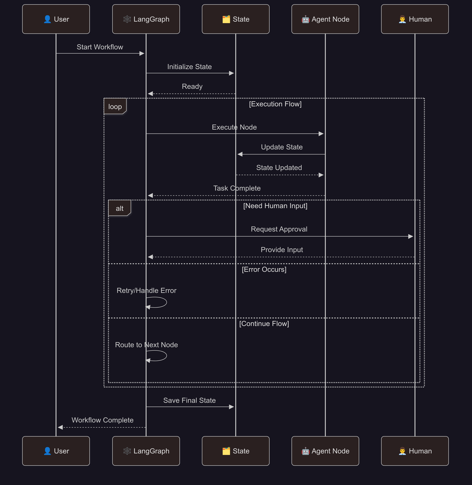

# LangGraph Multi-Agent Framework

[](https://www.python.org/downloads/)
[](https://streamlit.io)
[](https://langchain.com)
[](https://crewai.com)
[](https://langchain-ai.github.io/langgraph/)

> Advanced state-driven workflows showcasing LangGraph's graph-based agent orchestration, type-safe state management, and sophisticated control flow patterns.

## Table of Contents

- [Overview](#overview)
- [Installation](#installation)
- [LangGraph Architecture](#langgraph-architecture)
- [Available LangGraph Usecases](#available-langgraph-usecases)
- [Use Cases](#use-cases)
- [Advanced Features](#advanced-features)

## Overview

**LangGraph** represents the cutting edge of graph based agent orchestration, where state driven workflows enable sophisticated control flows, conditional routing and dynamic decision-making. Unlike traditional sequential workflows, LangGraph provides graph based execution with type-safe state management, checkpointing, and human-in-the-loop capabilities.

### Key Features

| Feature | Description |
|---------|-------------|
| **Type-Safe State Management** | Annotated state types with automatic reducers |
| **Graph-Based Workflows** | Conditional routing and dynamic execution paths |
| **Checkpointing & Persistence** | Automatic state persistence and recovery |
| **Command Objects** | Dynamic control flow with goto and interrupt |
| **Human-in-the-Loop** | Human approval and intervention |

## ⚙️ Installation

Get up and running in under 5 minutes:

1. Clone the repository

    ```bash
    git clone https://github.com/genieincodebottle/generative-ai.git
    cd genai-usecases\agentic-ai
    ```

2. Open the Project in VS Code or any code editor.
3. Create a virtual environment by running the following command in the terminal:

    ```bash
    pip install uv #if uv not installed
    uv venv
    .venv\Scripts\activate # On Linux -> source venv/bin/activate
    ```

4. Install dependencies

    ```bash
    uv pip install -r requirements.txt
    ```
5. Configure Environment

    - **Option 1**: <-> Local LLM Setup

        1. **Ollama** - Run open models locally with zero API costs:

            ```bash
            # Install Ollama from https://ollama.ai
            curl -fsSL https://ollama.ai/install.sh | sh

            # Pull a lightweight models as per your system memory availability
            ollama pull llama3.2:3b # Options: gpt-oss:20b, llama3.2:1b, llama3.2:3b, llama3.1:8b, deepseek-r1:1.5b, deepseek-r1:7b, deepseek-r1:8b, gemma3:1b, gemma3:4b, gemma3:12b, phi3:3.8b

            # No API keys needed..
            ```
            Reference guide for memory requirement
            - **llama3.2:1b** (1B parameters) - ~0.7GB RAM
            - **llama3.2:3b** (3B parameters) - ~2GB RAM
            - **llama3.1:8b** (8B parameters) - ~4.5GB RAM
            - **gemma3:1b** (1B parameters) - ~0.7GB RAM
            - **gemma3:4b** (4B parameters) - ~2.5GB RAM

            **Note**: Ollama uses Q4_0 quantization (~0.5-0.7GB per billion parameters)
        2. **Run the following command to list the local open models available in Ollama**

            ```bash
            ollama list
            ```
        3. **Start Ollama Service** (if needed)
            ```bash
            ollama serve  # Only needed if Ollama isn't running automatically
            ```

            **Note**: Most desktop installations start Ollama automatically. Check if it's running by visiting `http://localhost:11434` in your browser or by looking for the Ollama icon in your system tray.

    - **Option 2**:  Cloud Providers

        - Configure Environment
            - rename ```.env.example``` to ```.env``` in your project root
            - Update with your keys:

                ```env
                # Choose your preferred providers
                GEMINI_API_KEY=your-gemini-key-here
                GROQ_API_KEY=your-groq-key-here
                ANTHROPIC_API_KEY=your-anthropic-key
                OPENAI_API_KEY=your-openai-key-here
                ```

6. Run any LangGraph system

    ```bash
    streamlit run agentic_frameworks\langgraph\customer_support_agent.py
    streamlit run agentic_frameworks\langgraph\document_processing_pipeline.py
    streamlit run agentic_frameworks\langgraph\task_planning_system.py
    ```

## 🕸️ LangGraph Architecture

### Core Components

#### **State Management**
- **TypedDict Schemas**: Type-safe state definitions with Annotated fields
- **State Reducers**: Automatic state merging with add_messages, operator.add
- **Checkpointing**: Persistent state management with MemorySaver
- **State Transitions**: Controlled state updates with validation

#### **Graph Construction**
- **Node Definition**: Agent functions as graph nodes with async execution
- **Edge Configuration**: Static and conditional routing between nodes
- **Control Flow**: Dynamic routing with Command objects and goto
- **Entry/Exit Points**: START and END node management

#### **Command Objects**
- **Dynamic Routing**: Runtime decision-making with goto commands
- **State Updates**: Selective state modifications during execution
- **Interrupts**: Human-in-the-loop integration with approval workflows
- **Error Handling**: Graceful failure recovery with retry mechanisms



## 🌐 Available LangGraph Usecases

### 1. **Customer Support Agent**
> **Intelligent conversation management through state-driven support flows**

Create sophisticated customer support experiences through context-aware conversation flows that intelligently route, escalate, and resolve customer issues.

#### When to Use
- Multi-tier customer support with intelligent escalation
- Conversation flow management with sentiment analysis
- Knowledge base integration with dynamic routing

#### How It Works
```
Customer Query -> Issue Classification -> Knowledge Base Search -> Resolution/Escalation -> Follow-up
```

#### Key Features
- **Conversation Flow Management**: State-driven conversation tracking
- **Intelligent Escalation**: Multi-tier escalation with sentiment analysis
- **Knowledge Base Integration**: Dynamic search and recommendation system
- **Human Handoff**: Seamless transition to human agents with context

#### For Real-World Implementation:

  You would connect this to:
  - **🗄️ Actual Database** - Replace hard-coded knowledge with dynamic DB
  - **📧 Email Service** - Send real password resets and notifications
  - **💳 Payment Gateway** - Actually retry failed payments
  - **🎟️ Ticketing System** - Integrate with Zendesk/Jira/ServiceNow
  - **📊 Monitoring Tools** - Pull real system status from monitoring APIs
  - **👤 User Database** - Lookup actual customer information and history
  
#### Agent Roles
| Agent | Responsibility | Expertise |
|-------|---------------|-----------|
| **Intake Agent** | Initial query processing, classification | Intent recognition, sentiment analysis, priority assessment |
| **Resolution Agent** | Issue resolution, knowledge base search | Problem-solving, knowledge retrieval, solution recommendation |
| **Escalation Manager** | Escalation decisions, routing | Escalation policies, department routing, priority management |
| **Quality Monitor** | Conversation quality, satisfaction tracking | Quality assurance, customer satisfaction, feedback analysis |

#### Example Applications
```
1. Technical Support: Issue classification -> Knowledge search -> Solution delivery -> Escalation if needed

2. Billing Inquiries: Account verification -> Billing analysis -> Resolution -> Follow-up confirmation

3. Product Questions: Product identification -> Feature explanation -> Usage guidance -> Additional support

4. Account Management: Account access -> Profile updates -> Security verification -> Confirmation
```

---

### 2. **Document Processing Pipeline**
> **Automated document analysis through structured processing workflows**

Process and analyze documents of various formats through intelligent extraction, classification, and structured output generation workflows.

#### When to Use
- Multi-format document processing and analysis
- Information extraction with structured outputs
- Batch document processing with quality validation

#### How It Works
```
Document Upload -> Format Detection -> Content Extraction -> Information Processing -> Validation -> Structured Output
```

#### Key Features
- **Multi-Format Support**: PDF, DOCX, TXT, CSV processing capabilities
- **Information Extraction**: Named entity recognition, key phrase extraction
- **Content Analysis**: Summarization, sentiment analysis, topic modeling
- **Structured Outputs**: Pydantic models for consistent data formats

#### Agent Roles
| Agent | Responsibility | Expertise |
|-------|---------------|-----------|
| **Document Parser** | Format detection, content extraction | File format handling, text extraction, metadata analysis |
| **Information Extractor** | Entity recognition, key phrase extraction | NLP processing, pattern recognition, data structuring |
| **Content Analyzer** | Summarization, sentiment analysis | Content understanding, topic modeling, sentiment detection |
| **Quality Validator** | Data validation, accuracy verification | Quality control, error detection, output validation |

#### Example Applications
```
1. Legal Document Review: Contract parsing -> Clause extraction -> Risk analysis -> Summary generation

2. Research Paper Analysis: PDF processing -> Abstract extraction -> Topic classification -> Citation analysis

3. Financial Report Processing: Statement parsing -> Data extraction -> Trend analysis -> Executive summary

4. HR Document Management: Resume parsing -> Skill extraction -> Candidate matching -> Interview scheduling
```

---

### 3. **Task Planning System**
> **Dynamic workflow planning through intelligent task decomposition and coordination**

Create and execute complex project workflows through intelligent task decomposition, dependency management, and adaptive execution planning.

#### When to Use
- Complex project planning with dynamic task decomposition
- Resource allocation and scheduling optimization
- Adaptive workflow execution with dependency management

#### How It Works
```
Goal Definition -> Task Decomposition -> Dependency Analysis -> Resource Allocation -> Execution Planning -> Monitoring
```

#### Key Features
- **Dynamic Task Decomposition**: Intelligent breaking down of complex goals
- **Dependency Management**: Automatic dependency resolution and ordering
- **Resource Allocation**: Optimal resource assignment and scheduling
- **Adaptive Execution**: Real-time replanning based on execution results

#### Agent Roles
| Agent | Responsibility | Expertise |
|-------|---------------|-----------|
| **Planning Agent** | Goal decomposition, task creation | Project planning, task breakdown, strategic thinking |
| **Scheduling Agent** | Resource allocation, timeline management | Scheduling optimization, resource management, dependency handling |
| **Execution Monitor** | Progress tracking, performance monitoring | Execution monitoring, progress analysis, bottleneck identification |
| **Adaptive Planner** | Replanning, optimization | Adaptive planning, dynamic optimization, contingency management |

#### Example Applications
```
1. Software Development: Requirements -> Design -> Implementation -> Testing -> Deployment

2. Marketing Campaign: Strategy -> Content Creation -> Channel Setup -> Launch -> Analysis

3. Research Project: Literature Review -> Data Collection -> Analysis -> Writing -> Publication

4. Event Planning: Concept -> Venue -> Marketing -> Logistics -> Execution -> Follow-up
```

## 💡 Use Cases

### Business Applications
- **Data-Driven Decision Making**: Multi-perspective data analysis with business insights
- **Customer Experience Management**: Intelligent support workflows with escalation
- **Document Automation**: Automated processing of business documents
- **Project Management**: Dynamic planning and execution monitoring

### Development Applications
- **Quality Assurance**: Multi-agent code review and validation workflows
- **Documentation Processing**: Automated technical documentation analysis
- **Workflow Automation**: Complex development pipeline orchestration
- **Testing Strategies**: Comprehensive testing workflow coordination

### Research & Education
- **Academic Research**: Multi-phase research project management
- **Document Analysis**: Systematic analysis of research papers and documents
- **Data Analysis**: Statistical analysis with multiple validation layers
- **Knowledge Management**: Intelligent information extraction and organization

### Enterprise Applications
- **Business Intelligence**: Comprehensive data analysis and reporting workflows
- **Customer Support**: Sophisticated support ticket routing and resolution
- **Content Management**: Automated document processing and classification
- **Strategic Planning**: Dynamic project planning and execution management

## ✨ Advanced Features

### State-Driven Architecture
- **Type Safety**: Annotated state definitions with automatic validation
- **State Reducers**: Intelligent state merging with custom reduction functions
- **Persistence**: Automatic checkpointing with state recovery capabilities
- **Memory Management**: Efficient state storage and retrieval mechanisms

### Graph-Based Execution
- **Dynamic Routing**: Conditional execution paths based on runtime conditions
- **Command Objects**: Sophisticated control flow with goto and interrupt commands
- **Parallel Execution**: Concurrent node execution for performance optimization
- **Error Handling**: Graceful failure recovery with retry and fallback mechanisms

### Advanced Control Flow
- **Human-in-the-Loop**: Seamless human intervention with approval workflows
- **Interrupt Handling**: Sophisticated pause and resume capabilities
- **Conditional Logic**: Complex decision-making with state-based conditions
- **Async Operations**: High-performance concurrent processing capabilities

### Integration Capabilities
- **Multi-Provider LLMs**: Support for Ollama, OpenAI, Anthropic, Gemini, Groq
- **Tool Integration**: Seamless integration with external APIs and services
- **Structured Outputs**: Pydantic models for consistent data handling
- **Monitoring & Logging**: Comprehensive execution tracking and observability
