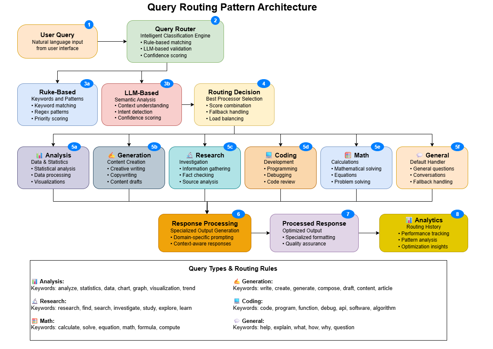
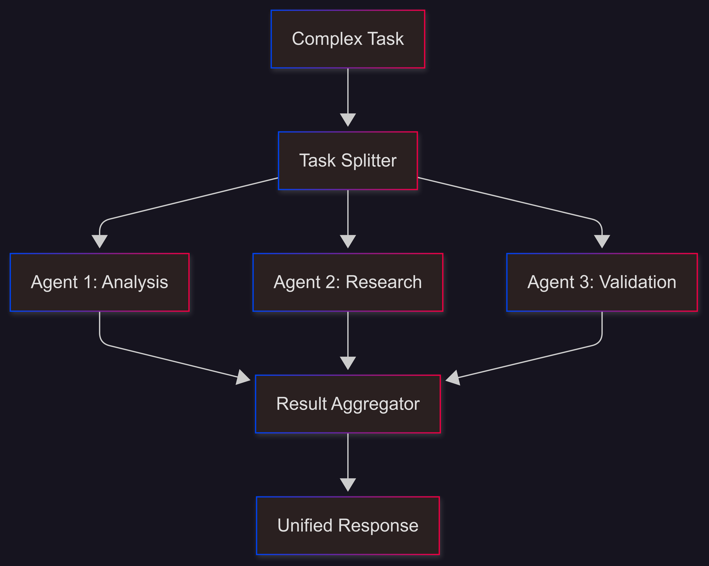
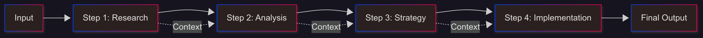
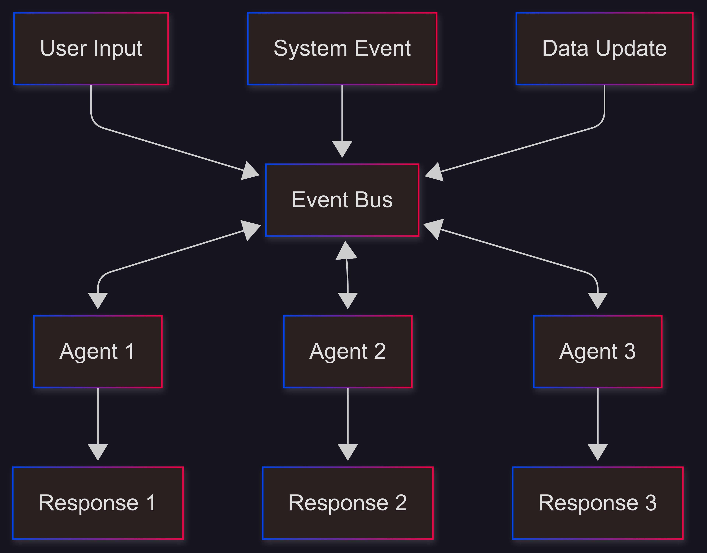
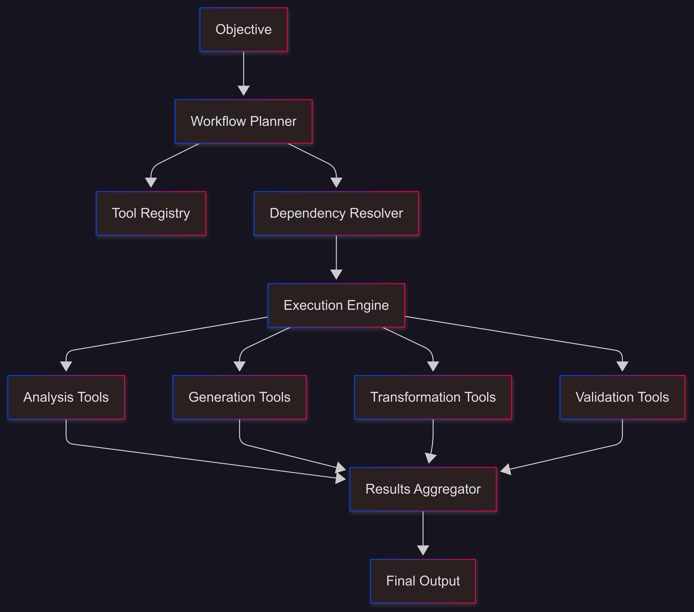

# Agentic AI Workflow Patterns

[](https://www.python.org/downloads/)
[](https://streamlit.io)
[](https://langchain.com)
[](https://crewai.com)
[](https://langchain-ai.github.io/langgraph/)

> A collection of advanced AI workflow patterns for building intelligent systems that can think, decide and act independently.

## 📋 Table of Contents

- [🌟 Overview](#-overview)
- [⚙️ Installation](#️-installation)
- [🏗️ Workflow Patterns](#️-workflow-patterns)
- [💼 Use Cases](#-use-cases)
- [📚 Learning Resources](#-learning-resources)

## 🌟 Overview

**Agentic** AI is the next step in artificial intelligence, moving beyond simple prompt responses to actively reason, plan and execute complex workflows on its own. This repository demonstrates **5 core patterns** that serve as the foundation for building intelligent, autonomous systems.

### What Makes These Patterns "Agentic"?

| Feature | Description |
|---------|-------------|
| 🧠 **Autonomous Decision Making** | AI agents analyze context and make intelligent decisions without human intervention |
| 🤝 **Multi-Agent Coordination** | Multiple AI agents collaborate to solve complex, multi-faceted problems |
| 🔄 **Adaptive Workflows** | Systems dynamically adjust their behavior based on changing conditions |
| ⚡ **Event-Driven Architecture** | Reactive systems that respond intelligently to real-time events |
| 🛠️ **Tool Integration** | Seamless coordination of external tools, APIs, and services |

## ⚙️ Installation

Get up and running in under 5 minutes:

1. Clone the repository

    ```bash
    git clone https://github.com/genieincodebottle/generative-ai.git
    cd genai-usecases\agentic-ai
    ```

2. Open the Project in VS Code or any code editor.
3. Create a virtual environment by running the following command in the terminal:

    ```bash   
    pip install uv #if uv not installed
    uv venv
    .venv\Scripts\activate # On Linux -> source venv/bin/activate
    ```

4. Install dependencies

    ```bash
    uv pip install -r requirements.txt
    ```
5. Configure Environment
    
    - **Option 1**: 🏠 Local LLM Setup

        1. **Ollama** - Run open models locally with zero API costs:

            - **Windows/MacOS:** Download Ollama models from here -> https://ollama.com/download
            - **Linux:** Install with command:
            
                ```bash
                # Install Ollama from https://ollama.ai
                curl -fsSL https://ollama.ai/install.sh | sh
                ```
            - Pull a lightweight models as per your system memory availability 
                ```bash
                ollama pull llama3.2:3b # Options: gpt-oss:20b, llama3.2:1b, llama3.2:3b, llama3.1:8b, deepseek-r1:1.5b, deepseek-r1:7b, deepseek-r1:8b, gemma3:1b, gemma3:4b, gemma3:12b, phi3:3.8b

                # No API keys needed..
                ```
            Reference guide for memory requirement 
            - **llama3.2:1b** (1B parameters) - ~0.7GB RAM
            - **llama3.2:3b** (3B parameters) - ~2GB RAM
            - **llama3.1:8b** (8B parameters) - ~4.5GB RAM
            - **gemma3:1b** (1B parameters) - ~0.7GB RAM
            - **gemma3:4b** (4B parameters) - ~2.5GB RAM

            **Note**: Ollama uses Q4_0 quantization (~0.5-0.7GB per billion parameters)
        2. **Run the following command to list the local open models available in Ollama**

            ```bash
            ollama list
            ```
        3. **Start Ollama Service** (if needed)
            ```bash
            ollama serve  # Only needed if Ollama isn't running automatically
            ```

            **Note**: Most desktop installations start Ollama automatically. Check if it's running by visiting `http://localhost:11434` in your browser or by looking for the Ollama icon in your system tray.

    - **Option 2**: ☁️ Cloud Providers

        - Configure Environment 
            - rename ```.env.example``` to ```.env``` in your project root
            - Update with your keys:

                ```env
                # Choose your preferred providers
                GEMINI_API_KEY=your-gemini-key-here
                GROQ_API_KEY=your-groq-key-here
                ANTHROPIC_API_KEY=your-anthropic-key
                OPENAI_API_KEY=your-openai-key-here
                ```

6. Run any pattern

    ```bash
    streamlit run agentic_workflows\query_routing.py
    streamlit run agentic_workflows\parallel_execution.py
    streamlit run agentic_workflows\prompt_chaining.py
    streamlit run agentic_workflows\event_driven.py
    streamlit run agentic_workflows\tool_orchestration.py
    ```

## 🏗️ Workflow Patterns

### 1. 🎯 Query Routing
> **Intelligent traffic control for AI workflows**

**Perfect for beginners** - See immediate results with clear routing decisions.

Automatically routes different types of queries to specialized processing pipelines, like a smart receptionist that knows exactly who can best help with each request.

#### When to Use
- Multi-domain applications (customer support, technical docs, sales)
- Content management with diverse content types
- Chatbots handling varied query types

#### How It Works



#### Key Features
- ✨ **Smart Classification**: Automatically categorizes queries by intent
- ⚡ **Optimized Processing**: Different strategies for different query types
- 📊 **Performance Analytics**: Track routing accuracy and efficiency

#### Example Applications
```
1. Customer Support: Billing queries → Billing system, Tech issues → Technical team
2. Documentation: API questions → Developer docs, Tutorials → Learning materials  
3. E-commerce: Product info → Catalog, Order status → Order management
```

---

### 2. ⚡ Parallel Execution
> **Make your AI Apps faster with concurrent processing**

Execute multiple AI tasks simultaneously for fast results and comprehensive multi perspective analysis.

#### When to Use
- Tasks that can be processed independently
- Time-sensitive applications requiring fast responses
- Comprehensive analysis from multiple angles

#### How It Works



#### Key Features
- **Speed Optimization**: Process multiple tasks concurrently
- **Task Specialization**: Each parallel task optimized for specific analysis
- **Load Balancing**: Efficient resource distribution
- **Error Handling**: Graceful failure with partial results

#### Example Applications
```
1. Content Analysis: Simultaneously analyze sentiment + topics + quality + SEO
2. Research: Parallel research different aspects of complex topics
3. Document Processing: Process different sections of large documents concurrently
4. Multi-modal Analysis: Analyze text + images + data simultaneously
```

---

### 3. 🔗 Prompt Chaining
> **Build sophisticated multi-step reasoning workflows**

Create complex workflows where each step builds intelligently upon previous results, like a thoughtful conversation that gets smarter with each exchange.

#### When to Use
- Complex problem-solving requiring multiple reasoning steps
- Document analysis with progressive refinement
- Strategic planning and decision-making processes

#### Execution Patterns
- **Sequential Chain**: Step-by-step with context flow
- **Parallel Chain**: Independent steps executed simultaneously  
- **Custom LCEL**: Advanced LangChain Expression Language patterns

#### How It Works



#### Key Features
- **Sequential Intelligence**: Each step smarter with accumulated context
- **Multiple Patterns**: Sequential, parallel, and custom execution
- **Memory Management**: Maintain context across all steps
- **Progressive Refinement**: Each step adds depth and sophistication

#### Example Applications
```
1. Strategic Planning: Research → Analysis → Strategy → Implementation → Evaluation
2. Content Creation: Outline → Draft → Review → Refine → Finalize
3. Problem Solving: Define → Analyze → Generate Solutions → Evaluate → Recommend
4. Research: Data Collection → Analysis → Insights → Conclusions → Report
```

---

### 4. 🎪 Event-Driven
> **Real-time reactive AI systems that respond instantly**

Build reactive systems where AI agents coordinate through events, creating dynamic, responsive applications that feel alive.

#### When to Use
- Real-time applications requiring immediate responses
- Systems with multiple interacting components
- IoT and monitoring applications
- Interactive and collaborative systems

#### How It Works



#### Key Features
- **Real-time Responsiveness**: Instant reaction to events
- **Multi-Agent Coordination**: Seamless agent collaboration
- **Dynamic Adaptation**: Adapt behavior based on event patterns
- **Event Analytics**: Comprehensive event monitoring and analysis

#### Event Types
| Type | Description | Examples |
|------|-------------|----------|
| **User Input** | Direct interactions | Messages, clicks, commands |
| **Task Completion** | Agent finish notifications | Processing done, results ready |
| **Data Updates** | New information available | File uploads, database changes |
| **System Events** | Workflow state changes | Start, completion, errors |
| **Decision Points** | Human input required | Approvals, choices, confirmations |

#### Example Applications
```
1. Customer Support: Auto-route → escalate → update → resolve
2. IoT Systems: Sensor data → analysis → actions → alerts  
3. Collaboration: Real-time editing → notifications → sync → updates
4. Monitoring: System alerts → analysis → automated responses
5. Gaming: Player actions → game state → real-time interactions
```

---

### 5. 🎼 Tool Orchestration
> **Conduct symphonies of AI tools and APIs**

Intelligently coordinate multiple tools and APIs to accomplish complex objectives through automated workflow planning and execution.

#### When to Use
- Integration with multiple external systems
- Complex workflows requiring specialized tools
- Automation of multi-step business processes
- Dynamic workflow creation based on objectives

#### How It Works



#### Key Features
- 🧠 **Intelligent Planning**: AI creates optimal workflows for objectives
- 🛠️ **Tool Management**: Dynamic registry with performance-based selection
- 📊 **Workflow Analytics**: Comprehensive monitoring and optimization
- 🔄 **Adaptive Execution**: Workflows adapt based on real-time results

#### Tool Categories
| Category | Purpose | Examples |
|----------|---------|----------|
| **Analysis** | Data understanding | Text analysis, sentiment, summarization |
| **Generation** | Content creation | Code generation, writing, reports |
| **Transformation** | Data processing | Format conversion, data cleaning |
| **Validation** | Quality assurance | Compliance checking, testing |
| **Integration** | External connections | API calls, databases, file systems |

#### Example Applications
```
1. Data Pipeline: Extract → Transform → Analyze → Visualize → Report
2. Content Workflow: Research → Generate → Review → Optimize → Publish
3. Business Process: Lead Capture → Qualify → Assign → Follow-up
4. Development: Code Generation → Testing → Review → Deploy
5. Customer Onboarding: Collect Data → Verify → Setup → Train
```

## 💼 Use Cases

### 🏢 Business Applications
- **Customer Support Automation**: Route, prioritize, and resolve customer inquiries
- **Content Management**: Generate, review, and optimize content at scale
- **Business Process Automation**: Orchestrate complex workflows intelligently
- **Data Analysis & Reporting**: Multi-perspective analysis with automated insights

### 👨‍💻 Development Applications  
- **Code Generation & Review**: AI-powered development workflows
- **API Integration**: Intelligent coordination of multiple services
- **Automated Testing**: Comprehensive testing and validation workflows
- **DevOps Automation**: Smart deployment and monitoring systems

### 🔬 Research & Education
- **Research Workflows**: Multi-source research with comprehensive analysis
- **Document Processing**: Progressive analysis of large, complex documents
- **Knowledge Synthesis**: Intelligent combination of multiple information sources
- **Adaptive Learning**: Personalized learning paths based on progress

### 🎮 Interactive Applications
- **Real-time Gaming**: Event-driven interactive gaming experiences
- **Collaborative Systems**: Real-time coordination and communication
- **IoT & Monitoring**: Intelligent responses to sensor data and alerts
- **Interactive Media**: Dynamic, responsive user experiences

## 📚 Learning Resources

### 🎯 Recommended Learning Path

#### **🌱 Foundations** 
1. **Setup Ollama** - Get local models running
2. **Query Routing** - Understand basic routing concepts
3. **Parallel Execution** - See the power of concurrent processing
4. **Experiment Freely** - Try different inputs and configurations

#### **🌿 Intermediate Concepts**
1. **Prompt Chaining** - Master multi-step workflows  
2. **Event-Driven Systems** - Build reactive applications
3. **Cloud Integration** - Connect to external providers
4. **Custom Workflows** - Adapt patterns to your needs

#### **🌲 Advanced Applications**
1. **Tool Orchestration** - Master complex automation
2. **Pattern Combinations** - Integrate multiple patterns
3. **Production Deployment** - Scale for real applications