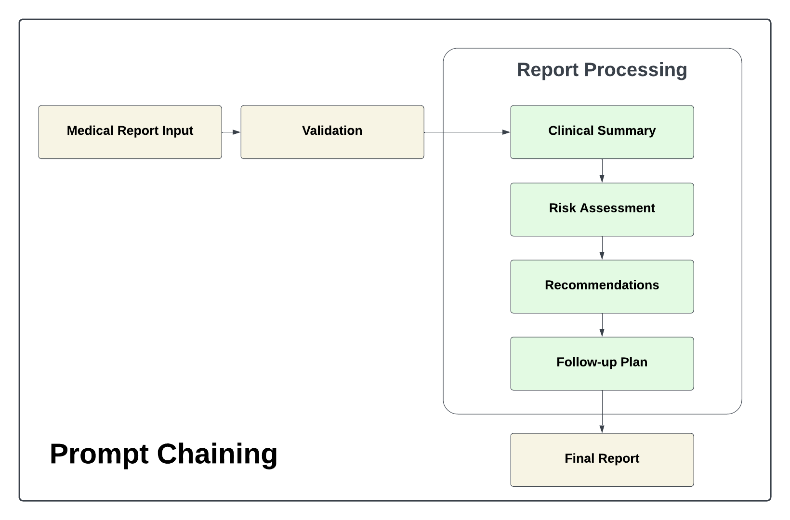
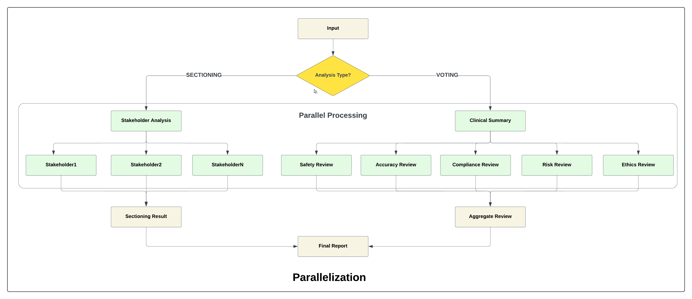
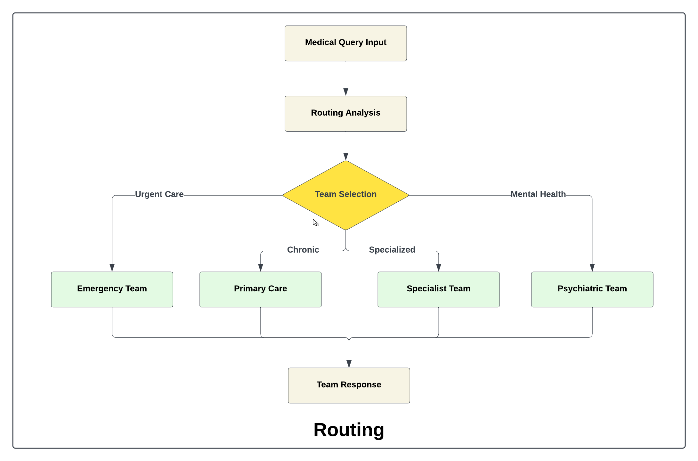
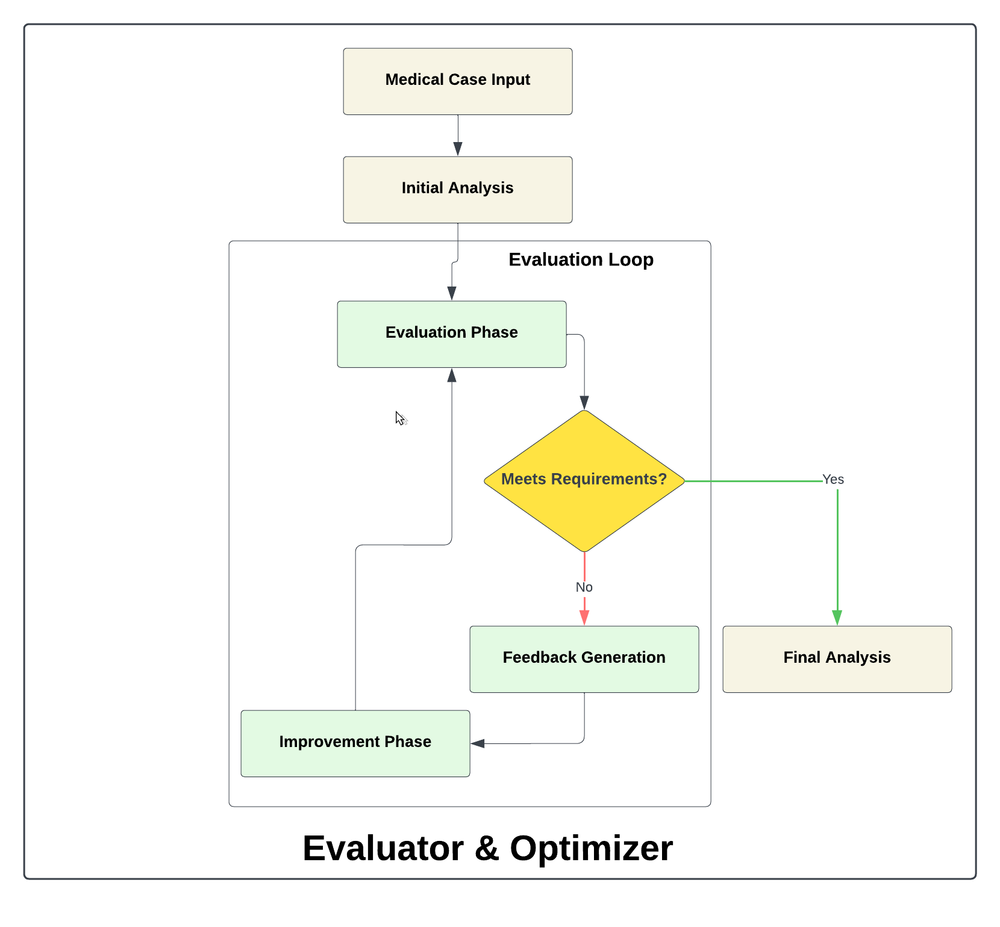
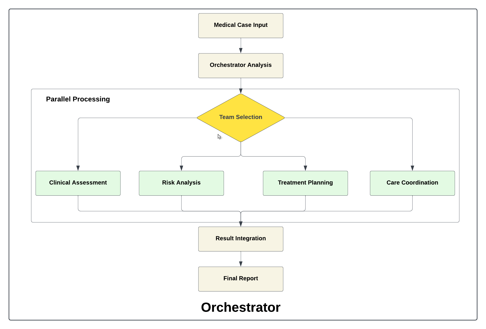
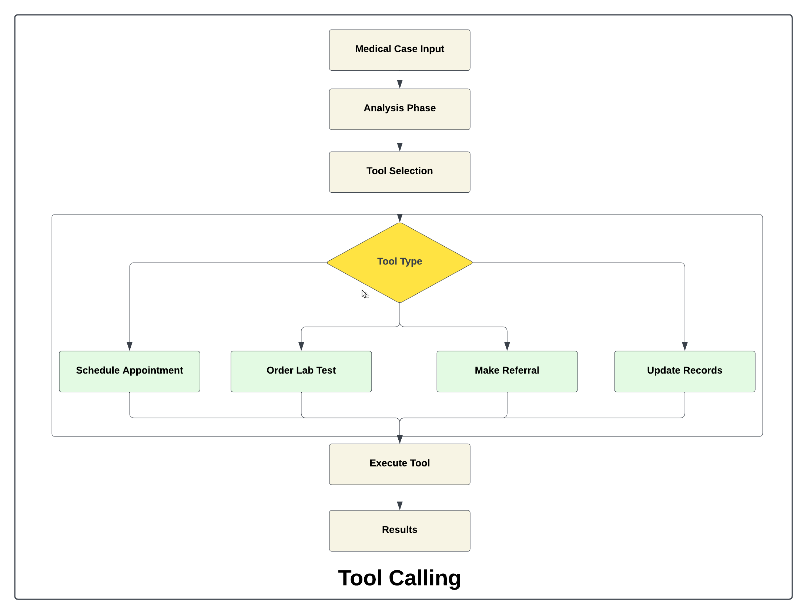

<div align="center">
   
</div>

### ⚙️ Setup Instructions

- #### Prerequisites
   - Python 3.9 or higher
   - pip (Python package installer)

- #### Installation
   1. Clone the repository:
      ```bash
      git clone https://github.com/genieincodebottle/generative-ai.git
      cd generative-ai/genai-usecases/agentic-ai/ai_workflow
      ```
   2. Open the Project in VS Code or any code editor.
   3. Create a virtual environment by running the following command in the terminal:
      ```bash
      pip install uv #if uv not installed
      uv venv
      .venv\Scripts\activate # On Linux -> source venv/bin/activate
      ```
   4. Create a requirements.txt file and add the following libraries:
      
      ```bash
        streamlit>=1.47.1 
        langchain>=0.3.27 
        langchain-google-genai>=2.1.8 
        langchain-chroma>=0.2.5 
        langchain-community>=0.3.27
        nest-asyncio>=1.6.0
        pypdf>=5.9.0
        python-dotenv>=1.0.1
        flashrank>=0.2.10
        rank_bm25>=0.2.2
      ```
   5 Install dependencies:
      ```bash
      uv pip install -r requirements.txt
      ```
   6. Configure Environment
      * Rename .env.example → .env
      * Update with your keys:

      ```bash
      GROQ_API_KEY=your_api_key
      OPENAI_API_KEY=your_api_key
      GOOGLE_API_KEY=your_api_key
      ANTHROPIC_API_KEY=your_api_key
      ```
      - For **GROQ_API_KEY** follow this -> https://console.groq.com/keys
      - For **OPENAI_API_KEY** follow this -> https://platform.openai.com/api-keys
      - For **GOOGLE_API_KEY** follow this -> https://ai.google.dev/gemini-api/docs/api-key
      - For **ANTHROPIC_API_KEY** follow this -> https://console.anthropic.com/settings/keys
<hr>

### 💻 Running the Application
To start the application, run:
```bash
streamlit run app.py
```
<hr>

### AI Workflows 

Reference: [Anthropic's Guide to Building Effective Agents](https://www.anthropic.com/research/building-effective-agents)

### 🔗 Prompt Chaining
- Sequential prompts for basic analysis
- Use when tasks can be split into fixed subtasks, trading latency for accuracy by simplifying each LLM call.
- Examples:
   -  Summarize an article → Extract key insights → Generate a social media post.
   -  Draft a legal contract → Review for compliance → Simplify for readability.
   -  Generate a story plot → Expand into chapters → Check for consistency.
   -  Extract data from text → Validate → Convert into structured format (JSON/CSV).
   -  Generate code → Review for errors → Optimize for performance.
<br>



### 🔀 Parallelization 
- Concurrent analysis tasks
- Use when tasks can run in parallel for speed or when multiple perspectives improve accuracy.
- Types:
   -  **Sectioning**: Split a task into independent subtasks.
   -  **Voting**: Run the same task multiple times for diverse outputs.
- Examples:
   -  **Sectioning**: One LLM processes queries, another screens for inappropriate content.
   -  **Voting**: Multiple LLM calls review code for vulnerabilities or assess content moderation thresholds.
<br>



### 📡 Query Routing
- Dynamic task distribution
- Use when tasks fall into distinct categories best handled separately, improving specialization and efficiency.
- Examples:
   - Route customer queries (general, refunds, tech support) to specific prompts or tools.
   - Send simple queries to smaller models and complex ones to larger models for cost and speed optimization.
<br>



### 📈 Evaluator/Optimizer
- Quality control and improvement
- Use when responses can be iteratively improved based on clear evaluation criteria and feedback loops.
- Examples:
   - Refining literary translations by having an evaluator LLM critique and suggest improvements.
   - Enhancing complex searches by assessing results and determining if further searches are needed.
<br>



### 🎼 Orchestrator 
- Complex workflow management
- Use when tasks require dynamic decomposition, with an orchestrator LLM assigning subtasks to worker LLMs based on input.
- Examples:
   -  Modify multiple files in a coding project based on task requirements.
   -  Conduct searches across various sources, analyzing and synthesizing relevant information.
<br>



### 📞 Tool Calling 
- External tool integration
- Use when LLMs need to interact with external tools for accurate, real-time, or computationally heavy tasks.
- Examples:
   - Calling a calculator or code execution tool for precise mathematical or programming outputs.
   - Fetching real-time data (weather, stock prices, database queries) via APIs to enhance responses.
<br>

