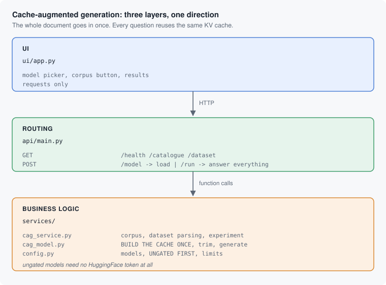

# Cache-Augmented Generation

> **Learn how to build this project step-by-step on [AI-ML Companion](https://aimlcompanion.ai/)**. Interactive ML learning platform with guided walkthroughs, architecture decisions, and hands-on challenges.


**RAG retrieves a few chunks and hopes they were the right ones. This puts the
whole document in the context once, keeps the KV cache, and answers every
question from it. No retrieval step means no retrieval mistakes.**

---

## 1. The idea, in one measurement

Build the cache over the document once, then reuse it for every question.
Real output from this project, on CPU with the bundled corpus:

| | seconds |
|---|---|
| Build the KV cache over the document | **12.63** (once) |
| Reuse it, per question | **0.16** |
| Generate the answer, per question | 87.47 (CPU, no GPU) |

Reusing the cache costs **0.16 s against 12.63 s to rebuild it** - about 79x
cheaper. That gap is the entire argument for cache-augmented generation, and
it grows with the size of the document.

The cost is equally clear: the document has to fit in the context window.
Past that point this technique stops applying and retrieval is the answer,
which is why `validate_document` refuses oversized input with that exact
message rather than silently truncating.

## 2. The shape of it



## 3. Four bugs that stopped this working at all

### The cached path loaded a file nothing ever wrote

```python
cache = torch.load("./data_cache/cache_knowledges.pt", weights_only=True)
```

That line ran once per question. Nothing anywhere in the project ever wrote
that file, and the directory did not exist, so **the entire cached path -
the point of the project - raised `FileNotFoundError` immediately.**

The cache is now built once before the loop and reused from memory, which is
both correct and what "cache-augmented" means:

```python
shared_cache, build_time = self.prepare_cache(documents)   # once
...
cache = copy.deepcopy(shared_cache)                        # per question
self._clean_cache(cache, origin_len)                       # drop the last answer
```

### `DynamicCache.key_cache` no longer exists

transformers 5.x replaced it with `.layers`, so
`cache.key_cache[0].shape[-2]` raises `AttributeError`. The supported calls
are `get_seq_length()` and `crop()`, and the code now uses those with a
fallback for transformers 4.x. `crop()` also deprecated its positive form in
5.16, so this passes the negative form that survives 5.18.

### An empty token is not "no token"

Passing `token=""` makes `huggingface_hub` build the header `Bearer ` with
nothing after it, and refuse it:

```
Illegal header value b'Bearer '
```

So loading an *ungated* model with no token configured failed anyway. "No
token" has to be `None`.

### The only model offered was gated

The original listed exactly one model, `meta-llama/Llama-3.2-1B-Instruct`,
which is a **gated** repo: you need a HuggingFace token *and* you must accept
Meta's licence with that same account. That is a hard stop before you have
seen the idea work once.

The catalogue now leads with ungated models that need **no token at all**:

| Model | Size | Token needed |
|---|---|---|
| SmolLM2 360M | ~720 MB | **no** |
| Qwen2.5 0.5B | ~1 GB | **no** |
| Qwen2.5 1.5B | ~3 GB | **no** |
| Llama 3.2 1B | ~2.5 GB | yes, and a licence |

Verified: `POST /model` with no `HF_TOKEN` set returns
`{"loaded": true, "model": "HuggingFaceTB/SmolLM2-360M-Instruct", "hf_token": false}`.

## 4. Run it

### Clone

```bash
git clone https://github.com/genieincodebottle/generative-ai.git
cd generative-ai/genai-usecases/cache_augmented_generation
```

### Set up with uv

```bash
pip install uv

uv venv
source .venv/bin/activate      # Linux / macOS
# .venv\Scripts\activate       # Windows PowerShell or cmd

uv pip install -r requirements.txt
```

Python 3.10+. This installs torch, so it is a large download.

### Keys

**None needed.** `.env` is optional and only matters if you want the gated
Llama model.

### Start both services

```bash
python run.py
```

```
API   ->  http://localhost:8000/docs
UI    ->  http://localhost:8501
```

### Use it

1. Sidebar: pick **SmolLM2 360M** and press **Load model**. First run downloads
   the weights.
2. Press **Use the bundled corpus** - ten support documents, about 25,600
   characters, with one question about each. Nothing to paste.
3. Press **Run**.

Then run it again with **Use the KV cache** unticked and compare.

### Run the tests

```bash
pytest                         # 25 tests, no model download, no network
```

## 5. The API

| Method | Path | Purpose |
|---|---|---|
| `GET` | `/health` | Is a model loaded, is a token present |
| `GET` | `/catalogue` | Models, **with the gated ones marked**, and the limits |
| `POST` | `/model` | Load a model |
| `DELETE` | `/model` | Unload it |
| `GET` | `/dataset` | The bundled questions **and the joined corpus** |
| `POST` | `/run` | Answer every question, with or without the cache |

```bash
curl -X POST http://localhost:8000/model \
  -H 'Content-Type: application/json' \
  -d '{"model_id":"HuggingFaceTB/SmolLM2-360M-Instruct"}'

curl -X POST "http://localhost:8000/run?use_cache=true"
```

With no `document` supplied, `/run` falls back to the dataset's own corpus, so
the shortest path from clone to result is two curl commands.

## 6. If something goes wrong

| symptom | cause | fix |
|---|---|---|
| UI says "Cannot reach the API" | Streamlit started on its own | use `python run.py` |
| First load takes minutes | downloading weights | expected once; they are cached |
| `503 ... is a gated repository` | you picked the Llama model | use an ungated one, or set `HF_TOKEN` and accept the licence |
| `503 Not enough memory` | model too large for this machine | pick a smaller one |
| `422 ... what retrieval is for` | document over the context limit | that is the technique's real boundary |
| `409 No model is loaded` | you skipped step 1 | load a model first |
| A run takes many minutes | CPU generation | expected: 87 s per answer here. A GPU changes this completely |
| `Illegal header value b'Bearer '` | an older copy of this project | fixed; no token now means `None` |
| Port already in use | something else has 8000/8501 | `API_PORT=8100 UI_PORT=8600 python run.py` |

## 7. Layout

```
run.py                       starts the API and the UI together
.env.example                 optional; only the gated model needs a token
.streamlit/config.toml       turns off Streamlit's own start-up advert
datasets/                    ten documents with a question about each
colab_notebook/              the original notebook

ui/app.py                    Streamlit. Widgets + requests only.

api/main.py                  6 routes, error -> status mapping

services/config.py           models, UNGATED FIRST, gating flags, limits
services/cag_service.py      corpus, dataset parsing, the experiment
services/cag_model.py        BUILD THE CACHE ONCE, trim it, generate

tests/test_cag_service.py    catalogue, parsing, guards, the no-token path
```

## 8. Track modules this covers

`cacheAugmentedGeneration` - `kvCache` - `contextWindows` - `rag` -
`localModels` - `transformers`

## 9. Honest limitations

- **It only works while the document fits in the context window.** That is
  the technique, not a bug. The 40,000-character default limit is a guard
  against pretending otherwise.
- **CPU generation is slow.** 87 seconds per answer with a 360M model here.
  Ten questions is a quarter of an hour. A GPU changes this by more than an
  order of magnitude; the cache reuse advantage is unchanged either way.
- **Similarity is cosine similarity of sentence embeddings**, not correctness.
  0.59 means "roughly on topic", not "right". Treat it as a smoke test.
- **The cache is deep-copied per question** so that trimming one answer cannot
  corrupt the next. That costs memory proportional to the document.
- **One model at a time, held globally.** Loading a second replaces the first,
  and every client shares it.
- **No comparison against RAG is included.** The interesting experiment - CAG
  versus retrieval on the same corpus - is left for you to run.
- **CORS is wide open** because both halves run on localhost.
