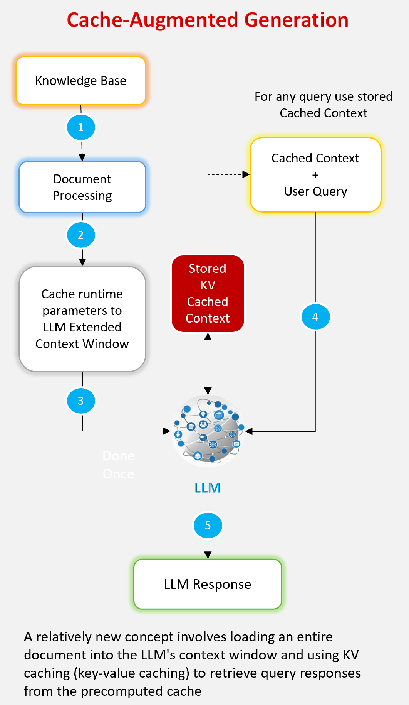

<div align="center">
   
</div>

- [⚙️ **Setup Instructions**](#%EF%B8%8F-setup-instructions)
- [💻 Running the Application](#-running-the-application)
- [🔍 Overview](#-overview)
- [✨ Advantages of CAG](#-advantages-of-cag)
- [⚠️ Limitations of CAG](#-limitations-of-cag)
- [📚 References ](#-references)


<a href="https://colab.research.google.com/drive/1-5MgFfzNtcFMCIv-VEPXBrp4hJq9v6-R?usp=sharing" target="_parent"></a>

### 🔍 Overview
Retrieval-Augmented Generation (RAG) enhances language models by integrating external 
knowledge but faces challenges like retrieval latency, errors, and system complexity. 
Cache-Augmented Generation (CAG) addresses these by preloading relevant data into the 
model's context, leveraging modern LLMs' extended context windows and caching runtime parameters. 
This eliminates real-time retrieval during inference, enabling direct response generation.


<hr>

### ✨ Advantages of CAG
* **Reduced Latency:** Faster inference by removing real-time retrieval.
* **Improved Reliability:** Avoids retrieval errors and ensures context relevance.
* **Simplified Design:** Offers a streamlined, low-complexity alternative to RAG with comparable or better performance.

<hr>

### ⚠️ Limitations of CAG
* **Knowledge Size Limits:** Requires fitting all relevant data into the context window, unsuitable for extremely 
large datasets.
* **Context Length Issues:** Performance may degrade with very long contexts.

<hr>

### 📚 References
* [Research Paper](https://arxiv.org/abs/2412.15605)
* https://github.com/hhhuang/CAG/tree/main

<hr>

### ⚙️ Setup Instructions

- #### Prerequisites
   - Python 3.9 or higher
   - pip (Python package installer)

- #### Installation
   1. Clone the repository:
      ```bash
      git clone https://github.com/genieincodebottle/generative-ai.git
      cd generative-ai\genai-usecases\cache_augumeted_generation
      ```
   2. Create a virtual environment:
      ```bash
      pip install uv
      uv venv
      .venv\Scripts\activate # On Linux -> source venv/bin/activate
      ```
   3. Install dependencies:
      ```bash
      uv pip install torch --index-url https://download.pytorch.org/whl/cu118
      uv pip install -r requirements.txt
      ```
   4. Rename `.env.example` to `.env`
   
   5. Get your Hugging Face token:
      * Visit [Hugging Face Tokens Page](https://huggingface.co/settings/tokens)
      * Create a new token with read access
   
   6. Copy the token to `HF_TOKEN` in your .env file

<hr>

### 💻 Running the Application
To start the application, run:
```bash
streamlit run app.py
```

<div align="left">
   
</div>