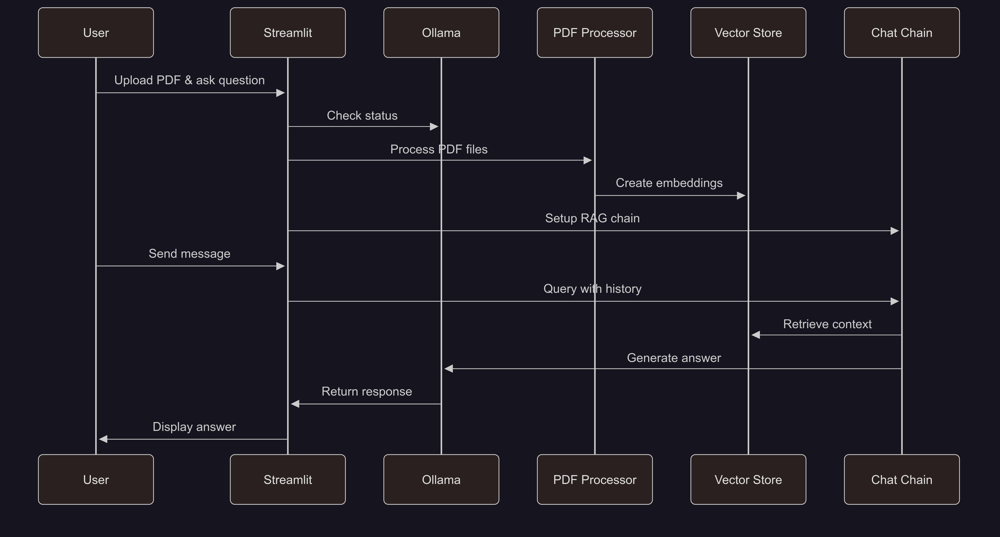

## PDF Chatbot with Memory powered by Ollama

A beginner friendly GenAI based chatbot that provides a conversational interface for PDF documents using Ollama based local open models.

## Features

- 🤖 **Multiple Local Models** - Support for various [Ollama](https://ollama.com/) based open models (Llama, Gemma, DeepSeek, gpt-oss, phi etc.)
- 📚 **Multiple PDF Support** - Upload and query multiple documents simultaneously
- 💬 **Advanced Memory System** - Latest [LangChain](https://python.langchain.com/docs/introduction/) 0.3+ conversational memory with context-aware responses
- 🧠 **RAG Implementation** - Retrieval-Augmented Generation using PDF documents as knowledge base
- 🔄 **Session-based Memory** - Isolated conversation threads with persistent chat history
- ⚙️ **UI-Based Configuration** - All settings configurable through the sidebar interface


## 📊 Application Flow



## 🛠️ Setup Instructions

### Prerequisites

1. **Install Ollama**
   - Download from [ollama.com](https://ollama.com/download)
   - Follow installation instructions for your operating system (macOS, Linux, Windows)

   Check Ollama based open models -> https://ollama.com/search32. 

2. **After Ollama installtion. Pull Local Open Model based on your choice and system capacity**
   ```bash
   ollama pull llama3.2:1b # Options: gpt-oss:20b, llama3.2:1b, llama3.2:3b, llama3.1:8b, deepseek-r1:1.5b, deepseek-r1:7b, deepseek-r1:8b, gemma3:1b, gemma3:4b, gemma3:12b, phi3:3.8b
   ```
   Reference guide for memory requirement 
   - **llama3.2:1b** (1B parameters) - ~0.7GB RAM
   - **llama3.2:3b** (3B parameters) - ~2GB RAM
   - **llama3.1:8b** (8B parameters) - ~4.5GB RAM
   - **gemma3:1b** (1B parameters) - ~0.7GB RAM
   - **gemma3:4b** (4B parameters) - ~2.5GB RAM

   **Note**: Ollama uses Q4_0 quantization (~0.5-0.7GB per billion parameters)

3. **Run the following command to list the local open models available in Ollama**

   ```bash
   ollama list
   ```
4. **Start Ollama Service** (if needed)
   ```bash
   ollama serve  # Only needed if Ollama isn't running automatically
   ```

   **Note**: Most desktop installations start Ollama automatically. Check if it's running by visiting `http://localhost:11434` in your browser or by looking for the Ollama icon in your system tray.

## ⚙️ Installation & Running App

1. Clone the repository:

   ```bash
   git clone https://github.com/genieincodebottle/generative-ai.git
   cd genai-usecases\chatbot-with-memory
   ```

2. Open the Project in VS Code or any code editor.

3. Create a virtual environment by running the following command in the terminal:

   ```bash
   pip install uv #if uv not installed
   uv venv
   .venv\Scripts\activate # On Linux -> source venv/bin/activate
   ```

4. The `requirements.txt` file contains the following dependencies:

   ```bash
   langchain>=0.3.27
   langchain-community>=0.3.29
   langchain-ollama>=0.3.8
   langchain-huggingface>=0.3.1
   sentence-transformers>=5.1.0
   faiss-cpu>=1.12.0
   streamlit>=1.49.1
   pypdf>=6.0.0
   # Ollama support
   requests>=2.32.5
   ```

   **Note**: The application now uses the latest LangChain 0.3+ memory patterns with `RunnableWithMessageHistory` and `InMemoryChatMessageHistory` for enhanced conversational AI capabilities.

5. Install dependencies:

   ```bash
   uv pip install -r requirements.txt
   ```

6. Run the Application:

   ```bash
   streamlit run app.py
   ```

## ⚙️ Configuration

All configuration is done through the **sidebar interface** - no configuration files needed!

### 📊 Status Section
- **Ollama Status**: Real-time connection status with setup instructions
- **Setup Guide**: Expandable instructions when Ollama is not running

### 🎛️ Essential Settings
- **🤖 Model**: Choose from available models based on your system memory.
- **🎛️ Temperature**: Controls response creativity (0 = focused, 1 = creative)

### 🔧 Advanced Settings (Expandable)
- **Ollama URL**: Server location (default: http://localhost:11434)
- **Chunk Size**: Text processing chunk size (1000-8000, default: 4000)
- **Chunk Overlap**: Overlap between chunks (0-500, default: 10)

### 📄 File Upload
- **PDF Upload**: Drag & drop or browse for PDF files in sidebar
- **Multiple Files**: Upload and query multiple documents simultaneously

## 💡 Usage

1. **Start the application** using `streamlit run app.py`
2. **Check status** - Ollama connection status shown in sidebar
3. **Configure model** - Choose model and temperature in sidebar (optional)
4. **Upload PDF files** - Use the sidebar file uploader
5. **Wait for processing** - You'll see a toast notification when ready
6. **Start chatting** - Ask questions in the main chat interface
7. **Get AI responses** - Contextual answers based on your PDF documents with memory-enabled conversations

### 🧠 Memory & Context Features:
- **Conversation Continuity**: Remembers previous questions and answers within the session
- **Context-Aware Responses**: References earlier parts of the conversation naturally
- **Document-Based Answers**: All responses are grounded in the uploaded PDF content
- **Session Isolation**: Each conversation maintains its own memory thread
- **Clear History**: Reset both UI and memory with the "Clear Chat History" button

### Configuration Tips:
- **Smaller models** (1b-3b): Faster responses, less resource usage
- **Larger models** (8b+): Better quality responses, more resource intensive
- **Lower temperature**: More focused, deterministic responses
- **Higher temperature**: More creative, varied responses

## 🐛 Troubleshooting

### Common Issues

1. **"Ollama server is not running"**
   - Ensure Ollama is installed and running: `ollama serve`
   - Check if the service is accessible at `http://localhost:11434`
   - Verify the Base URL in the sidebar settings

2. **"Model not found"**
   - Pull the model first: `ollama pull [model-name]`
   - Wait for the download to complete
   - Select the correct model in the sidebar dropdown

3. **Memory Issues**
   - Choose smaller models (llama3.2:1b, gemma2:2b)
   - Reduce chunk size in document settings
   - Close other resource-intensive applications

4. **PDF Processing Errors**
   - Ensure PDFs are not password-protected
   - Try smaller PDF files first
   - Check console for detailed error messages

5. **Configuration Issues**
   - Use the "Reset to Defaults" button in the sidebar
   - Refresh the page to reload settings
   - Check that all required fields are filled

6. **Memory/Conversation Issues**
   - Use "Clear Chat History" to reset conversation memory
   - Refresh the page if memory seems inconsistent
   - Check that PDF content is properly indexed before starting conversations

## 🔧 Technical Architecture

### Memory Implementation
- **LangChain Patterns**: Uses `RunnableWithMessageHistory`
- **Conversational RAG**: Implements context-aware retrieval with chat history integration
- **Session Management**: Each user session maintains isolated conversation memory
- **History-Aware Retrieval**: Questions are contextualized using previous conversation before document retrieval

### Document Processing Pipeline
1. **PDF Loading**: `PyPDFLoader` extracts text from uploaded PDFs
2. **Text Chunking**: `RecursiveCharacterTextSplitter` creates manageable document chunks
3. **Embeddings**: `HuggingFaceEmbeddings` generates vector representations
4. **Vector Storage**: `FAISS` stores and enables similarity search
5. **Retrieval**: Context-aware retriever finds relevant document sections
6. **Generation**: LLM generates responses using retrieved context and conversation history