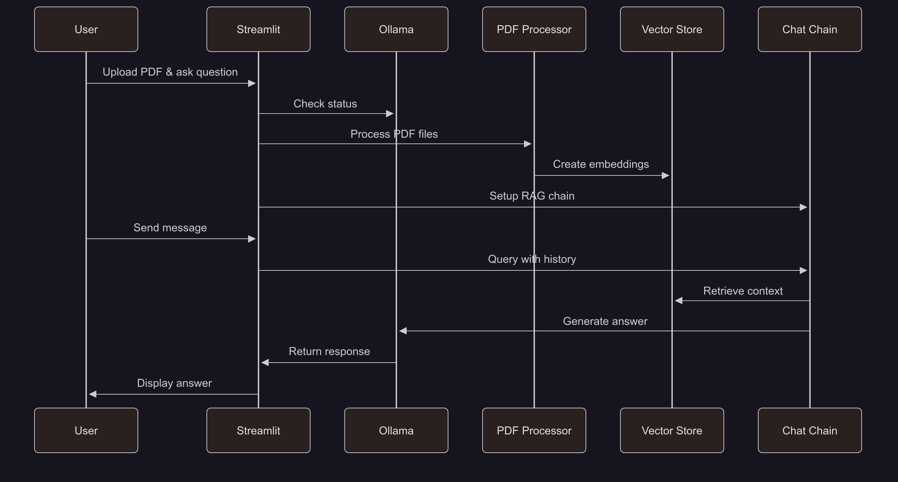

## PDF Chatbot with Memory

A beginner-friendly GenAI chatbot that lets you upload PDF documents and have a conversation about their content. The bot **remembers** your previous questions within a session, so you can ask follow-up questions naturally.

### What You'll Learn

- How to build a **RAG** (Retrieval-Augmented Generation) pipeline with LangChain
- How to add **conversational memory** so the chatbot remembers context
- How to use **FAISS** for fast vector similarity search
- How to work with **two LLM providers** — Groq (primary, free) and Google Gemini (secondary, free)

> **No API keys needed!** This project runs entirely on your local machine using Ollama. No cloud APIs, no credit cards, no sign-ups. Just install Ollama, pull a model, and run.

## Features

- 🤖 **Dual LLM Providers** — Groq (fast, free) or Google Gemini (free tier)
- 📚 **Multi-PDF Support** — Upload and query multiple documents at once
- 💬 **Conversational Memory** — LangChain 0.3+ `RunnableWithMessageHistory` for context-aware responses
- 🧠 **RAG Pipeline** — Documents are chunked, embedded, stored in FAISS, and retrieved per query
- ⚙️ **Sidebar Configuration** — Change model, temperature, and chunking parameters from the UI

## Application Flow



## Tech Stack

| Component | Groq Provider | Gemini Provider |
|---|---|---|
| **LLM** | Groq (`llama-3.1-8b-instant`, `llama-3.3-70b-versatile`, `llama-4-scout-17b`, `qwen3-32b`) | Google Gemini (`gemini-2.5-flash`, `gemini-2.0-flash`, `gemini-2.5-pro`) |
| **Embeddings** | HuggingFace (`all-MiniLM-L6-v2`) | Google (`gemini-embedding-001`) |
| **Vector Store** | FAISS | FAISS |
| **Framework** | LangChain 0.3+ | LangChain 0.3+ |
| **UI** | Streamlit | Streamlit |

## Prerequisites

- **Python 3.10+** installed ([download](https://www.python.org/downloads/))
- A **free API key** from at least one provider:
  - **Groq** (recommended) — [console.groq.com/keys](https://console.groq.com/keys)
  - **Google Gemini** — [aistudio.google.com/apikey](https://aistudio.google.com/apikey)

> **No GPU required.** Embeddings run on CPU; LLM inference happens in the cloud via API.

## Setup (Step by Step)

### 1. Clone the repository

```bash
git clone https://github.com/genieincodebottle/generative-ai.git
cd generative-ai/genai-usecases/chatbot-with-memory
```

### 2. Create a virtual environment

```bash
pip install uv          # one-time install of the uv tool
uv venv                 # creates a .venv folder
```

Activate it:

```bash
# Windows (PowerShell / CMD)
.venv\Scripts\activate

# macOS / Linux
source .venv/bin/activate
```

### 3. Install dependencies

```bash
uv pip install -r requirements.txt
```

### 4. Set up your API keys

**Option A** — Create a `.env` file in this folder:

```bash
cp .env.example .env     # Windows: copy .env.example .env
```

**Option B** — Use the repo-root `.env` file (shared by all projects):

```bash
# Already exists at generative-ai/.env — just add your keys there
```

Open the `.env` file in any text editor and paste your key(s):

```
GROQ_API_KEY=gsk_xxxxxxxxxxxxxxxxxxxxxxx
GOOGLE_API_KEY=AIzaSy_xxxxxxxxxxxxxxxxxxxxxxx
```

> You only need the key for the provider you plan to use. If you have both, you can switch providers from the sidebar at any time.
> The app checks the local `.env` first, then falls back to the repo-root `.env`.

### 5. Run the app

```bash
streamlit run app.py
```

The app opens in your browser at `http://localhost:8501`.

## How to Use

1. **Pick a provider** — Select Groq or Gemini in the sidebar.
2. **Choose a model** — Smaller models are faster; larger models give better answers.
3. **Upload PDFs** — Drag & drop one or more PDF files in the sidebar.
4. **Wait for indexing** — A toast message confirms when documents are ready.
5. **Start chatting** — Type your question in the chat box at the bottom.
6. **Ask follow-ups** — The bot remembers your conversation within the session.
7. **Clear history** — Click "🧹 Clear Chat History" to reset memory.

## Configuration Options

| Setting | Default | Description |
|---|---|---|
| Provider | Groq | Which LLM service to use |
| Model | `llama3-8b-8192` / `gemini-2.5-flash` | LLM model |
| Temperature | 0.3 | 0 = focused, 1 = creative |
| Chunk Size | 2000 | Characters per text chunk |
| Chunk Overlap | 200 | Overlap between consecutive chunks |
| Retriever K | 3 | Number of document chunks retrieved per query |

## Troubleshooting

| Problem | Fix |
|---|---|
| `GROQ_API_KEY not found` | Make sure `.env` file exists in the project folder with your key |
| `GOOGLE_API_KEY not found` | Same as above — add your Google key to `.env` |
| `No content found in PDFs` | The PDF might be image-based (scanned). Try a text-based PDF |
| `Error processing PDFs` | Check that the PDF is not password-protected |
| App is slow on first question | HuggingFace embeddings download a model (~90 MB) on first run — this is a one-time download |
| `ModuleNotFoundError` | Run `uv pip install -r requirements.txt` again inside your activated venv |

## Project Structure

```
chatbot-with-memory/
├── app.py              # Main Streamlit application
├── requirements.txt    # Python dependencies
├── .env.example        # Template for API keys
├── .env                # Your actual API keys (git-ignored)
├── README.md           # This file
└── images/
    └── sequence_diagram.png
```

## How It Works (Architecture)

1. **PDF Upload** → `PyPDFLoader` extracts text from each page
2. **Chunking** → `RecursiveCharacterTextSplitter` splits text into overlapping chunks
3. **Embedding** → Each chunk is converted to a vector (HuggingFace or Google embeddings)
4. **Indexing** → Vectors are stored in a FAISS in-memory index
5. **Question** → User's question + chat history → reformulated into a standalone question
6. **Retrieval** → FAISS finds the top-K most relevant chunks
7. **Generation** → LLM produces an answer using the retrieved context
8. **Memory** → Question and answer are stored in `InMemoryChatMessageHistory` for follow-ups
