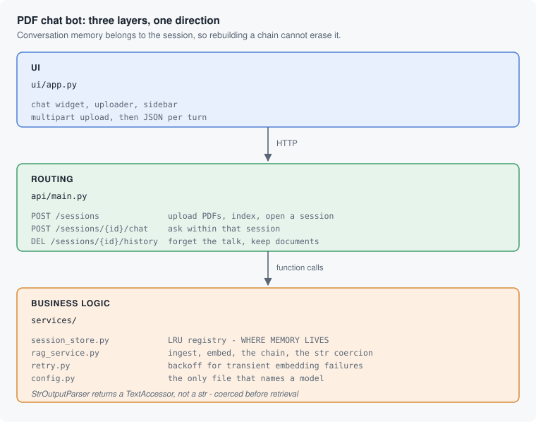

# PDF Chat Bot with Memory

> **Learn how to build this project step-by-step on [AI-ML Companion](https://aimlcompanion.ai/)**. Interactive ML learning platform with guided walkthroughs, architecture decisions, and hands-on challenges.


**Conversational RAG over your own PDFs. The interesting part is not the
retrieval, it is that "how long does *that* take?" resolves against the
previous turn, and that the conversation survives you moving a slider.**

---

## 1. The problem

Upload PDFs, ask questions, get answers grounded in the documents. Then ask a
follow-up that only makes sense in context:

> **You:** How many days do customers have to request a refund?
> **Bot:** Customers have 30 days from the date of purchase to request a refund.
> **You:** And how long does processing **that** take?
> **Bot:** Refunds are processed in 5 business days.

The second question is unanswerable on its own. "That" is doing all the work,
and a vector search for *"And how long does processing that take?"* retrieves
nothing useful. So the question is rewritten against the history **before**
retrieval - that is the `contextualize` step - and only then embedded.

## 2. The shape of the fix



## 3. Two bugs this layering exposed

### The conversation was being deleted by the temperature slider

The original single-file app created its history store **inside** the function
that built the chain:

```python
def create_chat_chain(llm, vectorstore, retriever_k):
    ...
    store = {}                      # <- new dict every time this runs
    def get_session_history(session_id):
        if session_id not in store:
            store[session_id] = InMemoryChatMessageHistory()
        return store[session_id]
```

The chain was rebuilt whenever the model, temperature, or `k` changed. Moving
the temperature slider therefore wiped the conversation, silently - no error,
no message, the chat just stopped remembering. Here the history belongs to the
**session**, and `build_chain` receives a factory it cannot reach:

```python
chain = build_chain(llm, session.index, session.retriever_k,
                    lambda _sid: session.history)   # owned by the session
```

`test_session_store.py::test_history_object_is_owned_by_the_session` pins it.

### A type leak that masqueraded as a Google outage

Live testing produced this, on every single request:

```
Error embedding content: 500 INTERNAL. {'error': {'code': 500, ...}}
```

A 500 reads as "the provider is having a bad day", and adding retries around it
(which this project also does, for genuine blips) just made it fail more slowly.
The real cause: **`StrOutputParser` returns a `TextAccessor`, not a `str`.**
FAISS passes whatever it is handed straight to the embedding client, and the
Google SDK serialises a `TextAccessor` into a request the API rejects.
Deterministically. The fix is one coercion:

```python
history_aware_retriever = (
    contextualize_prompt | llm | StrOutputParser() | (lambda q: str(q)) | retriever
)
```

`test_rag_service.py::TestRetrieverReceivesAPlainString` fails with
`retriever received TextAccessor, not str` if that coercion is ever removed.

## 4. Run it

### Clone

```bash
git clone https://github.com/genieincodebottle/generative-ai.git
cd generative-ai/genai-usecases/chatbot-with-memory
```

### Set up with uv

```bash
pip install uv

uv venv
source .venv/bin/activate      # Linux / macOS
# .venv\Scripts\activate       # Windows PowerShell or cmd

uv pip install -r requirements.txt
```

Python 3.10+. Plain `pip install -r requirements.txt` works identically.

### Add a key

```bash
cp .env.example .env           # copy .env.example .env  on Windows
```

| Variable | Where to get it | Embeddings |
|---|---|---|
| `GOOGLE_API_KEY` | [Google AI Studio](https://aistudio.google.com/app/apikey) | Gemini API - nothing to download |
| `GROQ_API_KEY` | [Groq Console](https://console.groq.com/keys) | **local CPU**, ~90 MB downloaded on first use |

Groq serves chat models but no embedding model, so choosing Groq runs retrieval
locally through `sentence-transformers`. That is why the first upload on Groq
is slow and the first upload on Gemini is not. **Gemini is the lighter path if
you just want to see it work.**

### Start both services

```bash
python run.py
```

```
API   ->  http://localhost:8000/docs
UI    ->  http://localhost:8501
```

Or run the halves separately:

```bash
uvicorn api.main:app --reload --port 8000
streamlit run ui/app.py
```

### Use it

1. Sidebar, then **Upload PDFs**, and pick one or more files.
2. **Index documents**. You get back a page and chunk count.
3. Ask a question in the chat box, then ask a follow-up that refers back to it.

### Run the tests

```bash
pytest                         # 49 tests, no API key, no network
```

They build a real PDF byte-by-byte in `make_pdf()` rather than committing a
fixture file, so the parsing tests exercise the real loader with nothing to
download.

## 5. The API

| Method | Path | Purpose |
|---|---|---|
| `GET` | `/health` | Liveness, configured providers, session count |
| `GET` | `/providers` | Providers with keys, models, embedding strategy |
| `POST` | `/sessions` | Upload PDFs, index them, open a session |
| `POST` | `/sessions/{id}/chat` | Ask a question within that session |
| `GET` | `/sessions/{id}/history` | The conversation so far |
| `DELETE` | `/sessions/{id}/history` | Forget the conversation, keep the documents |
| `DELETE` | `/sessions/{id}` | Drop the session and its index |

```bash
SID=$(curl -s -X POST http://localhost:8000/sessions \
  -F "files=@policy.pdf;type=application/pdf" \
  -F "provider=Gemini" -F "model=gemini-flash-latest" \
  | python -c "import json,sys; print(json.load(sys.stdin)['session_id'])")

curl -X POST "http://localhost:8000/sessions/$SID/chat" \
  -H 'Content-Type: application/json' \
  -d '{"question":"How many days do customers have to request a refund?"}'
```

Sessions are held in memory with LRU eviction (`MAX_SESSIONS`, default 20),
because each one holds a FAISS index. An evicted session returns **404** with
"upload your PDFs again" rather than an empty answer, and the UI acts on that.

## 6. Limits and why they exist

| Setting | Default | Why |
|---|---|---|
| `MAX_UPLOAD_BYTES` | 25 MB | Uploads are read into memory; this caps one request |
| `MAX_FILES` | 10 | Same reason, per request |
| `MAX_SESSIONS` | 20 | Each session pins a FAISS index in RAM |

Uploads are validated **before** anything is parsed: total size across all
files (not per file), extension, and non-emptiness. A PDF that parses but
yields no text - a scan - is reported as *"No extractable text found... this
app does not run OCR"* instead of building an empty index that answers
"I don't know" to everything.

## 7. If something goes wrong

| symptom | cause | fix |
|---|---|---|
| UI says "Cannot reach the API" | Streamlit started on its own | use `python run.py` |
| "No API keys found" | `.env` missing or unfilled | `cp .env.example .env`, add a key, restart the API |
| First Groq upload hangs for a minute | downloading the local embedding model | expected once; or switch to Gemini |
| "No extractable text found" | scanned/image PDF | this app does not OCR; use a text PDF |
| 404 "Session not found" mid-chat | session evicted, or the API restarted | index your PDFs again |
| `Upload is too large` | total across all files exceeds 25 MB | raise `MAX_UPLOAD_BYTES`, or upload fewer |
| `500 INTERNAL` from embeddings | genuine provider blip | retried automatically 4 times with backoff |
| `chunk_overlap must be smaller` | overlap >= chunk size | lower the overlap in Advanced |
| Port already in use | something else has 8000/8501 | `API_PORT=8100 UI_PORT=8600 python run.py` |

## 8. Layout

```
run.py                          starts the API and the UI together
.env.example                    the keys, and where to get them
.streamlit/config.toml          turns off Streamlit's own start-up advert

ui/app.py                       Streamlit chat UI, widgets + requests only

api/main.py                     7 routes, upload handling, status mapping

services/config.py              THE ONLY FILE THAT NAMES A MODEL OR READS THE ENV
services/rag_service.py         ingestion, embeddings, THE CHAIN (and the str coercion)
services/session_store.py       LRU session registry - WHERE MEMORY ACTUALLY LIVES
services/retry.py               backoff for transient embedding failures

tests/test_rag_service.py       upload validation, PDF parsing, the coercion regression
tests/test_session_store.py     lifecycle, LRU eviction, memory retention
tests/test_retry.py             what is retryable and what is not
tests/test_api.py               routes and status codes
```

## 9. Track modules this covers

`rag` - `vectorDatabases` - `embeddings` - `chunking` - `conversationalMemory` -
`llmApps`

## 10. Honest limitations

- **Sessions live in process memory.** Restart the API and every session is
  gone. Swapping `session_store.py` for Redis is the intended exercise; nothing
  else would need to change.
- **No authentication.** Anyone who can reach the API can read any session id
  they know. It is a localhost demo.
- **Retrieval is plain similarity search.** No reranking, no hybrid search, no
  query expansion beyond the contextualisation step. See the `advance-rag`
  project in this repo for those.
- **No OCR.** Scanned PDFs are detected and rejected with a clear message
  rather than silently indexing nothing.
- **`langchain-community` prints a sunset warning.** It is still the correct
  source for `PyPDFLoader` and `FAISS`; the `langchain-faiss` and
  `langchain-pdf` names on PyPI are empty placeholder packages, not
  replacements. Do not "fix" the warning by installing them.
- **`RunnableWithMessageHistory` is deprecated** in favour of LangGraph
  persistence. It still works and it keeps this example readable; migrating is
  a change to `build_chain` and `session_store` only.
