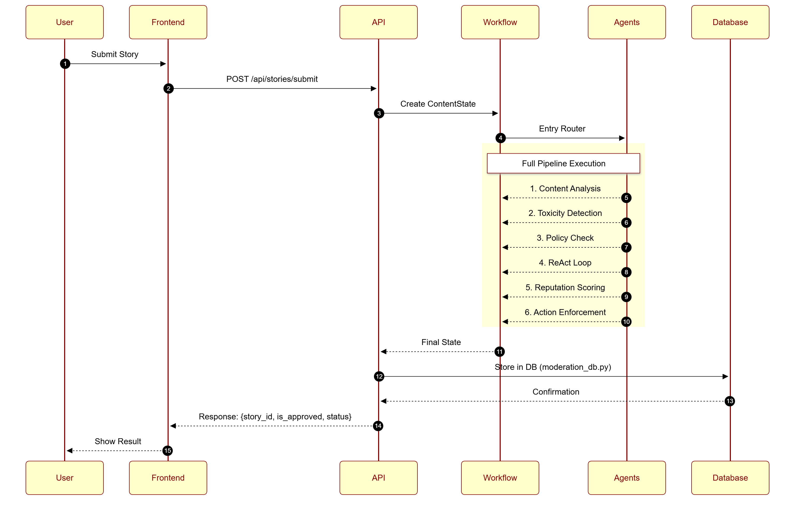
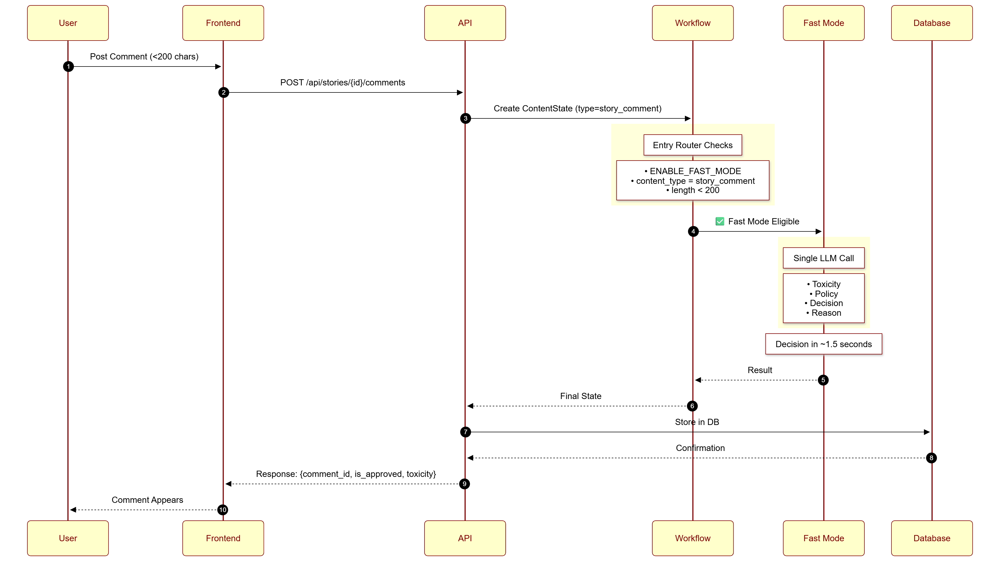
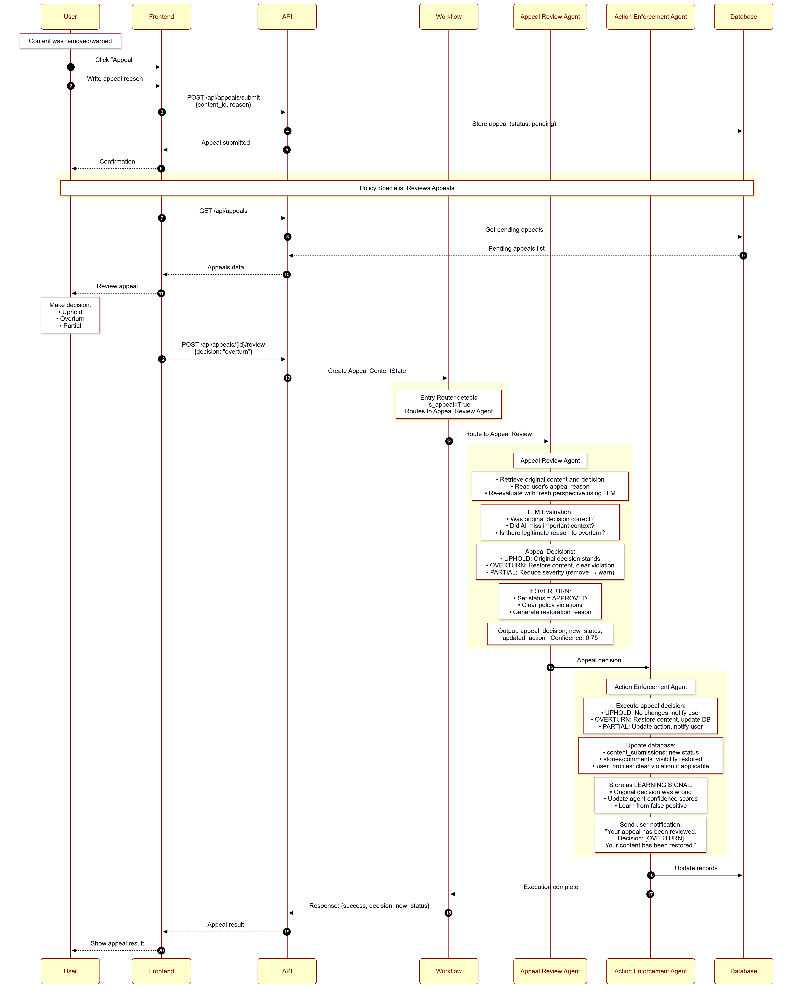

# Content Moderation System - Complete End-to-End Architecture

## 🎯 System Overview

This document provides a comprehensive view of the entire content moderation platform, from user story submission to final resolution, including all components, databases, and workflows. It covers both the high-level system architecture and detailed backend module implementations.

---

## 📑 Table of Contents

1. [📊 High Level Architecture](#📊-high-level-architecture-diagram)
2. [🔧 Backend Module Overview](#🔧-backend-module-overview)
3. [🤖 AI/ML Models & Embedding Systems](#🤖-aiml-models--embedding-systems)
4. [🔄 Complete User Story Submission Flow](#🔄-complete-user-story-submission-flow)
5. [📐 Sequence Diagrams](#📐-sequence-diagrams)
6. [🗄️ Database Schema Details](#🗄️-database-schema-details)
7. [📈 System Performance Metrics](#📈-system-performance-metrics)
8. [🔐 Security & Privacy](#🔐-security--privacy)
9. [🚀 Deployment Architecture](#🚀-deployment-architecture)
10. [⚙️ Configuration](#⚙️-configuration)
11. [📊 Complete Flow Summary](#📊-complete-flow-summary)

---

## 📊 High Level Architecture Diagram


---

## 🔧 Backend Module Overview

### 📁 Backend Structure

```
backend/
├── main.py                          # FastAPI application & REST endpoints
├── src/
│   ├── core/
│   │   ├── models.py                # Data models & type definitions
│   │   └── llm_schemas.py           # Pydantic schemas for LLM responses
│   ├── agents/
│   │   ├── agents.py                # 6 AI agent implementations
│   │   ├── workflow.py              # LangGraph workflow orchestration
│   │   ├── reasoning.py             # ReAct decision loop logic
│   │   └── tool_manager.py          # Tool management for agents
│   ├── database/
│   │   ├── moderation_db.py         # Content moderation database operations
│   │   └── auth_db.py               # User authentication database
│   ├── memory/
│   │   ├── memory.py                # ChromaDB memory manager
│   │   ├── agent_episodic_memory.py # Episode-level memory
│   │   ├── agent_semantic_memory.py # Pattern learning
│   │   └── learning_tracker.py      # Decision outcome tracking
│   ├── ml/
│   │   ├── ml_classifier.py         # ML toxicity detection models
│   │   ├── keyword_detectors.py     # Keyword-based detection
│   │   └── guardrails.py            # Safety guardrails
│   └── utils/
│       ├── tools.py                 # Utility functions
│       ├── evaluation.py            # Model evaluation metrics
│       └── observability.py         # Logging and monitoring
```

---

### 1. Core Modules (`src/core/`)

#### `models.py`
**Purpose**: Central data model definitions

**Key Components**:
- `ContentState` (TypedDict): Main state object passed through all agents
- `AgentDecision` (Dataclass): Individual agent decision record
- `UserProfile` (Dataclass): User reputation and history
- Enums: `ContentStatus`, `DecisionType`, `ToxicityLevel`, `PolicyCategory`

**Usage**: Every module imports types from here for type safety

---

#### `llm_schemas.py`
**Purpose**: Pydantic schemas for structured LLM outputs

**Key Components**:
- `TopicExtractionResponse`: Structured topic extraction
- `ToxicityAnalysisResponse`: Toxicity detection output
- `parse_llm_response()`: Parse and validate LLM JSON responses
- `create_structured_prompt()`: Format prompts for structured outputs

**Usage**: Agents use these to get reliable, parseable outputs from LLMs

---

### 2. Agent Modules (`src/agents/`)

#### `agents.py`
**Purpose**: Implementation of 6 specialized AI agents + Fast Mode agent

**Key Agents**:
1. **Content Analysis Agent**: Analyzes sentiment, topics, categories
2. **Toxicity Detection Agent**: Detects toxic language and hate speech
3. **Policy Violation Agent**: Checks community guidelines
4. **ReAct Decision Loop Agent**: Synthesizes all agent decisions
5. **HITL Checkpoint Agent**: Evaluates need for human review
6. **User Reputation Agent**: Scores user reputation and risk
7. **Action Enforcement Agent**: Executes moderation actions
8. **Appeal Review Agent**: Handles user appeals
9. **Fast Mode Agent**: Single-pass moderation for short comments

**Usage**: Called by [workflow.py](backend/src/agents/workflow.py) in sequence based on routing logic

---

#### `workflow.py`
**Purpose**: LangGraph workflow orchestration

**Key Functions**:
- `create_moderation_workflow()`: Builds the state graph
- `process_content()`: Executes workflow for content
- `resume_from_hitl()`: Resumes paused workflow after human review
- `should_use_fast_mode()`: Determines fast mode eligibility
- Routing functions: Direct flow between agents based on state

**Usage**: [main.py](backend/main.py) creates workflow on startup, calls it for each content submission

---

#### `reasoning.py`
**Purpose**: ReAct (Reason-Act-Observe) decision synthesis logic

**Key Functions**:
- Think phase: Analyzes all agent decisions
- Act phase: Makes final consolidated decision
- Observe phase: Evaluates HITL triggers and confidence
- Consensus calculation: Weights agent agreements

**Usage**: Called by ReAct Decision Loop Agent to synthesize multi-agent decisions

---

### 3. Database Modules (`src/database/`)

#### `moderation_db.py`
**Purpose**: All content moderation database operations

**Key Tables**:
- `content_submissions`: All moderated content
- `stories`: Story posts with visibility
- `story_comments`: Comments on stories
- `agent_executions`: Individual agent decision logs
- `policy_violations`: Policy violation records
- `user_actions`: Warnings, suspensions, bans

**Key Operations**:
- `store_content_submission()`: Save content and moderation results
- `get_content_by_id()`: Retrieve content details
- `update_story_moderation()`: Update story approval status
- `get_user_violations()`: Get user violation history

**Usage**: Called by agents and API endpoints to persist/retrieve data

---

#### `auth_db.py`
**Purpose**: User authentication and management

**Key Tables**:
- `users`: User accounts with credentials
- `user_profiles`: Extended profile information
- `sessions`: Active user sessions

**Key Operations**:
- `create_user()`: Register new user
- `authenticate_user()`: Verify credentials
- `update_user_role()`: Change user permissions
- `get_all_users()`: Admin user management

**Usage**: Called by authentication endpoints and user management APIs

---

### 4. Memory Modules (`src/memory/`)

#### `memory.py`
**Purpose**: ChromaDB-based memory management

**Key Collections**:
- `moderation_decisions`: Historical decisions
- `flagged_patterns`: Patterns of flagged content
- `user_violations`: User violation history

**Key Operations**:
- `store_moderation_decision()`: Save decision for learning
- `retrieve_similar_content()`: Find similar past content
- `get_user_violation_history()`: Get user's past violations

**Usage**: Agents store and retrieve decisions for pattern learning

---

#### `learning_tracker.py`
**Purpose**: Track decision outcomes and learn from appeals

**Key Functions**:
- `record_decision()`: Log agent decision with metadata
- `update_outcome()`: Update when decision is appealed
- `get_success_rate()`: Calculate agent accuracy
- `analyze_patterns()`: Identify learning opportunities

**Usage**: Called by agents to enable continuous improvement from feedback

---

### 5. ML Modules (`src/ml/`)

#### `ml_classifier.py`
**Purpose**: ML-based toxicity detection using transformer models

**Supported Models**:
- DistilBERT Toxic (default)
- HateBERT (hate speech specialist)
- Toxic BERT (multi-category)
- RoBERTa Hate (robust detection)

**Key Functions**:
- `load_models()`: Initialize transformer models
- `predict_toxicity()`: Get toxicity predictions
- `ensemble_predict()`: Combine multiple model predictions

**Usage**: Optional - used by Toxicity Detection Agent if `USE_ML_MODELS=true`

---

#### `keyword_detectors.py`
**Purpose**: Fast keyword-based toxicity detection (default)

**Key Functions**:
- `keyword_toxicity_detection()`: Pattern matching for toxic phrases
- `keyword_hate_speech_detection()`: Detect hate speech patterns
- Built-in pattern libraries for common violations

**Usage**: Default toxicity detection method (fast, no ML dependencies)

---

#### `guardrails.py`
**Purpose**: Safety guardrails for AI agent behavior

**Key Features**:
- Loop detection (max 10 iterations)
- Hallucination detection (contradiction checking)
- Cost budget tracking
- Execution time limits
- Consistency validation across agents

**Usage**: Wraps all agent functions to ensure safe, bounded execution

---

### 6. Main Application (`main.py`)

#### `main.py`
**Purpose**: FastAPI REST API server

**Key Endpoints**:

**Authentication**:
- `POST /api/auth/login`: User login
- `POST /api/auth/register`: New user registration
- `PUT /api/auth/password`: Update password

**Content Submission**:
- `POST /api/stories/submit`: Submit story for moderation
- `POST /api/stories/{id}/comments`: Submit comment

**Moderation**:
- `GET /api/hitl/queue`: Get HITL review queue
- `POST /api/hitl/review/{id}`: Submit human decision
- `POST /api/content/review`: Manual content review

**Appeals**:
- `POST /api/appeals/submit`: Submit appeal
- `POST /api/appeals/{id}/review`: Review appeal

**Analytics**:
- `GET /api/statistics`: System statistics
- `GET /api/analytics/overview`: Moderation analytics

**Usage**: Entry point for all frontend interactions

---

## 🤖 AI/ML Models & Embedding Systems

This section clarifies the different AI models and embedding systems used throughout the platform.

### 🧠 Google Gemini LLM (Primary AI Engine)

**Model**: `gemini-1.5-flash` via Google Generative AI API

**Usage Locations**:
1. **Content Analysis Agent** ([agents.py:58](content-moderation-system/backend/src/agents/agents.py#L58))
   - Topic extraction
   - Sentiment analysis
   - Content categorization
   - Uses structured prompts with JSON output parsing

2. **Toxicity Detection Agent** ([agents.py:178](content-moderation-system/backend/src/agents/agents.py#L178))
   - Language-aware toxicity assessment
   - Contextual hate speech detection
   - Cultural nuance understanding

3. **Policy Compliance Agent** ([agents.py:298](content-moderation-system/backend/src/agents/agents.py#L298))
   - Community guidelines checking
   - Policy violation categorization
   - Severity level determination

4. **Context Analysis Agent** ([agents.py:418](content-moderation-system/backend/src/agents/agents.py#L418))
   - User history analysis
   - Behavioral pattern detection
   - Risk level assessment

5. **Decision Synthesis Agent** ([agents.py:538](content-moderation-system/backend/src/agents/agents.py#L538))
   - ReAct reasoning loop (Think-Act-Observe)
   - Multi-agent decision aggregation
   - Final decision with confidence scoring

6. **Appeal Review Agent** ([agents.py:658](content-moderation-system/backend/src/agents/agents.py#L658))
   - Original vs updated content comparison
   - Appeal justification evaluation
   - Decision reversal recommendations

**API Configuration**:
```python
# Environment variable
GOOGLE_API_KEY=your_api_key_here

# LLM Client initialization
from langchain_google_genai import ChatGoogleGenerativeAI
llm = ChatGoogleGenerativeAI(
    model="gemini-1.5-flash",
    temperature=0.7,
    google_api_key=os.getenv("GOOGLE_API_KEY")
)
```

**Cost per Request**:
- Fast Mode (1 LLM call): ~$0.0002
- Full Pipeline (4 LLM calls): ~$0.0016
- Appeal Review (2 LLM calls): ~$0.0005

---

### 🔍 ChromaDB Vector Embeddings (Memory System)

**Embedding Function**: ChromaDB Default (sentence-transformers/all-MiniLM-L6-v2)

**NOT using Google Embedding API** - The memory system uses ChromaDB's built-in embedding function for:
- Fast local embedding generation
- No API call overhead
- Cost-free vector operations
- Consistent semantic search

**Implementation** ([memory.py:45-60](content-moderation-system/backend/src/memory/memory.py#L45-L60)):
```python
from chromadb import PersistentClient, Settings

# Initialize ChromaDB with default embedding function
self.client = chromadb.PersistentClient(
    path=persist_directory,
    settings=Settings(
        anonymized_telemetry=False,
        allow_reset=True
    )
)

# Collections use ChromaDB default embeddings
self.decisions_collection = self.client.get_or_create_collection(
    name="moderation_decisions",
    metadata={"description": "Historical moderation decisions"}
    # No embedding_function specified = uses ChromaDB default
)
```

**Vector Collections**:

1. **moderation_decisions**
   - **Documents**: Historical moderation decisions and content
   - **Embeddings**: 384-dim vectors (sentence-transformers)
   - **Purpose**: Find similar past content for consistency
   - **Query Example**: "Find content similar to current submission"

2. **flagged_patterns**
   - **Documents**: Patterns of flagged/violating content
   - **Embeddings**: 384-dim vectors
   - **Purpose**: Pattern matching and learning
   - **Query Example**: "Check if content matches known violation patterns"

3. **user_violations**
   - **Documents**: User violation history and context
   - **Embeddings**: 384-dim vectors
   - **Purpose**: User risk scoring and repeat offender detection
   - **Query Example**: "Retrieve user's historical violations"

**Embedding Dimensions**: 384 (all-MiniLM-L6-v2) or 768 (depending on ChromaDB version)

**Performance**:
- Embedding Generation: <10ms locally
- Similarity Search: <50ms for typical queries
- No API latency or costs

---

### 🛡️ ML Toxicity Detection Models (Optional)

**Framework**: HuggingFace Transformers

**Activation**: Set `USE_ML_MODELS=true` in environment variables

**Supported Models** ([ml_classifier.py:25-45](content-moderation-system/backend/src/ml/ml_classifier.py#L25-L45)):

1. **DistilBERT Toxic** (default)
   - Model: `unitary/toxic-bert`
   - Categories: toxic, severe_toxic, obscene, threat, insult, identity_hate
   - Speed: Fast (~50-100ms inference)

2. **HateBERT**
   - Model: `GroNLP/hateBERT`
   - Specialization: Hate speech detection
   - Performance: High precision on hate speech

3. **Toxic BERT**
   - Model: `unitary/multilingual-toxic-xlm-roberta`
   - Features: Multi-language support
   - Languages: 100+ languages

4. **RoBERTa Hate**
   - Model: `facebook/roberta-hate-speech-dynabench-r4-target`
   - Features: Robust against adversarial examples
   - Use case: Production-grade hate detection

**Default Mode**: Keyword-based detection ([keyword_detectors.py](content-moderation-system/backend/src/ml/keyword_detectors.py))
- No ML model loading required
- Fast pattern matching (~1-5ms)
- Built-in toxic phrase libraries
- Good for basic toxicity screening

---

### 📊 AI/ML Architecture Summary

```
┌─────────────────────────────────────────────────────────────┐
│                    CONTENT SUBMISSION                        │
└────────────────────┬────────────────────────────────────────┘
                     │
                     ▼
         ┌───────────────────────┐
         │   Fast Mode Check     │
         │  (length < 200 chars) │
         └───────┬───────────────┘
                 │
        ┌────────┴────────┐
        │                 │
        ▼                 ▼
   [Fast Mode]      [Full Pipeline]
        │                 │
        ▼                 ▼
┌───────────────┐  ┌──────────────────────┐
│ Google Gemini │  │  6 Agent Pipeline    │
│ 1 LLM call    │  │  Google Gemini LLM   │
│ Quick decision│  │  4 LLM calls total   │
└───────┬───────┘  └──────┬───────────────┘
        │                 │
        │                 ▼
        │          ┌─────────────────────┐
        │          │ ChromaDB Query      │
        │          │ (Default Embeddings)│
        │          │ - Similar content   │
        │          │ - Pattern matching  │
        │          │ - User violations   │
        │          └──────┬──────────────┘
        │                 │
        │                 ▼
        │          ┌─────────────────────┐
        │          │ ML Toxicity         │
        │          │ (Optional)          │
        │          │ HuggingFace Models  │
        │          └──────┬──────────────┘
        │                 │
        └────────┬────────┘
                 │
                 ▼
         ┌───────────────┐
         │ Final Decision│
         └───────┬───────┘
                 │
                 ▼
         ┌───────────────────┐
         │ Store in ChromaDB │
         │ (Memory Learning) │
         └───────────────────┘
```

**Key Distinctions**:
- **Google Gemini**: Used for reasoning, analysis, and decision-making (LLM tasks)
- **ChromaDB Embeddings**: Used for vector storage and similarity search (memory tasks)
- **HuggingFace Models**: Optional ML-based toxicity detection (classification tasks)
- **Keyword Detection**: Default fast toxicity screening (pattern matching)

---

### Component Interaction Diagrams

#### Database Interactions

```
           ┌──────────────┐
           │   Agents     │
           └──────┬───────┘
                  │
                  │ Read/Write
                  ↓
┌────────────────────────────────────────┐
│ moderation_db.py                       │
│ ─────────────────────────────────────  │
│ Operations:                            │
│ • store_content_submission()           │
│ • update_story_moderation()            │
│ • get_user_violations()                │
│ • record_agent_execution()             │
└────────────────┬───────────────────────┘
                 │
                 │ SQL Operations
                 ↓
┌────────────────────────────────────────┐
│ SQLite Database                        │
│ databases/moderation_data.db           │
│ ─────────────────────────────────────  │
│ Tables:                                │
│ • content_submissions                  │
│ • stories                              │
│ • story_comments                       │
│ • agent_executions                     │
│ • policy_violations                    │
│ • user_actions                         │
└────────────────────────────────────────┘
```

#### Memory System Interactions

```
            ┌──────────────┐
            │   Agents     │
            └──────┬───────┘
                   │
                   │ Store/Retrieve Decisions
                   ↓
┌────────────────────────────────────────┐
│ memory.py (ModerationMemoryManager)    │
│ ─────────────────────────────────────  │
│ Methods:                               │
│ • store_moderation_decision()          │
│ • retrieve_similar_content()           │
│ • get_user_violation_history()         │
└─────────────────┬──────────────────────┘
                  │
                  │ Vector Operations
                  ↓
┌────────────────────────────────────────┐
│ ChromaDB                               │
│ databases/chroma_moderation_db/        │
│ ─────────────────────────────────────  │
│ Collections:                           │
│ • moderation_decisions                 │
│ • flagged_patterns                     │
│ • user_violations                      │
│                                        │
│ Used for:                              │
│ • Finding similar past content         │
│ • Learning from patterns               │
│ • Improving agent decisions            │
└────────────────────────────────────────┘
```

#### LLM Interactions

```
            ┌──────────────┐
            │   Agents     │
            └──────┬───────┘
                   │
                   │ LLM Calls
                   ↓
┌────────────────────────────────────────┐
│ Google Gemini API                      │
│ ─────────────────────────────────────  │
│ Used for:                              │
│ • Content analysis                     │
│ • Topic extraction                     │
│ • Policy checking                      │
│ • ReAct synthesis                      │
│ • Appeal review                        │
│ • Action reason generation             │
│                                        │
│ Full Pipeline: 6-8 LLM calls           │
│ Fast Mode: 1 LLM call                  │
└────────────────────────────────────────┘
```

---

## 🔄 Complete User Story Submission Flow

### Story 1: User Submits a Story (Happy Path - Auto-Approved)

```
┌──────────────────────────────────────────────────────────────────────────┐
│ PHASE 1: USER SUBMISSION                                                 │
└──────────────────────────────────────────────────────────────────────────┘

1. User Login
   ├─> User enters credentials on frontend
   ├─> POST /api/auth/login
   │   Body: { username: "john_doe", password: "****" }
   │
   ├─> Auth Database Query
   │   └─> SELECT * FROM users WHERE username=? AND password_hash=?
   │
   └─> Response: { session_token: "abc123...", user_info: {...} }

2. Story Submission
   ├─> User writes story in text editor
   ├─> User clicks "Submit Story"
   ├─> POST /api/stories/submit
   │   Headers: { Authorization: "Bearer abc123..." }
   │   Body: {
   │     title: "My Amazing Day at the Park",
   │     content: "I had a wonderful time at the park today...",
   │     user_id: "user_12345",
   │     author_name: "John Doe"
   │   }
   │
   └─> API validates token and user

┌──────────────────────────────────────────────────────────────────────────┐
│ PHASE 2: CONTENT PROCESSING INITIALIZATION                               │
└──────────────────────────────────────────────────────────────────────────┘

3. Workflow Initialization
   ├─> Generate content_id: "story_1733334567_abc"
   │
   ├─> Create ContentState object:
   │   {
   │     content_id: "story_1733334567_abc",
   │     content_type: "story",
   │     content_text: "I had a wonderful time...",
   │     user_id: "user_12345",
   │     author_name: "John Doe",
   │     metadata: {
   │       title: "My Amazing Day at the Park",
   │       submission_timestamp: "2025-12-04T10:30:00Z"
   │     },
   │     user_profile: {
   │       reputation_score: 0.85,
   │       total_violations: 0,
   │       account_age_days: 365
   │     },
   │     status: "pending",
   │     decisions: []
   │   }
   │
   └─> Invoke LangGraph Workflow: process_content(state)

┌──────────────────────────────────────────────────────────────────────────┐
│ PHASE 3: MULTI-AGENT AI ANALYSIS                                         │
└──────────────────────────────────────────────────────────────────────────┘

4. Entry Router Decision
   ├─> Check: content_type == "story"
   ├─> Check: ENABLE_FAST_MODE = true
   ├─> Check: len(content) = 450 chars > 200 (FAST_MODE_MAX_LENGTH)
   │
   └─> Route: "content_analysis" (Full Pipeline)
       ⚠️  Story too long for fast mode - using full analysis

5. Agent 1: Content Analysis Agent
   ┌────────────────────────────────────────────────────────┐
   │ Execution Time: ~2 seconds                             │
   ├────────────────────────────────────────────────────────┤
   │ 1. Call Google Gemini API (LLM)                        │
   │    Prompt: "Analyze this content for sentiment..."     │
   │    Response: {                                         │
   │      sentiment: "positive",                            │
   │      topics: ["leisure", "outdoor activities"],        │
   │      category: "personal_story"                        │
   │    }                                                   │
   │                                                        │
   │ 2. Query ChromaDB for Similar Content                  │
   │    └─> retrieve_similar_content(text)                  │
   │        Found: 3 similar approved stories               │
   │                                                        │
   │ 3. Initial Toxicity Check                              │
   │    └─> keyword_toxicity_detection(text)                │
   │        Result: toxicity_score = 0.05 (very low)        │
   │                                                        │
   │ 4. Make Decision                                       │
   │    Decision: APPROVE                                   │
   │    Confidence: 0.92                                    │
   │    Reasoning: "Positive personal story, no red flags"  │
   └────────────────────────────────────────────────────────┘
   │
   └─> Update ContentState.decisions[]
       └─> Add AgentDecision record

6. Agent 2: Toxicity Detection Agent
   ┌────────────────────────────────────────────────────────┐
   │ Execution Time: ~1.5 seconds                           │
   ├────────────────────────────────────────────────────────┤
   │ 1. Keyword-Based Detection (Default)                   │
   │    └─> keyword_toxicity_detection(text)                │
   │        • Profanity score: 0.0                          │
   │        • Hate speech: None detected                    │
   │        • Harassment patterns: None                     │
   │                                                        │
   │ 2. Calculate Overall Toxicity                          │
   │    toxicity_score = 0.03                               │
   │    toxicity_level = "none"                             │
   │                                                        │
   │ 3. Make Decision                                       │
   │    Decision: APPROVE                                   │
   │    Confidence: 0.95                                    │
   │    Reasoning: "No toxic content detected"              │
   └────────────────────────────────────────────────────────┘
   │
   └─> Update ContentState

7. Agent 3: Policy Violation Agent
   ┌────────────────────────────────────────────────────────┐
   │ Execution Time: ~2 seconds                             │
   ├────────────────────────────────────────────────────────┤
   │ 1. Call Google Gemini API                              │
   │    Prompt: "Check for policy violations..."            │
   │    Community Guidelines:                               │
   │    • No hate speech                                    │
   │    • No harassment                                     │
   │    • No spam/misinformation                            │
   │    • No sexual/violent content                         │
   │    • No illegal activity                               │
   │                                                        │
   │ 2. LLM Analysis Result                                 │
   │    {                                                   │
   │      violations: [],                                   │
   │      violation_severity: "none",                       │
   │      explanation: "Content follows all guidelines"     │
   │    }                                                   │
   │                                                        │
   │ 3. Make Decision                                       │
   │    Decision: APPROVE                                   │
   │    Confidence: 0.88                                    │
   │    Reasoning: "No policy violations found"             │
   └────────────────────────────────────────────────────────┘
   │
   └─> Update ContentState

8. Agent 4: ReAct Decision Loop (Synthesis)
   ┌────────────────────────────────────────────────────────┐
   │ Execution Time: ~2.5 seconds                           │
   ├────────────────────────────────────────────────────────┤
   │ THINK PHASE:                                           │
   │ ───────────────────────────────────────────────────────│
   │ 1. Gather all agent decisions                          │
   │    • Agent 1: APPROVE (conf: 0.92)                     │
   │    • Agent 2: APPROVE (conf: 0.95)                     │
   │    • Agent 3: APPROVE (conf: 0.88)                     │
   │                                                        │
   │ 2. Calculate consensus                                 │
   │    Consensus = 100% (all agree on APPROVE)             │
   │    Avg Confidence = (0.92 + 0.95 + 0.88) / 3 = 0.917   │
   │                                                        │
   │ 3. Identify conflicts                                  │
   │    Conflicts: None                                     │
   │                                                        │
   │ ACT PHASE:                                             │
   │ ───────────────────────────────────────────────────────│
   │ 4. Call LLM for synthesis                              │
   │    Prompt: "Synthesize final decision..."              │
   │    All agents recommend approval                       │
   │                                                        │
   │ 5. Generate final decision                             │
   │    Final Decision: APPROVE                             │
   │    Final Confidence: 0.92                              │
   │                                                        │
   │ OBSERVE PHASE:                                         │
   │ ───────────────────────────────────────────────────────│
   │ 6. Evaluate HITL triggers (8 conditions)               │
   │    ✗ Low confidence (<70%)? No (92%)                  │
   │    ✗ High severity violation? No                      │
   │    ✗ Conflicting decisions (<60% consensus)? No       │
   │    ✗ High-profile user? No                            │
   │    ✗ Sensitive content? No                            │
   │    ✗ Potential false positive? No                     │
   │    ✗ First offense + severe? No                       │
   │    ✗ Legal concern? No                                │
   │                                                        │
   │ 7. HITL decision                                       │
   │    hitl_required = False                               │
   │    hitl_trigger_reasons = []                           │
   └────────────────────────────────────────────────────────┘
   │
   └─> Update ContentState

9. Route Decision: HITL Not Required
   └─> Proceed to: user_reputation_scoring

10. Agent 5b: User Reputation Scoring Agent
    ┌────────────────────────────────────────────────────────┐
    │ Execution Time: ~1 second                              │
    ├────────────────────────────────────────────────────────┤
    │ 1. Query User History from Database                    │
    │    └─> get_user_violations(user_id="user_12345")       │
    │        Result: violations = []                         │
    │                                                        │
    │ 2. Calculate Reputation Metrics                        │
    │    • Account age: 365 days                             │
    │    • Total submissions: 24                             │
    │    • Approved: 24, Removed: 0                          │
    │    • Approval rate: 100%                               │
    │    • Previous violations: 0                            │
    │                                                        │
    │ 3. Compute Reputation Score                            │
    │    reputation_score = 0.85 (Good standing)             │
    │    user_risk_score = 0.05 (Very low risk)              │
    │                                                        │
    │ 4. Make Decision                                       │
    │    Decision: APPROVE                                   │
    │    Confidence: 0.90                                    │
    │    Reasoning: "Trusted user with clean history"        │
    └────────────────────────────────────────────────────────┘
    │
    └─> Update ContentState

11. Agent 6: Action Enforcement Agent
    ┌────────────────────────────────────────────────────────┐
    │ Execution Time: ~1.5 seconds                           │
    ├────────────────────────────────────────────────────────┤
    │ 1. Determine final action                              │
    │    final_decision = "approve"                          │
    │    final_confidence = 0.92                             │
    │                                                        │
    │ 2. Generate user-friendly reason (LLM)                 │
    │    Prompt: "Generate approval message..."              │
    │    Response: "Your story has been approved!"           │
    │                                                        │
    │ 3. Execute Actions:                                    │
    │    ├─> Update story visibility = "public"              │
    │    ├─> Set moderation_status = "approved"              │
    │    ├─> Generate notification message                   │
    │    └─> Record action timestamp                         │
    │                                                        │
    │ 4. Store decision in ChromaDB memory                   │
    │    └─> store_moderation_decision(state)                │
    │        Stored for future pattern learning              │
    │                                                        │
    │ 5. Update databases                                    │
    │    └─> See Phase 4 below                               │
    └────────────────────────────────────────────────────────┘

┌──────────────────────────────────────────────────────────────────────────┐
│ PHASE 4: DATABASE PERSISTENCE                                            │
└──────────────────────────────────────────────────────────────────────────┘

12. Database Operations (All executed together)

    A. Moderation Database (moderation_data.db)

       Table: content_submissions
       INSERT INTO content_submissions VALUES (
         content_id: "story_1733334567_abc",
         content_type: "story",
         content_text: "I had a wonderful time...",
         user_id: "user_12345",
         author_name: "John Doe",
         final_decision: "approve",
         confidence_score: 0.92,
         processing_time_ms: 10500,
         hitl_required: false,
         created_at: "2025-12-04T10:30:00Z",
         updated_at: "2025-12-04T10:30:11Z"
       )

       Table: stories
       INSERT INTO stories VALUES (
         story_id: "story_1733334567_abc",
         title: "My Amazing Day at the Park",
         content: "I had a wonderful time...",
         author_id: "user_12345",
         author_name: "John Doe",
         moderation_status: "approved",
         visibility: "public",
         created_at: "2025-12-04T10:30:00Z",
         approved_at: "2025-12-04T10:30:11Z"
       )

       Table: agent_executions (6 records inserted)
       For each agent:
       INSERT INTO agent_executions VALUES (
         execution_id: "exec_...",
         content_id: "story_1733334567_abc",
         agent_name: "content_analysis_agent",
         decision: "approve",
         confidence: 0.92,
         reasoning: "Positive personal story...",
         execution_time_ms: 2000,
         timestamp: "2025-12-04T10:30:01Z"
       )

    B. ChromaDB Vector Memory

       Collection: moderation_decisions
       ADD document:
       {
         id: "story_1733334567_abc",
         text: "I had a wonderful time...",
         metadata: {
           decision: "approve",
           confidence: 0.92,
           topics: ["leisure", "outdoor activities"],
           toxicity_score: 0.03,
           user_reputation: 0.85
         },
         embedding: [0.234, -0.145, ...] (768-dim vector)
       }

┌──────────────────────────────────────────────────────────────────────────┐
│ PHASE 5: USER NOTIFICATION & RESPONSE                                    │
└──────────────────────────────────────────────────────────────────────────┘

13. API Response to Frontend
    └─> POST /api/stories/submit
        Status: 200 OK
        Body: {
          success: true,
          content_id: "story_1733334567_abc",
          status: "approved",
          message: "Your story has been approved and is now public!",
          moderation_result: {
            decision: "approve",
            confidence: 0.92,
            processing_time_ms: 10500,
            reviewed_by: "AI_System"
          }
        }

14. Frontend Updates
    ├─> Display success notification
    ├─> Redirect to story page
    └─> Story is immediately visible to all users

┌──────────────────────────────────────────────────────────────────────────┐
│ SUMMARY: Happy Path - Auto-Approved Story                                │
└──────────────────────────────────────────────────────────────────────────┘

Total Processing Time: ~10.5 seconds
LLM API Calls: 4 (Content Analysis, Policy Check, ReAct Synthesis, Action Reason)
Agents Executed: 6 agents
Database Writes: 8 operations
Final Status: Approved ✅
User Impact: Story published immediately
```

---

### 🔴 Story 2: User Submits Toxic Comment (Removal Path)

```
┌──────────────────────────────────────────────────────────────────────────┐
│ SCENARIO: User posts a toxic comment that violates community guidelines  │
└──────────────────────────────────────────────────────────────────────────┘

1. Comment Submission
   POST /api/stories/story_123/comments
   Body: {
     content: "This is stupid. You're an idiot for posting this garbage.",
     user_id: "user_99999",
     story_id: "story_123"
   }

2. Fast Mode Check
   ├─> len(content) = 68 chars < 200 ✅
   ├─> content_type = "story_comment" ✅
   └─> Route: "fast_mode" (Single-agent processing)

3. Fast Mode Agent Execution
   ┌────────────────────────────────────────────────────────┐
   │ Execution Time: ~1.2 seconds                           │
   ├────────────────────────────────────────────────────────┤
   │ 1. Single LLM call with combined analysis              │
   │                                                        │
   │ 2. Toxicity Detection                                  │
   │    └─> keyword_toxicity_detection()                    │
   │        Detected: "stupid", "idiot", "garbage"          │
   │        toxicity_score = 0.72 (High)                    │
   │                                                        │
   │ 3. Policy Check                                        │
   │    Violation: Harassment/Bullying                      │
   │    Severity: Medium                                    │
   │                                                        │
   │ 4. User History Check                                  │
   │    get_user_violations("user_99999")                   │
   │    Found: 2 previous warnings                          │
   │                                                        │
   │ 5. Decision                                            │
   │    Decision: REMOVE                                    │
   │    Confidence: 0.88                                    │
   │    Reasoning: "Contains harassment. Repeat offender."  │
   │                                                        │
   │ 6. User Action                                         │
   │    └─> Apply 7-day suspension (3rd violation)          │
   └────────────────────────────────────────────────────────┘

4. Action Enforcement
   ├─> Delete comment from database
   ├─> Update user: suspended = true, suspended_until = +7 days
   ├─> Generate notification
   └─> Store in memory for learning

5. Database Updates

   Table: story_comments
   INSERT ... moderation_status = "removed"

   Table: policy_violations
   INSERT (user_id="user_99999", violation_type="harassment", severity="medium")

   Table: user_actions
   INSERT (user_id="user_99999", action="suspend", duration_days=7, reason="Repeated harassment")

6. API Response
   Status: 200 OK
   Body: {
     success: false,
     status: "removed",
     message: "Your comment violates our harassment policy and has been removed.",
     user_action: {
       type: "suspension",
       duration_days: 7,
       reason: "Repeated policy violations",
       appeal_allowed: true
     }
   }

Total Processing Time: ~1.2 seconds ⚡
Decision: Removed + 7-day suspension ❌
```

---

### ⏸️ Story 3: Content Requires Human Review (HITL Path)

```
┌──────────────────────────────────────────────────────────────────────────┐
│ SCENARIO: Borderline case requiring human judgment                       │
└──────────────────────────────────────────────────────────────────────────┘

1. Story Submission
   POST /api/stories/submit
   Body: {
     title: "My Views on Recent Elections",
     content: "I think the recent election was unfair. Many people believe..."
   }

2. Multi-Agent Analysis
   • Agent 1 (Content Analysis): FLAG (conf: 0.68) - Sensitive political content
   • Agent 2 (Toxicity): APPROVE (conf: 0.75) - Low toxicity
   • Agent 3 (Policy): WARN (conf: 0.62) - Potential misinformation

3. ReAct Decision Loop
   ┌────────────────────────────────────────────────────────┐
   │ THINK: Agents disagree (consensus = 33%)               │
   │ ACT: Synthesize → FLAG                                 │
   │ OBSERVE: Check HITL triggers                           │
   │                                                        │
   │ ✓ Low confidence: 0.68 < 0.70                          │
   │ ✓ Conflicting decisions: consensus 33% < 60%           │
   │ ✓ Sensitive content: political topic                   │
   │                                                        │
   │ Result: hitl_required = TRUE                           │
   └────────────────────────────────────────────────────────┘

4. HITL Checkpoint Agent
   ┌────────────────────────────────────────────────────────┐
   │ 1. Calculate priority score                            │
   │    • Low confidence: +30                               │
   │    • Conflicting decisions: +40                        │
   │    • Sensitive content: +50                            │
   │    Total: 120 points → CRITICAL priority               │
   │                                                        │
   │ 2. Prepare review packet                               │
   │    • Content text                                      │
   │    • All agent decisions + reasoning                   │
   │    • User context                                      │
   │    • Similar past cases                                │
   │                                                        │
   │ 3. Add to HITL queue in database                       │
   │    INSERT INTO hitl_queue VALUES (...)                 │
   │                                                        │
   │ 4. Pause workflow using LangGraph checkpointer         │
   │    └─> Workflow state saved, execution paused          │
   └────────────────────────────────────────────────────────┘

5. Workflow Paused - Wait for Human
   Status: PENDING_HUMAN_REVIEW

   └─> Store state in memory:
       hitl_pending_reviews["story_1733334567_xyz"] = ContentState

6. API Response (Immediate)
   Status: 202 Accepted
   Body: {
     success: true,
     status: "pending_review",
     message: "Your story is under review by our moderation team.",
     estimated_review_time: "< 1 hour"
   }

7. Moderator Reviews (Separate Session)

   A. Moderator Login
      └─> GET /api/hitl/queue
          Returns: [
            {
              content_id: "story_1733334567_xyz",
              priority: "critical",
              submitted_at: "2025-12-04T14:30:00Z",
              ai_recommendation: "flag",
              reason: "Conflicting AI decisions, sensitive content"
            }
          ]

   B. Moderator Reviews Content
      └─> GET /api/hitl/review/story_1733334567_xyz
          Returns full review packet with all AI analysis

   C. Moderator Makes Decision
      └─> POST /api/hitl/review/story_1733334567_xyz
          Body: {
            decision: "approve",
            reviewer_name: "Moderator Sarah",
            notes: "Factual discussion, no misinformation detected",
            confidence_override: 0.95
          }

8. Resume Workflow
   ┌────────────────────────────────────────────────────────┐
   │ resume_from_hitl() called                              │
   │                                                        │
   │ 1. Retrieve saved state from checkpointer              │
   │ 2. Update state with human decision                    │
   │    • hitl_human_decision = "approve"                   │
   │    • reviewer_name = "Moderator Sarah"                 │
   │    • hitl_resolution_timestamp = now()                 │
   │                                                        │
   │ 3. Route to action_enforcement                         │
   │ 4. Workflow continues from pause point                 │
   └────────────────────────────────────────────────────────┘

9. Action Enforcement
   └─> Apply human decision (approve)
   └─> Publish story
   └─> Notify user: "Your story has been reviewed and approved"

10. Learning Update
    └─> Store in memory: Human overrode AI flag → approve
    └─> System learns: Similar political content may be acceptable

Total Time: Variable (depends on moderator availability)
HITL ensures quality on edge cases ✅
```

---

### 📝 Story 4: User Appeals a Removal Decision

```
┌──────────────────────────────────────────────────────────────────────────┐
│ SCENARIO: User appeals removed content                                   │
└──────────────────────────────────────────────────────────────────────────┘

1. User Submits Appeal
   POST /api/appeals/submit
   Body: {
     content_id: "comment_12345",
     user_id: "user_99999",
     appeal_reason: "This was sarcasm, not actual harassment. Context was missed."
   }

2. Appeal Review Agent Execution
   ┌────────────────────────────────────────────────────────┐
   │ Execution Time: ~2.5 seconds                           │
   ├────────────────────────────────────────────────────────┤
   │ 1. Retrieve original content and decision              │
   │    └─> get_content_by_id("comment_12345")              │
   │        Original decision: REMOVE (toxicity detected)   │
   │                                                        │
   │ 2. Get user violation history                          │
   │    └─> get_user_violations("user_99999")               │
   │        Found: 2 previous warnings, 1 suspension        │
   │                                                        │
   │ 3. Analyze appeal with LLM                             │
   │    Prompt: "Review this appeal considering context"    │
   │    LLM Response: {                                     │
   │      appeal_valid: true,                               │
   │      confidence: 0.78,                                 │
   │      reasoning: "Sarcasm indicators present,           │
   │                  context supports user claim"          │
   │    }                                                   │
   │                                                        │
   │ 4. Make appeal decision                                │
   │    Decision: UPHOLD_APPEAL (restore content)           │
   │    Confidence: 0.78                                    │
   │                                                        │
   │ 5. Update databases                                    │
   │    • Restore comment visibility                        │
   │    • Reverse suspension                                │
   │    • Update violation count (-1)                       │
   │    • Record appeal outcome                             │
   │                                                        │
   │ 6. Learning update                                     │
   │    └─> Update patterns: Sarcasm detection improved     │
   └────────────────────────────────────────────────────────┘

3. Database Updates

   Table: appeals
   UPDATE appeals SET
     status = "upheld",
     reviewed_at = now(),
     reviewer = "appeal_review_agent"
   WHERE appeal_id = "appeal_789"

   Table: story_comments
   UPDATE story_comments SET
     moderation_status = "approved",
     visibility = "visible"
   WHERE comment_id = "comment_12345"

   Table: user_actions
   UPDATE user_actions SET
     reversed = true,
     reversal_reason = "Appeal upheld - context misunderstood"
   WHERE action_id = "action_456"

4. User Notification
   └─> Email/In-app: "Your appeal has been approved. Your comment has been restored."

5. System Learning
   └─> ChromaDB: Store appeal outcome for future reference
   └─> Update sarcasm detection patterns

Total Processing Time: ~2.5 seconds
Outcome: Appeal upheld, content restored ✅
Learning: System improved for similar cases
```

---

## 📐 Sequence Diagrams

### 1. Story Submission Flow

User → Frontend → API → Workflow → Agents → Database → Frontend → User



- **Processing Time:** 6-12 seconds (Full Pipeline)
- **LLM Calls:** 6-8 calls

---

### 2. Comment Submission Flow (Fast Mode)

User → Frontend → API → Workflow → Fast Mode Agent → Database → User



- **Processing Time:** 1-2 seconds (Fast Mode)
- **LLM Calls:** 1 call
- **Cost Savings:** 87.5% reduction

---

### 3. Full Multi-Agent Pipeline

```
Entry → Content Analysis → Toxicity → Policy → ReAct → Reputation → Action → END

                            ┌──────────────┐
                            │ Entry Router │
                            └──────┬───────┘
                                   │ content_type = "story"
                                   ↓
┌──────────────────────────────────────────────────────────────────────┐
│ AGENT 1: Content Analysis Agent                                      │
│ ──────────────────────────────────────────────────────────────────── │
│ • Sentiment analysis (positive/negative/neutral)                     │
│ • Topic extraction (using LLM)                                       │
│ • Category detection                                                 │
│ • Explicit content check                                             │
│ • Retrieve similar historical content from ChromaDB                  │
│ • Initial toxicity detection                                         │
│                                                                      │
│ Output: content_category, content_topics, sentiment                  │
│ Decision: APPROVE → continue | FLAG → END                            │
│ Confidence: 0.85                                                     │
└─────────────────────────────────┬────────────────────────────────────┘
                                  ↓
┌──────────────────────────────────────────────────────────────────────┐
│ AGENT 2: Toxicity Detection Agent                                    │
│ ──────────────────────────────────────────────────────────────────── │
│ • Calculate toxicity score (0.0-1.0)                                 │
│ • Detect profanity patterns                                          │
│ • Identify hate speech indicators                                    │
│ • Check for harassment/bullying                                      │
│ • Use ML models (if enabled) or keyword detection                    │
│                                                                      │
│ Thresholds:                                                          │
│   0.0-0.2: None → APPROVE                                            │
│   0.2-0.4: Low → MONITOR                                             │
│   0.4-0.6: Medium → FLAG                                             │
│   0.6-0.8: High → REMOVE                                             │
│   0.8-1.0: Severe → REMOVE + User Action                             │
│                                                                      │
│ Output: toxicity_score, toxicity_level, categories                   │
│ Decision: APPROVE | FLAG | REMOVE                                    │
│ Confidence: 0.80                                                     │
└──────────────────────────────┬───────────────────────────────────────┘
                               ↓
┌──────────────────────────────────────────────────────────────────────┐
│ AGENT 3: Policy Violation Agent                                      │
│ ──────────────────────────────────────────────────────────────────── │
│ • Check against community guidelines                                 │
│ • Identify specific violations:                                      │
│   - Hate speech, harassment, bullying                                │
│   - Spam, misinformation                                             │
│   - Sexual content, violence                                         │
│   - Self-harm, illegal activity                                      │
│ • Assess severity: low/medium/high/critical                          │
│                                                                      │
│ Output: policy_violations[], violation_severity                      │
│ Decision: APPROVE | WARN | REMOVE                                    │
│ Confidence: 0.75                                                     │
└──────────────────────────────┬───────────────────────────────────────┘
                               ↓
┌──────────────────────────────────────────────────────────────────────┐
│ AGENT 4: ReAct Decision Loop (Think-Act-Observe)                     │
│ ──────────────────────────────────────────────────────────────────── │
│ THINK Phase:                                                         │
│ • Analyze all 3 agent decisions                                      │
│ • Calculate consensus level (% agreement)                            │
│ • Compute average confidence                                         │
│ • Identify conflicts in recommendations                              │
│ • Run LLM synthesis on combined analysis                             │
│                                                                      │
│ ACT Phase:                                                           │
│ • Synthesize final decision                                          │
│ • Map to: APPROVE | WARN | REMOVE | SUSPEND | BAN                    │
│ • Calculate final confidence score                                   │
│                                                                      │
│ OBSERVE Phase:                                                       │
│ • Evaluate 8 HITL trigger conditions:                                │
│   1. Low confidence (<70%)                                           │
│   2. High severity violation (critical/high)                         │
│   3. Conflicting decisions (consensus <60%)                          │
│   4. High-profile user (10k+ followers)                              │
│   5. Sensitive content (politics/religion)                           │
│   6. Potential false positive                                        │
│   7. First offense + severe                                          │
│   8. Legal concern                                                   │
│                                                                      │
│ Output: react_act_decision, react_confidence, hitl_required          │
└───────────────────────────┬──────────────────────────────────────────┘
                            │
                            ↓
                     ┌──────┴───────┐
                     │ HITL Needed? │
                     └──────┬───────┘
                            │
              ┌─────────────┴──────────────┐
              │ YES                      NO│
              ↓                            ↓
       ┌────────────────────┐      ┌────────────────────┐
       │ AGENT 5a:          │      │ AGENT 5b:          │
       │ HITL Checkpoint    │      │ User Reputation    │
       │                    │      │ Scoring Agent      │
       │ • Pause workflow   │      │                    │
       │ • Calculate        │      │ • Get user history │
       │   priority         │      │ • Count violations │
       │ • Add to queue     │      │ • Identify repeat  │
       │ • Wait for human   │      │   offenders        │
       │                    │      │ • Calculate risk   │
       │ Status: PENDING    │      │ • Update rep score │
       │                    │      │                    │
       │ [Workflow pauses   │      │ Output: user_      │
       │  until human       │      │ reputation_score,  │
       │  provides          │      │ user_risk_score    │
       │  decision via      │      │                    │
       │  /api/hitl/review] │      │ Decision: APPROVE  │
       │                    │      │ | WARN | REMOVE    │
       │                    │      │ | SUSPEND | BAN    │
       └────────┬───────────┘      └────────┬───────────┘
                │                           │
                │ Human Decision            │
                └─────────────┬─────────────┘
                              ↓
┌──────────────────────────────────────────────────────────────────────┐
│ AGENT 6: Action Enforcement Agent                                    │
│ ──────────────────────────────────────────────────────────────────── │
│ • Execute final moderation action                                    │
│ • Generate user-friendly reason (via LLM)                            │
│ • Update content visibility                                          │
│ • Apply user penalties if needed:                                    │
│   - WARN: Notify user, keep content                                  │
│   - REMOVE: Delete content, notify user                              │
│   - SUSPEND: Calculate duration, notify user                         │
│   - BAN: Permanent ban, notify user                                  │
│ • Store decision in ChromaDB memory                                  │
│ • Record audit log in database                                       │
│ • Update user profile (violations count, reputation)                 │
│                                                                      │
│ Output: action_timestamp, user_notified, content_removed             │
│ Decision: Always APPROVE (action completed)                          │
└───────────────────────────┬──────────────────────────────────────────┘
                            ↓
                        ┌───────┐
                        │  END  │
                        └───────┘
```

---

### 4. HITL Review Process

```
Agent Pause → Queue → Moderator → Decision → Resume → Complete

┌──────────────────────────────────────────────────────────────┐
│ Content triggers HITL (from ReAct Loop)                      │
│ • Low confidence: 65% (below 70% threshold)                  │
│ • Conflicting decisions: Agents disagree                     │
└────────────────────────┬─────────────────────────────────────┘
                         │
                         ↓
┌──────────────────────────────────────────────────────────────┐
│ HITL Checkpoint Agent                                        │
│ ──────────────────────────────────────────────────────────── │
│ 1. Calculate Priority Score:                                 │
│    • Low confidence: +30 points                              │
│    • High severity: +80 points                               │
│    • Conflicting decisions: +40 points                       │
│    • High-profile user: +60 points                           │
│    • Sensitive content: +50 points                           │
│    • Potential false positive: +45 points                    │
│    • First offense severe: +70 points                        │
│    • Legal concern: +100 points                              │
│                                                              │
│ 2. Assign Priority Level:                                    │
│    • Critical: 100+ points → Immediate review                │
│    • High: 75-99 points → <1 hour SLA                        │
│    • Medium: 50-74 points → <4 hours SLA                     │
│    • Low: 0-49 points → <24 hours SLA                        │
│                                                              │
│ 3. Prepare Review Packet:                                    │
│    • Content text                                            │
│    • All agent decisions + reasoning                         │
│    • Toxicity scores                                         │
│    • Policy violations                                       │
│    • User context (reputation, history)                      │
│    • ReAct synthesis                                         │
│                                                              │
│ 4. Add to HITL Queue (in database)                           │
│                                                              │
│ 5. Pause Workflow (using LangGraph checkpointer)             │
│                                                              │
│ Status: PENDING_HUMAN_REVIEW                                 │
└────────────────────────┬─────────────────────────────────────┘
                         │
                         │ [Workflow is saved and paused]
                         │
                         ↓
┌──────────────────────────────────────────────────────────────┐
│ Moderator Dashboard                                          │
│ ──────────────────────────────────────────────────────────── │
│ 1. Moderator logs in                                         │
│                                                              │
│ 2. GET /api/hitl/queue                                       │
│    • Returns items sorted by priority                        │
│    • Shows pending count by priority level                   │
│                                                              │
│ 3. Moderator selects item                                    │
│                                                              │
│ 4. GET /api/hitl/review/{content_id}                         │
│    • Returns detailed review packet:                         │
│      - Content details                                       │
│      - AI analysis (all agents)                              │
│      - User context                                          │
│      - Suggested actions                                     │
│                                                              │
│ 5. Moderator Reviews:                                        │
│    • Reads content                                           │
│    • Reviews AI reasoning                                    │
│    • Checks user history                                     │
│    • Considers context                                       │
│                                                              │
│ 6. Moderator Makes Decision:                                 │
│    • APPROVE: Content is acceptable                          │
│    • WARN: Minor violation, warn user                        │
│    • REMOVE: Violates policy, remove                         │
│    • SUSPEND_USER: Suspend for X days                        │
│    • BAN_USER: Permanent ban                                 │
│    • ESCALATE: Needs senior review                           │
│                                                              │
│ 7. POST /api/hitl/review/{content_id}                        │
│    Body: {                                                   │
│      decision: "remove",                                     │
│      reviewer_name: "Moderator Jane",                        │
│      notes: "Clear harassment",                              │
│      confidence_override: 0.95                               │
│    }                                                         │
└────────────────────────┬─────────────────────────────────────┘
                         │
                         ↓
┌──────────────────────────────────────────────────────────────┐
│ Resume Workflow (resume_from_hitl)                           │
│ ──────────────────────────────────────────────────────────── │
│ 1. Retrieve saved state from checkpointer                    │
│                                                              │
│ 2. Update state with human decision:                         │
│    • hitl_human_decision = "remove"                          │
│    • hitl_human_notes = "Clear harassment"                   │
│    • reviewer_name = "Moderator Jane"                        │
│    • hitl_resolution_timestamp = now()                       │
│                                                              │
│ 3. Route based on human decision:                            │
│    • APPROVE → Action Enforcement → END                      │
│    • WARN/REMOVE → Action Enforcement → END                  │
│    • SUSPEND/BAN → Reputation Scoring → Action Enforcement   │
│    • ESCALATE → END (handled externally)                     │
│                                                              │
│ 4. Workflow continues from pause point                       │
└────────────────────────┬─────────────────────────────────────┘
                         │
                         ↓
┌──────────────────────────────────────────────────────────────┐
│ Action Enforcement Agent                                     │
│ ──────────────────────────────────────────────────────────── │
│ • Uses human decision as final authority                     │
│ • Executes action (remove content, notify user, etc.)        │
│ • Records in audit log: "Human Override"                     │
│ • Stores decision in memory for learning                     │
│ • If overturned AI decision, updates learning patterns       │
└────────────────────────┬─────────────────────────────────────┘
                         │
                         ↓
                     ┌───────┐
                     │  END  │
                     └───────┘

Total Time: Variable (depends on moderator availability)
HITL adds human judgment to edge cases and low-confidence decisions
```

---

### 5. Appeal Workflow

User Appeal → Review Agent → Decision → Database → Notify User



- **Appeal Processing Time:** 2-3 seconds
- **Outcome:** Content restored if appeal successful
- **Learning:** System learns from overturned decisions to improve future accuracy

---

## 🗄️ Database Schema Details

### Database 1: Auth Database (moderation_auth.db)

```sql
-- User Management
CREATE TABLE users (
    user_id INTEGER PRIMARY KEY AUTOINCREMENT,
    username TEXT UNIQUE NOT NULL,
    password_hash TEXT NOT NULL,
    full_name TEXT NOT NULL,
    role TEXT NOT NULL,  -- 'moderator', 'senior_moderator', 'admin'
    email TEXT,
    phone TEXT,
    is_active INTEGER DEFAULT 1,
    created_at TEXT DEFAULT CURRENT_TIMESTAMP,
    last_login TEXT
);

-- Session Management
CREATE TABLE user_sessions (
    session_id TEXT PRIMARY KEY,
    user_id INTEGER NOT NULL,
    created_at TEXT DEFAULT CURRENT_TIMESTAMP,
    expires_at TEXT,
    ip_address TEXT,
    FOREIGN KEY (user_id) REFERENCES users(user_id)
);

-- Audit Trail
CREATE TABLE audit_log (
    log_id INTEGER PRIMARY KEY AUTOINCREMENT,
    user_id INTEGER,
    action TEXT NOT NULL,
    content_id TEXT,
    details TEXT,
    timestamp TEXT DEFAULT CURRENT_TIMESTAMP,
    ip_address TEXT,
    FOREIGN KEY (user_id) REFERENCES users(user_id)
);

-- Moderator Performance
CREATE TABLE moderator_stats (
    user_id INTEGER PRIMARY KEY,
    total_reviews INTEGER DEFAULT 0,
    approved_count INTEGER DEFAULT 0,
    removed_count INTEGER DEFAULT 0,
    warned_count INTEGER DEFAULT 0,
    escalated_count INTEGER DEFAULT 0,
    avg_response_time_seconds REAL DEFAULT 0,
    accuracy_score REAL DEFAULT 0,
    last_updated TEXT,
    FOREIGN KEY (user_id) REFERENCES users(user_id)
);
```

### Database 2: Moderation Database (moderation_data.db)

```sql
-- Content Submissions (All content processed)
CREATE TABLE content_submissions (
    content_id TEXT PRIMARY KEY,
    content_type TEXT NOT NULL,  -- 'story', 'story_comment'
    content_text TEXT NOT NULL,
    user_id TEXT NOT NULL,
    author_name TEXT,
    final_decision TEXT,  -- 'approve', 'warn', 'remove', 'suspend', 'ban'
    confidence_score REAL,
    processing_time_ms INTEGER,
    hitl_required INTEGER DEFAULT 0,
    hitl_reviewer TEXT,
    hitl_notes TEXT,
    created_at TEXT DEFAULT CURRENT_TIMESTAMP,
    updated_at TEXT,
    metadata TEXT  -- JSON blob
);

-- Stories
CREATE TABLE stories (
    story_id TEXT PRIMARY KEY,
    title TEXT NOT NULL,
    content TEXT NOT NULL,
    author_id TEXT NOT NULL,
    author_name TEXT,
    moderation_status TEXT,  -- 'pending', 'approved', 'removed'
    visibility TEXT,  -- 'public', 'hidden', 'deleted'
    toxicity_score REAL,
    created_at TEXT DEFAULT CURRENT_TIMESTAMP,
    approved_at TEXT,
    removed_at TEXT
);

-- Comments
CREATE TABLE story_comments (
    comment_id TEXT PRIMARY KEY,
    story_id TEXT NOT NULL,
    content TEXT NOT NULL,
    author_id TEXT NOT NULL,
    author_name TEXT,
    moderation_status TEXT,
    visibility TEXT,
    toxicity_score REAL,
    created_at TEXT DEFAULT CURRENT_TIMESTAMP,
    FOREIGN KEY (story_id) REFERENCES stories(story_id)
);

-- Agent Execution Logs
CREATE TABLE agent_executions (
    execution_id INTEGER PRIMARY KEY AUTOINCREMENT,
    content_id TEXT NOT NULL,
    agent_name TEXT NOT NULL,
    decision TEXT,
    confidence REAL,
    reasoning TEXT,
    execution_time_ms INTEGER,
    timestamp TEXT DEFAULT CURRENT_TIMESTAMP,
    metadata TEXT,
    FOREIGN KEY (content_id) REFERENCES content_submissions(content_id)
);

-- Policy Violations
CREATE TABLE policy_violations (
    violation_id INTEGER PRIMARY KEY AUTOINCREMENT,
    content_id TEXT NOT NULL,
    user_id TEXT NOT NULL,
    violation_type TEXT NOT NULL,  -- 'hate_speech', 'harassment', 'spam', etc.
    severity TEXT,  -- 'low', 'medium', 'high', 'critical'
    detected_by TEXT,  -- 'ai_agent' or moderator name
    timestamp TEXT DEFAULT CURRENT_TIMESTAMP,
    FOREIGN KEY (content_id) REFERENCES content_submissions(content_id)
);

-- User Actions (Warnings, Suspensions, Bans)
CREATE TABLE user_actions (
    action_id INTEGER PRIMARY KEY AUTOINCREMENT,
    user_id TEXT NOT NULL,
    action_type TEXT NOT NULL,  -- 'warn', 'suspend', 'ban'
    reason TEXT,
    duration_days INTEGER,  -- NULL for permanent bans
    applied_by TEXT,  -- Agent or moderator name
    applied_at TEXT DEFAULT CURRENT_TIMESTAMP,
    expires_at TEXT,
    reversed INTEGER DEFAULT 0,
    reversal_reason TEXT
);

-- Appeals
CREATE TABLE appeals (
    appeal_id INTEGER PRIMARY KEY AUTOINCREMENT,
    content_id TEXT NOT NULL,
    user_id TEXT NOT NULL,
    appeal_reason TEXT NOT NULL,
    status TEXT DEFAULT 'pending',  -- 'pending', 'upheld', 'denied'
    reviewed_by TEXT,
    review_notes TEXT,
    submitted_at TEXT DEFAULT CURRENT_TIMESTAMP,
    reviewed_at TEXT,
    FOREIGN KEY (content_id) REFERENCES content_submissions(content_id)
);

-- HITL Queue
CREATE TABLE hitl_queue (
    queue_id INTEGER PRIMARY KEY AUTOINCREMENT,
    content_id TEXT NOT NULL,
    priority TEXT,  -- 'critical', 'high', 'medium', 'low'
    priority_score INTEGER,
    trigger_reasons TEXT,  -- JSON array
    ai_recommendation TEXT,
    status TEXT DEFAULT 'pending',  -- 'pending', 'in_progress', 'completed'
    assigned_to TEXT,
    added_at TEXT DEFAULT CURRENT_TIMESTAMP,
    completed_at TEXT,
    FOREIGN KEY (content_id) REFERENCES content_submissions(content_id)
);
```

### Database 3: ChromaDB Vector Memory

```python
# Collections in ChromaDB

Collection: "moderation_decisions"
├─ Documents: Historical moderation decisions
├─ Embeddings: 768-dimensional vectors (ChromaDB default embedding function)
├─ Metadata: {
│    decision: "approve/remove/warn",
│    confidence: 0.0-1.0,
│    topics: ["topic1", "topic2"],
│    toxicity_score: 0.0-1.0,
│    user_reputation: 0.0-1.0,
│    timestamp: "ISO8601"
│  }
└─ Used for: Finding similar past content decisions

Collection: "flagged_patterns"
├─ Documents: Patterns of flagged content
├─ Metadata: {
│    pattern_type: "hate_speech/harassment/etc",
│    severity: "low/medium/high",
│    frequency: count
│  }
└─ Used for: Pattern learning and detection

Collection: "user_violations"
├─ Documents: User violation history
├─ Metadata: {
│    user_id: "user_12345",
│    violation_type: "harassment",
│    timestamp: "ISO8601"
│  }
└─ Used for: User risk scoring
```

**Embedding Model Details:**
- **Embedding Function**: ChromaDB default (typically sentence-transformers/all-MiniLM-L6-v2)
- **Vector Dimensions**: 384 or 768 dimensions (depending on ChromaDB version)
- **Purpose**: Semantic similarity search for historical content retrieval
- **Performance**: Fast local embedding generation without API calls

---

## 📈 System Performance Metrics

### Processing Time Comparison

| Scenario | Mode | Agents | LLM Calls | Time | Cost/Request |
|----------|------|--------|-----------|------|--------------|
| Short comment (<200 chars) | Fast Mode | 1 | 1 | 1-2s | $0.0002 |
| Long comment (>200 chars) | Full Pipeline | 6 | 4 | 6-12s | $0.0016 |
| Story submission | Full Pipeline | 6 | 4 | 6-12s | $0.0016 |
| HITL case | Full + Human | 6 + Human | 4 | Variable | $0.0016 + Human time |
| Appeal review | Appeal Agent | 1 | 2 | 2-3s | $0.0005 |

### Throughput Estimates

- **Fast Mode**: ~500-1000 comments/minute
- **Full Pipeline**: ~100-200 stories/minute
- **HITL Reviews**: Depends on moderator availability
- **Appeals**: ~400-600 appeals/minute

---

## 🔐 Security & Privacy

### Authentication Flow
```
User → Login → Auth DB → Session Token → Stored in memory → Used for all API calls
```

### Authorization Levels
- **Regular Users**: Submit content, view own content, file appeals
- **Moderators**: Access HITL queue, review content, view analytics
- **Senior Moderators**: Override decisions, manage moderators
- **Admins**: Full system access, user management, configuration

### Data Privacy
- User passwords: SHA-256 hashed (stored in Auth DB)
- Session tokens: 32-byte random URL-safe tokens
- Content data: Encrypted at rest (database level)
- API communication: HTTPS only (production)

---

## 🚀 Deployment Architecture

```
┌─────────────────────────────────────────────────────────┐
│                     Load Balancer                       │
└────────────────────┬────────────────────────────────────┘
                     │
         ┌───────────┴───────────┐
         │                       │
┌────────▼─────────┐    ┌────────▼─────────┐
│   API Server 1   │    │   API Server 2   │
│   (FastAPI)      │    │   (FastAPI)      │
└────────┬─────────┘    └────────┬─────────┘
         │                       │
         └───────────┬───────────┘
                     │
     ┌───────────────┼─────────────┐
     │               │             │
┌────▼─────┐  ┌──────▼───┐  ┌──────▼─────┐
│ SQLite   │  │ ChromaDB │  │ Google     │
│ DBs      │  │ Vector   │  │ Gemini API │
└──────────┘  └──────────┘  └────────────┘
```

---

## ⚙️ Configuration

### Environment Variables Impact

```
ENABLE_FAST_MODE=true
├─> workflow.py: enable_fast_mode parameter
├─> should_use_fast_mode(): Check eligibility
└─> Entry Router: Route to fast_mode or content_analysis

FAST_MODE_MAX_LENGTH=200
└─> should_use_fast_mode(): len(content) <= 200

FAST_MODE_CONTENT_TYPES=story_comment
└─> should_use_fast_mode(): content_type in eligible_types

USE_ML_MODELS=true
├─> ml_classifier.py: Load transformer models
└─> Toxicity Detection Agent: Use ML predictions

GOOGLE_API_KEY=your_key
├─> All agents: Initialize ChatGoogleGenerativeAI (LLM reasoning)
└─> Used for: Content analysis, toxicity detection, policy compliance, decision synthesis
    NOTE: NOT used for embeddings - ChromaDB uses local sentence-transformers

CHROMADB_PERSIST_DIR=./chroma_data
├─> memory.py: PersistentClient storage location
└─> Stores: moderation_decisions, flagged_patterns, user_violations collections
    Embeddings: ChromaDB default (sentence-transformers/all-MiniLM-L6-v2)
```

### Key Takeaways

1. **Modular Design**: Each component has a single responsibility
2. **State-Driven**: ContentState flows through all agents, accumulating data
3. **Flexible Routing**: Workflow adapts based on content type and agent decisions
4. **Human Oversight**: HITL provides safety net for edge cases
5. **Learning System**: Memory and learning tracker enable continuous improvement
6. **Performance Options**: Fast Mode for comments, Full Pipeline for critical content

### Processing Paths

| Content Type | Length | Mode | Agents | Time | Cost |
|--------------|--------|------|--------|------|------|
| Story | Any | Full | 6 agents | 6-12s | High |
| Comment | >200 chars | Full | 6 agents | 6-12s | High |
| Comment | ≤200 chars | Fast | 1 agent | 1-2s | Low |

### Agent Decision Flow

```
Entry → Analysis → Toxicity → Policy → ReAct
                                          ↓
                                    HITL? (if needed)
                                          ↓
                                    Reputation
                                          ↓
                                    Action → END
```

---

## 📊 Complete Flow Summary

### Key Metrics
- **6 AI Agents** working in orchestrated pipeline
- **3 Databases**: Auth SQLite, Moderation SQLite, ChromaDB Vector Memory
- **2 AI Systems**: Google Gemini LLM (reasoning) + ChromaDB Embeddings (memory)
- **8 HITL Triggers** for edge case detection
- **87.5% Cost Reduction** with Fast Mode for comments
- **~10 second** average processing time (full pipeline)
- **~1 second** average processing time (fast mode)

### Decision Paths
1. **Auto-Approve**: Clean content → 6 agents → Approved
2. **Auto-Remove**: Toxic content → Fast/Full mode → Removed + User action
3. **HITL Review**: Edge cases → Pause → Human review → Resume
4. **Appeal**: User contests → Appeal agent → Restore/Deny

This architecture ensures:
- ✅ Scalable multi-agent processing
- ✅ Human oversight for edge cases
- ✅ Continuous learning from decisions
- ✅ Fast processing with cost optimization
- ✅ Complete audit trail
- ✅ User appeal mechanism
