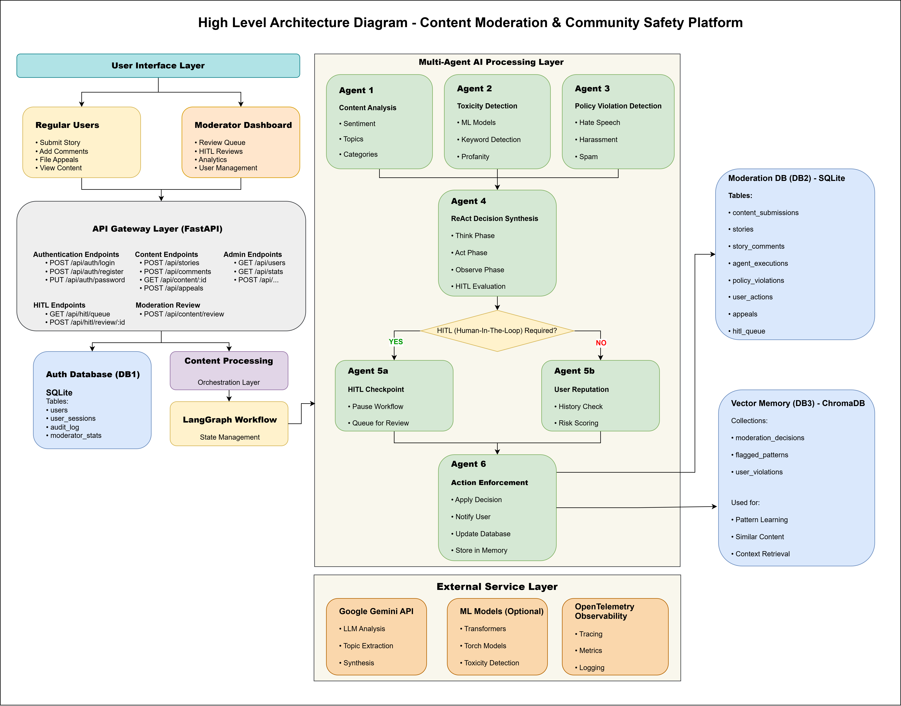
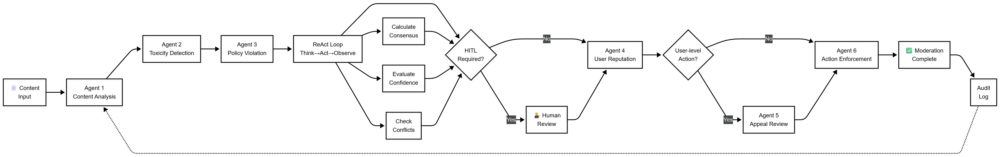

# 🛡️ Content Moderation & Community Safety Platform

**AI-Powered Multi-Agentic Content Moderation System with React Frontend**




## 📖 Table of Contents
- [🎯 Overview](#🎯-overview)
- [⚡ Quick Start](#⚡-quick-start)
- [✨ Features](#✨-features)
- [🏗️ Architecture & Agents](#🏗️-architecture--agents)
- [🧑‍⚖️ Human-in-the-Loop (HITL) System](#🧑‍⚖️-human-in-the-loop-hitl-system)
- [📂 Project Structure](#📂-project-structure)
- [🔧 REST API Endpoints](#🔧-rest-api-endpoints)
- [🛠️ Technology Stack](#🛠️-technology-stack)
- [🎓 Project Highlights & Learning Outcomes](#🎓-project-highlights--learning-outcomes)
- [📈 Use Cases](#📈-use-cases)
- [🎓 Skills Demonstrated](#🎓-skills-demonstrated)
- [🔧 Troubleshooting](#🔧-troubleshooting)
- [🗑️ Database Cleanup](#🗑️-database-cleanup)
- [📝 Resume Talking Points](#📝-resume-talking-points)

## 🎯 Overview

An enterprise-grade content moderation system that automates content safety using a Multi-Agentic AI Architecture powered by Google Gemini free-tier LLM API and LangGraph.

The system processes user-generated content through 6 specialized AI agents using a ReAct (Reason-Act) Decision Loop. It features a **Fast Mode** for high-volume comments and a comprehensive Human-in-the-Loop (HITL) workflow, allowing human moderators to review low-confidence or high-severity decisions.

The platform includes a full-stack React web application serving six distinct user roles:
- **Users (Community Members):** Submit stories and comments, view content, file appeals
- **Moderators:** Review content, approve/warn/remove, basic moderation actions
- **Senior Moderators:** All moderator permissions + HITL queue review, escalations, user suspensions
- **Content Analysts:** View analytics, analyze patterns and trends, export reports
- **Policy Specialists:** Handle appeals, policy violations, user bans
- **Admins:** Full system access, user management, system configuration

## ⚡ Quick Start

### Prerequisites

- **Python 3.12 or higher** (for backend) ([Get one here](https://www.python.org/downloads/))
- **Node.js 18+ and npm** (for frontend) ([Get one here](https://nodejs.org/en/download))
- **Git Installed** ([Get one here](https://git-scm.com/install/))
- **Google Gemini API Key (free-tier)** ([Get one here](https://aistudio.google.com/app/apikey))


### Backend Setup (In one terminal)

**Step 1: Clone the repository and open it in VS Code (or any IDE/terminal of your choice)**

If you're using VS Code, you can split the terminal and run both the backend and frontend side-by-side in one window.


```bash
git clone https://github.com/genieincodebottle/generative-ai.git
cd generative-ai\genai-usecases\agentic-ai\content-moderation-system\backend
```

**Step 2: Install Python dependencies**
```bash
pip install uv
uv pip install -r requirements.txt
```

**Step 3: Set up your Google API Key**

Create a `.env` file in the backend folder:
```bash
cp .env.example .env
# Edit .env and add your API key
```

Your `.env` file should contain:
```env
GOOGLE_API_KEY=your_google_gemini_api_key_here

# Optional: Enable ML-based toxicity detection
USE_ML_MODELS=false  # Set to true to enable HateBERT/DistilBERT models
ML_PRIMARY_MODEL=distilbert_toxic
ML_USE_ENSEMBLE=false
ML_PRELOAD_MODELS=true
ML_DEVICE=auto  # auto, cpu, cuda, or mps (Apple Silicon)

# Optional: Enable Fast Mode for comments
ENABLE_FAST_MODE=true  # Set to true to enable fast mode
FAST_MODE_MAX_LENGTH=200  # Max characters for fast mode eligibility
FAST_MODE_CONTENT_TYPES=story_comment  # Content types eligible for fast mode
```

**Step 4: Initialize the database and create demo users**
```bash
python scripts/initialize_users.py
```

**Step 5: Start the API server**
```bash
python main.py
```

The API will be available at `http://localhost:8000`

### Frontend Setup (In the different terminal)

**Step 1: Install Node dependencies**
```bash
cd content-moderation-system\frontend
npm install
```

**Step 2: Start the development server**
```bash
npm run dev
```

The frontend will be available at `http://localhost:5173`

### Access the Application

1. **Backend API**: http://localhost:8000
2. **Frontend**: http://localhost:5173

**Default Login**: After starting the frontend, you'll see a login screen with:
- **Sign In / Register** tabs for user authentication
- **Content Moderation Flow** diagram showing the 5-step process
- Option to register as a new user or login with demo accounts

### Demo User Accounts

The system includes several pre-configured demo accounts with different roles:

<details>
<summary><strong>Click to view accounts</strong></summary>

| Username | Password | Role | Full Name | Access Level |
|----------|----------|------|-----------|-------------|
| `admin` | `admin123` | Admin | Admin User | Full system access, user management, analytics |
| `moderator1` | `mod@123` | Moderator | Moderator One | Moderation dashboard with HITL queue, content review |
| `moderator2` | `mod@123` | Moderator | Moderator One | Moderation dashboard with HITL queue, content review |
| `senior_mod` | `senior@123` | Senior Moderator | Senior Moderator | Moderation, escalations, user suspensions, analytics |
| `analyst` | `analyst@123` | Content Analyst | Content Analyst | Analytics, patterns, trends, reports |
| `policy_expert` | `policy@123` | Policy Specialist | Policy Expert | Appeals review, policy violations |
| `raj` | `test@123` | User | Raj User | Create stories, comment, submit appeals |
| `priya` | `test@123` | User | Test User | Create stories, comment, submit appeals |
| `amit` | `test@123` | User | Test User | Create stories, comment, submit appeals |

**New Users**: You can register new accounts through the registration form. New users are created with the "user" role by default.

**Password Reset**: If you forget your password, contact the admin or reset it directly in the database using the `initialize_users.py` script.
</details>

## ✨ Features

Click to view each

<details>
<summary><strong>Backend AI System</strong></summary>

| Feature                              | Details                                         |
|--------------------------------------|-------------------------------------------------|
| 🤖 **Multi-Agentic Architecture**    | 6 Specialized AI agents working collaboratively |
| ⚡ **Fast Mode**             | Optimized single-pass moderation for short comments (1-2 seconds vs 6-12 seconds) |
| 🧠 **ReAct Decision Loop**           | Think-Act-Observe pattern for synthesizing agent decisions |
| 🧑‍⚖️ [**Human-in-the-Loop (HITL)**]((https://medium.com/@raj-srivastava/why-agent-assist-human-in-the-loop-is-usually-smarter-than-fully-automated-agentic-ai-bb4e022684a7))      | Configurable interrupt points for human review |
| 📋 **Priority Review Queue**         | Smart prioritization of [HITL (Human-In-The-Loop)](https://medium.com/@raj-srivastava/why-agent-assist-human-in-the-loop-is-usually-smarter-than-fully-automated-agentic-ai-bb4e022684a7) reviews (critical/high/medium/low) |
| 🔍 **ML-Powered Toxicity Detection** | Transformer based models (HateBERT, DistilBERT) or keyword-based detection |
| ⚖️ **Policy Enforcement**            | Automated checking against community guidelines |
| 👤 **User Reputation System**        | Dynamic reputation scoring and risk assessment |
| 📝 **Appeal Workflow**               | Automated appeal review process with HITL support |
| 🎯 **Smart Action Enforcement**      | Content removal, warnings, suspensions, and bans |
| 💾 **Complete Audit Trail**          | Dual SQLite databases stored in databases/ folder: moderation_data.db (content/decisions) and moderation_auth.db (users/auth) - (You can modify to use any other DB) |
| 🧠 **Memory & Learning**             | ChromaDB vector store learns from moderation patterns |
| 📊 **REST API**                      | FastAPI backend with comprehensive endpoints |
| 🔄 **Real-time Processing**          | Instant content analysis with AI workflow pause/resume |
| ⏸️ **Workflow Interrupts**           | Pause workflows for human input, resume automatically |
</details>


<details>
<summary><strong>Frontend Web Application</strong></summary>

| Feature                              | Details                                         | 
|--------------------------------------|-------------------------------------------------|
| ⚛️ **React + Vite**                 | Modern, fast frontend development |
| 🎨 **Material-UI (MUI)**            | Professional, responsive UI components |
| 🏠 **Community Dashboard**          | Main landing page with widget-based architecture (featured stories, community stats, user stats, guidelines) |
| 📖 **Stories Platform**             | Users can create and share stories (moderated before publishing) |
| 💬 **Comments System**              | Users can comment on stories (with real-time moderation) |
| 🔐 **Role-Based Access Control**    | Separate interfaces for users, moderators, analysts, and admins (6 distinct roles) |
| 🔑 **Authentication System**        | User registration, login, and password management |
| 📊 **Moderation Dashboard**         | Integrated HITL (Human-in-the-Loop) review queue with real-time statistics and pending reviews |
| 🔍 **Content Review Interface**     | Detailed review page with AI analysis, toxicity scores, and one-click moderation actions |
| 📈 **Analytics Dashboard**          | Charts, trends, and insights with Recharts |
| 📮 **Appeals Management**           | Interface for users to submit appeals and moderators to review |
| 👥 **User Management**              | Admin interface for CRUD operations on user accounts (create, edit, delete, role changes) |
| 🧩 **Custom Hooks**                 | Reusable data fetching hooks (useStories, useUserStories, useStoryStats, etc.) |
| 📦 **Widget Architecture**          | Modular, reusable UI components for consistent design |
</details>

<details>
<summary><strong>Advanced Features</strong></summary>

#### 🛡️ Guardrails System
- **Loop Detection** - Prevents infinite reasoning loops (max 10 iterations)
- **Hallucination Detection** - Identifies contradictions and unsupported claims in AI decisions
- **Cost Budget Tracking** - Monitors and limits API costs (configurable budget)
- **Consistency Checking** - Ensures agent decisions don't contradict each other
- **Confidence Adjustment** - Automatically reduces confidence when hallucinations detected

#### 🧠 Learning System
- **Episodic Memory** - Stores individual moderation decisions for learning
- **Semantic Memory** - Learns generalized patterns from outcomes
- **Success Rate Tracking** - Monitors decision quality per agent
- **Pattern Recognition** - Identifies which actions work best in specific contexts
- **Adaptive Thresholds** - Learns optimal toxicity/policy thresholds over time
</details>

## 🏗️ Architecture & Agents
The system uses a LangGraph based StateGraph to manage the flow of data between agents.

#### The Agent Workflow

- **Content Analysis Agent:** Extracts topics, sentiment, and media type.
- **Toxicity Agent:** Scores content (0-1) using ML models or keywords.
- **Policy Agent:** Maps content against community guidelines (Spam, Hate Speech, etc.).
- **Reputation Agent:** Checks user history; adjusts risk score based on past violations.
- **Decision Synthesis:** The ReAct loop aggregates all insights.
- **Enforcement Agent:** Executes the action (Ban, Remove, Warn, Approve).

<details>
<summary><strong>View Detailed Agent Specs</strong></summary>

- **Guardrails:** Loop detection (max 10 steps), hallucination checks, and cost budgeting.
Memory:

- **Episodic:** Stores individual decisions.
- **Semantic:** Learns generalized patterns from outcomes.
- **Fast Mode:** A bypass lane for content <200 chars. It skips the multi-agent debate for a single, comprehensive LLM check, reducing cost by ~87%.
</details>
<br/>




## 🧑‍⚖️ Human-in-the-Loop (HITL) System

AI isn't perfect. The system automatically pauses the workflow and flags content for human review based on specific triggers.
Priority Levels:

- 🔴 Critical: Legal concerns, severe toxicity.
- 🟠 High: High-profile user (10k+ followers), conflicting agent signals.
- 🟡 Medium: Potential false positives.
- 🟢 Low: Low confidence scores (<70%).

#### The Workflow:

1. Agents analyze content.
2. Trigger detected (e.g., Confidence = 0.65).
3. State saved -> Added to HITL (Human-In-The-Loop) Queue.
4. Moderator logs in, views "AI Reasoning," and clicks Approve or Remove.
5. Workflow resumes, executing the human's decision and updating Agent Memory.


## 📂 Project Structure

```
content-moderation-system/
├── backend/
│   ├── databases/                 # SQLite & ChromaDB storage
│   ├── src/
│   │   ├── agents/                # AI Agent definitions & LangGraph workflow
│   │   ├── core/                  # Pydantic models & Schemas
│   │   ├── ml/                    # HateBERT/DistilBERT classifiers
│   │   └── memory/                # Vector store logic
│   ├── main.py                    # FastAPI entry point
│   └── scripts/                   # Data initialization tools
│
├── frontend/
│   ├── src/
│   │   ├── components/
│   │   │   ├── Dashboard/         # Moderator HITL Queue
│   │   │   ├── ContentReview/     # Detailed Review Interface
│   │   │   ├── Analytics/         # Charts & Graphs
│   │   │   └── Stories/           # User Facing Feed
│   │   ├── services/              # API Axios instances
│   │   └── store/                 # Zustand state management
│   │   └── App.jsx                # Main app with protected routing
│   ├── package.json               # Node dependencies
│   └── vite.config.js             # Vite configuration
├── .gitignore                     # Git ignore file
└── README.md                      # This file
```

## 🔧 REST API Endpoints

<details>
<summary><strong>Click to view key endpoints</strong></summary>

### Content & Moderation
- POST /api/content/submit - Submit content (Trigger workflow)
- GET /api/stories - Fetch approved stories
- POST /api/stories/{id}/comments - Comment (triggers Fast Mode)

### HITL & Review
- GET /api/hitl/queue - Fetch pending reviews (sorted by priority)
- GET /api/hitl/review/{id} - Get full review packet (AI reasoning + user stats)
- POST /api/hitl/review/{id} - Submit human decision (Resumes workflow)

### Analytics & Users
- GET /api/analytics/trends - Moderation stats over time
- GET /api/auth/users - User management (Admin only)
</details>

## 🛠️ Technology Stack

<details>
<summary><strong>Click to view stack</strong></summary>

### Backend
| Component | Technology | Purpose |
|-----------|------------|---------|
| **AI Framework** | LangChain + LangGraph | Multi-agent orchestration |
| **LLM & Embedding Model** | Google Gemini | AI reasoning and decision-making & Embedding Model|
| **ML Models** | HateBERT, DistilBERT (optional) | ML-based toxicity detection |
| **Web Framework** | FastAPI | REST API backend |
| **Database** | SQLite | Persistent storage |
| **Vector Store** | ChromaDB | Memory and pattern learning |
| **State Management** | LangGraph StateGraph | Workflow state tracking |
| **Authentication** | JWT + HTTPBearer | Secure API access |

### Frontend
| Component | Technology | Purpose |
|-----------|------------|---------|
| **Framework** | React 18 | UI framework |
| **Build Tool** | Vite | Fast development and building |
| **UI Library** | Material-UI (MUI) v5 | Component library |
| **Routing** | React Router v6 | Client-side routing |
| **State Management** | Zustand | Lightweight state management |
| **HTTP Client** | Axios | API communication |
| **Charts** | Recharts + MUI X-Charts | Data visualization |

### DevOps & Tools
| Component | Technology | Purpose |
|-----------|------------|---------|
| **Python** | 3.12+ | Backend runtime |
| **Node.js** | 18+ | Frontend runtime |
| **Package Management** | pip, npm | Dependency management |
</details>

## 🎓 Project Highlights & Learning Outcomes

This project was built to demonstrate advanced Full-Stack and AI Engineering capabilities:

- **Agentic Patterns:** Implementation of Multi-Agent Systems and ReAct reasoning loops, moving beyond simple chatbot wrappers.
- **Hybrid Intelligence:** Designing a Human-in-the-Loop architecture that balances AI speed with human nuance.
- **Production Considerations:** Features like Fast Mode (latency optimization), Cost Budgeting, and Guardrails against hallucination.
- **Complex State Management:** handling asynchronous workflow pauses/resumes in the backend and syncing real-time status updates to the React frontend.
- **Role-Based Security:** Implementing a secure, JWT-based auth system with granular permission controls across 6 user roles.

## 📈 Use Cases

This system is ideal for:

- 🐦 **Social Media Platforms** (Twitter, Reddit, Discord)
- 💬 **Community Forums** (Discussion boards, Q&A sites)
- 🎮 **Gaming Platforms** (Chat moderation, user reports)
- 📺 **Video Platforms** (YouTube comments, live chat)
- 💼 **Enterprise Collaboration** (Slack, Teams, internal forums)
- 📱 **Mobile Apps** (User-generated content moderation)

## 🎓 Skills Demonstrated

For freshers/candidates, this project showcases:

### Backend
- **Multi-Agent AI Systems** - Understanding of agent-based architecture
- **LangGraph & LangChain** - AI orchestration frameworks
- **ReAct Pattern** - Think-Act-Observe reasoning loops
- **Human-in-the-Loop (HITL)** - Hybrid AI-human decision systems
- **Workflow Orchestration** - Conditional routing, state management
- **NLP & Content Analysis** - Toxicity detection, sentiment analysis
- **ML Integration** - Optional transformer models (HateBERT, DistilBERT)
- **FastAPI Development** - Modern Python web frameworks
- **Database Design** - SQL schema design and optimization
- **Vector Databases** - ChromaDB for semantic search
- **AI Ethics** - Content moderation, bias mitigation
- **System Design** - Scalable, production-ready architecture
- **API Development** - RESTful API design with authentication

### Frontend
- **React Development** - Modern React 18 with hooks
- **Material-UI** - Professional component library usage
- **State Management** - Zustand for global state
- **Routing** - React Router v6 with protected routes
- **API Integration** - Axios with authentication headers
- **Data Visualization** - Charts and analytics with Recharts
- **Responsive Design** - Mobile-friendly UI components
- **Role-Based Access Control** - Frontend authorization

### Full-Stack Skills
- **End-to-End Development** - Complete application from API to UI
- **Authentication & Authorization** - JWT-based security
- **Real-time Updates** - Dynamic status tracking
- **User Experience** - Intuitive interfaces for different user roles

## 🔧 Troubleshooting

- ### ML Models not loading?
  Ensure USE_ML_MODELS=true is set in .env and you have installed torch: pip install torch transformers. Restart the server after changing these settings.
- ### Flagged stories not appearing?
  Users see them in "My Stories" (under review). Moderators see them in the "Moderation Dashboard" tab, not the main feed.
- ### Database Locked?
  Since SQLite is a file-based DB, ensure you don't have the database file open in a viewer while the server is trying to write to it.

## 🗑️ Database Cleanup

If you need to reset all data and start fresh, use the cleanup script:

### Full Database Reset

**⚠️ WARNING**: This will permanently delete ALL data including:
- All content (stories, comments)
- All moderation decisions and appeals
- All user accounts and sessions
- ChromaDB vector store with historical patterns

**Steps:**

```bash
cd content-moderation-system\backend
python scripts\cleanup_data.py
```

The script will:
1. Prompt for confirmation (type `DELETE ALL` to proceed)
2. Clean moderation database tables:
   - content_submissions
   - agent_executions
   - final_decisions
   - appeals
   - manual_reviews
   - user_profiles
   - moderation_history
   - stories
   - story_comments
3. Clean authentication database tables:
   - users
   - user_sessions
4. Remove ChromaDB vector store (`databases/chroma_moderation_db/`)

**After cleanup, reinitialize users:**

```bash
python scripts\initialize_users.py
```

This will recreate the default demo accounts:
- **Users**: raj, priya, amit (password: `test@123`)
- **Moderators**: moderator1, moderator2 (password: `mod@123`)
- **Senior Moderators**: senior_mod, hitl_reviewer (passwords: `senior@123`, `hitl@123`)
- **Content Analyst**: analyst (password: `analyst@123`)
- **Policy Specialists**: policy_expert, appeals_handler (passwords: `policy@123`, `appeals@123`)
- **Admin**: admin (password: `admin@123`)

**Then restart the backend server:**

```bash
python main.py
```

### Partial Cleanup (Manual)

If you only want to clean specific data:

**Clean only content (keep users):**
```sql
-- Connect to databases/moderation_data.db
DELETE FROM content_submissions;
DELETE FROM stories;
DELETE FROM story_comments;
DELETE FROM agent_executions;
DELETE FROM appeals;
```

**Clean only sessions (keep users):**
```sql
-- Connect to databases/moderation_auth.db
DELETE FROM user_sessions;
```

**Clean only ChromaDB:**
```bash
# Delete the directory
rm -rf databases\chroma_moderation_db
# Or on Windows:
rmdir /s /q databases\chroma_moderation_db
```

---

## 📝 Resume Talking Points

> Developed a **full-stack content moderation platform** with a **multi-agent AI backend** powered by **Google Gemini and LangGraph**, and a **React frontend** using **Material-UI**. Implemented **specialized AI agents** with **ReAct Decision Loop** and **Human-in-the-Loop (HITL) checkpoints** for intelligent content moderation. Built the Think-Act-Observe reasoning pattern for synthesizing agent decisions with configurable consensus thresholds.
>
> Created a **Moderation Dashboard with integrated HITL review queue** that allows human reviewers to approve/reject AI decisions with detailed explanations. The workflow automatically pauses for human input on low-confidence or high-severity cases, then resumes processing. Implemented priority-based queuing and comprehensive appeals management system for users to contest moderation decisions.
>
> Developed a complete **React web application** with role-based access control (6 distinct roles), featuring a **Community Dashboard** as the main landing page with widget-based architecture, **Content Review Interface** for HITL moderation, and **Analytics Dashboards** for admins. Built user management system with registration, authentication, password updates, and admin CRUD operations. Integrated **ML-based toxicity detection** using HateBERT and DistilBERT transformers, with fallback to keyword-based detection.
>
> Built with **FastAPI backend** and **React + Vite frontend**, using **SQLite** for dual-database architecture (auth and moderation data), **ChromaDB** for vector storage, **Zustand** for state management, and **Recharts** for data visualization. The system processes content in real-time with complete audit trails, explainable AI decisions, and professional UI/UX including custom hooks for data fetching and reusable widget components."
