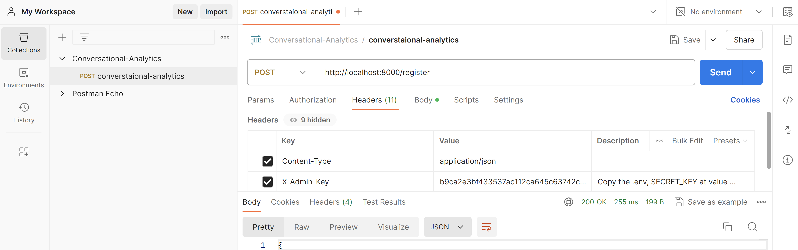
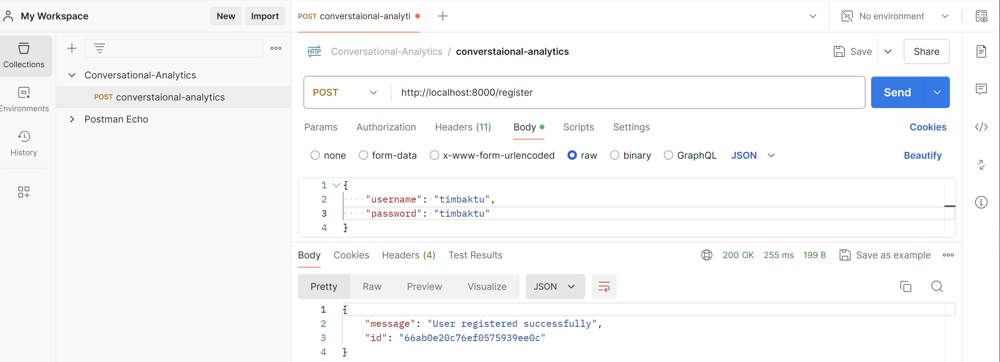
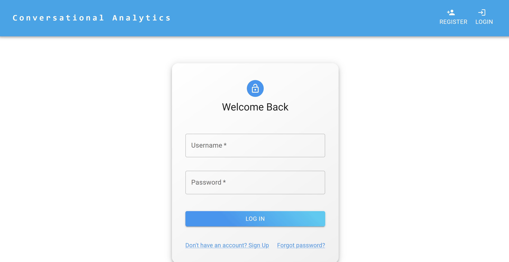
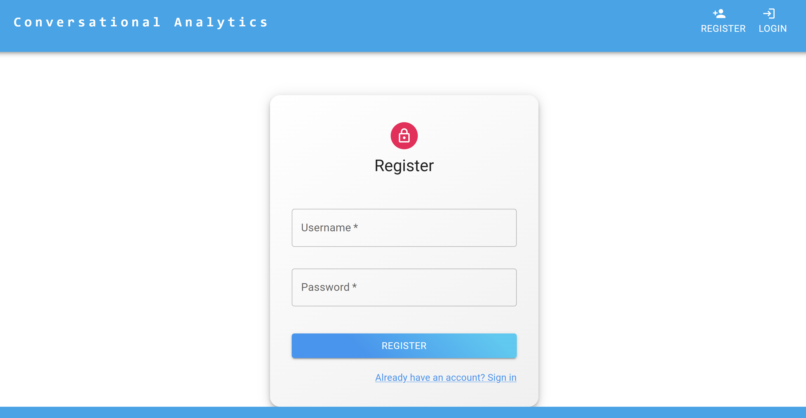
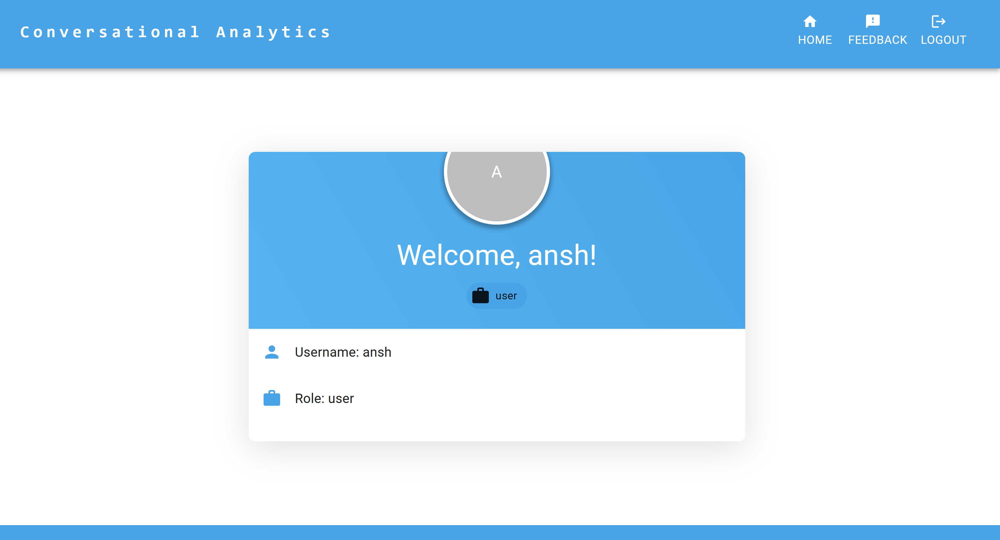
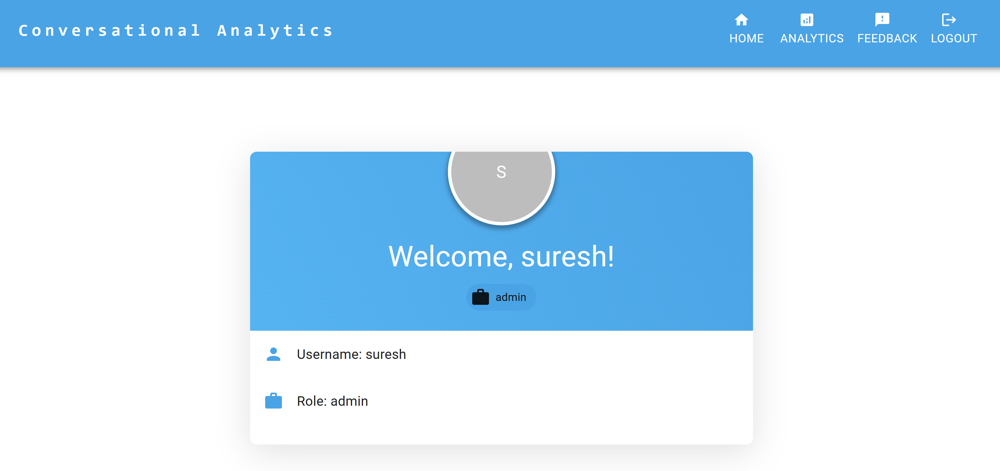
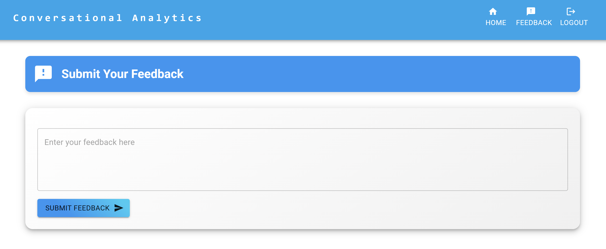
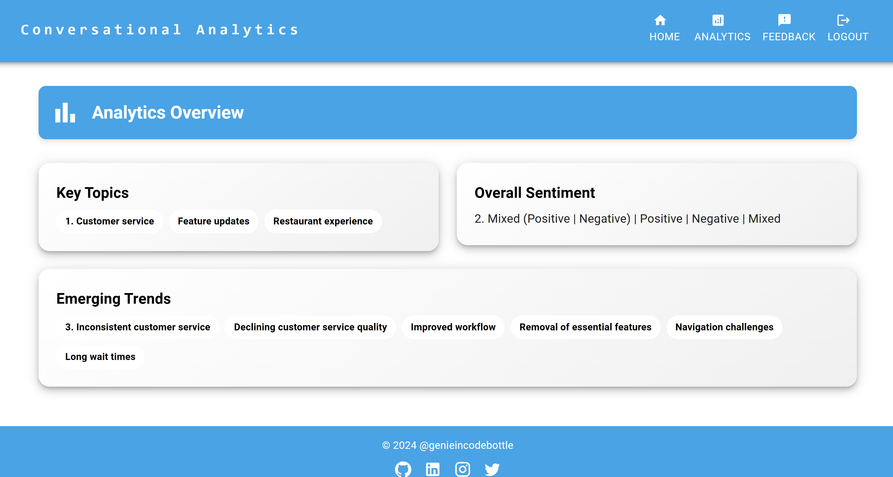
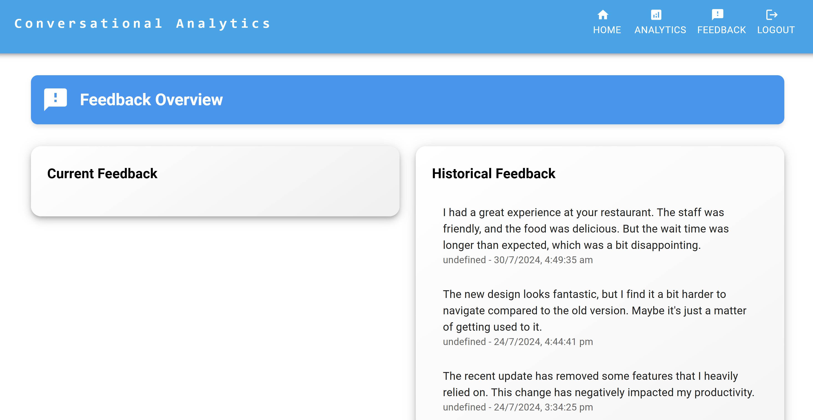

# Conversational Analytics - Full Stack GenAI App

A full-stack Generative AI application that analyzes customer feedback to automatically detect **Key Topics**, **Overall Sentiment**, and **Emerging Trends** using LLMs (Groq or Google Gemini).

## YouTube Tutorial
[](https://www.youtube.com/watch?v=fzkM-qkibpM)

---

## How It Works

**Customer Feedback:**
> I reached out for help with my account, and the support team was very responsive and helpful. I appreciate their quick assistance, but it would be helpful to have more self-service options available.

**AI-Generated Analytics:**
| Metric | Result |
|---|---|
| Key Topics | Account support |
| Overall Sentiment | Mixed (Positive \| Negative) |
| Emerging Trends | Limited self-service options |

---

## Key Features

- Real-time sentiment analysis using LLMs
- Topic detection and categorization
- Trend identification and tracking
- Role-based access control (Admin and User roles)
- Dual LLM support — **Groq (primary)** and **Google Gemini (secondary)**

---

## Tech Stack

| Layer | Technology |
|---|---|
| Frontend | React 18, TypeScript, Material-UI v5 |
| Backend | Python 3.11, FastAPI, LangChain |
| Database | MongoDB (runs inside Docker — no separate install needed) |
| LLM (Primary) | Groq API (free) — Llama 3.3 70B |
| LLM (Secondary) | Google Gemini API (free) — Gemini 2.0 Flash |
| Auth | JWT (JSON Web Tokens) with bcrypt password hashing |
| Containerization | Docker & Docker Compose |

---

## Project Structure

```
conversational-analytics/
├── backend/
│   ├── auth.py                 # JWT authentication & user management
│   ├── main.py                 # FastAPI app, LLM chain, API routes
│   ├── requirements.txt        # Python dependencies
│   └── Dockerfile
├── frontend/
│   ├── public/
│   └── src/
│       ├── components/
│       │   ├── AnalyticsDisplay.tsx   # Admin analytics dashboard
│       │   ├── FeedbackDisplay.tsx    # Current & historical feedback
│       │   ├── FeedbackForm.tsx       # Submit feedback form
│       │   ├── Header.tsx             # Navigation bar
│       │   ├── Footer.tsx             # Footer with social links
│       │   ├── Home.tsx               # User profile page
│       │   ├── Login.tsx              # Login page
│       │   ├── PrivateRoute.tsx       # Route guard
│       │   └── Register.tsx           # Registration page
│       ├── App.tsx             # Main app with routing
│       ├── index.tsx           # React entry point
│       └── types.ts            # TypeScript interfaces
├── images/                     # Screenshots
├── .env.example                # Environment template (copy to .env)
├── docker-compose.yml          # Docker services config
├── secret_key_generation.py    # Utility to generate SECRET_KEY
├── Conversational-Analytics.postman_collection.json  # Postman API collection
└── README.md
```

---

## Prerequisites

Before you start, install these on your system:

1. **Git** — [Download here](https://git-scm.com/downloads)
2. **Docker Desktop** — [Download here](https://docs.docker.com/engine/install/)
   - After installing, make sure Docker Desktop is **running**
3. **One free LLM API key** (choose one):
   - **Groq (recommended)** — [Get free key](https://console.groq.com/keys) — Sign up, create an API key
   - **Google Gemini** — [Get free key](https://aistudio.google.com/app/apikey)
4. **Postman** (optional, for creating admin user) — [Download here](https://www.postman.com/downloads/)
   - You can also use the `curl` command instead of Postman

---

## Step-by-Step Setup

### Step 1: Clone the Repository

```bash
git clone https://github.com/genieincodebottle/generative-ai.git
cd generative-ai/genai-usecases/conversational-analytics
```

### Step 2: Create the `.env` File

Copy the example file and rename it:

**Windows (Command Prompt):**
```bash
copy .env.example .env
```

**Mac/Linux:**
```bash
cp .env.example .env
```

### Step 3: Generate a Secret Key

Run this Python script to generate a secure key for admin user creation:

```bash
python secret_key_generation.py
```

Copy the output (a long hex string) and paste it into your `.env` file as:
```
SECRET_KEY=<paste_the_generated_key_here>
```

### Step 4: Add Your LLM API Key

Open the `.env` file and update it:

**Option A — Using Groq (Recommended / Primary):**
```env
LLM_PROVIDER="groq"
GROQ_API_KEY="your_groq_api_key_here"
```

**Option B — Using Google Gemini:**
```env
LLM_PROVIDER="gemini"
GOOGLE_API_KEY="your_gemini_api_key_here"
```

Your final `.env` file should look like this (example with Groq):
```env
LLM_PROVIDER="groq"
GROQ_API_KEY="gsk_xxxxxxxxxxxxxxxx"
GOOGLE_API_KEY="XXXXXX"
MONGODB_URI="mongodb://mongo:27017/"
SECRET_KEY="your_generated_secret_key"
```

### Step 5: Build and Run with Docker

Make sure Docker Desktop is running, then execute:

```bash
docker-compose up --build
```

Wait for all 3 services to start (frontend, backend, mongo). You'll see logs from all three.

> First build takes a few minutes as it downloads dependencies.

### Step 6: Create an Admin User

Normal users can register via the UI, but **admin users** must be created via API call.

**Option A — Using curl:**
```bash
curl --location "http://localhost:8000/register" \
--header "Content-Type: application/json" \
--header "X-Admin-Key: YOUR_SECRET_KEY_FROM_ENV" \
--data "{\"username\": \"admin\", \"password\": \"admin123\"}"
```

Replace `YOUR_SECRET_KEY_FROM_ENV` with the actual SECRET_KEY from your `.env` file.

**Option B — Using Postman:**
1. Import the `Conversational-Analytics.postman_collection.json` file into Postman
2. Open the "Register Admin" request
3. Go to **Headers** tab → update `X-Admin-Key` with your `SECRET_KEY`
4. Go to **Body** tab → set your admin username & password
5. Click **Send**

Screenshots:


<br>


### Step 7: Access the Application

| Service | URL |
|---|---|
| Frontend (UI) | http://localhost:3000 |
| Backend (API) | http://localhost:8000 |
| API Docs (Swagger) | http://localhost:8000/docs |

---

## How to Use

### As a Regular User:
1. Go to http://localhost:3000/register and create an account
2. Login with your credentials
3. Go to **Feedback** → type your feedback and submit

### As an Admin:
1. Login with the admin account you created in Step 6
2. Go to **Feedback** → view all user feedback
3. Go to **Analytics** → see AI-generated insights (topics, sentiment, trends)

---

## User Roles

| Role | Can Do |
|---|---|
| **User** | Register, login, submit feedback, view own feedback |
| **Admin** | Everything above + view all feedback + access Analytics dashboard |

---

## Stopping & Cleanup

**Stop the application:**
```bash
# Press Ctrl+C in the terminal, or run:
docker-compose down
```

**Stop and remove all data (including database):**
```bash
docker-compose down -v
```

**Rebuild after code changes:**
```bash
docker-compose up --build
```

---

## Switching LLM Provider

You can switch between Groq and Gemini anytime:

1. Edit your `.env` file:
   ```env
   LLM_PROVIDER="gemini"   # or "groq"
   ```
2. Rebuild the backend:
   ```bash
   docker-compose up --build backend
   ```

### Supported Models

| Provider | Model | Notes |
|---|---|---|
| Groq (primary) | llama-3.3-70b-versatile | Fast inference, free tier available |
| Gemini (secondary) | gemini-2.0-flash | Google's free-tier model |

---

## Troubleshooting

| Problem | Solution |
|---|---|
| Docker build fails | Ensure Docker Desktop is running. Try `docker-compose down` then `docker-compose up --build` |
| "GROQ_API_KEY not set" error | Check your `.env` file has the correct key, or switch `LLM_PROVIDER` to `gemini` |
| "GOOGLE_API_KEY not set" error | Check your `.env` file has the correct key, or switch `LLM_PROVIDER` to `groq` |
| Frontend not loading | Wait 1-2 minutes for the build to complete. Check Docker logs for errors |
| Can't create admin user | Ensure the `X-Admin-Key` header matches the `SECRET_KEY` in your `.env` file exactly |
| Analytics page is empty | Submit some feedback first as a regular user, then check analytics as admin |
| Port 3000/8000 already in use | Stop other services using those ports, or change ports in `docker-compose.yml` |

---

## Screenshots

1. **Login**<br>


2. **Register**<br>


3. **User Home Page**<br>


4. **Admin Home Page**<br>


5. **User Feedback**<br>


6. **Analytics Dashboard**<br>


7. **Feedback Details**<br>


---

Happy Coding!
