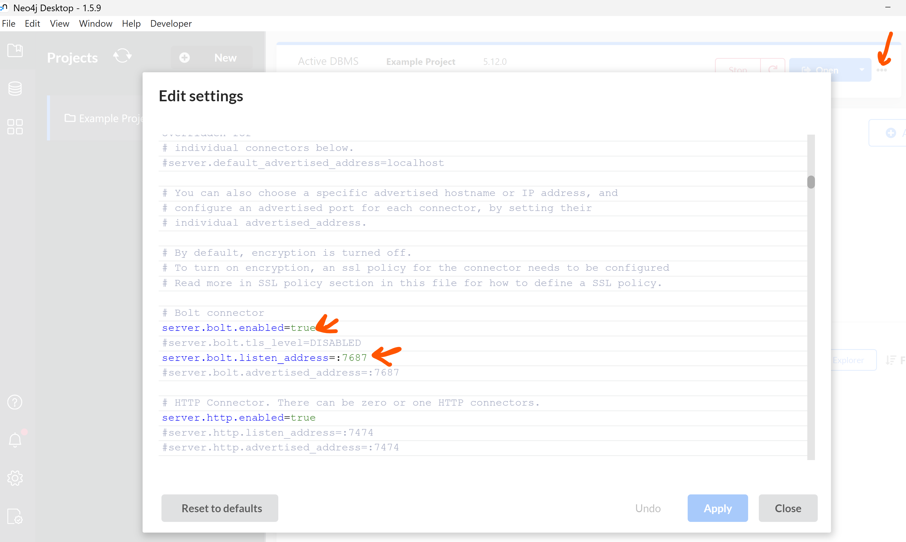

## Graph Database-Powered Q&A Chatbot

This app connects a Neo4j graph database to a Gemini LLM via LangChain to enable natural language Q&A over a **graph schema**. It uses the **default Neo4j Movie database** as its dataset.

🎥 YouTube Video:  Walkthrough on setup and running the app

[](https://www.youtube.com/watch?v=PJTxPW5He7w)

### 🎞️ Demo Context

This chatbot uses **Neo4j's built-in Movie Database**, which includes:
- Actors
- Movies
- Directors
- Relationships like `ACTED_IN` and `DIRECTED`

You can ask natural language questions like:
- "Who acted in The Matrix?"
- "List all movies directed by Christopher Nolan."
- "Which actors have worked together in more than one movie?"
- "Give me movies released after 2000 featuring Keanu Reeves."

Or any other information available in the Movie graph database. 

### 🔧 Neo4J GraphDB Installation

#### ✅ Download and Install Neo4j Desktop:
- Visit [neo4j.com/download/](https://neo4j.com/download/)
- Click Download, fill in the registration form.
- Copy the Neo4j Desktop Activation Key.
- Install Neo4j Desktop with default settings.
- Launch the app, accept the license agreement.
- Paste the activation key to activate.

#### ⚙️ Configure Neo4j Database:
- Open Neo4j Desktop → Open the Movie DBMS example project.
- Go to the Plugins tab → Install APOC and restart.
- Go to Details → Click Reset DBMS password and set your new password.

### 🛠️ Setup Instructions

#### ✅ Prerequisites
   - Python 3.10 or higher
   - pip (Python package installer)

#### 📦 Installation & Running App
   1. Clone the repository:
      ```bash
      git clone https://github.com/genieincodebottle/generative-ai.git
      cd genai-usecases\graph-qa
      ```
   2. Open the Project in VS Code or any code editor.
   3. Create a virtual environment by running the following command in the terminal:
      ```bash
      pip install uv #if uv not installed
      uv venv
      .venv\Scripts\activate # On Linux -> source venv/bin/activate
      ```
   4. Create a requirements.txt file and add the following libraries:
      ```
      langchain>=0.3.27
      langchain-community>=0.2.1
      langchain-google-genai>=2.1.8
      neo4j>=5.28.1
      streamlit>=1.47.1
      streamlit-chat>=0.1.1
      python-dotenv==1.1.1
      ```
   5. Install dependencies:
      ```bash
      uv pip install -r requirements.txt
      ```
   6. Configure Environment
      * Rename .env.example → .env
      * Update with your keys:

      ```bash
      GOOGLE_API_KEY=your_key_here # Using the free-tier API Key
      NEO4J_URI="bolt://localhost:7687"
      NEO4J_USERNAME="neo4j"
      NEO4J_PASSWORD="your_new_password"
      ```
      * Get **GOOGLE_API_KEY** here -> https://aistudio.google.com/app/apikey
   7. Code Files Overview
      * `utils.py`: Backend logic - connects to Neo4j, loads env variables, runs LangChain-based Q&A logic.
      * `app.py`: Streamlit-based frontend - user inputs questions, displays answers from the graph DB.
   9. Run the App
   
      `streamlit run app.py`

### ⚠️ Troubleshooting

#### If you see an error like:
```
neo4j.exceptions.ServiceUnavailable: Couldn't connect to localhost:7687 (resolved to ('[::1]:7687', '127.0.0.1:7687')):  
Failed to establish connection to ResolvedIPv6Address(('::1', 7687, 0, 0))
```

#### ✅ Open the Neo4j Desktop dashboard, go to the Settings tab, and verify that the Bolt port (7687) is enabled.

#### 📌 Ensure the following line exists and is not commented out in the settings:
```
dbms.connector.bolt.listen_address=:7687
```


