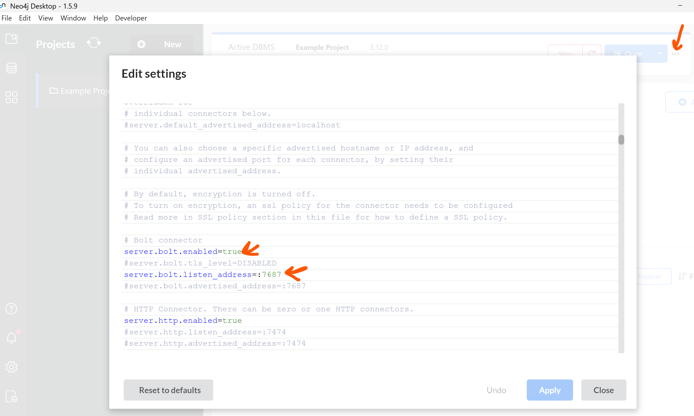

## Graph QA Chatbot — Natural Language Q&A over Neo4j

Ask plain-English questions about a graph database and get answers instantly. The app converts your question into a **Cypher query**, runs it against a **Neo4j** graph database, and returns the result using an LLM.

**Supports two LLM providers** — Groq (primary, fast & free) and Google Gemini (secondary, free tier).

🎥 **YouTube Walkthrough:** Setup and demo

[](https://www.youtube.com/watch?v=PJTxPW5He7w)

---

### Demo Context — Neo4j Movie Database

This chatbot uses **Neo4j's built-in Movie Database**, which includes:
- **Actors**, **Movies**, **Directors**
- Relationships like `ACTED_IN` and `DIRECTED`

**Example questions you can ask:**
- "Who acted in The Matrix?"
- "List all movies directed by Christopher Nolan."
- "Which actors have worked together in more than one movie?"
- "Give me movies released after 2000 featuring Keanu Reeves."

---

### Step 1 — Install & Configure Neo4j

1. Download **Neo4j Desktop** from [neo4j.com/download](https://neo4j.com/download/).
2. Install with default settings and launch it.
3. Paste the **Activation Key** (shown on the download page) to activate.
4. In Neo4j Desktop:
   - Open the **Movie DBMS** example project (comes pre-loaded).
   - Go to **Plugins** tab → Install **APOC** → Restart the database.
   - Go to **Details** → Click **Reset DBMS password** → Set a new password (you'll need this later).
5. Make sure the database is **running** (green status indicator).

> **Troubleshooting:** If you see a connection error like `Couldn't connect to localhost:7687`, open Neo4j Desktop → **Settings** tab and verify this line exists and is **not** commented out:
> ```
> dbms.connector.bolt.listen_address=:7687
> ```
> 

---

### Step 2 — Get API Keys (free)

You need **at least one** API key. Groq is recommended (faster for this use case).

| Provider | Where to get the key | Env variable |
|----------|---------------------|--------------|
| **Groq** (primary) | [console.groq.com/keys](https://console.groq.com/keys) | `GROQ_API_KEY` |
| **Gemini** (secondary) | [aistudio.google.com/app/apikey](https://aistudio.google.com/app/apikey) | `GOOGLE_API_KEY` |

---

### Step 3 — Project Setup

```bash
# Clone the repo and navigate to the project
git clone https://github.com/genieincodebottle/generative-ai.git
cd generative-ai/genai-usecases/graph-qa
```

```bash
# Create and activate a virtual environment
pip install uv          # skip if uv is already installed
uv venv
.venv\Scripts\activate  # Windows
# source .venv/bin/activate  # macOS / Linux
```

```bash
# Install dependencies
uv pip install -r requirements.txt
```

---

### Step 4 — Configure Environment

```bash
# Copy the example env file
cp .env.example .env    # Windows: copy .env.example .env
```

Open `.env` in your editor and fill in your values:

```dotenv
# At least one LLM key is required
GROQ_API_KEY="your_groq_api_key_here"
GOOGLE_API_KEY="your_google_api_key_here"

# Neo4j — update password to match what you set in Step 1
NEO4J_URI="bolt://localhost:7687"
NEO4J_USERNAME="neo4j"
NEO4J_PASSWORD="your_neo4j_password"
```

---

### Step 5 — Run the App

```bash
streamlit run app.py
```

The app opens in your browser. Select a provider and model in the sidebar, then start asking questions!

---

### Project Structure

```
graph-qa/
├── app.py              # Streamlit UI — chat interface & provider selection
├── utils.py            # Backend — Neo4j connection, LLM setup, query chain
├── requirements.txt    # Python dependencies
├── .env.example        # Template for environment variables
└── img/
    ├── globe.png       # Sidebar logo
    └── troubleshoot.png
```

---

### Available Models

| Provider | Models |
|----------|--------|
| **Groq** | `llama-3.3-70b-versatile`, `llama-3.1-8b-instant`, `meta-llama/llama-4-scout-17b-16e-instruct` |
| **Gemini** | `gemini-2.5-flash`, `gemini-2.5-pro`, `gemini-2.0-flash` |

---

### How It Works

```
Your Question (English)
    ↓
LLM converts it to a Cypher query
    ↓
Cypher query runs on Neo4j
    ↓
Results returned and summarized by LLM
    ↓
Answer displayed in chat
```

The magic happens via LangChain's `GraphCypherQAChain` — it reads the Neo4j schema, generates the right Cypher query for your question, executes it, and uses the LLM to format a human-readable answer.
