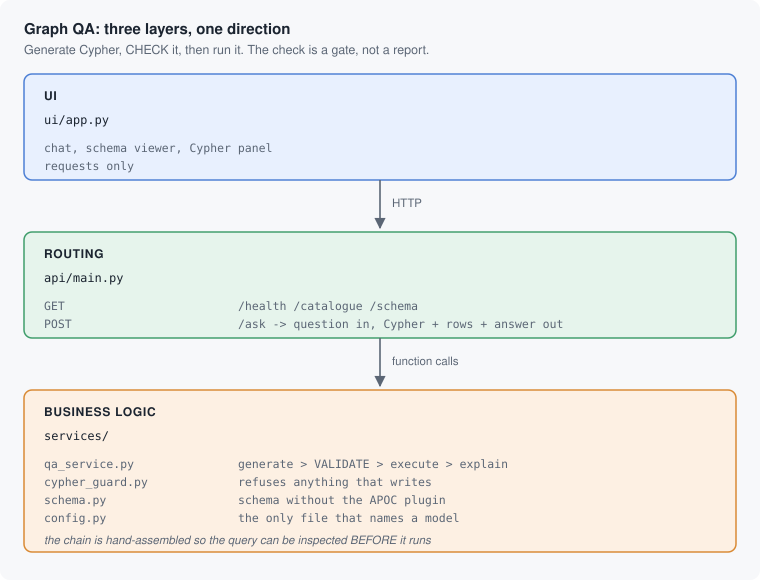

# Graph QA Chatbot

> **Learn how to build this project step-by-step on [AI-ML Companion](https://aimlcompanion.ai/)**. Interactive ML learning platform with guided walkthroughs, architecture decisions, and hands-on challenges.


**Ask a graph questions in English. The model writes Cypher, and the Cypher is
checked before it runs - because "read only" in a prompt is a request, not a
guarantee.**

---

## 1. The problem

`GraphCypherQAChain` is the obvious way to do this, and its constructor tells
you what it costs:

```python
GraphCypherQAChain.from_llm(graph=graph, llm=llm, allow_dangerous_requests=True)
```

The chain will not run without that flag. What the flag means in practice is:
**whatever Cypher the model writes gets executed against your database.** The
chain generates and executes in a single call, so there is no point at which
you can look at the query first.

For a question-answering app the only legitimate output is a read. So this
project does not use that chain. It does the three steps itself:

```
generate Cypher  ->  assert_read_only(cypher)  ->  execute  ->  explain
                     ^ raises here, before the database is touched
```

That is the difference between a gate and a report.

## 2. The shape of it



## 3. The guard, and why it is not just a keyword grep

`services/cypher_guard.py` rejects `CREATE`, `MERGE`, `DELETE`, `DETACH`,
`SET`, `REMOVE`, `DROP`, `LOAD CSV`, `FOREACH`, and the APOC write procedures.
Two details make it usable rather than annoying:

**String literals are stripped before scanning.** A film called *"Set It Off"*
or a person named *"Drop"* would otherwise be refused - a false positive that
rejects a perfectly correct query, which is worse than useless.

```cypher
MATCH (m:Movie {title: 'Set It Off'}) RETURN m     -- allowed
MATCH (m:Movie) SET m.title = 'X' RETURN m         -- refused
```

**Word boundaries, so `SKIP 10` is not read as containing `SET`,** and a write
hidden behind a comment or after a semicolon is still caught.

`tests/test_api.py::TestTheGateNotJustThePrompt` drives the service with a
model that returns `DETACH DELETE` regardless of the prompt, and asserts the
database is never called at all.

## 4. Running without the APOC plugin

Every Neo4j tutorial gives you this:

```bash
docker run -d --name neo4j -p 7474:7474 -p 7687:7687 \
  -e NEO4J_AUTH=neo4j/your-password neo4j:5-community
```

And then the app dies on connect with:

```
Could not use APOC procedures. Please ensure the APOC plugin is installed
```

`Neo4jGraph.refresh_schema()` calls `apoc.meta.data()`. **APOC is a plugin,
and the community image does not ship it.** That is a confusing first failure
for something with nothing to do with the app.

`services/schema.py` builds the schema from procedures that need no plugin -
`db.labels()`, `db.relationshipTypes()`, plus a sampled scan for the
properties each label actually carries. Verified against a stock container:

```
Node labels and their properties:
  Supplier (13 nodes): aliases, created_at, key, name, status, summary, type
  Location (14 nodes): aliases, created_at, key, name, status, summary, type
  ...
Relationships:
  (:Supplier)-[:LOCATED_IN]->(:Location)
```

**No plugins required.**

## 5. Run it

### Clone

```bash
git clone https://github.com/genieincodebottle/generative-ai.git
cd generative-ai/genai-usecases/graph-qa
```

### Set up with uv

```bash
pip install uv

uv venv
source .venv/bin/activate      # Linux / macOS
# .venv\Scripts\activate       # Windows PowerShell or cmd

uv pip install -r requirements.txt
```

Python 3.10+.

### Start a graph

```bash
docker run -d --name neo4j -p 7474:7474 -p 7687:7687 \
  -e NEO4J_AUTH=neo4j/your-password neo4j:5-community
```

Any graph works - the app reads whatever schema is present and shows it to the
model. An empty database answers "the graph has no matching data", which is
correct but dull; load something first. Neo4j's own
[movie dataset](https://neo4j.com/docs/getting-started/appendix/example-data/)
is the usual starting point (`:play movies` in the browser at
<http://localhost:7474>).

### Add keys

```bash
cp .env.example .env           # copy .env.example .env  on Windows
```

| Variable | Where to get it |
|---|---|
| `GOOGLE_API_KEY` | [Google AI Studio](https://aistudio.google.com/app/apikey), free tier |
| `GROQ_API_KEY` | [Groq Console](https://console.groq.com/keys), free tier |
| `NEO4J_URI` / `NEO4J_USERNAME` / `NEO4J_PASSWORD` | your container |

### Start both services

```bash
python run.py
```

```
API   ->  http://localhost:8000/docs
UI    ->  http://localhost:8501
```

### Run the tests

```bash
pytest                         # 41 tests, no API key, no database, no network
```

## 6. The API

| Method | Path | Purpose |
|---|---|---|
| `GET` | `/health` | Configured providers, and whether Neo4j answers |
| `GET` | `/catalogue` | Providers, models, key URLs |
| `GET` | `/schema` | The schema the model is shown when it writes Cypher |
| `POST` | `/ask` | Question in; Cypher, rows and an answer out |

```bash
curl -X POST http://localhost:8000/ask \
  -H 'Content-Type: application/json' \
  -d '{"question":"How many suppliers are in the graph?",
       "provider":"Gemini","model":"gemini-flash-latest"}'
```

```json
{
  "success": true,
  "cypher": "MATCH (s:Supplier)\nRETURN count(s) AS supplier_count",
  "answer": "There are 13 suppliers in the graph.",
  "rows": [{"supplier_count": 13}]
}
```

Real output. The response always carries the Cypher, so you can see what the
model actually asked - which is the interesting part, and the part you need
when an answer looks wrong.

## 7. If something goes wrong

| symptom | cause | fix |
|---|---|---|
| UI says "Cannot reach the API" | Streamlit started on its own | use `python run.py` |
| "Neo4j is not reachable" | no container, or wrong credentials | the message includes the `docker run` command |
| `Could not use APOC procedures` | an older copy of this project | fixed here; `services/schema.py` needs no plugin |
| "No LLM provider configured" | `.env` missing or unfilled | `cp .env.example .env`, add a key, restart the API |
| "contains a write operation" | the model wrote a `DELETE` or similar | working as intended; rephrase the question |
| "does not look like a read query" | the model returned prose, not Cypher | try a clearer question or a stronger model |
| "The graph has no matching data" | your database is empty | load a dataset; `:play movies` in the browser |
| Answers ignore part of the question | one query cannot express it | look at the Cypher in the response; that is the real answer |
| Port already in use | something else has 8000/8501 | `API_PORT=8100 UI_PORT=8600 python run.py` |

## 8. Layout

```
run.py                       starts the API and the UI together
.env.example                 keys and Neo4j settings, with the docker command
.streamlit/config.toml       turns off Streamlit's own start-up advert

ui/app.py                    Streamlit chat. Widgets + requests only.

api/main.py                  4 routes, exception -> status mapping

services/config.py           THE ONLY FILE THAT NAMES A MODEL OR READS THE ENV
services/qa_service.py       generate > VALIDATE > execute > explain
services/cypher_guard.py     THE READ-ONLY GATE
services/schema.py           schema from built-in procedures, no APOC
services/llm_text.py         flattens Gemini 3 content blocks to text

tests/test_cypher_guard.py   reads, writes, string literals, comments, 27 cases
tests/test_api.py            routes, Cypher cleaning, THE GATE TEST, 14 cases
```

## 9. Track modules this covers

`graphDatabases` - `cypher` - `textToQuery` - `knowledgeGraphs` - `llmApps` -
`promptEngineering`

## 10. Honest limitations

- **The guard is a keyword gate over normalised text.** It reliably stops the
  failure that actually happens - the model writing a `DELETE`. It is not a
  Cypher parser, and it is not a substitute for connecting as a **read-only
  Neo4j user**, which is what you would do in production.
- **One question becomes one query.** Anything needing several queries and
  reasoning between them will be answered partially. The returned Cypher shows
  you exactly what was asked, which is the honest way to notice this.
- **The schema goes into every prompt.** On a graph with hundreds of labels
  that is a lot of tokens, and eventually more than fits. Retrieval over the
  schema is the next step.
- **Results are capped at 50 rows** to keep prompts bounded. An aggregate
  question is unaffected; "list everything" is silently truncated.
- **Sampled schema.** Property lists come from up to 100 nodes per label, so a
  property that only appears on rare nodes may be missing from the schema.
- **CORS is wide open** because both halves run on localhost.
