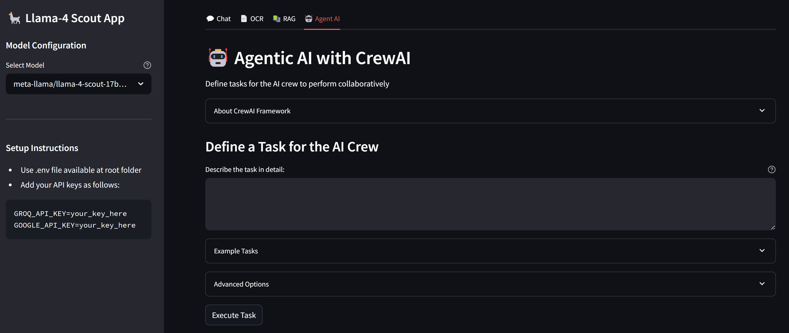

### Llama-4 Scout: All-in-One App for Chat, OCR, RAG & Agentic AI with CrewAI Integration



### 🔗 Dependencies

```bash
streamlit>=1.43.2 
groq>=0.22.0
python-dotenv>=1.1.0
langchain-groq>=0.3.2
langchain-community>=0.0.27
langchain>=0.0.27
python-dotenv>=1.0.0
pypdf>=4.0.0
faiss-cpu>=1.7.4
pillow>=10.2.0
streamlit-chat>=0.1.1
sentence-transformers>=2.2.2
crewai>=0.28.5
crewai-tools>=0.40.1
google-genai>=1.5.0
```

### ⚙️ Setup Instructions

- #### Prerequisites
   - Python 3.9 or higher
   - pip (Python package installer)

- #### Installation
   1. Clone the repository:
      ```bash
      git clone https://github.com/genieincodebottle/generative-ai.git
      cd genai-usecases/llama-4-multi-function-app
      ```
   2. Create a virtual environment:
      ```bash
      python -m venv venv
      venv\Scripts\activate # On Linux -> source venv/bin/activate
      ```
   3. Install dependencies:
      ```bash
      pip install -r requirements.txt
      ```
   4. Rename `.env.example` file to `.env` and updated following API Keys
      ```bash
      GROQ_API_KEY=your_key_here
      GOOGLE_API_KEY=your_key_here # Gemini serves as the fallback model when the primary Llama 4 Scout fails in CrewAI's agent workflow.
      ```

      For **GROQ_API_KEY** follow this -> https://console.groq.com/keys

      For **GOOGLE_API_KEY** follow this -> https://aistudio.google.com/app/apikey

6. Run App
   
   `streamlit run app.py`