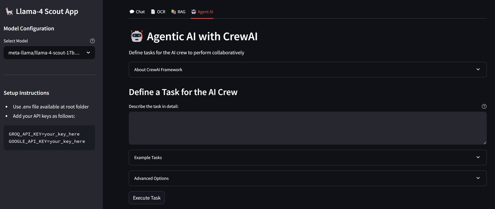

# All-in-One Chat, OCR, RAG & Agentic AI App



A unified Streamlit interface that brings together conversational AI, document OCR, Retrieval-Augmented Generation (RAG), and multi-agent workflows - powered by CrewAI and the multimodal Llama-4 Scout model via Groq.

## Features

| Tab | What it does |
|-----|-------------|
| **Chat** | Conversational AI with Llama 4 Scout multimodal model (text + image) |
| **OCR** | Extract text from images using Llama 4 Scout's vision capabilities |
| **RAG** | Upload PDFs, build a vector index, and ask questions grounded in your documents |
| **Agentic AI** | Multi-agent workflows powered by CrewAI (research, analysis, content generation) |
| **RAG Evaluation** | Evaluate RAG quality using RAGAS metrics (faithfulness, relevance, context precision) |

## API Keys (Both Free-Tier)

| Key | Where to get it | Used for |
|-----|----------------|----------|
| **GROQ_API_KEY** | [console.groq.com/keys](https://console.groq.com/keys) | Primary LLM (Llama 4 Scout) |
| **GOOGLE_API_KEY** | [aistudio.google.com/app/apikey](https://aistudio.google.com/app/apikey) | Fallback LLM for CrewAI + embeddings |

> **Both APIs are free-tier.** No credit card required.

## Setup Instructions

### Prerequisites
- Python 3.10 or higher
- pip (Python package installer)

### Installation

1. Clone the repository:
   ```bash
   git clone https://github.com/genieincodebottle/generative-ai.git
   cd genai-usecases/llama-4-multi-function-app
   ```

2. Create a virtual environment:
   ```bash
   pip install uv    # if uv not installed
   uv venv
   .venv\Scripts\activate    # On Linux/Mac: source .venv/bin/activate
   ```

3. Install dependencies:
   ```bash
   uv pip install -r requirements.txt
   ```
   > **Note:** This installs ~50 packages including CrewAI, RAGAS, sentence-transformers, and FAISS. First install may take 5-10 minutes.

4. Set up environment variables:
   ```bash
   cp .env.example .env
   ```
   Edit `.env` and add your keys:
   ```bash
   GROQ_API_KEY=your_groq_key_here     # Free-tier
   GOOGLE_API_KEY=your_google_key_here  # Free-tier
   ```

5. Run the app:
   ```bash
   streamlit run app.py
   ```

## Usage Tips

- **Start with Chat tab** - simplest way to test your setup
- **For RAG**: Upload a PDF in the sidebar, wait for indexing, then ask questions
- **For OCR**: Upload an image and the model will extract text
- **CrewAI agents** take 2-5 minutes per run (this is normal - multiple agents collaborate)
- **RAG Evaluation** uses RAGAS metrics - requires both Groq and Google API keys

## Tech Stack

- **UI**: Streamlit
- **Primary LLM**: Llama 4 Scout via Groq (free-tier)
- **Fallback LLM**: Google Gemini (free-tier, used in CrewAI)
- **Vector Store**: FAISS (in-memory, no database setup needed)
- **Embeddings**: HuggingFace sentence-transformers
- **Multi-Agent**: CrewAI framework
- **Evaluation**: RAGAS (Retrieval-Augmented Generation Assessment)

## Troubleshooting

- **"GROQ_API_KEY not set"**: Check your `.env` file exists in the project root
- **CrewAI is slow**: Multi-agent workflows involve multiple LLM calls - 2-5 minutes is normal
- **RAGAS evaluation fails**: Ensure both GROQ and GOOGLE API keys are set
- **Memory issues**: sentence-transformers downloads ~420MB model on first run
