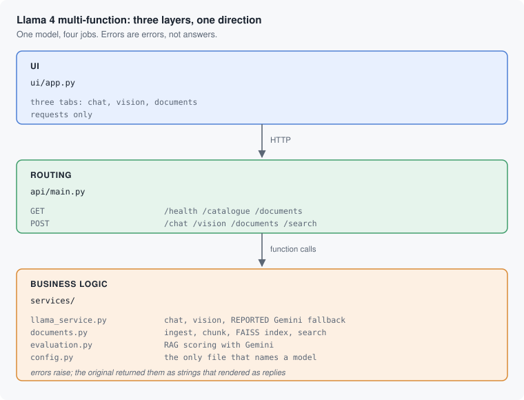

# Llama 4 Multi-Function App

> **Learn how to build this project step-by-step on [AI-ML Companion](https://aimlcompanion.ai/)**. Interactive ML learning platform with guided walkthroughs, architecture decisions, and hands-on challenges.


**One model doing four jobs: chat, reading images, retrieval over your own
documents, and RAG evaluation. Llama 4 Scout on Groq, with a Gemini fallback
that is always reported rather than hidden.**

---

## 1. The bug worth fixing first

Every provider call in the original ended like this:

```python
if not GROQ_API_KEY:
    return "Groq API key not set."
except Exception as e:
    return f"Error connecting to Groq API: {str(e)}"
```

The caller receives a string either way. There is no way to tell an answer
from a failure, so the chat window rendered **"Error connecting to Groq API:
401 Unauthorized"** in an assistant bubble, styled exactly like a reply. The
same string then went into the conversation history and was sent back to the
model as context on the next turn.

Here those raise, and the routing layer maps them:

| Situation | Response |
|---|---|
| Empty messages, bad role, unsupported image type | **422** |
| No API key | **503**, naming the variable and the URL |
| Provider reached but the call failed | **502** |
| Empty completion | **502** - an empty answer is a failure, not an answer |

Verified with no Groq key configured:

```
POST /chat  ->  HTTP 503
{"detail": "GROQ_API_KEY is not set. Add it to your .env file
            (get one at https://console.groq.com/keys), then restart the API."}
```

No `text` field. Nothing a UI could render as a reply.

## 2. The shape of it



## 3. The fallback is reported, never disguised

When Groq fails and a `GOOGLE_API_KEY` is present, the request is retried on
Gemini. The response says so:

```json
{"text": "...", "provider": "google", "model": "gemini-flash-latest",
 "fallback_used": true, "fallback_reason": "The Groq request failed: 429 ..."}
```

The UI renders that as a warning above the answer. A fallback you cannot see
is a silent change of model, which quietly invalidates any comparison you were
making - and it is exactly the kind of thing that makes a demo look better than
it is.

Without a Google key there is no fallback at all, and the failure is reported
as a failure. The UI says so up front rather than at submit time.

## 4. What it does

| Tab | What it uses |
|---|---|
| **Chat** | Llama 4 Scout, text only |
| **OCR / vision** | The same model, reading an uploaded image |
| **Documents** | Local embeddings, FAISS, similarity search over your files |

Vision is the reason this is one app rather than three. Llama 4 Scout takes
text and images through the same endpoint, so "read this receipt" and "explain
this paragraph" are the same call with a different payload.

Uploaded images are validated **before** they are sent: type, size, and a
Pillow round-trip, so a `.png` that is not really a PNG is caught here with a
clear message instead of by the provider with an opaque one.

## 5. Run it

### Clone

```bash
git clone https://github.com/genieincodebottle/generative-ai.git
cd generative-ai/genai-usecases/llama-4-multi-function-app
```

### Set up with uv

```bash
pip install uv

uv venv
source .venv/bin/activate      # Linux / macOS
# .venv\Scripts\activate       # Windows PowerShell or cmd

uv pip install -r requirements.txt
```

Python 3.10+.

### Add keys

```bash
cp .env.example .env           # copy .env.example .env  on Windows
```

| Variable | Required? | Where |
|---|---|---|
| `GROQ_API_KEY` | **yes** - every feature runs on Llama 4 | [Groq Console](https://console.groq.com/keys), free tier |
| `GOOGLE_API_KEY` | optional | [Google AI Studio](https://aistudio.google.com/app/apikey) - enables the fallback and RAG evaluation |

### Start both services

```bash
python run.py
```

```
API   ->  http://localhost:8000/docs
UI    ->  http://localhost:8501
```

The first document you index downloads a local embedding model
(`all-MiniLM-L6-v2`, about 90 MB). Chat and vision need no download.

### Run the tests

```bash
pytest                         # 35 tests, no key, no model download, no network
```

## 6. The API

| Method | Path | Purpose |
|---|---|---|
| `GET` | `/health` | Which keys are set, which features that enables |
| `GET` | `/catalogue` | Models, vision-capable models, key URLs |
| `POST` | `/chat` | Text chat, with optional reported fallback |
| `POST` | `/vision` | Read or describe an uploaded image |
| `GET` `POST` `DELETE` | `/documents` | Index status, add files, clear |
| `POST` | `/search` | Similarity search over the indexed documents |

```bash
curl -X POST http://localhost:8000/chat \
  -H 'Content-Type: application/json' \
  -d '{"messages":[{"role":"user","content":"Explain RAG in two sentences."}],
       "model":"meta-llama/llama-4-scout-17b-16e-instruct"}'
```

Uploading several documents at once is partially tolerant: a file that cannot
be read appears in `failed` with its reason while the rest are indexed. Only
if *nothing* could be indexed is it a 422.

## 7. If something goes wrong

| symptom | cause | fix |
|---|---|---|
| UI says "Cannot reach the API" | Streamlit started on its own | use `python run.py` |
| `503 GROQ_API_KEY is not set` | no Groq key | add it to `.env`, restart the API |
| "No fallback available" | no `GOOGLE_API_KEY` | optional; add one to enable it |
| First index takes a minute | downloading the embedding model | expected once |
| `422 not a readable image` | file is not really an image | caught before it is sent |
| `422 No extractable text found` | scanned PDF | this app does not OCR documents; the vision tab reads images |
| `409 No documents have been indexed` | search before indexing | index a file first |
| `502 empty response` | the model returned nothing | treated as a failure, not an answer |
| Port already in use | something else has 8000/8501 | `API_PORT=8100 UI_PORT=8600 python run.py` |

## 8. Layout

```
run.py                       starts the API and the UI together
.env.example                 both keys, and what each unlocks
.streamlit/config.toml       turns off Streamlit's own start-up advert
notebook/                    the standalone Llama 4 notebook

ui/app.py                    Streamlit. Three tabs, widgets + requests only.

api/main.py                  8 routes, error -> status, never a fake answer

services/config.py           THE ONLY FILE THAT NAMES A MODEL OR READS THE ENV
services/llama_service.py    chat, vision, THE REPORTED FALLBACK
services/documents.py        ingest, chunk, FAISS index, search
services/evaluation.py       RAG scoring with Gemini
services/llm_text.py         flattens Gemini 3 content blocks to text

tests/test_llama_service.py  image validation, chat guards, 17 cases
tests/test_documents.py      ingestion guards, 8 cases
tests/test_api.py            routes and status codes, 10 cases
```

## 9. Track modules this covers

`multimodal` - `visionModels` - `rag` - `embeddings` - `llmApps` -
`errorHandling`

## 10. Honest limitations

- **Groq model availability is not pinned by this project.** `llama-4-scout`
  and `llama-4-maverick` are Groq's names for hosted models, and hosted
  catalogues change. If a model disappears, `/chat` returns 502 with the
  provider's message rather than pretending.
- **The document index is global and in memory.** Every client shares it, and
  a restart clears it.
- **No OCR for documents.** A scanned PDF is rejected with a clear message.
  Read it through the vision tab instead, one page at a time.
- **RAG evaluation is LLM-graded**, so the grader has the same blind spots as
  the thing it is grading. Treat the numbers as directional.
- **No conversation memory across the tabs.** Chat keeps its own history;
  document search does not see it.
- **CORS is wide open** because both halves run on localhost.
