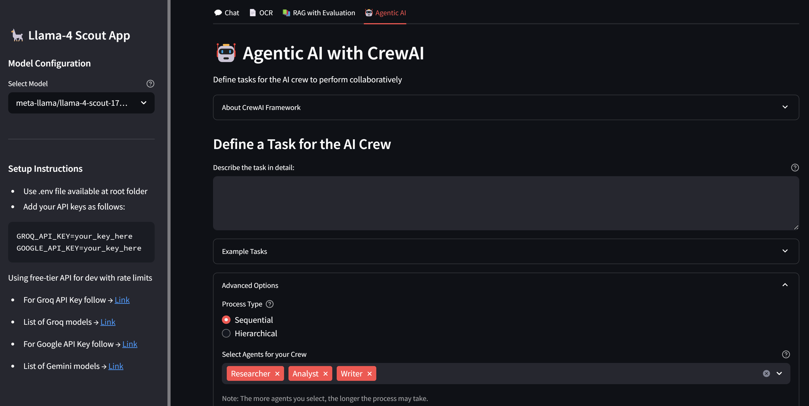

### All-in-One Chat, OCR, RAG & Agentic AI App with CrewAI Integration



This app is a unified Streamlit interface that brings together conversational AI, document OCR, Retrieval-Augmented Generation (RAG), and multi-agent workflows-powered by CrewAI and the multimodal 🦙 Llama-4 Scout model.

### 🔗 Dependencies

```bash
streamlit>=1.43.2 
groq>=0.22.0
python-dotenv>=1.1.0
langchain-groq>=0.3.2
langchain-huggingface>=0.1.2
langchain-community>=0.0.27
langchain>=0.0.27
python-dotenv>=1.0.0
pypdf>=4.0.0
faiss-cpu>=1.7.4
pillow>=10.2.0
streamlit-chat>=0.1.1
sentence-transformers>=2.2.2
crewai>=0.28.5
crewai-tools
google-genai>=1.5.0
plotly
ragas>=0.1.0
datasets>=2.0.0
pandas>=1.0.0
```

### ⚙️ Setup Instructions

- #### Prerequisites
   - Python 3.10 or higher
   - pip (Python package installer)

- #### Installation
   1. Clone the repository:
      ```bash
      git clone https://github.com/genieincodebottle/generative-ai.git
      cd genai-usecases\llama-4-multi-function-app
      ```
   2. Create a virtual environment:
      ```bash
      pip install uv #if uv not installed
      uv venv
      .venv\Scripts\activate # On Linux -> source venv/bin/activate
      ```
   3. Install dependencies:
      ```bash
      uv pip install -r requirements.txt
      ```
   4. Set up environment variables
      * Rename .env.example to .env
      * Update the file with your API keys:
      
      ```bash
      GROQ_API_KEY=your_key_here   # using the free-tier Open weight LLM API
      GOOGLE_API_KEY=your_key_here # Using the free-tier API in CrewAI as a fallback when the primary Llama 4 Scout model fails.
      ```
      * 🔑 Get your API keys:

      For **GROQ_API_KEY** follow this -> https://console.groq.com/keys
      
      For **GOOGLE_API_KEY** follow this -> https://aistudio.google.com/app/apikey

6. Run App
   
   `streamlit run app.py`