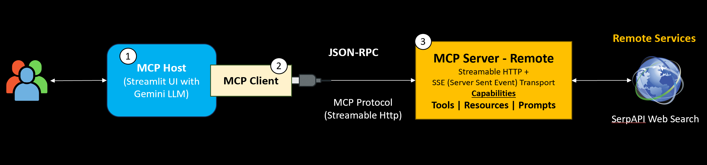
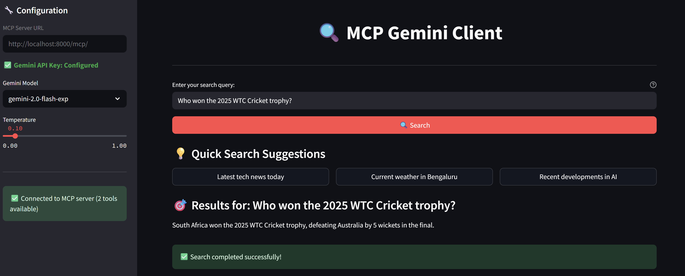

## 🔍 Gemini LLM-powered MCP Client integrated with Web Search Remote MCP Server

A local web search system that combines Google's **Gemini LLM** with a **FastMCP** tool-calling interface and a **Streamlit UI**. Uses **SerpApi** for live, real-time search results via a custom MCP server to show Remote MCP Server capabilities with Gemini LLM.



### Features

- ✅ Google's Gemini API integration with Remote FastMCP Server
- ✅ Tool calling using [FastMCP based Remote MCP Server](https://github.com/jlowin/fastmcp)
- ✅ Custom MCP Server with live web search via SerpApi

### [MCP Official Doc](https://modelcontextprotocol.io/docs/getting-started/intro)

### Installation

```bash
git clone https://github.com/genieincodebottle/generative-ai

cd genai-usecases\mcp

pip install uv # If uv doesn't exist in your system

uv venv

.venv\Scripts\activate   # Linux: source .venv/bin/activate

uv pip install -r requirements.txt
```

### Environment Setup
Create a .env file and set the following keys:

```bash
GEMINI_API_KEY=your_google_genai_api_key
SERPAPI_API_KEY=your_serpapi_key
```

**For free tier Gemini API Key** -> https://aistudio.google.com/apikey 

**For free-tier SerpAPI API Key** -> https://serpapi.com/manage-api-key

### Run the MCP Server at one terminal

```bash
cd genai-usecases\mcp

.venv\Scripts\activate

python web_search_mcp_server.py --host localhost --port 8000
```

### Run the Streamlit Client App in another terminal

```bash
cd genai-usecases\mcp\web_search_mcp

.venv\Scripts\activate

streamlit run gemini_mcp_client.py
```

Once started, go to:
http://localhost:8501

Use the sidebar to view Gemini API status, adjust model/temperature, and run queries with real-time web search using SerpApi.



### ⚙️ How It Works
- The Remote MCP server exposes tools (like web_search) via FastMCP over Streamable HTTP.
- The Streamlit app uses Gemini's function calling to request results from the Remote Web Saerch MCP server.
- Gemini combines LLM reasoning with live data via SerpApi using tool calling.