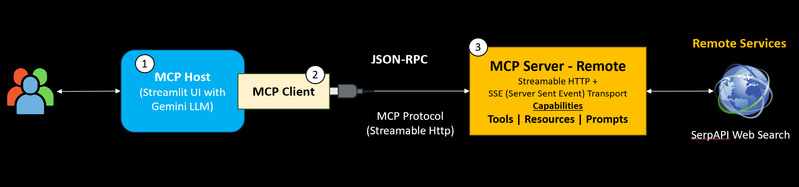
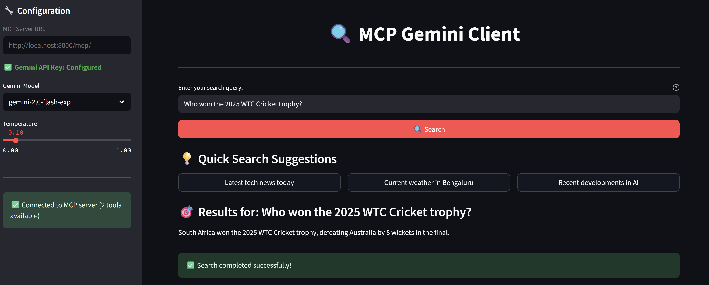

## 🔍 Gemini LLM-powered MCP Client integrated with Web Search Remote MCP Server

A local web search system that combines Google's **Gemini LLM** with a **FastMCP** tool-calling interface and a **Streamlit UI**. Uses **SerpApi** for live, real-time search results via a custom MCP server to show Remote MCP Server capabilities with Gemini LLM.



### Features

- ✅ Google's Gemini API integration with Remote FastMCP Server
- ✅ Tool calling using [FastMCP based Remote MCP Server](https://github.com/jlowin/fastmcp)
- ✅ Custom MCP Server with live web search via SerpApi

### [MCP Official Doc](https://modelcontextprotocol.io/docs/getting-started/intro)

### Installation

   1. Clone the repository:

      ```bash
      git clone https://github.com/genieincodebottle/generative-ai.git
      cd genai-usecases\mcp\web_search_mcp
      ```
   2. Open the Project in VS Code or any code editor.
   3. Create a virtual environment:

      ```bash
      pip install uv #if uv not installed
      uv venv
      .venv\Scripts\activate # On Linux -> source venv/bin/activate
      ```
   4. The `requirements.txt` file contains all necessary dependencies.
   5. Install dependencies:
      ```bash
      uv pip install -r requirements.txt
      ```
   6. Set up environment variables
      * Rename .env.example to .env
      * Update the file with your API keys:
      
      ```bash
      GOOGLE_API_KEY=your_key_here # Using the free-tier API 
      SERPAPI_API_KEY=your_serpapi_key # Using free-tier
      ```
      * 🔑 Get your API keys:
      
        For **GOOGLE_API_KEY** follow this -> https://aistudio.google.com/app/apikey

        For **SERPAPI_API_KEY** follow this -> https://serpapi.com/manage-api-key

   7. **You need 2 terminals running side-by-side.** In VS Code, click the split terminal icon or open two separate terminal windows.

      **Terminal 1 - Start the MCP Server:**
      ```bash
      cd genai-usecases\mcp\web_search_mcp
      .venv\Scripts\activate
      python web_search_mcp_server.py --host localhost --port 8000
      ```
      > Keep this terminal running. You should see "MCP Server running on port 8000".

      **Terminal 2 - Start the Streamlit Client:**
      ```bash
      cd genai-usecases\mcp\web_search_mcp
      .venv\Scripts\activate
      streamlit run gemini_mcp_client.py
      ```

   8. Open http://localhost:8501 in your browser.

      Use the sidebar to view Gemini API status, adjust model/temperature, and run queries with real-time web search using SerpApi.

      

### ⚙️ How It Works
- The Remote MCP server exposes tools (like web_search) via FastMCP over Streamable HTTP.
- The Streamlit app uses Gemini's function calling to request results from the Remote Web Saerch MCP server.
- Gemini combines LLM reasoning with live data via SerpApi using tool calling.