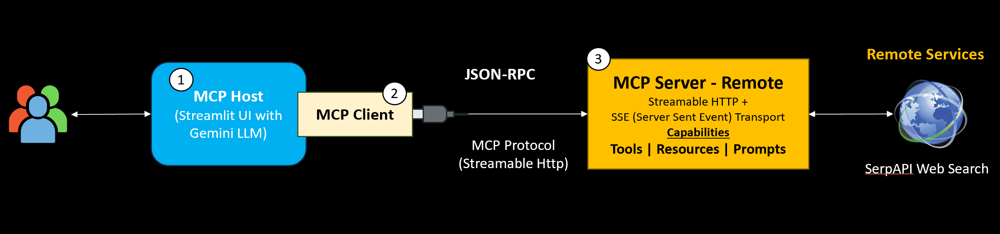
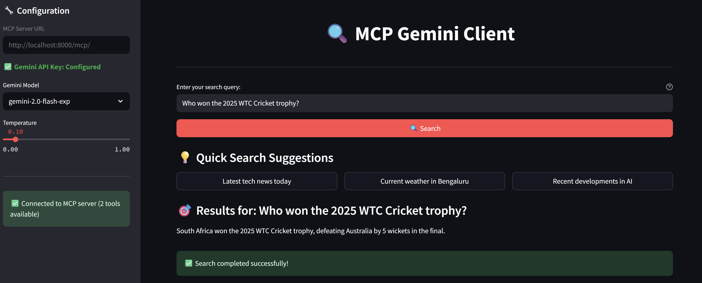

# Gemini MCP client with a remote web-search MCP server

> **Learn how to build this project step-by-step on [AI-ML Companion](https://aimlcompanion.ai/)**. Interactive ML learning platform with guided walkthroughs, architecture decisions, and hands-on challenges.


**A remote MCP server that exposes web search as a tool, and a Streamlit client
that lets Gemini call it. The search half needs no API key at all.**



---

## 1. What this shows

MCP separates the thing that *owns a tool* from the thing that *talks to a
model*. The server here owns web search; the client here owns the conversation.
Neither knows how the other is implemented, which is the entire point - point a
different client at this server and it still works.

Concretely, the server exposes three tools:

| Tool | Purpose |
|---|---|
| `web_search` | Search the web, returning formatted results |
| `list_providers` | Which search backends this server can currently use |
| `health_check` | Liveness, naming the provider that would actually be used |

## 2. Search providers - the default needs no key

The server tries whichever provider your environment can actually use:

| Provider | Needs | Notes |
|---|---|---|
| **DuckDuckGo** | **nothing** | the default when no key is set |
| Tavily | a free key | better snippets, and returns a synthesised answer |
| SerpApi | a paid key | real Google SERP features |

An earlier version of this project supported **SerpApi only** and refused to do
anything without `SERPAPI_API_KEY`. That is a hard stop before you have seen a
demo about *MCP* work even once - and API keys get revoked, so the failure
arrives later without warning. DuckDuckGo removes that dependency entirely.

Pick one explicitly if you want to:

```python
web_search(query="...", provider="duckduckgo")   # or "tavily", "serpapi"
```

## 3. Run it

### Install

```bash
git clone https://github.com/genieincodebottle/generative-ai.git
cd generative-ai/genai-usecases/mcp/web_search_mcp

pip install uv
uv venv
source .venv/bin/activate      # Linux / macOS
# .venv\Scripts\activate       # Windows PowerShell or cmd

uv pip install -r requirements.txt
```

### Keys

```bash
cp .env.example .env
```

**The server needs no key.** `GEMINI_API_KEY` is only for the Streamlit client,
which asks Gemini to decide when to call the tool. Free key:
[aistudio.google.com/apikey](https://aistudio.google.com/apikey).

### Two terminals

**Terminal 1 - the MCP server:**

```bash
python web_search_mcp_server.py --host localhost --port 8000
```

It prints the provider it will use, so you know before you send a query:

```
Default provider : duckduckgo
Available        : duckduckgo
No API key is required - DuckDuckGo is used when no key is set.
```

**Terminal 2 - the Streamlit client:**

```bash
streamlit run gemini_mcp_client.py
```

Then open http://localhost:8501.



### Talk to the server without the UI

Useful for checking the server on its own, and it needs no Gemini key:

```python
import asyncio
from fastmcp import Client

async def main():
    async with Client("http://localhost:8000/mcp/") as c:
        print([t.name for t in await c.list_tools()])
        r = await c.call_tool("web_search",
                              {"query": "what is MCP", "num_results": 3})
        print(r.content[0].text)

asyncio.run(main())
```

## 4. Layout

```
web_search_mcp_server.py   the MCP server - THIN, tools only
services/search.py         all the search logic; imports no web framework
gemini_mcp_client.py       Streamlit UI + Gemini function calling
requirements.txt  .env.example
```

`services/search.py` importing no web framework is the rule that matters: it
means the search layer can be exercised with nothing running, and that swapping
MCP for another transport would not touch it.

## 5. If something goes wrong

| symptom | cause | fix |
|---|---|---|
| `Search error: ... 401` on Tavily or SerpApi | key revoked or wrong | drop the key entirely; DuckDuckGo needs none |
| `ModuleNotFoundError: ddgs` | partial install | `uv pip install -r requirements.txt` |
| Client hangs or connection refused | server not running, or wrong port | start Terminal 1 first; the URL ends `/mcp/` |
| `400 Bad Request` opening the URL in a browser | expected | MCP needs a handshake; a plain GET is not one |
| `Search error: The query is empty.` | blank query | that is the guard working |
| `Search error: num_results must be between 1 and 25` | out of range | pick a number in range |
| Gemini errors about the model | a retired model ID | the client uses rolling aliases like `gemini-flash-latest` |

## 6. Honest limitations

- **DuckDuckGo results are scraped, not an official API.** They are fine for a
  demo and can be rate-limited or shaped differently over time. Tavily is the
  better choice for anything real, and its free tier is generous.
- **The server trusts its caller.** There is no auth, no rate limiting and no
  spend guard. It is meant to run on localhost.
- **A tool description is untrusted text** once a client points at a server it
  did not write. Descriptions go straight into the model's context, so treat
  them as data, and gate destructive tools behind human approval.
- **Only `duckduckgo` and `tavily` are verified end to end here.** The SerpApi
  path is correct against its documented API but was not run - the key
  available for testing was rejected with a 401, which is what prompted the
  provider chain in the first place.
- **One search per call, no caching.** Repeated identical queries repeat the
  work.
