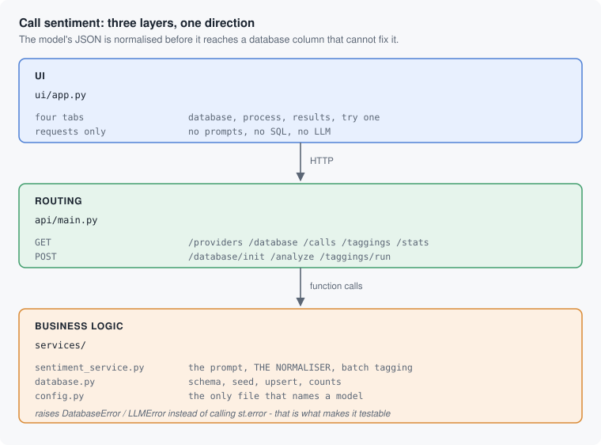

# Customer Call Sentiment and Aggressiveness Tagging

> **Learn how to build this project step-by-step on [AI-ML Companion](https://aimlcompanion.ai/)**. Interactive ML learning platform with guided walkthroughs, architecture decisions, and hands-on challenges.


**Asking a model for JSON gets you JSON-shaped text. This project treats the
model's output as untrusted input and normalises it before it reaches a
database column that cannot.**

---

## 1. The problem

Classify customer call transcripts on two axes at once: sentiment
(Positive / Negative / Neutral) and aggressiveness (1-10). Store the results,
then report on them.

The classification itself is one prompt. The work is everywhere else:

- The model returns `"positive"`, `"POSITIVE"`, and `"Positive"` on different
  calls. Group by that column and you get three groups for one sentiment.
- It returns `"8"` where an integer belongs, and occasionally an
  aggressiveness of `0` or `15` despite the range being in the prompt.
- One bad call in a batch of ten should not lose the other nine.

## 2. The shape of the fix



The original version called `st.error(...)` from inside the database and LLM
functions. That single detail is what made the logic impossible to test, reuse,
or call from anything but a running Streamlit session. Here those functions
raise `DatabaseError`, `LLMError`, or `InvalidCallText`, and the layer that has
a screen decides what to show. All 47 tests run with no API key and no network
as a direct result.

## 3. Where the model's output stops being trusted

`normalise_result` in `services/sentiment_service.py` is the whole idea:

| Model returns | Stored |
|---|---|
| `"positive"` / `"POSITIVE"` / `"  neutral  "` | `Positive` / `Positive` / `Neutral` |
| `"furious"` (not one of the three) | `Neutral` |
| `"8"` (string) | `8` |
| `3.7` | `3` |
| `0` or `-5` | `1` |
| `99` | `10` |
| missing entirely | `Neutral`, `1` |

None of this is hypothetical: the range and the three allowed labels are both
stated in the prompt, and the model still leaves the range and varies the
casing. A prompt is a request; this is the enforcement.

Input is validated on the way in too. `validate_call_text` measures length
**after** stripping, so whitespace padding cannot smuggle a two-character
transcript past the 10-character minimum.

Batch tagging reports per-call outcomes rather than a single pass/fail, so a
partial run is visible instead of silent:

```json
{"total": 10, "succeeded": 10, "failed": 0, "outcomes": [...]}
```

## 4. Run it

### Clone

```bash
git clone https://github.com/genieincodebottle/generative-ai.git
cd generative-ai/genai-usecases/sentiment-analysis
```

### Set up with uv

```bash
pip install uv

uv venv
source .venv/bin/activate      # Linux / macOS
# .venv\Scripts\activate       # Windows PowerShell or cmd

uv pip install -r requirements.txt
```

Plain `pip install -r requirements.txt` works identically. Python 3.10+.

### Add a key

```bash
cp .env.example .env           # copy .env.example .env  on Windows
```

At least one of:

| Variable | Where to get it | Notes |
|---|---|---|
| `GOOGLE_API_KEY` | [Google AI Studio](https://aistudio.google.com/app/apikey) | Free tier, no card |
| `GROQ_API_KEY` | [Groq Console](https://console.groq.com/keys) | Free tier, fast |

The UI only offers providers whose key is set, so a missing key is a shorter
dropdown rather than a stack trace on submit.

### Start both services

```bash
python run.py
```

`run.py` starts uvicorn, waits for `/health`, then starts Streamlit, and shuts
both down on Ctrl+C. It needs **no install of this project**.

```
API   ->  http://localhost:8000/docs
UI    ->  http://localhost:8501
```

Two terminals instead, if you prefer:

```bash
uvicorn api.main:app --reload --port 8000
streamlit run ui/app.py
```

### The walkthrough, in order

1. **Database** tab, then *Initialize database*. Creates the schema and seeds
   10 sample calls. No external database needed; it is a SQLite file.
2. **Process calls** tab, then *Analyze all calls*. Classifies all 10.
3. **Results** tab. The table plus aggregate statistics.
4. **Try one** tab. Paste any transcript and classify it without storing it.

### Run the tests

```bash
pytest                         # 47 tests, no API key, no network
```

## 5. The API

| Method | Path | Purpose |
|---|---|---|
| `GET` | `/health` | Liveness, database readiness, configured providers |
| `GET` | `/providers` | Providers with keys, their models and defaults |
| `GET` | `/database` | Ready? How many calls, how many tagged |
| `POST` | `/database/init` | Create schema, seed samples (idempotent) |
| `DELETE` | `/database` | Delete the database file |
| `GET` | `/calls` | The source transcripts |
| `POST` | `/analyze` | Classify one transcript, store nothing |
| `POST` | `/taggings/run` | Classify and store every call |
| `GET` | `/taggings` | Stored results joined with call metadata |
| `GET` | `/stats` | Totals, sentiment breakdown, aggressiveness summary |

```bash
curl -X POST http://localhost:8000/analyze \
  -H 'Content-Type: application/json' \
  -d '{"text":"Customer was furious about receiving the wrong order for the third time and threatened to cancel their contract.",
       "provider":"gemini","model":"gemini-flash-latest"}'
```

```json
{"sentiment": "Negative", "aggressiveness": 9}
```

That is real output from this project, not an illustration.

Status codes carry meaning: an uninitialized database is **409** (your state,
not a server fault), a missing key is **503**, text that fails validation is
**422**, and an unknown provider is **400**.

## 6. Models

Defaults are Google's rolling aliases (`gemini-flash-latest`) rather than
pinned IDs. Every `gemini-2.0-*` ID this project previously used has since been
retired, which turns a working clone into a 404 with no code change. Pinned IDs
remain in the dropdown for reproducible runs.

`services/config.py` is the only file that names a model.

## 7. If something goes wrong

| symptom | cause | fix |
|---|---|---|
| UI says "Cannot reach the API" | Streamlit started on its own | use `python run.py` |
| "No API keys found" | `.env` missing or unfilled | `cp .env.example .env`, add a key, restart the API |
| `409` from `/calls` or `/stats` | database not initialized | Database tab, then *Initialize database* |
| `ModuleNotFoundError: services` | run from a subfolder | run from the project root |
| `404 model not found` | a pinned model ID was retired | pick `gemini-flash-latest` in the sidebar |
| Port already in use | something else has 8000/8501 | `API_PORT=8100 UI_PORT=8600 python run.py` |
| Batch reports failures | rate limit on the free tier | rerun; it upserts, so completed calls are not redone |
| `pytest` collects 0 tests | wrong directory | run `pytest` from the project root |

## 8. Layout

```
run.py                          starts the API and the UI together
.env.example                    the keys, and where to get them
pytest.ini                      test config
.streamlit/config.toml          turns off Streamlit's own start-up advert

ui/app.py                       Streamlit. 4 tabs, widgets + requests only.

api/main.py                     10 routes, exception -> status mapping
api/schemas.py                  the request/response contract

services/config.py              THE ONLY FILE THAT NAMES A MODEL OR READS THE ENV
services/database.py            SQLite: schema, seed, upsert, counts
services/sentiment_service.py   the prompt, THE NORMALISER, batch tagging

tests/test_sentiment_service.py validation and normalisation, 24 cases
tests/test_database.py          schema, idempotency, upsert, 12 cases
tests/test_api.py               routes and status codes, 11 cases
```

## 9. Track modules this covers

`sentimentAnalysis` - `textClassification` - `promptEngineering` -
`structuredOutput` - `llmApps`

## 10. Honest limitations

- **Aggressiveness is not calibrated.** A 7 from one model is not a 7 from
  another. The scale is useful for ranking calls within one run, not for
  comparing across models or across time.
- **No inter-rater baseline.** Nothing here measures the model against human
  labels, so "accuracy" is unmeasured by design. The sample calls are written
  to have obvious answers, which is exactly why they cannot tell you how it
  performs on real transcripts.
- **English only.** The prompt and the sentiment vocabulary assume English.
- **Batch is sequential.** Ten calls is ten round trips, one after another.
  Fine at this size; parallelise before pointing it at ten thousand.
- **CORS is wide open** because both halves run on localhost. Narrow it before
  deploying the API anywhere else.
