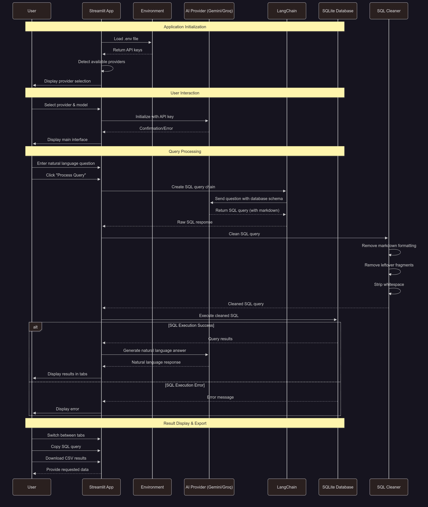

# Text-to-SQL Query Demo App

An app that converts natural language questions into SQL queries using free-tier Google Gemini or Groq APIs. Query the sample Chinook database using plain English and get results in multiple organized formats.

## Features

- 🤖 **Multiple AI Providers**: Choose between Google Gemini and Groq APIs
- 🗃️ **Natural Language to SQL**: Ask questions in plain English
- 📑 **Tabbed Results**: Organized display with Answer, Generated SQL, Raw Results, and Formatted Results tabs
- 🔍 **Query Visualization**: See the generated SQL queries with copy functionality
- 📥 **Export Results**: Download query results as CSV files
- 💡 **Example Queries**: Pre-built examples to get started quickly
- 📋 **Database Explorer**: Browse available tables and sample data
- 🛡️ **Robust SQL Cleaning**: Advanced markdown removal and error handling

## Installation & Running App

   1. Clone the repository:

      ```bash
      git clone https://github.com/genieincodebottle/generative-ai.git
      cd genai-usecases\advance-rag\text-to-sql
      ```
   2. Open the Project in VS Code or any code editor.
   3. Create a virtual environment by running the following command in the terminal:
   
      ```bash
      pip install uv #if uv not installed
      uv venv
      .venv\Scripts\activate # On Linux -> source venv/bin/activate
      ```
   4. The `requirements.txt` file contains the following dependencies:

      ```bash
        streamlit>=1.49.1
        langchain>=0.3.27
        langchain-google-genai>=2.1.12
        langchain-groq>=0.3.8
        langchain-community>=0.3.29
        pandas>=2.3.2
        python-dotenv>=1.0.0
      ```
   5. Install dependencies:
      
      ```bash
      uv pip install -r requirements.txt
      ```
   6. Configure Environment
      * Rename .env.example → .env
      * Update with your keys:

         ```bash
         GOOGLE_API_KEY=your_key_here # Using the free-tier API Key
         GROQ_API_KEY=your_key_here # Using the free-tier API Key
         ```
      * Get **GOOGLE_API_KEY** here -> https://aistudio.google.com/app/apikey
      * Get **GROQ_API_KEY** here -> https://console.groq.com/

   7. Run the Application:

      ```bash
      streamlit run app.py
      ```

## Usage

1. **Automatic Provider Detection**: The app automatically detects which API keys are available and shows only those providers
2. **Select API Provider**: Choose between Google Gemini or Groq in the sidebar (only available providers shown)
3. **Choose Model**: Select from available models for your provider:
   - **Google Gemini**: gemini-2.0-flash, gemini-2.0-pro, gemini-2.5-flash, gemini-2.5-pro
   - **Groq**: llama-3.1-8b-instant, llama-3.3-70b-versatile, openai/gpt-oss-20b, openai/gpt-oss-120b
4. **Ask Questions**: Type natural language questions about the database
5. **View Results in Tabs**:
   - **💬 Answer**: Natural language response from AI
   - **🔍 Generated SQL**: The SQL query with copy functionality
   - **📊 Raw Results**: Raw SQL execution results
   - **📋 Formatted Results**: Table view with CSV download option

## Example Questions

- "How many employees are there?"
- "Which country's customers spent the most?"
- "What are the top 5 best-selling tracks?"
- "How many customers are from Germany?"
- "What is the total revenue for each genre?"
- "Which artist has the most albums?"

## Database Schema

The application uses the Chinook database, which represents a digital media store with:

- **artists**: Music artists
- **albums**: Album information
- **tracks**: Individual songs with genre and media type
- **customers**: Customer information
- **employees**: Store employee data
- **invoices**: Purchase transactions
- **invoice_items**: Individual items in purchases
- **genres**: Music genres
- **media_types**: Format types (MP3, AAC, etc.)
- **playlists**: User-created playlists

## Technical Details

- **Framework**: Streamlit for web interface
- **AI Integration**: LangChain for LLM orchestration with Google Gemini and Groq support
- **Database**: SQLite (Chinook sample database)
- **Query Processing**: Simplified chain approach with robust SQL cleaning and error handling
- **Environment Management**: python-dotenv for secure API key management
- **SQL Cleaning**: Advanced markdown removal system handling various LLM output formats
- **Result Display**: Tabbed interface with export functionality
- **Error Handling**: Comprehensive error handling with user-friendly feedback

## Architecture & Sequence Diagram


### Execution Flow Steps

1. **Environment Setup**: Load API keys from .env file
2. **Provider Detection**: Automatically detect available API providers
3. **SQL Generation**: Use LangChain to generate SQL from natural language
4. **SQL Cleaning**: Advanced cleaning to remove markdown formatting
5. **Execution**: Direct SQL execution with proper error handling
6. **Answer Generation**: Generate natural language responses from clean results
7. **Display**: Organized tabbed interface with export options

## Troubleshooting

- **No API providers available**: Check your .env file has valid API keys
- **SQL execution errors**: The app includes robust SQL cleaning to handle markdown formatting
- **Empty results**: Some queries may return no data - this is normal behaviour