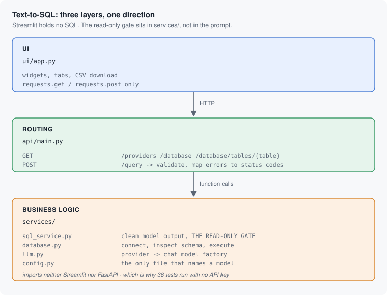

# Text-to-SQL Query App

> **Learn how to build this project step-by-step on [AI-ML Companion](https://aimlcompanion.ai/)**. Interactive ML learning platform with guided walkthroughs, architecture decisions, and hands-on challenges.


**An LLM that writes SQL is a code generator pointed at your database. This
project treats it that way: the generated statement is validated before it is
ever executed, and the validation lives in a service layer you can test
without an API key.**

---

## 1. The problem

Ask a question in English. Get an answer from a real relational database.

The demo version of this is four lines of LangChain, and it works on the first
try. What it does not survive is the second question, because the interesting
failures are not "the model didn't understand":

- The model returns SQL wrapped in a ```sql fence, or prefixed with
  `SQLQuery:`, or followed by its own commentary. String, not statement.
- The model returns a `DELETE`. It was asked for a `SELECT`, and asking is not
  enforcing.
- The demo is one 500-line `app.py` where the prompt, the SQL cleaner, the
  executor, and the button that triggers them are the same file, so none of it
  can be tested and none of it can be reused.

## 2. The shape of the fix



The rule that keeps it honest: **`services/` never imports a framework.** It is
callable from a notebook, a test, a cron job, or a different UI. The 36 tests
below run with no API key and no network because of this, not by accident.

## 3. Where the model's output stops being trusted

`services/sql_service.py` does two things between the model and the database.

**Clean it.** Models wrap SQL in scaffolding that varies by model and by day:

| Model returns | After `clean_sql_query` |
|---|---|
| ` ```sql\nSELECT 1\n``` ` | `SELECT 1` |
| `SQLQuery: SELECT * FROM artists;` | `SELECT * FROM artists` |
| `SELECT 1\nSQLResult: [(1,)]\nAnswer: one` | `SELECT 1` |

**Then refuse it.** `assert_read_only` rejects anything that is not a single
read:

| Rejected | Why |
|---|---|
| `DROP TABLE artists` | not a `SELECT` or `WITH` |
| `SELECT 1; DROP TABLE artists` | stacked statements |
| `UPDATE artists SET Name = 'x'` | write verb |
| `PRAGMA table_info(artists)` | not a read of user data |

This check is in the service layer rather than the prompt on purpose. A prompt
instruction is a request the model may decline; this is a gate the request has
to pass. It matters more here than in the original single-file version, because
the logic is now reachable over HTTP.

The same reasoning applies to the table preview: `preview_table` checks the
requested name against the real schema instead of interpolating it, so
`GET /database/tables/artists;DROP` is a 404 rather than a surprise.

## 4. Run it

### Clone

```bash
git clone https://github.com/genieincodebottle/generative-ai.git
cd generative-ai/genai-usecases/text-to-sql
```

### Set up with uv

[uv](https://docs.astral.sh/uv/) resolves and installs in seconds and keeps the
environment inside the project.

```bash
pip install uv

uv venv
source .venv/bin/activate      # Linux / macOS
# .venv\Scripts\activate       # Windows PowerShell or cmd

uv pip install -r requirements.txt
```

Plain `pip install -r requirements.txt` works identically. Python 3.10+.

### Add a key

```bash
cp .env.example .env           # copy .env.example .env  on Windows
```

Then set at least one of these in `.env`:

| Variable | Where to get it | Notes |
|---|---|---|
| `GOOGLE_API_KEY` | [Google AI Studio](https://aistudio.google.com/app/apikey) | Free tier, no card |
| `GROQ_API_KEY` | [Groq Console](https://console.groq.com/keys) | Free tier, fast |

The UI only offers providers whose key is actually set, so a missing key shows
up as a smaller dropdown rather than a stack trace on submit.

### Start both services

```bash
python run.py
```

That is the whole thing. `run.py` starts uvicorn, waits for `/health` to answer
before starting Streamlit, and shuts both down on Ctrl+C. It needs **no install
of this project** - it puts the project root on `PYTHONPATH` itself.

```
API   ->  http://localhost:8000/docs      interactive OpenAPI docs
UI    ->  http://localhost:8501
```

Prefer two terminals? The halves are independent:

```bash
uvicorn api.main:app --reload --port 8000
streamlit run ui/app.py
```

Ports are configurable with `API_PORT` / `UI_PORT`.

### Run the tests

```bash
pytest                         # 36 tests, no API key, no network
```

## 5. The API

The UI is one client of this; `curl` is another.

| Method | Path | Purpose |
|---|---|---|
| `GET` | `/health` | Is the database readable, which providers have keys |
| `GET` | `/providers` | Providers with keys, and the models each offers |
| `GET` | `/database` | Dialect and table list |
| `GET` | `/database/tables/{table}?limit=n` | Preview rows, name validated against the schema |
| `POST` | `/query` | Question in, SQL + rows + explanation out |

```bash
curl -X POST http://localhost:8000/query \
  -H 'Content-Type: application/json' \
  -d '{"question":"Which country'\''s customers spent the most? Top 3.",
       "provider":"Google Gemini",
       "model":"gemini-flash-latest",
       "temperature":0.0}'
```

```json
{
  "success": true,
  "sql_query": "SELECT \"customers\".\"Country\", SUM(\"invoices\".\"Total\") AS \"TotalSpent\" FROM \"customers\" JOIN \"invoices\" ON \"customers\".\"CustomerId\" = \"invoices\".\"CustomerId\" GROUP BY \"customers\".\"Country\" ORDER BY \"TotalSpent\" DESC LIMIT 3",
  "answer": "The top 3 countries whose customers spent the most are:\n\n1. USA ($523.06)\n2. Canada ($303.96)\n3. France ($195.10)",
  "columns": ["Country", "TotalSpent"],
  "rows": [["USA", 523.06], ["Canada", 303.96], ["France", 195.1]]
}
```

That is real output from this project, not an illustration.

A model or database failure comes back as `success: false` with HTTP 200 - the
request was valid, the work failed, and the UI renders the reason. Invalid
*requests* get real error codes: unknown provider is 400, a blank question is
422, a missing key is 503.

## 6. Models

Defaults are Google's rolling aliases (`gemini-flash-latest`,
`gemini-pro-latest`) rather than pinned IDs. This is deliberate: every
`gemini-2.0-*` ID that this project previously pinned has since been retired,
which turns a working clone into a 404 with no code change. The aliases track
the current generation; pinned IDs are still in the dropdown when you need a
reproducible run.

Edit `services/config.py` to change the catalogue. It is the only file that
names a model.

## 7. If something goes wrong

| symptom | cause | fix |
|---|---|---|
| UI says "Cannot reach the API" | you ran `streamlit run ui/app.py` on its own | use `python run.py`, or start uvicorn too |
| "No API keys found" | `.env` missing or not filled in | `cp .env.example .env`, add a key, restart the API |
| `ModuleNotFoundError: services` | running a file directly from a subfolder | run from the project root; `run.py` sets this up for you |
| `404 model not found` | a pinned model ID has been retired | switch to `gemini-flash-latest` in the sidebar |
| Port 8000 or 8501 already in use | another app has it | `API_PORT=8100 UI_PORT=8600 python run.py` |
| "Only SELECT and WITH queries may be executed" | the model wrote a write statement | working as intended; rephrase the question |
| `pytest` collects 0 tests | run from the wrong directory | run `pytest` from the project root |

## 8. Layout

```
run.py                      starts the API and the UI together
pytest.ini                  test config
.env.example                the keys, and where to get them
.streamlit/config.toml      turns off Streamlit's own start-up advert
chinook.db                  the sample database (11 tables, ships with the repo)

ui/app.py                   Streamlit. Widgets + requests. No business logic.

api/main.py                 FastAPI routes and exception -> status mapping
api/schemas.py              the request/response contract

services/config.py          THE ONLY FILE THAT NAMES A MODEL OR READS THE ENV
services/database.py        connection, schema inspection, execution
services/llm.py             provider -> chat model factory, cached
services/sql_service.py     cleaning, THE READ-ONLY GATE, orchestration

tests/test_sql_service.py   cleaning and the gate, 24 cases
tests/test_api.py           routes, status codes, validation, 12 cases
```

## 9. Track modules this covers

`textToSql` - `promptEngineering` - `llmApps` - `apiDesign` - `ragIntro`

## 10. Honest limitations

- **SQLite only.** `services/database.py` assumes SQLite. Pointing it at
  Postgres means changing the URI and the preview quoting, not the architecture.
- **The read-only gate is a keyword gate.** It reliably stops the failure that
  actually happens (the model writing a `DELETE`). It is not a substitute for
  connecting with a read-only database user, which is what you would do in
  production.
- **No result-size limit.** A question that produces a million rows will try to
  render a million rows. The demo database is small enough that this never
  comes up.
- **Schema goes in the prompt.** Chinook's schema is small. A database with
  hundreds of tables would need retrieval over the schema, not the whole thing
  in every request.
- **CORS is wide open** (`allow_origins=["*"]`) because both halves run on
  localhost. Narrow it before putting the API anywhere else.
