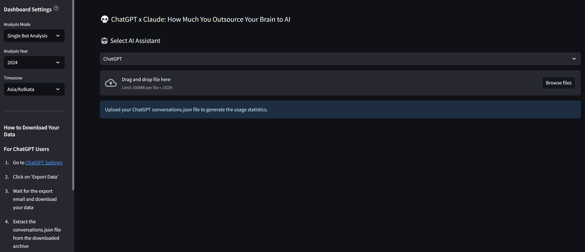

<div align="center">
   
</div>

### ⚙️ Setup Instructions

- #### Prerequisites
   - Python 3.9 or higher
   - pip (Python package installer)

- #### Installation
   1. Clone the repository:
      ```bash
      git clone https://github.com/genieincodebottle/generative-ai.git
      cd generative-ai\genai-usecases\your_ai_chat_analytics
      ```
   2. Create a virtual environment:
      ```bash
      pip install uv
      uv venv
      .venv\Scripts\activate # On Linux -> source venv/bin/activate
      ```
   3. Install dependencies:
      ```bash
      uv pip install -r requirements.txt
      ```

### 💻 Running the Application
To start the application, run:
```bash
streamlit run app.py
```

<div align="left">
   
</div>