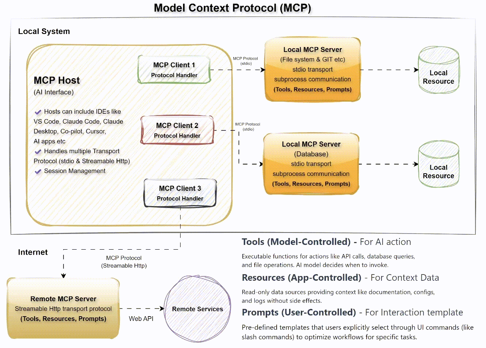
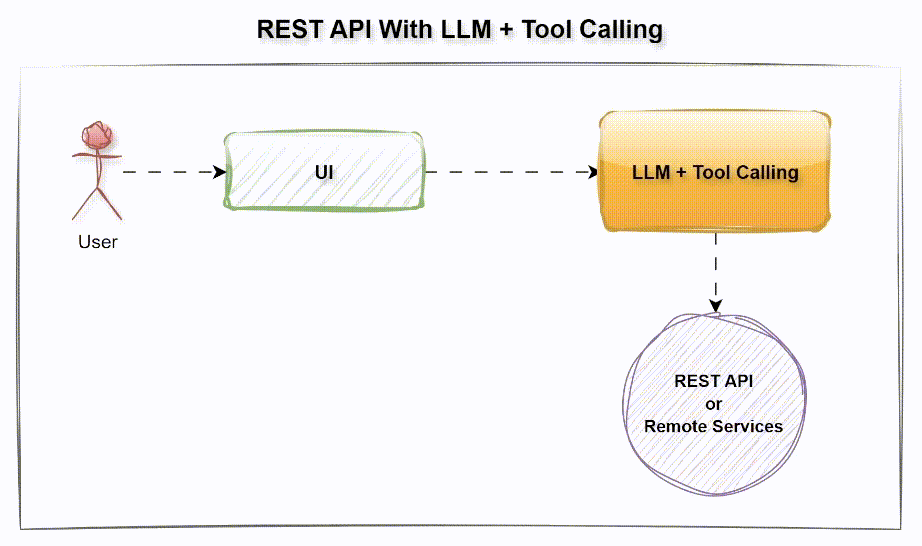
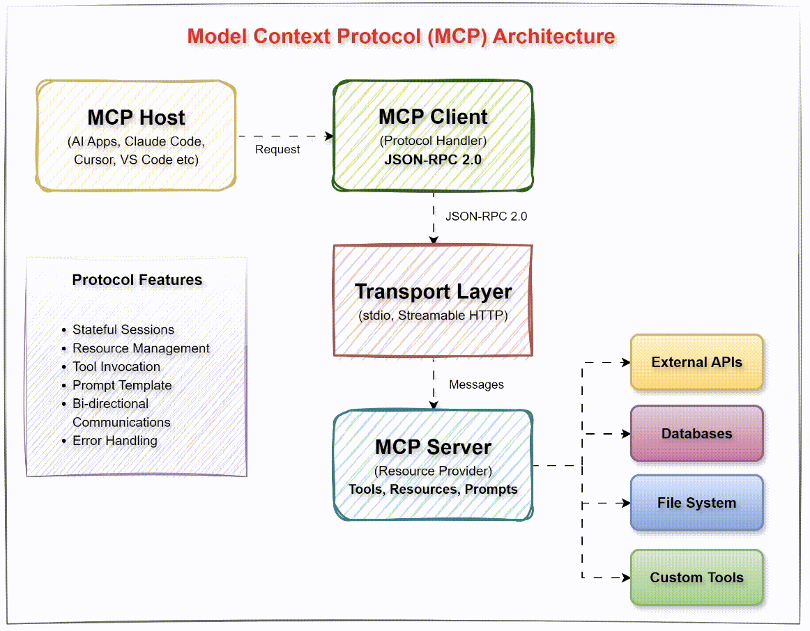

## 🧪 Agentic Tool Calls, ⚡ API Integrations & 🔗 MCP Server-Based LLM Integration

This codebase is used to demo how to integrate LLMs with API calls and MCP (Model Context Protocol) for tool-based reasoning. You will experiment with:

* 🌐 REST API integrations with FastAPI, enabling agentic tool calls where LLMs dynamically invoke functions or tools and trigger REST APIs.

* 🔗 MCP server integrations using Anthropic’s Model Context Protocol (MCP) and the FastMCP library for rapid MCP server and client development.



### 📑 Resources

* 📊 [Slides PPT](./doc/mcp_session.pptx)
* [FastAPI Official Doc](https://fastapi.tiangolo.com/)
* [MCP Official Doc](https://modelcontextprotocol.io/docs/getting-started/intro)
* [FastMCP Official Doc](https://gofastmcp.com/getting-started/welcome)
* [FastAPI MCP GitHub](https://github.com/tadata-org/fastapi_mcp)
* [Streamlit UI Official Doc](https://streamlit.io/)

### ⚙️ Installation

   1. Clone the repository:
      
      ```bash
      git clone https://github.com/genieincodebottle/generative-ai.git
      cd sessions\mcp_session
      ```
   2. Open the Project in VS Code or any code editor.
   3. Create a virtual environment by running the following command in the terminal:
      
      ```bash
      pip install uv # install uv if not already installed
      uv venv # create virtual environment
      .venv\Scripts\activate # On Linux -> source venv/bin/activate
      ```
   4. Add dependencies → requirements.txt
      
      ```bash
      fastapi>=0.116.1          # REST API integration  
      uvicorn>=0.35.0           # ASGI server  
      langchain>=0.3.27         # AI orchestration  
      langchain-google-genai>=2.1.9  # Gemini wrapper for LangChain  
      requests>=2.32.4          # HTTP requests  
      python-dotenv>=1.0.1      # Environment variables  
      asyncio>=3.4.3  
      aiohttp>=3.12.13  
      google-search-results>=2.4.2 # SerpApi  
      fastmcp>=2.8.1            # Quick MCP server development  
      mcp>=1.9.4                # Core MCP library (Anthropic)  
      streamlit>=1.45.1         # Python based lightweight UI  
      google-genai>=1.20.0      # Gemini core API  
      ```
   5. Install dependencies:
      ```bash
      uv pip install -r requirements.txt
      ```
   6. Configure Environment
      * Rename .env.example → .env
      * Update with your keys:

        ```bash
        GEMINI_API_KEY=your_google_genai_api_key
        SERPAPI_API_KEY=your_serpapi_key
        ```
      * Get free keys:

        * [Gemini API Key](https://aistudio.google.com/apikey) 
        * [SerpAPI Key](https://serpapi.com/manage-api-key)


## ⚡[API based LLM Integration](./api_based/)


1️⃣ Run the FastAPI Web Search Server (Terminal 1)

```bash
cd mcp_session
.venv\Scripts\activate
cd api_based\web_search
python search_api_server.py
```

2️⃣ Run the Streamlit Search Client (Terminal 2 or Split IDE Terminal)

```bash
cd mcp_session
.venv\Scripts\activate
cd api_based\web_search
streamlit run search_api_client.py
```

* How It Works (API-based Integration)
  - The FastAPI server exposes REST endpoints (e.g., web_search) as tools.
  - The Streamlit client takes user queries and forwards them to Gemini.
  - Gemini uses function calling to decide when to call the REST API.
  - The FastAPI server processes the request (e.g., fetches results from SerpAPI) and sends them back.
  - Gemini combines LLM reasoning with live API responses, returning enriched results to the Streamlit UI.

## 🔗 [MCP-based LLM Integration](./mcp_based/)


1️⃣ Run the MCP Server (Terminal 1)

```bash
cd mcp_session
.venv\Scripts\activate
cd mcp_based
python web_search_mcp_server.py
```

2️⃣ Run the Streamlit MCP Client (Terminal 2)

```bash
cd mcp_session
.venv\Scripts\activate
cd mcp_based
streamlit run mcp_client.py
```
* How It Works (MCP-based Integration)
  - The MCP server exposes tools (like web_search) through FastMCP over Streamable Http.
  - The Streamlit client connects with Gemini, which uses tool calling to decide when to query the MCP server.
  - The MCP server handles the request, retrieves results (e.g., via SerpAPI), and sends them back.
  - Gemini integrates LLM reasoning with the MCP tool responses, producing real-time, context-aware answers in the Streamlit UI.